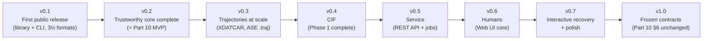

# ChemBridge — Incremental Development Roadmap (Solo Student Edition)

> **Document status:** Binding supplement to `10_Roadmap.md` (MASTER_SPEC Part 10). This document does **not** redesign the architecture — every component, schema, report, and boundary referenced below is defined normatively in Parts 0–9 and used verbatim. What it changes is *sequencing and packaging*: Part 10 plans for an experienced developer at 10–15 h/week; this document re-plans the same content for **one student developer, weekends only during semesters (~8–10 h/week), with concentrated availability during school breaks**.
>
> **Explicit version-numbering divergence (flagged, not silent).** Part 10 §1 labels its milestones v0.1 (library + CLI), v0.2 (API + all Phase 1 formats), v0.5 (web UI), v1.0. This document subdivides those milestones into smaller shippable versions and therefore **reassigns the labels v0.2–v0.7**. Part 10's *content, dependencies, and v1.0 definition of done are preserved unchanged*; only the version labels are re-sliced. If this roadmap is adopted, `10_Roadmap.md` should gain a Revision note recording the new numbering (per the spec's own revision convention) — the mapping table in §1 below is that record's draft.

---

## 0. The Honest Framing First

Part 10 estimates **50–63 part-time dev-weeks to v1.0 for an experienced developer**. Three adjustments apply here:

1. **Experience multiplier.** A student encountering pydantic validators, packaging, CI, and crystallographic edge cases for the first time should budget **1.5×** on unfamiliar ground. That puts v1.0 at roughly **75–95 effective weeks**.
2. **Cadence.** At ~9 h/week during semesters and ~20–30 h/week during breaks, that is approximately **two academic years** to v1.0. This roadmap treats that as a feature, not a failure: every intermediate version below is independently usable, publishable, and portfolio-worthy, so the project delivers value continuously rather than only at the end.
3. **The schedule risk is formats, not frameworks** (Part 10's own planning note). Every estimate below front-loads buffer into parser weeks, not engine weeks.

The single most important scope decision, inherited from Part 10 §2 and pushed one step further here: **the web UI, the REST API, PostgreSQL, Redis, and Docker do not exist until v0.5**. Everything before that is a pure-Python library plus CLI running on Tier 0 (`09 §1.1`) — no services, no containers, no infrastructure to maintain while the science is being built.

---

## 1. Version Ladder at a Glance

| This roadmap | Ships | Part 10 mapping | Effort (student weekends) |
|---|---|---|---|
| **v0.1** | **First public release.** `pip install` library + `chembridge` CLI; XYZ, extXYZ, POSCAR/CONTCAR; Discovery/Conversion/Validation Reports; `missing_lattice` + `frame_selection` recovery (preset-only) | First ~60% of Part 10's MVP | **12–13 weekends** (≈ one semester) |
| **v0.2** | Full scenario catalog, strict/permissive modes complete, report-completeness property test, golden corpus governance, POSCAR velocity block | Completes Part 10's MVP (its "v0.1") | **3–4 concentrated weeks** (one school break) |
| **v0.3** | XDATCAR + ASE trajectory parsers/exporters; frame-chunked processing; benchmark seed | First half of Part 10's "v0.2" | **8–10 weekends** |
| **v0.4** | CIF parser/exporter (occupancy, symmetry, multi-block) | Second half of Part 10's "v0.2" (format side) | **5–7 weekends** |
| **v0.5** | FastAPI backend, async job model incl. `awaiting_recovery`, error envelope, limits; PostgreSQL/object-storage adapters; Tier 1 compose | Remainder of Part 10's "v0.2" (service side) | **8–12 weeks** (ideally a summer) |
| **v0.6** | Web UI: upload → inspect → convert → report → download; loss-communication design language | ~70% of Part 10's "v0.5" | **8–10 weekends** |
| **v0.7** | Interactive Recovery Workflow UI, format explorer, history, self-hosting compose | Remainder of Part 10's "v0.5" | **4–6 weekends** |
| **v1.0** | Exactly Part 10 §6's definition of done — **unchanged** | Part 10's v1.0 | **6–8 weekends** |

Strict sequencing is preserved from Part 10: no version begins on speculation about a later one, and each version's components depend only on prior versions.

---

## 2. v0.1 — First Public Release (the true MVP)

**Target: 12–13 weekends ≈ one semester. This is the 2–3 month version.**

### 2.1 Purpose of v0.1

v0.1 is not an internal milestone that happens to be visible — it is **the first public release**, and everything in its scope is chosen to make that release credible. Its purpose is threefold:

1. **Solve a real problem today.** The XYZ-family ↔ POSCAR/CONTCAR pair is one of the most common real conversions in computational materials work (VASP inputs/outputs against the universal interchange format), and it is exactly the pair where existing converters fail Persona 1 (`00 §5`): the lattice gets invented, frames get dropped without a word, and nobody finds out for weeks. v0.1 fixes that pair *completely* — Discovery Report before, Conversion Report after, refusal instead of guessing, validation by re-parse. A researcher who touches VASP can adopt v0.1 on day one; the small format count bounds *coverage*, not *trustworthiness*.
2. **Demonstrate the philosophy, not promise it.** Every claim in the mission statement — "tells you exactly what it kept, what it lost, and why" — is mechanically true in v0.1 for the supported formats. Nothing in the release depends on future work to be honest.
3. **Be shown with confidence.** v0.1 is the artifact that goes on GitHub, in a portfolio, in internship and transfer applications, and in front of researchers for early feedback. That imposes a release-quality bar on the *whole surface*, not just the science: clean install, ten-minute reproducible demo, real documentation, CI badge that is actually green.

The framing rule for every v0.1 decision: **narrow and finished, never broad and provisional.** v0.1 is a complete product for a small domain — a tool with four formats and zero silent behavior — not a prototype of a bigger one. "Prototype" would imply the reports are illustrative and the refusals negotiable; in v0.1 they are the product.

### 2.2 What it is

The smallest *shippable product* that delivers the entire value proposition end to end: *parse → discover → predict loss → convert (or refuse) → report → validate*, as a library and CLI. One sentence pitch on the v0.1 README: *"Convert an XYZ trajectory to a POSCAR, and ChemBridge will tell you it dropped 9 frames, refuse to invent a lattice unless you name one, and prove the output round-trips."*

### 2.3 Primary features

- **Canonical schema, all eight categories** (`02 §3`), `1.0.0-draft`, with the absence convention (`02 §2`) enforced by validators. Not trimmed — Part 10 §2 decision 3 stands: schema fields are cheap to define and ruinous to retrofit.
- **Plugin SDK interfaces** (`ParserPlugin`/exporter counterpart, `ParseResult`/`ParseIssue` error contract, `03 §2, §5`) — the *interfaces* ship in v0.1 even though only first-party formats implement them, because retrofitting an SDK under four existing parsers is exactly the rewrite this roadmap exists to avoid.
- **Formats: XYZ, extXYZ, POSCAR + CONTCAR.** CONTCAR is included because it is the POSCAR parser under a second `format_id` (near-zero marginal cost); together these still cover the engine-path argument of Part 10 §2 decision 2 (no-cell vs full-cell, Cartesian vs fractional, single- vs multi-frame, per-atom arrays, format-defined PBC, selective dynamics → `Constraint`, and one fabricative recovery).
- **Capability Matrix** (`03 §4`) populated for these four formats; pre-flight diff drives conversion.
- **Conversion Engine + Conversion Report** with `preserved`/`removed`/`supplied`/`assumptions` (`04 §2`) and the structured refusal path.
- **Recovery Engine with exactly two scenarios:** `missing_lattice` (fabricative — the flagship XYZ→POSCAR case) and `frame_selection` (selective reductive — forced by any multi-frame → POSCAR conversion). Preset-only, per Part 10 §2 decision 4.
- **Validation Engine, identity round-trip only** (`A → Canonical → A`), with the default tolerance profile and `ValidationReport` (`05 §3`).
- **CLI:** `chembridge inspect`, `chembridge convert`, `chembridge validate`, emitting the report schemas verbatim as JSON (Appendix A surface, minimally).
- **Tier 0 dev loop + GitHub Actions running pytest on every PR.** Nothing more.

### 2.4 Intentionally omitted (and where it went)

| Omitted | Deferred to | Why safe to defer |
|---|---|---|
| Scenarios `missing_velocities`, `missing_masses`, `missing_species`, `missing_energy` | v0.2 | The scenario catalog (`04 §3.3`) is a data-driven registry; adding entries later touches no engine code. |
| POSCAR velocity block; Maxwell–Boltzmann init | v0.2 | Depends on `missing_velocities`/`missing_masses`; selective dynamics (constraints) stays in v0.1. |
| Two-hop round-trip matrix (A→B→A) | v0.2 | Identity round-trips catch the majority of parser/exporter asymmetry first; the matrix is a superset of infrastructure already built. |
| Report-completeness property test (`08 §1.2`) | v0.2 | Requires a corpus generator; the invariant is designed in from v0.1, only its *mechanical enforcement* waits. |
| CIF, XDATCAR, ASE trajectory | v0.3–v0.4 | Part 10 §2 decision 2, unchanged: format-complexity cost, no new engine paths. |
| REST API, jobs, DB, object storage, Docker, web UI | v0.5+ | Part 10 §2 decision 1, pushed further: thin presenters over objects that must exist first. |
| Benchmarks, nightly CI, coverage gates | v0.3+ | One developer's laptop is the benchmark rig until trajectories at scale exist. |

### 2.5 Weekly milestones (each weekend ends in a functioning, testable state)

| Wk | Deliverable | "Testable" means |
|---|---|---|
| 1 | Monorepo skeleton (`packages/` layout of `01 §5`, dependency-direction lint stub), `pyproject.toml`, `packages/canonical-schema` with `Geometry` + `Cell` + absence-convention validators | `pytest` green on schema construction, absence vs zero, shape checks |
| 2 | Remaining schema categories (Trajectory, Dynamics, Electronic, Simulation Metadata, Provenance, User Metadata) + JSON serialization round-trip | Serialize → deserialize → equality for hand-built objects covering every category |
| 3 | `packages/plugin-sdk`: `ParserPlugin` base, exporter base, `ParseResult`/`ParseIssue`/`ParseError`; format sniffer (extension + content heuristics for the 4 formats) | Sniffer unit tests; a dummy parser registers and is discoverable |
| 4 | **XYZ parser + exporter** + first golden files | First identity round-trip green: `file.xyz → Canonical → file.xyz → Canonical`, objects equal |
| 5 | **extXYZ parser + exporter** (lattice, PBC, per-atom arrays → `user_metadata`/typed fields) | Golden + identity round-trip green; XYZ↔extXYZ canonical diff shows expected field deltas |
| 6 | **POSCAR/CONTCAR parser + exporter** (Direct/Cartesian, selective dynamics → `Constraint`, VASP-4 `recovery_hint="supply_species"` emitted but unhandled) | Golden + identity round-trip green for both Direct and Cartesian inputs |
| 7 | `packages/capability-matrix`: `FormatCapabilities` for all four formats + pre-flight diff function | Diff of (extXYZ source, POSCAR target) predicts the exact preserved/removed/scenario set by unit test |
| 8 | `packages/conversion`: Conversion Engine happy path + `ConversionReport` (`preserved`/`removed`, warnings) | **First real cross-format conversion**: extXYZ → POSCAR with a complete report. Demo-able. |
| 9 | `packages/recovery`: bright-line classification, `missing_lattice` (`manual_input`, `bounding_box`) + `frame_selection` (`first`/`last`/`index`), Assumption + `supplied` recording, structured refusal | XYZ → POSCAR *without* a preset → `status: "refused"`, `RECOVERY_REQUIRED`; *with* presets → report reproduces `04 §5`'s shape |
| 10 | `packages/validation`: identity round-trip check, tolerance profile, `ValidationReport`; Conversion Engine invokes it automatically | Every completed conversion carries exactly one Validation Report; a deliberately broken exporter is caught |
| 11 | CLI (`inspect`/`convert`/`validate`, `--recovery` preset flags, JSON output), packaging, `examples/` | `pip install -e .` then the full worked flow from a clean shell, copy-pasteable from README |
| 12 | **Release week**: GitHub Actions (pytest on PR) with status badge; README with quickstart, recorded demo transcript/GIF, and an explicit "what v0.1 does and does not do" scope statement; `LICENSE`, `CHANGELOG.md`, `CITATION.cff`; golden corpus tidy-up; **tag and publish v0.1** | CI green on a fresh clone; a stranger — or an internship reviewer — can install and reproduce the demo in <10 minutes without asking a question |
| 13 | *Buffer.* Reserved for format edge-case debt (it will exist) | — |

**Rule for slipping:** if a week slips, cut *format edge cases* (log a `ParseIssue`, add a tracking issue), never *report completeness*. A converter that handles fewer files honestly beats one that handles more files silently — that is P1 applied to schedule pressure.

### 2.6 Risks and why v0.1 is a logical stopping point

Risks: schema perfectionism in weeks 1–2 (timebox: the absence convention and field names must be right; validator exhaustiveness can grow); POSCAR coordinate-mode edge cases (mitigate by wrapping ASE I/O and laundering, per `03 §2`); motivation dip mid-semester (mitigated by weeks 8–9 being the payoff weeks — schedule them before any long exam gap if possible); and a risk the public-release framing itself creates — **polish creep**, spending week 12's budget on logo/website/badge aesthetics instead of the release checklist. The bar is "a stranger reproduces the demo in ten minutes," not "looks like a funded project"; anything beyond the week-12 checklist waits.

Stopping point: v0.1 is a complete, trustworthy product for the single most common real conversion pain (VASP-adjacent ↔ XYZ-family) — small in coverage, finished in behavior. It is usable by Persona 1 via CLI and Persona 2 via `import chembridge`, and it is the version researchers can be pointed at without caveats about supported formats being "coming soon" inside them: what it supports, it supports honestly and completely. If the project paused forever here, it would still stand as a legitimate open-source contribution and a defensible portfolio piece.

---

## 3. v0.2 — Trustworthy Core Complete (= Part 10's MVP)

**Target: 3–4 concentrated weeks — sized for a winter break.**

- **Primary:** full scenario catalog (`04 §3.3` — `missing_velocities`, `missing_masses`, `missing_species`, `missing_energy`, `upload_reference` choices); strict/permissive modes with `acknowledge_loss`; POSCAR velocity block + Maxwell–Boltzmann init; two-hop round-trip suites over the four formats; the report-completeness **property test** (`08 §1.2`); golden-corpus governance (`08 §3`); `CONTRIBUTING.md` and issue/PR templates (pulled forward from Part 10 §4 — see §10 below on contributors).
- **Omitted:** everything involving services, new formats, or UI.
- **Architecture:** no new components — this version *fills in* `recovery/`, `validation/`, and `tests/` to Part 10-MVP completeness.
- **Risks:** Maxwell–Boltzmann correctness (unit tests against known temperature/mass distributions); property-test corpus generator scope creep (start with parametrized golden mutations, not full random generation).
- **Stopping point:** the project now *is* Part 10's MVP. Everything the spec promises about the four-format core is mechanically enforced, not just designed.

---

## 4. v0.3 — Trajectories at Scale

**Target: 8–10 weekends (a semester alongside coursework).**

- **Primary:** **XDATCAR** (per-frame cells, forces the frame-chunked implementation — Part 10 risk R8) and **ASE trajectory** (binary richness; zero-cell laundering per `03 §2`) parsers/exporters; frame-chunked processing through the Conversion and Validation Engines; performance benchmark seed (`08 §4`) with a large-trajectory fixture; memory ceiling documented.
- **Omitted:** CIF (isolated to v0.4 because it is the costliest single parser and shares nothing with trajectory work); any service layer.
- **Risks:** chunked processing is the first genuinely algorithmic engine change since v0.1 — budget two full weekends for it before touching either parser; `.traj` version drift across ASE releases (pin ASE, record version in Provenance).
- **Stopping point:** ChemBridge now handles the "10,000-frame MD run" class of input that motivated the project, still as a clean library. Six of seven Phase 1 formats done.

## 5. v0.4 — CIF (Phase 1 Complete)

**Target: 5–7 weekends.** Part 10 prices CIF at ~3 experienced weeks alone; with the student multiplier and occupancy/symmetry/multi-block handling (`03 §3` note 4 — extra data blocks reported, never silently skipped), this is a version by itself, deliberately. **Omitted:** nothing else lands here — mixing CIF with other work is how CIF eats a semester. **Stopping point:** all seven Phase 1 formats parse and export with golden coverage; the "adding a format is O(1)" claim (`03 §4.3`) has now been demonstrated three times.

---

## 6. v0.5 — Service (REST API)

**Target: 8–12 weeks, ideally a summer block — this is the version that needs consecutive days, not weekends.**

- **Primary:** FastAPI backend per `06` — endpoint table, async job model including `awaiting_recovery` (interactive recovery arrives here, exactly as Part 10 §2 decision 4 planned), error envelope, limits, cancellation; PostgreSQL + object-storage adapters behind the Tier 0-compatible interfaces (`09 §1.1`); Tier 1 `docker-compose.yml` (`09 §1.2`); job-lifecycle test suite.
- **Omitted:** hosted public instance (a v1.0-time *decision*, per Part 10); auth beyond self-hosted anonymous mode + static API key; SSE/WebSockets (rejected in `06 §3.1` anyway); horizontal scaling.
- **Why summer:** the job state machine (`queued/running/awaiting_recovery/completed/failed/expired/cancelled`) is the one piece of the project where half-finished weekend state is actively dangerous — paused jobs, expiry, and worker semantics need sustained context.
- **Stopping point:** Persona 2's CI-pipeline story (`00 §5`) is now fully served over HTTP, and every object the future UI will render already exists on the wire.

## 7. v0.6 — Humans (Web UI Core)

**Target: 8–10 weekends.** Next.js app: upload → inspect → convert → report → download pages, report rendering with the ✓/✗/◆ loss-communication language (`07 §4`), fixture-driven component tests. **Omitted:** interactive recovery cards, format explorer, history, docs site (→ v0.7); all visualization (post-1.0, `07 §6`). **Risk:** design perfectionism — the palette and plain-language mapping are specified (`07 §3.3–§4`); implement them, don't redesign them. **Stopping point:** a non-programmer collaborator can complete a conversion and read what happened.

## 8. v0.7 — Interactive Recovery + Polish

**Target: 4–6 weekends (winter break + spares).** Recovery Workflow UI rendered from the `awaiting_recovery` job envelope, failed-validation acknowledgment gate (`VALIDATION_ACK_REQUIRED`), format explorer from `/v1/capabilities`, history page, production/self-hosting compose (`09 §4–5`). **Stopping point:** feature-complete against Parts 6–7; only v1.0's freezing discipline remains.

## 9. v1.0 — Frozen Contracts

**Target: 6–8 weekends.** The definition of done is **Part 10 §6, verbatim and unchanged** — this roadmap adds nothing and removes nothing from it: 30-day-green nightly matrix, zero-waiver property test, schema `1.0.0` + exercised migration, stable SDK + reference plugin, reproducible worked examples, restore drill, honesty checks, docs–code drift as a release blocker.

---

## 10. Practices Deliberately Postponed

| Practice | Earliest sensible version | Rationale |
|---|---|---|
| Docker / compose | v0.5 | Tier 0 exists precisely so parser work never requires containers (`09 §1.1`) |
| PostgreSQL, Redis, object storage | v0.5 | SQLite + local filesystem behind the same interfaces until there is an API to serve |
| Nightly n×n round-trip matrix | v0.3 (nightly), gate at v1.0 | Needs enough formats to be a matrix; 30-day-green is a v1.0 criterion |
| Performance benchmarks as CI gates | v0.5 | Measure from v0.3, gate only once there's a pinned runner |
| Auth, rate limiting, upload limits | v0.5 | No surface to protect before the API |
| Hosted public instance | v1.0 decision point | Per Part 10; self-hosting is the default posture |
| Coverage thresholds, lint-graph CI enforcement | v0.2 | Week-1 lint stub suffices until the corpus justifies gates |
| Horizontal scaling, HA, multi-region | Never / post-1.0 | Multi-region already rejected in `09 §6.2` — an unmaintained HA architecture serves no one |
| Visualization, repair, analysis, AI assistant | Post-1.0 | Attach at named seams (`01 §6`, `07 §6`); building them earlier is the overengineering the brief warns against |

---

## 11. Two-Year Schedule Sketch

Assumes a fall start; shift labels to fit the actual calendar.

| Period | Availability | Work |
|---|---|---|
| **Fall, year 1** (~13 weekends) | ~9 h/wk | v0.1 weeks 1–13 → **tag v0.1** |
| **Winter break, year 1** (2–3 wks) | ~20–25 h/wk | v0.2 → **tag v0.2** |
| **Spring, year 1** (~13 weekends) | ~9 h/wk | v0.3 (+ start CIF study for v0.4) |
| **Summer, year 1** (10–12 wks) | ~25–30 h/wk | Finish v0.4 early summer; v0.5 as the summer project → **tags v0.4, v0.5** |
| **Fall, year 2** | ~9 h/wk | v0.6 → **tag v0.6** |
| **Winter break, year 2** | ~20–25 h/wk | v0.7 → **tag v0.7** |
| **Spring, year 2** | ~9 h/wk | v1.0 hardening; nightly matrix accumulating its 30 green days |
| **Early summer, year 2** | — | **v1.0 release** |

Exams, life, and CIF will eat some of this. The ladder degrades gracefully: any tagged version is a complete resting state, and the strict dependency ordering means a six-month pause costs context, not correctness.

---

## 12. The Four Answers

**Smallest feature set that still deserves the name "ChemBridge":** a library + CLI that converts between the XYZ family and POSCAR/CONTCAR, and that (a) shows a Discovery Report before converting, (b) emits a Conversion Report naming every preserved, removed, and supplied field, (c) *refuses* to invent a lattice unless the user names one, recording it as an Assumption, and (d) validates every output by re-parse-and-diff. That is v0.1. One conversion pair with total transparency embodies the mission; twenty formats with silent loss would not.

**First feature to implement:** the canonical schema's **absence convention** (`02 §2`) — it is the load-bearing wall for every report, every parser rule, and every recovery decision. The first *user-visible* feature built on it is `chembridge inspect` for XYZ (week 4): a Discovery Report is a compelling demo on its own and forces the schema, sniffer, SDK, and one parser to be real.

**First milestone to show publicly (GitHub, portfolio, college applications):** make the repository public from **week 1** — the spec set itself is already a portfolio artifact, and building in the open costs nothing at this scale. The first *demo-able* moment is **week 8** (first cross-format conversion with a full report — record the terminal session for the README). But the milestone this roadmap is built around is the **v0.1 tag itself, which is by design the first public release** (§2.1): installable, documented, CI-green, scope-honest, reproducible in ten minutes by a stranger. That is the version to put in front of internship reviewers, admissions readers, and researchers. For applications, v0.1 plus the write-up of *why* it refuses to guess is a stronger story than any feature count.

**First milestone where outside contributors can realistically help:** **v0.2**, and narrowly — golden-corpus contributions (real-world files from other codes, with expected Discovery Reports) are low-coordination, high-value, and governed by the corpus rules of `08 §3`; `CONTRIBUTING.md` ships in v0.2 for exactly this. **Parser/exporter contributions** become realistic at **v0.3–v0.4**, once the plugin SDK has been exercised by six-plus first-party formats and the reference patterns are stable — with the honest caveat, stated in the contribution guide, that the SDK is not *frozen* until v1.0 and plugin authors before then accept interface churn. Inviting parser contributions during v0.1, when the SDK is a week old, would generate rework for everyone.
