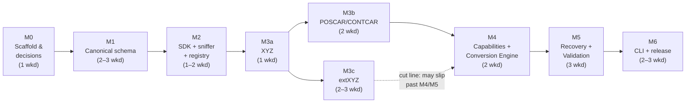

# ChemBridge — v0.1 Implementation Plan

> **Document status:** Execution plan for Version 0.1 (the first public release, per `docs/Incremental_Roadmap_v1.0.md` §2). It **supersedes the roadmap's §2.5 week-by-week table for execution purposes** while preserving all of its scope decisions (four formats, two recovery scenarios, preset-only recovery, library + CLI, Tier 0 only). Scope authority remains MASTER_SPEC.md and the roadmap; this document decides *sequencing, packaging into milestones, and cut lines*.
>
> **Assumed inputs:** this plan assumes the recommendations of `docs/ARCHITECTURE_REVIEW.md` §7 items 1–7 are accepted — in particular one-distribution packaging (review §4.1), the dependency graph with plugin-sdk placed (review B3), deferred entry-point discovery (review §4.2), the v0.1 scope trims (review §4.4), and the 16–20-weekend re-baseline (review §5). Where a milestone depends on a specific review decision, it is flagged inline as **[needs review §N]**. No code is written until this plan is approved.

---

## 1. Shape of the plan

Seven milestones, M0–M6. Each is:

- **Mergeable** — lands on `main` with green CI, no half-states;
- **Testable** — has a "done means" statement executable from a clean checkout;
- **A resting state** — if the project pauses after any milestone, what exists is coherent and documented.

Estimates are in **weekends** (~9 h each), re-baselined per the review: totals below sum to **16–20 weekends** including buffer. Every milestone carries a **cut line** — the first thing dropped under schedule pressure — governed by the roadmap's slip rule: *cut format edge cases, never report completeness*.



Note the deliberate asymmetry: **M3c (extXYZ) is off the critical path.** M4–M6 need only XYZ + POSCAR to demonstrate the entire pipeline (including the flagship `missing_lattice` refusal). If M3c runs long it proceeds in parallel or ships in v0.1.1 — the pre-authorized cut of review §5.4.

---

## 2. Milestones

### M0 — Project scaffold and engineering decisions (1 weekend)

The milestone that exists so no later milestone starts with an unmade decision.

**Deliverables**

1. Resolve **LICENSE** (review A1) and the source-of-truth/preface fixes (review A2–A3, §7 items 1–3 — one spec-editing pass, including the Revision 1.2 note). **[needs review §7.1–3]**
2. Single-distribution repo layout **[needs review §4.1]**:
   ```
   pyproject.toml            # one distribution: chembridge
   src/chembridge/
     schema/                 # Part 2 (canonical-schema)
     sdk/                    # Part 3 §2, §5 + FormatCapabilities types (review B3)
     parsers/  exporters/    # one module per format each — kept separate per Part 1 §2 (DECISIONS D1)
     capabilities/           # registry + query API (Part 3 §4)
     discovery/              # sniffer + Discovery Engine (review B2)
     conversion/  recovery/  validation/  cli/
   tests/  tests/golden/  tests/roundtrip/
   examples/
   ```
   *(Built: separate `parsers/`/`exporters/` rather than the combined `formats/` sketched above, to honor their distinct Part 1 §2 contracts — see `docs/DECISIONS.md` D1.)*
3. Recorded decisions in `docs/DECISIONS.md` (D1–D10), each with a rejected alternative, house style: Python ≥3.11; build backend (hatchling); dev tooling = pytest + ruff + mypy + **import-linter** with the acyclic contract `schema → sdk → {parsers, exporters, capabilities} → discovery → {recovery, validation} → conversion → cli` (review B3, B7); CLI framework (argparse, review B1); per-format strategy — hand-rolled XYZ, ASE-backed extXYZ, hand-rolled POSCAR/CONTCAR ⇒ ASE is the only scientific dependency, version-pinned (review B5); array-serialization/golden-equality (review B6).
4. CI (`ci.yml`): ruff + mypy + import-linter + pytest on every PR, from day one. Real checks, not the roadmap's "stub" — they are the same effort.
5. Repo public (roadmap §12: public from week 1).

**Done means:** fresh clone → `pip install -e ".[dev]"` → `pytest` (one placeholder test) and all lint gates green in CI.
**Dependencies:** none. **Cut line:** none — everything here is load-bearing.

---

### M1 — Canonical schema + absence convention (2–3 weekends)

**Deliverables**

1. All eight categories of Part 2 §3 as pydantic v2 models: `CanonicalObject`, `Frame`, `AtomsBlock`, `Cell`, `Dynamics`, `Electronic`, `TrajectoryMetadata`, `SimulationMetadata`, `Provenance`/`ConversionRecord`, `UserMetadata`, `Constraint` — **not trimmed** (Part 10 §2 decision 3 stands). `schema_version = "0.1.0"` (review A11).
2. NumPy array types: `Annotated` custom types with shape validation (N×3, 3×3, N, first-dim-N/F for custom arrays), float64 in memory, nested-list JSON serialization with exact float64 round-trip; golden equality defined as *deserialize-then-compare*, never JSON-text comparison (review B6).
3. Validators: length agreement (`symbols`/`atomic_numbers`/`positions`), constant-N across frames (Part 2 §3.2), element-symbol validity incl. `"X"`, absence convention (`None` ≠ zero) with `frame_count` as a computed property.
4. `field_presence() → PresenceMap` with the full `present/absent/mixed` trichotomy and granularity rules (Part 2 §3.11).
5. JSON serialize → deserialize → equality tests covering every category; the Part 2 §8.1/§8.2 worked examples committed as the first golden fixtures — **with the carry-through keys corrected per review A6** (POSCAR title in `user_metadata.custom_global["poscar:comment"]`).

**Done means:** `pytest` green on construction, absence-vs-zero, shape violations, `mixed` detection, and byte-faithful round-trip of both worked-example objects.
**Dependencies:** M0. **Cut line:** validator *exhaustiveness* (the roadmap's own timebox: absence convention and field names must be right; extra validators can grow later). The schema surface itself is never cut.

**Risk:** schema perfectionism (roadmap §2.6). Timebox to 3 weekends hard; unresolved niceties become tracked issues.

---

### M2 — Plugin SDK contracts, sniffer, registry (1–2 weekends)

**Deliverables**

1. `chembridge.sdk`: `ParserPlugin` / `ExporterPlugin` ABCs, `ParseResult` / `ParseIssue` / `ParseError` (Part 3 §2, §5), and the `FormatCapabilities` / `FieldCapability` / `CapabilityLevel` data models (moved here per review B3), including wildcard-path semantics (review A9).
2. **Explicit-list registry** — `register(parser)` calls, no entry-point discovery (review §4.2; entry points are additive in v0.3).
3. Format sniffer (`chembridge.discovery`): all-parsers scoring, accept threshold 0.5 / ambiguity margin 0.2, filename hints, and the POSCAR⇄CONTCAR filename rule (Part 3 §6.1).
4. A dummy in-test parser proving registration, sniffing, and capability declaration end to end.

**Done means:** sniffer unit tests pass for the dummy + negative cases (`UNKNOWN_FORMAT` with candidate list); registry rejects a capability declaration with an unknown canonical path.
**Dependencies:** M1. **Cut line:** sniffer heuristic sophistication (extension + first-lines checks suffice for 4 formats; golden corpus pins outcomes later).

---

### M3 — Formats (4–6 weekends total; 3 sub-milestones)

Each sub-milestone is the same recipe: parser + exporter + capability declarations + golden files (`manifest.yaml` per Part 8 §3.1) + **identity round-trip green** (`A → Canonical → A → Canonical′`, objects equal under the strict profile) + error-contract fixtures for each documented `ParseIssue` code.

#### M3a — XYZ (1 weekend) — critical path
Hand-rolled. Comment lines → `user_metadata.custom_per_frame["xyz:comment"]`; multi-frame; the `XYZ_INCONSISTENT_ATOM_COUNT` mid-file `ParseError` fixture with `recovery_hint="truncate_at_last_valid_frame"` (Part 3 §5 rule 4). First identity round-trip in the project.

#### M3b — POSCAR/CONTCAR (2 weekends) — critical path
Hand-rolled. Direct **and** Cartesian coordinate modes; fractional→Cartesian at the parser boundary with `original_coordinate_system` recorded; format-defined `pbc=(T,T,T)` with `parse_notes`; selective dynamics → `Constraint` incl. the all-T ⇒ `constraints=[]` distinction (Part 3 §3 n.7); scaling factor (incl. negative-volume form); VASP-4 files → recoverable `ParseError` with `recovery_hint="supply_species"` (emitted, unhandled in v0.1); CONTCAR as second `format_id` on the same implementation, velocity/predictor-corrector tail carried through (`03 §3` n.12); title line routed per review A6.

#### M3c — extXYZ (2–3 weekends) — **off the critical path** (cut-line milestone)
ASE-backed with the **default-laundering suite** (Part 3 §2 — zero cell → `cell=None`, `pbc=(F,F,F)`-when-undeclared → `None`, zero momenta → `None`): the highest-value parser tests in the project (Part 8 §1.1). `Lattice=`/`Properties=`/key-value handling; arbitrary per-atom columns → `custom_per_atom["extxyz:…"]`; XYZ-vs-extXYZ sniff disambiguation.

**Done means (per format):** golden + identity round-trip + laundering (M3c) + error fixtures green in CI.
**Dependencies:** M2. M3b needs only M3a's conventions; M3c can proceed in parallel with M4/M5 or slip to v0.1.1 (review §5.4 — announced in the release scope statement if cut).
**Cut line:** within each format, edge cases (log a `ParseIssue`, open an issue) — never report/absence correctness. Across formats, M3c is the cut.

---

### M4 — Capability Matrix, Conversion Engine, Conversion Report (2 weekends)

**Deliverables**

1. `chembridge.capabilities`: registry assembly from `capabilities()` declarations; query API; capability rows for all implemented formats (write-side POSCAR row per Part 3 §4.2, corrected for wildcard semantics).
2. Pre-flight diff (Part 3 §4.3): presence × write-capability → predicted `preserved`/`removed`/scenarios/`warnings`; `required_fields` and `max_frames` triggers.
3. Conversion Engine happy path + `write_plan` discipline (exporter writes exactly the plan, Part 4 §1 rules 1–4) + `ConversionReport` schema verbatim (Part 4 §2), both `preflight` and `final` stages, `ConversionRecord(operation="convert")` appended to provenance.
4. **Completeness invariant as a runtime assertion** at report finalization (review §4.5): every source-present/`mixed` path ∈ `preserved ∪ removed`; every `supplied` path absent-on-source with a resolving `from_assumption`. Raises in dev/test; logged-and-raised always (it is never legitimate).
5. **First cross-format conversion demo:** XYZ-with-workaround or (if M3c landed) extXYZ → POSCAR with a complete report — the project's first demo-able artifact; record the terminal session.

**Done means:** unit test asserting the pre-flight diff for a (source, POSCAR) pair predicts the exact preserved/removed/scenario set; a full conversion produces a `final` report satisfying the invariant assertion.
**Dependencies:** M3a + M3b (M3c optional). **Cut line:** report `detail` string richness — never the entry lists themselves.

---

### M5 — Recovery Engine + Validation Engine (3 weekends)

The philosophy-critical milestone; deliberately given the time the roadmap's week 9–10 lacked (review §5.2).

**Deliverables — recovery (~1.5 weekends)**

1. Three-way hazard classification (bulk-reductive / selective-reductive / fabricative, Part 4 §3.1) and the resolution flow (Part 4 §3.2), preset-only.
2. Scenarios: `missing_lattice` (`manual_input`, `bounding_box` + `padding_ang`) and `frame_selection` (`first`/`last`/`index`) — the review §4.4 trim; option lists are *computed* and honestly exclude unoffered choices. Dependency ordering: frame selection before bounding box (Part 4 §3.3).
3. Structured refusal: no preset ⇒ `status="refused"`, `refusal.code="RECOVERY_REQUIRED"`, unresolved scenarios listed. `Assumption` + `SuppliedEntry` + `ConversionRecord(operation="recovery")` recording; permissive/strict mode table incl. `acknowledge_loss` (Part 4 §4).

**Deliverables — validation (~1.5 weekends)**

4. Expected-object construction (source filtered through `write_plan` + supplied fields, Part 5 §1); re-parse via the ordinary registry; the check catalog (Part 5 §2): `atom_count`, `species_preservation` (+ permutation map from the POSCAR exporter's element grouping), `positions_rmsd`, `lattice_consistency`, `frame_count`, `numeric_field_fidelity`, `metadata_preservation`, `absence_conformance`, `report_consistency`.
5. Tolerance machinery: named profiles only (`default`/`strict`/`loose`, review §4.4) with the representational-bound formula (Part 5 §4.2) and `numeric_precision` on exporter declarations.
6. Conversion Engine invokes validation as its unconditional final step — every completed conversion carries exactly one `ValidationReport` (Part 5 §3).
7. **Negative test:** a deliberately broken exporter (perturbed positions / dropped atom / plan deviation) is caught by the corresponding check.

**Done means:** the Part 4 §5 / Part 5 §6 worked example reproduced end to end as a test — same source shape, same choices, report and validation output matching the spec's fixtures (with review-A6 key corrections); refusal path test (`XYZ → POSCAR`, no preset ⇒ refused with the spec's shape); broken-exporter test red-then-caught.
**Dependencies:** M4. **Cut line:** `numeric_field_fidelity` breadth (fields no v0.1 format writes can be skipped-with-reason) — never `atom_count`/`species`/`absence_conformance`/`report_consistency`.

---

### M6 — CLI, packaging, release (2–3 weekends)

**Deliverables**

1. `chembridge.cli` (framework per M0): `inspect`, `convert`, `validate`, `capabilities` per Appendix A — `--format`, `--to`, `-o`, `--mode`, repeatable `--recover SCENARIO=CHOICE[,param=value…]`, `--acknowledge-loss`, `--acknowledge-parse-warnings`, `--tolerance-profile NAME`, `--report PATH` / `--validation-report PATH` / bare `--json` per the Appendix A convention; exit codes 0/1/2/3/4/5 per §A.2. `validate` ships both the offline re-parse mode and the re-thresholding mode (Part 5 §4.5) — both are pure library calls.
2. Discovery Engine terminal rendering (✓/✗ inventory with capability context — Part 3 §6.3's example as the fixture).
3. `examples/` with the full worked flow, copy-pasteable from README; README rewritten: pitch, quickstart, recorded demo transcript, **explicit "what v0.1 does and does not do"** scope statement (naming the M3c cut if taken), CI badge.
4. Release checklist: `CHANGELOG.md`, `CITATION.cff`, `NOTICE` (if Apache-2.0), golden-corpus tidy + `ATTRIBUTIONS.md` if any non-synthetic fixtures were admitted; **tag and publish v0.1** (PyPI + GitHub release).

**Done means:** the roadmap's own bar — a stranger on a clean machine runs `pip install chembridge`, reproduces the README demo (inspect → convert-with-refusal → convert-with-presets → validate) in under 10 minutes without asking a question; CI green on a fresh clone.
**Dependencies:** M5. **Cut line:** demo GIF/transcript polish and doc breadth — never install correctness or the scope statement. Polish-creep warning of roadmap §2.6 applies verbatim.

---

## 3. Schedule and checkpoints

| Milestone | Weekends | Cumulative | Go/no-go checkpoint |
|---|---|---|---|
| M0 | 1 | 1 | — |
| M1 | 2–3 | 3–4 | Schema frozen enough to build on? If week 4 arrives without `field_presence()` green: stop adding validators, ship what's green. |
| M2 | 1–2 | 4–6 | — |
| M3a | 1 | 5–7 | First identity round-trip = the project works. |
| M3b | 2 | 7–9 | **Mid-plan checkpoint:** if cumulative > 10, invoke the M3c cut now, not later. |
| M3c | 2–3 | 9–12 | Off critical path; may run parallel with M4/M5 or move to v0.1.1. |
| M4 | 2 | 11–14 | First cross-format demo — the roadmap's "payoff week"; schedule before any long exam gap. |
| M5 | 3 | 14–17 | Worked example reproduced = spec and code agree. |
| M6 | 2–3 | 16–20 | Tag v0.1. |

Buffer is built into the ranges rather than appended as a single terminal week (review §5.2: one buffer weekend for a 12-week plan was insufficient). Mapping to the roadmap's week table: M0≈wk1, M1≈wk1–2, M2≈wk3, M3a≈wk4, M3c≈wk5, M3b≈wk6, M4≈wk7–8, M5≈wk9–10, M6≈wk11–12 — same content and ordering (with POSCAR promoted ahead of extXYZ to shorten the critical path), honest durations.

## 4. Standing rules during v0.1

1. **The slip rule** (roadmap §2.5): cut format edge cases (log a `ParseIssue`, open an issue), never report completeness.
2. **No parser defaulting, ever** — the laundering suite and absence tests are un-cuttable at every milestone.
3. **Spec drift found while coding** gets a one-line entry appended to the Revision 1.2 note in the same PR — never fixed silently in code alone (Part 10 §4.6 rule 1, applied pre-emptively).
4. **Nothing from v0.2+** (scenario catalog beyond the two, velocity block, property-test harness, two-hop suites, API, services) enters v0.1 regardless of how tempting — the deferral table (roadmap §2.4) is binding.

## 5. Verification of the release as a whole

Before tagging v0.1, run the acceptance pass end to end from a clean environment:

1. `pip install chembridge` from the built artifact (not the checkout).
2. `chembridge inspect water_traj.xyz` → Discovery inventory matches Part 3 §6.3.
3. `chembridge convert water_traj.xyz --to poscar` → **exit 2**, refused report with `missing_lattice` + `frame_selection` unresolved.
4. Same command with `--recover frame_selection=last --recover missing_lattice=bounding_box,padding_ang=5.0` → exit 0; report shows `supplied` lattice traced to its Assumption; ValidationReport `passed`.
5. `chembridge validate --output POSCAR --source water_traj.xyz --conversion-report report.json` → passes offline.
6. CI green on the tag; README demo reproducible by someone who is not the author.
