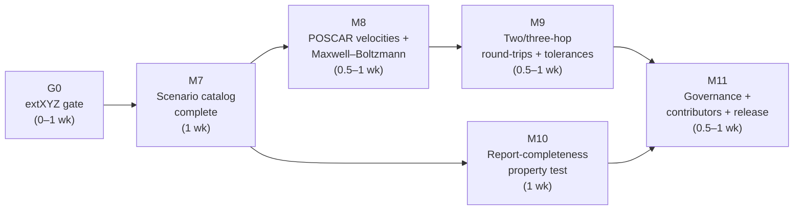

# ChemBridge — v0.2 Implementation Plan

> **Document status:** Execution plan for Version 0.2 ("Trustworthy Core Complete", per `docs/Incremental_Roadmap_v1.0.md` §3). It **supersedes the roadmap's §3 prose for execution purposes** while preserving all of its scope decisions (no new formats, no services, no UI; v0.2 *fills in* `recovery/`, `validation/`, and `tests/` to Part 10-MVP completeness). Scope authority remains MASTER_SPEC.md and the roadmap; this document decides *sequencing, packaging into milestones, and cut lines*.
>
> **Label reminder (Revision 1.2 note, Part 10 §1):** this roadmap's v0.2 **is** Part 10's "MVP" — the point at which everything the spec promises about the four-format core is mechanically enforced, not just designed. Part 10's own "v0.2" (API + remaining formats) is this ladder's v0.3–v0.5.
>
> **Assumed inputs:** v0.1 shipped per `docs/IMPLEMENTATION_PLAN_v0.1.md` — four formats (or three plus the pre-authorized M3c cut, see gate G0 below), two recovery scenarios preset-only, runtime completeness assertion live since M4, identity round-trips green in CI, `--tolerance-profile NAME` (named profiles only), and the v0.1 tag published. Milestone numbering continues globally from v0.1's M0–M6.

---

## 1. Shape of the plan

Five milestones, M7–M11. Each is mergeable, testable, and a resting state, exactly as in the v0.1 plan.

Estimates are in **break-weeks** (~20–25 h of concentrated time — this version is sized for a school break, per the roadmap). The roadmap budgets 3–4 weeks; the ranges below sum to **3½–5 weeks** with buffer inside the ranges, honoring the v0.1 re-baselining lesson (review §5.2: buffer belongs in the ranges, not in a terminal week).

Two structural notes:

- **G0 is conditional.** If v0.1 took the pre-authorized M3c cut (extXYZ deferred to v0.1.1), landing extXYZ is the *first* act of the break — v0.2's round-trip matrix (M9) and the roadmap's "over the four formats" language assume it exists. If extXYZ already shipped, G0 is zero weeks and this plan is M7–M11 only.
- **M10 is off the critical path.** The property-test harness depends on nothing after M7 (it generalizes the runtime assertion that has existed since M4) and can proceed in parallel with M8–M9. It is *not* the version's cut line — the roadmap names it primary scope — but its *generator depth* is (see M10).

---

## 2. Milestones

### G0 — extXYZ landing gate (0–1 week, conditional)

Only if v0.1 shipped without M3c. Deliverables are exactly v0.1-M3c's: ASE-backed extXYZ parser/exporter with the default-laundering suite, golden files, identity round-trip, sniff disambiguation vs plain XYZ. **Done means:** M3c's own done-means, plus the v0.1.1 patch release that was promised in the v0.1 scope statement.
**Dependencies:** none. **Cut line:** none — v0.2 cannot claim "trustworthy core complete" over three formats.

---

### M7 — Scenario catalog completion (1 week)

The Recovery Engine grows from two scenarios to the full catalog of Part 4 §3.3. The catalog is a data-driven registry (the v0.1 deferral table's own justification for waiting), so this is registry entries + choice implementations, not engine surgery.

**Deliverables**

1. **New scenarios registered with correct hazard classification** (Part 4 §3.1): `missing_species` (fabricative — finally *handling* the `supply_species` recovery hint that v0.1-M3b has emitted since VASP-4 files first parsed), `missing_energy` (fabricative, deliberately *optionless* beyond `upload_reference` — no synthetic energy exists), `truncate_corrupt_tail` (consuming the `truncate_at_last_valid_frame` hint emitted by v0.1-M3a's XYZ parser), `constraint_representation` (`project` / `drop_all`, with the PARTIAL-vs-NONE distinction: full drop under a NONE capability stays ordinary reductive loss). `missing_velocities` and `missing_masses` register here with their classification and non-interactive behavior, but their fabricative *choices* land in M8 where their only four-format trigger (the POSCAR velocity block) exists.
2. **Deferred options for v0.1's scenarios:** `upload_reference` (for `missing_lattice`, `missing_species`, `missing_velocities`, `missing_energy` — atom-count / shape / frame-count compatibility checks per scenario), `non_periodic` (offered **only** when the target can express `pbc=(F,F,F)` — extXYZ yes, POSCAR never, per Part 3 §4.2), `split_all` for `frame_selection` (one output file per frame; CLI form writes to a directory, recorded as one Assumption).
3. **Computed option lists stay honest** (review §4.4 rule): every refusal report lists exactly the options this version implements for this source/target pair — the ✳-conditional logic of Part 4 §3.3 becomes unit-tested behavior.
4. **Composition ordering** generalized and tested (Part 8 §1.1): scenarios resolve in dependency order; `frame_selection` before `bounding_box`; `maxwell_boltzmann` → `missing_masses` chaining is *declared* here, exercised in M8. One Assumption + one `ConversionRecord(operation="recovery")` per applied choice, always.
5. CLI: the repeatable `--recover SCENARIO=CHOICE[,param=value…]` flag already covers the new scenarios by construction; add the `upload_reference` file-argument form (`--recover missing_species=upload_reference,file=PATH`).

**Done means:** every scenario in Part 4 §3.3 has (a) a classification test, (b) at least one applied-choice test recording the correct Assumption/`supplied` shape (fabricative) or Assumption-only shape (selective reductive), and (c) a refusal test proving its "non-interactive behavior without preset" column verbatim — including `missing_energy` refusing with no synthetic option offered.
**Dependencies:** G0 (if taken). **Cut line:** `split_all` (lowest demand, most output-plumbing) → tracked issue; never the refusal behaviors or the honest-option-list rule.

---

### M8 — POSCAR velocity block + Maxwell–Boltzmann (0.5–1 week)

The one deliberate v0.1 format deferral, plus the two velocity-family scenarios it unlocks.

**Deliverables**

1. **POSCAR/CONTCAR velocity block**, parse and export: Cartesian and Direct velocity conventions, unit conversion at the boundary (Part 2 §3.1), absence preserved (`velocities = None` when the block is absent — never zero-filled), capability rows updated + table-sync test green.
2. **`missing_velocities` choices:** `zero_init` (an explicit rest state is *data* per Part 2 §2 rule 3 — recorded Assumption, `supplied` entry), `maxwell_boltzmann` (`temperature_K`, `seed` — both recorded in the Assumption's parameters, per risk R11's reproducibility rule), `upload_reference`, and ✳`omit` with its special mode rule (applied only when the target field is optional **and** mode is permissive; otherwise refused — the catalog's own footnote, tested per mode).
3. **`missing_masses` choices:** `standard_masses` (IUPAC standard atomic weights — a *reported default*, fabricative, never silent) and `manual_input`. The `maxwell_boltzmann` → `missing_masses` chain resolves in dependency order and records two Assumptions.
4. **Physics tests** (the roadmap's named risk for this version): MB-initialized velocities tested against known distributions — per-component variance = kT/m within statistical tolerance at fixed seed and large-N fixture; zero center-of-mass drift option decision recorded in `docs/DECISIONS.md` (with the rejected alternative); determinism test (same seed ⇒ identical velocities).

**Done means:** `chembridge convert traj.extxyz --to poscar --recover missing_lattice=… --recover frame_selection=last --recover missing_velocities=maxwell_boltzmann,temperature_K=300,seed=42` produces a POSCAR with a velocity block, a report whose `supplied` entries trace velocities *and* (if chained) masses to their Assumptions, and identical output on re-run.
**Dependencies:** M7 (scenario registrations). **Cut line:** Direct-mode velocity export edge cases (log `ParseIssue`, track) — never the MB distribution tests or the seed-recording rule.

**Risk:** Maxwell–Boltzmann correctness. Mitigation is the distribution tests above; if they resist a weekend of debugging, the checkpoint decision is to ship `zero_init` + `standard_masses` and hold `maxwell_boltzmann` for a v0.2.1 patch — that cut removes one *choice*, not a scenario, so the catalog stays complete.

---

### M9 — Two/three-hop round-trip suites + tolerance completion (0.5–1 week)

v0.1 proved identity round-trips (`A → Canonical → A`); v0.2 adds the cross-format matrix that catches parser/exporter *asymmetry* — the infrastructure superset the v0.1 deferral table promised.

**Deliverables**

1. **Two-hop suite** `A → Canonical → B → Canonical′` (Part 8 §2.2): diff restricted to the **comparable subspace computed from the Capability Matrix at test time — never hand-listed per pair**; fields outside the intersection asserted *absent* in `Canonical′`; fabricative gaps (any → POSCAR without a lattice) driven through the Recovery Engine with fixed presets, so Assumption recording is exercised end to end.
2. **Three-hop return** `A → B → A` (Part 8 §2.3), diffing `Canonical` vs `Canonical″` over the same subspace — the symmetric-bug catcher, anchored by the golden corpus.
3. **Full write-capable matrix per-PR** — at four formats, n×n is ~a dozen pairs and affordable in the PR suite; the PR-subset/nightly split of Part 8 §2.4 becomes real in v0.3 when the matrix grows. All test round-trips run under the **`strict` tolerance profile** (bases tightened 100×, Part 5 §4.4).
4. **Custom tolerance-table files:** `--tolerance-profile FILE` (the review §4.4 deferral lands on schedule) — file schema per Part 5 §4.4, validated with actionable errors; named profiles unchanged.
5. Velocity round-trips: POSCAR↔extXYZ velocity fields join the comparable subspace automatically via M8's capability rows — a deliberate test that the matrix machinery, not a hand-list, governs coverage.

**Done means:** the round-trip suite enumerates its pairs *from the registry* (adding a dummy in-test format grows the matrix with zero suite edits); a deliberately introduced exporter/parser symmetric bug in a scratch branch is caught by three-hop + golden anchoring; `--tolerance-profile ./custom.yaml` re-thresholds a validation offline.
**Dependencies:** M7, M8 (presets + velocity capabilities). **Cut line:** three-hop breadth (curate to the high-risk pairs of Part 8 §2.4: XYZ↔extXYZ near-superset, fractional↔Cartesian, recovery-exercising) — never the computed-subspace rule.

---

### M10 — Report-completeness property test (1 week; parallel-safe after M7)

The single most important test in the repository (Part 8 §1.2), mechanically enforcing P1 and P4: *no silent loss and no misfiled fabrication*. The runtime assertion from v0.1-M4 checks every conversion that happens; the property test checks conversions that *haven't happened yet*.

**Deliverables**

1. **Property 1 — completeness invariant:** for a generated source object and target, every source-`present`/`mixed` path appears in `preserved` ∪ `removed` (both, for partially retained `mixed` paths); every `supplied` entry names a source-`absent` path with a `from_assumption` resolving to a present Assumption.
2. **Property 2 — absence conformance:** every `removed` path is absent in the re-parsed output (test-time generalization of the `absence_conformance` runtime check, Part 8 §1.2).
3. **Generator, staged deliberately** (the roadmap's scope-creep mitigation, adopted as structure): **stage 1 — parametrized golden mutations**: take the worked-example canonical objects and golden expectations, systematically null/populate each optional field-path and each per-frame `mixed` configuration, and drive every (mutant, target) pair through convert-with-fixed-presets. Deterministic, debuggable, covers the path lattice. **Stage 2 — hypothesis strategies** over randomized Canonical Objects (bounded sizes, all eight categories reachable), with shrinking. Stage 1 merges before stage 2 begins.
4. PR-time example budgets bounded (Part 8 §5's <10-minute PR-suite cap governs); the extended nightly budget waits for v0.3's nightly workflow.
5. Every violation found during development becomes a committed regression fixture — property tests find bugs once; goldens keep them found.

**Done means:** both properties green over stage 1 with **zero waivers/skips**; a deliberately broken report finalizer (drop one `removed` entry) is caught by the property, not just the runtime assertion; stage 2 green at a bounded budget *or* explicitly cut with a tracking issue.
**Dependencies:** M7 (full catalog, so generated fabricative gaps resolve via real presets). Runs parallel to M8/M9. **Cut line:** stage 2 randomization depth — never stage 1, and never waivers ("green with exceptions" is the failure mode this project exists to reject).

---

### M11 — Corpus governance, contributor surface, release (0.5–1 week)

v0.2 is the version where outside contributors become realistic (roadmap §12) — narrowly, for golden-corpus contributions — so the governance and templates land together, last, when the practices they describe all exist.

**Deliverables**

1. **Golden-corpus governance mechanized** (Part 8 §3): `manifest.yaml` schema validated by a test (required fields incl. `origin.kind`, license, `sha256`); sha256 of every source file verified in CI (silent fixture edits impossible); `tests/golden/ATTRIBUTIONS.md` **regenerated from manifests in CI** and diffed (attribution can never silently lapse); the licensing policy enforced — no manifest, no license, no merge.
2. **Schema-version sync check** (Part 8 §3.3): every `expected.canonical.json` loads through the migration chain; CI fails if any manifest's `canonical_schema_version` lags more than one major version.
3. **CI gates promoted** (deferral table: earliest v0.2): coverage threshold on the PR suite (ratchet, not aspiration: set at current-measured minus small slack); import-linter contract from M0 confirmed as a required check.
4. **`CONTRIBUTING.md`** per Part 10 §4.3 — docs-are-the-constitution rule, the non-negotiables (absence convention, completeness invariant, glossary), the add-a-format checklist, Tier 0 dev loop — plus the two honesty clauses the roadmap requires: golden-corpus contributions are the *invited* path now; parser contributions are welcome-with-churn-warning until the SDK freezes at v1.0 (risk R12).
5. **Issue + PR templates** per Part 10 §4.4–4.5, including the license-grant checkbox for contributed files.
6. **Release:** `CHANGELOG.md`; README scope statement updated (v0.1's "does not do" list shrinks honestly); version bump; **tag and publish v0.2** (PyPI + GitHub release).

**Done means:** a PR adding a golden case with a missing license field fails CI with a readable message; `ATTRIBUTIONS.md` regeneration is byte-stable; a stranger can follow `CONTRIBUTING.md` to submit a valid golden-corpus PR without asking a question.
**Dependencies:** M9, M10 (the release ships them). **Cut line:** template polish and CONTRIBUTING breadth — never the license enforcement or the sha256 check.

---

## 3. Schedule and checkpoints

| Milestone | Break-weeks | Cumulative | Go/no-go checkpoint |
|---|---|---|---|
| G0 (conditional) | 0–1 | 0–1 | Only exists if v0.1 cut M3c; if G0 itself runs long, v0.2 re-scopes to a shorter break + spillover weekends. |
| M7 | 1 | 1–2 | Every scenario classified + refusal-tested? Choice breadth can lag; classification cannot. |
| M8 | 0.5–1 | 1.5–3 | **MB checkpoint:** distribution tests resisting debugging past one weekend ⇒ ship `zero_init`/`standard_masses`, patch `maxwell_boltzmann` in v0.2.1. |
| M9 | 0.5–1 | 2–4 | Matrix enumerated from the registry, not a hand-list — verify before writing pair tests. |
| M10 | 1 (parallel) | 2–4 | **Mid-plan checkpoint:** if cumulative > 3.5 weeks with M10 stage 1 not green, cut stage 2 now and say so in the release notes. |
| M11 | 0.5–1 | 3.5–5 | Tag v0.2. |

If the break ends before M11: M7–M8 are a coherent resting state (catalog complete, tag nothing); M9–M11 finish on regular weekends. The version tags only when M11's governance checks are green — a "trustworthy core complete" release with unenforced corpus rules would be mislabeled.

## 4. Standing rules during v0.2

1. **The slip rule** (roadmap §2.5) still governs: cut format edge cases and generator depth, never report completeness or refusal behavior.
2. **No parser defaulting, ever** — M8's velocity block gets the same absence discipline as every v0.1 field (absent block ⇒ `None`, never zeros).
3. **Zero waivers in the property suite** — a red property test is a stop-the-line event, not an `xfail`.
4. **Spec drift found while coding** gets a one-line Revision-note entry in the same PR (Part 10 §4.6 rule 1).
5. **Nothing from v0.3+** (new formats, chunked processing, entry-point discovery, benchmarks, nightly workflows, services) enters v0.2 — the deferral table (roadmap §10) is binding.

## 5. Verification of the release as a whole

Before tagging v0.2, from a clean environment with the built artifact:

1. `pip install chembridge`; `chembridge capabilities --json` shows the velocity-block rows.
2. Drive **every scenario in Part 4 §3.3** from the CLI at least once: each fabricative/selective scenario refused without a preset (exit 2, honest option list), then resolved with one (exit 0, correct Assumption/`supplied` shape). `missing_energy` refuses and offers no synthetic option.
3. The MB conversion of M8's done-means reproduces byte-identical output and Assumption parameters (`temperature_K`, `seed`) across two runs.
4. Full PR suite — identity + two-hop + three-hop matrix, golden corpus, both property tests — green with zero waivers, under 10 minutes.
5. `ATTRIBUTIONS.md` regenerates byte-stable; a synthetic bad-manifest PR fails CI as designed.
6. A non-author follows `CONTRIBUTING.md` end to end to draft a golden-corpus PR without asking a question.
7. CI green on the tag; CHANGELOG and README scope statement match what actually shipped (including any cut taken, named).
