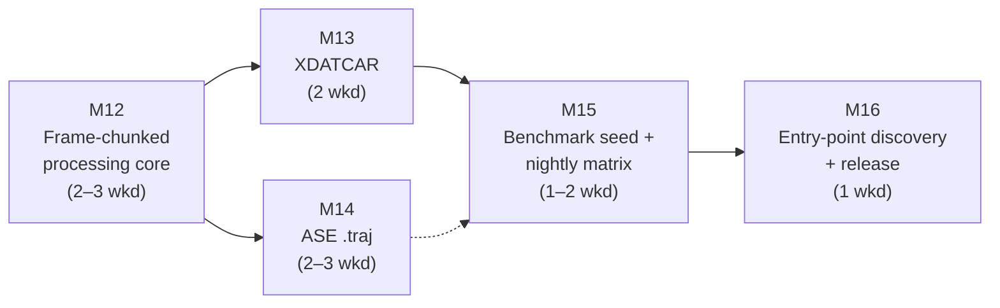

# ChemBridge — v0.3 Implementation Plan

> **Document status:** Execution plan for Version 0.3 ("Trajectories at Scale", per `docs/Incremental_Roadmap_v1.0.md` §4). It **supersedes the roadmap's §4 prose for execution purposes** while preserving its scope decisions: XDATCAR and ASE trajectory parsers/exporters, frame-chunked processing through the Conversion and Validation Engines, the performance-benchmark seed, and the nightly round-trip matrix — plus entry-point plugin discovery, the additive registry change `docs/ARCHITECTURE_REVIEW.md` §4.2 scheduled for exactly this version. CIF is **not here** (isolated to v0.4 deliberately: "mixing CIF with other work is how CIF eats a semester"). Scope authority remains MASTER_SPEC.md and the roadmap; this document decides *sequencing, packaging into milestones, and cut lines*.
>
> **Assumed inputs:** v0.2 shipped per `docs/IMPLEMENTATION_PLAN_v0.2.md` — full scenario catalog, two/three-hop round-trip suites enumerated from the registry, both property tests green with zero waivers, corpus governance enforced in CI, and the v0.2 tag published. Milestone numbering continues globally: v0.3 = **M12–M16**.

---

## 1. Shape of the plan

Five milestones, M12–M16. Each is mergeable, testable, and a resting state, as in the v0.1 and v0.2 plans.

Estimates are in **weekends** (~9 h — this version runs alongside a semester). The roadmap budgets 8–10 weekends; the ranges below sum to **9–12** with buffer inside the ranges (the v0.1 re-baselining lesson, applied forward).

Three structural notes:

- **M12 comes first, before either parser** — the roadmap's own explicit rule ("budget two full weekends for it before touching either parser"). Chunked processing is the first genuinely algorithmic engine change since v0.1 and the project's **top schedule risk (R8)**: if it is bolted on after XDATCAR exists, the mitigation degrades to "caps and patience" (Part 10 §3).
- **M13 before M14 on the critical path.** XDATCAR is the format that *forces* chunking (10,000-frame MD output is its normal size), so it is the honest first test of M12. M14 can proceed in parallel with M15 once M12 is stable.
- **M16 is the version's cut line.** Entry-point discovery serves future plugin authors, not current users; it slips to v0.4 before anything in M12–M15 is cut.

---

## 2. Milestones

### M12 — Frame-chunked processing core (2–3 weekends)

The engine change everything else in v0.3 stands on: memory growth must become **sub-linear in frames** through the whole pipeline, behind the *same* stable interfaces — performance work inside the single canonical path, never a second path (Part 4 §6, P2/P6).

**Deliverables**

1. **Streaming SDK surface, additive:** `ParserPlugin` gains an optional frame-iterator method (header/metadata parsed eagerly; frames yielded lazily) and `ExporterPlugin` an optional frame-stream write path. Existing v0.1/v0.2 whole-file implementations keep working unmodified — the registry adapts non-streaming plugins by materializing (the current behavior, now a named fallback). The design (iterator shape, chunk size ownership, error propagation mid-stream) is recorded in `docs/DECISIONS.md` with the rejected alternative.
2. **Discovery/presence over streams:** `field_presence()`'s `present/absent/mixed` trichotomy computed by single-pass accumulation across yielded frames — the Discovery Report stays exact without materializing the trajectory.
3. **Conversion Engine chunk-aware:** pre-flight diff from accumulated presence; `write_plan` applied per frame; the **runtime completeness assertion still holds exactly** — chunking changes memory behavior, never report truth. Recovery interplay handled explicitly: `frame_selection` on a stream (single-pass for `first`/`index`, bounded lookback for `last`), `bounding_box` computed on the *selected* frame only.
4. **Validation Engine chunk-aware:** per-frame checks (`positions_rmsd`, `numeric_field_fidelity`) stream pairwise over expected/re-parsed frames; whole-object checks (`frame_count`, `report_consistency`) run on accumulated state.
5. **Mid-stream error semantics:** a `ParseError` at frame k during streaming honors the Part 3 §5 contract — no half-written output masquerading as completed; the `truncate_corrupt_tail` hint works identically in the chunked path.
6. **Memory ceiling documented** (roadmap §4's named deliverable): a short `docs/` note stating the model — peak memory ∝ chunk size × atoms, not frames — and its measured validation from deliverable 7.
7. **Proof fixture:** a committed deterministic generator producing a large synthetic multi-frame extXYZ; a test converts it through the streaming path and asserts peak RSS stays under a fixed bound that whole-file materialization demonstrably exceeds.

**Done means:** the proof-fixture test is green in CI; all existing v0.1/v0.2 suites (identity, two/three-hop, property, golden) pass unchanged — the refactor is invisible to every report.
**Dependencies:** none within v0.3. **Cut line:** streaming *export* breadth (streaming parse + single-frame-target export covers XDATCAR→POSCAR; trajectory-to-trajectory streaming export may land with M13) — never presence exactness or the completeness assertion.

**Risk:** this is R8 made concrete. **Go/no-go:** if weekend 3 ends without the proof-fixture test green, stop — do not start M13 on an unproven core; re-scope the iterator design before any format work builds on it.

---

### M13 — XDATCAR parser/exporter (2 weekends) — critical path

The format that motivated chunking: VASP MD trajectories, routinely 10⁴ frames.

**Deliverables**

1. **Parser**, hand-rolled (consistent with the POSCAR family, DECISIONS D7), streaming-first via M12: header (scale, lattice, symbols + counts — symbols present in the header per Part 3 §3 n.1, so no `missing_species` on well-formed files); `Direct configuration N` frame blocks; fractional→Cartesian at the boundary with `original_coordinate_system` recorded; **both fixed-cell and per-frame-cell (NpT) forms** — per-frame cells are the format's distinctive canonical feature (`Frame.cell` varies); format-defined `pbc=(T,T,T)` as a `parse_notes` entry (n.3); **`trajectory.timestep = None`** — XDATCAR numbers configurations but declares no time axis (n.5); frame ordering preserved via `frame.index`.
2. **Exporter:** multi-frame Direct output, per-frame cells when frames disagree; capability rows registered; the v0.2 table-sync test forces the Part 3 §3 column to match.
3. **Error contract fixtures:** truncated frame block mid-file → recoverable `ParseError` with `recovery_hint="truncate_at_last_valid_frame"` (the v0.2 `truncate_corrupt_tail` scenario now has a second consumer); count/symbol mismatch in header → `ParseError`.
4. **Golden + round-trips:** synthetic golden cases (fixed-cell, NpT per-frame-cell, single-frame degenerate) with manifests per v0.2 governance; identity round-trip **through the streaming path**; XDATCAR joins the two/three-hop matrix automatically via the registry (the v0.2 investment paying out: zero suite edits).

**Done means:** golden + identity + error fixtures green; `chembridge convert XDATCAR --to extxyz` on a generated 10k-frame file completes within the M12 memory ceiling; the matrix has grown by one format with no test-suite edits.
**Dependencies:** M12. **Cut line:** exporter NpT breadth (fixed-cell export first, per-frame-cell export tracked) — never the per-frame-cell *parse* or the `timestep = None` honesty.

---

### M14 — ASE `.traj` parser/exporter (2–3 weekends) — parallel-safe after M12

The richest format in Phase 1 — and the one whose worked example anchors the spec itself.

**Deliverables**

1. **Parser/exporter, ASE-backed** (D7: ASE is the only scientific dependency), covering the format's breadth per Part 3 §3: positions/symbols/masses, cells, velocities, forces, energy, stress, charges, magnetic moments, constraints (ASE `FixAtoms` → `Constraint(kind="fixed_atoms_mask")`), per-frame `time`/`trajectory.timestep`, calculator name/parameters → `simulation.calculator` / `simulation.extra` (n.10).
2. **The default-laundering suite**, the highest-value parser tests in the project (Part 8 §1.1), applied to ASE's inventions: default zero cell → `cell = None`; undeclared `pbc=(F,F,F)` → `None`; zero momenta → `velocities = None`. No parser defaulting, ever — the standing rule at its sternest, because ASE actively manufactures these values.
3. **Version discipline** (roadmap §4's `.traj` drift risk): ASE pinned; the ASE version recorded in `Provenance` alongside `parser_version`, so a future pin bump that changes parse behavior is visible in every report. A canary test asserts the pinned version.
4. **The spec's worked example, reproduced for real:** a committed generator builds `relax.traj` (10-frame water optimization, no cell); the Appendix A command line — `chembridge convert relax.traj --to poscar --recover frame_selection=last --recover missing_lattice=bounding_box,padding_ang=5.0 …` — reproduces the Part 4 §5 Conversion Report and Part 5 §6 Validation Report shapes end to end as a test. Until now those fixtures were hand-built; from M14 the spec's central example is *executable* (Part 10 §4.6 rule 4).
5. Golden cases (rich all-fields trajectory; minimal molecule; laundering cases) with manifests; identity round-trip; automatic matrix membership.

**Done means:** laundering suite green; worked-example test green byte-for-byte against the spec fixtures (modulo timestamps/ids); `.traj` identity round-trip green through the streaming interface where ASE's reader supports lazy access (documented fallback where it does not).
**Dependencies:** M12 (M13 not required — may run in parallel with it or with M15). **Cut line:** exotic ASE constraint types beyond `FixAtoms` (carry through as custom data with a warning, track) — never the laundering suite or the worked-example reproduction.

---

### M15 — Benchmark seed + nightly matrix (1–2 weekends)

Performance becomes a tracked number, and the O(n²) suites move to their permanent nightly home (deferral table: nightly matrix from v0.3; benchmark *gates* wait for v0.5's pinned runner).

**Deliverables**

1. **Synthetic performance corpus:** committed deterministic generators (fixed seed) — the 10k-frame × 100-atom XDATCAR, the 1k-frame × 1k-atom extXYZ — generated, never stored (Part 8 §4).
2. **Benchmark harness** seeding Part 8 §4's table: `parse_xdatcar_10k`, `convert_xdatcar_to_extxyz_10k`, `convert_extxyz_roundtrip_1k`, `preflight_latency`, and a reduced-scale `frame_limit_ceiling` probe asserting the sub-linear memory property. Wall-time + peak-RSS recorded as CI artifacts. **Measured, not gated:** on shared runners the targets are reference points; the >20%-regression tripwire activates on v0.5's pinned runner (Part 8 §4's own alternative-rejected reasoning).
3. **Nightly workflow:** full n×n two-hop + three-hop matrix over all six formats (now super-linear enough to leave the PR suite — the v0.2 per-PR full matrix ends here, replaced by the Part 8 §2.4 curated PR subset: identity for all formats + high-risk pairs incl. `ase_traj→poscar`); extended property-test budgets (the M10 stage-2 budget finds its nightly home); dependency vulnerability audit. A nightly failure opens/updates a tracking issue rather than blocking PRs.
4. **Memory ceiling documentation** finalized with measured numbers from the benchmark corpus (closing M12 deliverable 6 with real data).

**Done means:** nightly workflow has run green at least once end to end; benchmark artifacts (time + RSS series) are downloadable from a scheduled run; the PR suite is back under its 10-minute cap after the matrix moved out.
**Dependencies:** M13 (XDATCAR benchmarks); M14 joins the matrix whenever it lands. **Cut line:** auto-issue plumbing and artifact charting polish — never the memory measurements or the nightly matrix itself.

---

### M16 — Entry-point plugin discovery + release (1 weekend) — the version's cut line

The additive registry change deferred from v0.1 by design (review §4.2: entry points serve zero users before v0.3 — this is v0.3).

**Deliverables**

1. **`importlib.metadata` entry-point discovery** (`chembridge.parsers` / `chembridge.exporters` groups, Part 3 §7.1) *added to* the explicit-list registry — first-party formats stay explicitly registered; discovery is for third parties. Declaration validation at load: a plugin declaring capabilities against unknown canonical paths is rejected with a readable error, not silently accepted.
2. **Discovery proof:** a minimal in-repo test plugin (separate installable package under `tests/`) is discovered from its entry point, sniffs, converts, and joins the round-trip matrix — the P6 promise demonstrated, and the seed of v1.0's reference plugin.
3. **Docs:** the add-a-format guide updated for entry-point packaging, carrying the R12 honesty clause verbatim — the SDK remains unstable until v1.0; plugin authors before then accept interface churn.
4. **Release:** `CHANGELOG.md`; README scope statement updated (six of seven Phase 1 formats; CIF named as v0.4); version bump; **tag and publish v0.3** (PyPI + GitHub release).

**Done means:** `pip install` of the test plugin wheel into a clean env makes its format appear in `chembridge capabilities` with no code changes; a bad-declaration plugin fails loudly at registry load.
**Dependencies:** M12 only (registry). **Cut line:** this whole milestone's discovery half slips to v0.4 before anything in M12–M15 is cut; the release half (item 4) is never cut — v0.3 tags when M15 is green regardless.

---

## 3. Schedule and checkpoints

| Milestone | Weekends | Cumulative | Go/no-go checkpoint |
|---|---|---|---|
| M12 | 2–3 | 2–3 | **Hard gate:** proof-fixture memory test green before M13 starts. Weekend 3 without it ⇒ stop and redesign the iterator, not push on. |
| M13 | 2 | 4–5 | First 10k-frame conversion inside the ceiling = R8 mitigated in fact, not in prose. |
| M14 | 2–3 | 6–8 | **Mid-plan checkpoint:** if cumulative > 8 with M14 unfinished, invoke the M16 cut now and let M14 finish on the remaining weekends. Worked-example reproduction is the milestone's exit door — don't tag without it. |
| M15 | 1–2 | 7–10 | One green nightly run before tagging. |
| M16 | 1 | 8–11 (–12 w/ buffer) | Tag v0.3 (with or without discovery, honestly stated). |

M14 may interleave with M13/M15 across weekends; the table's cumulative column assumes serial worst-case. Any milestone boundary is a resting state: a semester interruption after M13 leaves a coherent, tagged-able five-format core.

## 4. Standing rules during v0.3

1. **The slip rule** governs: cut format edge cases and M16, never report completeness, laundering, or memory honesty.
2. **No parser defaulting, ever** — M14's laundering suite is the rule's proving ground; ASE's manufactured defaults are exactly the class of silent fabrication the project exists to refuse.
3. **Chunking changes memory, never truth** — any divergence between streamed and materialized reports on the same input is a stop-the-line bug.
4. **Spec drift found while coding** gets a Revision-note entry in the same PR (Part 10 §4.6 rule 1) — likely spots: streaming SDK surface (Part 3 §2), XDATCAR capability rows (Part 3 §3).
5. **Nothing from v0.4+** (CIF, API, services, UI, benchmark gates) enters v0.3 — the deferral table (roadmap §10) is binding. CIF curiosity during XDATCAR work goes into v0.4 study notes, not code.

## 5. Verification of the release as a whole

Before tagging v0.3, from a clean environment with the built artifact:

1. `pip install chembridge`; `chembridge capabilities` lists six formats (XYZ, extXYZ, POSCAR, CONTCAR, XDATCAR, ASE traj).
2. Generate the 10k-frame XDATCAR with the committed script; `chembridge convert XDATCAR --to extxyz` completes with peak memory inside the documented ceiling, and the Conversion + Validation Reports satisfy the completeness invariant.
3. Run the spec's own worked example verbatim (Appendix A command on a generated `relax.traj`) and diff the reports against the Part 4 §5 / Part 5 §6 fixtures.
4. Laundering spot-check: a `.traj` with ASE's default zero cell inspects as `cell: absent` — never a fabricated box.
5. One full nightly run (n×n matrix, extended properties, audit) green on the release commit.
6. If M16 shipped: install the test plugin wheel and see its format appear with zero code changes. If cut: the README scope statement says so.
7. CI green on the tag; CHANGELOG and scope statement match what actually shipped.
