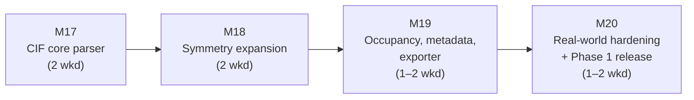

# ChemBridge — v0.4 Implementation Plan

> **Document status:** Execution plan for Version 0.4 ("CIF — Phase 1 Complete", per `docs/Incremental_Roadmap.md` §5). It **supersedes the roadmap's §5 prose for execution purposes** while preserving its one non-negotiable scope decision: **nothing else lands in this version.** Part 10 prices CIF at ~3 experienced weeks alone; the roadmap's verdict — "mixing CIF with other work is how CIF eats a semester" — is adopted here as a standing rule, not a suggestion. Scope authority remains MASTER_SPEC.md (Part 3 §3, especially footnotes 3, 4, 8, 9, 11, 13) and the roadmap; this document decides *sequencing, packaging into milestones, and cut lines*.
>
> **Assumed inputs:** v0.3 shipped per `docs/IMPLEMENTATION_PLAN_v0.3.md` — six formats through the streaming-capable engine, registry-enumerated round-trip matrix, nightly workflow live, corpus governance enforced. If v0.3 cut M16 (entry-point discovery), it lands here as a side deliverable of M20. Milestone numbering continues globally: v0.4 = **M17–M20**.

---

## 1. Shape of the plan

Four milestones, M17–M20, each mergeable, testable, a resting state. Estimates in **weekends** (~9 h, semester cadence). The roadmap budgets 5–7 weekends; the ranges below sum to **6–8** with buffer inside the ranges.

The chain is strictly serial — every milestone builds on the atoms the previous one produces — which is exactly why CIF gets a version to itself: there is no off-critical-path work to reorder around a slip. The schedule protection is instead **front-loaded risk**: M18 (symmetry expansion), the costliest and most correctness-critical piece, sits second, not last, so a slip there consumes buffer rather than the release.

**Why CIF is a version by itself, restated as engineering fact:** CIF is the only Phase 1 format that is (a) fractional-native with cell *parameters* rather than vectors, (b) commonly an *asymmetric unit* requiring declared-operation expansion to be physically right, (c) multi-block, and (d) carrying a canonical-schema gap (occupancy, Part 3 §3 n.11). None of these adds a new engine path — that claim, made when CIF was deferred in v0.1, gets its final proof here — but each is parser-side complexity with silent-wrongness failure modes (a fraction of the atoms, the wrong setting, a dropped block) of exactly the class this project exists to prevent.

---

## 2. Milestones

### M17 — CIF core parser (2 weekends)

The structural subset: syntax, cell, positions, block policy. No symmetry yet — M17 handles only files that are already full-cell (`P 1` or explicit full atom lists), which keeps the first milestone testable without the hardest machinery.

**Deliverables**

1. **CIF backend decision recorded in `docs/DECISIONS.md`** with rejected alternatives, before code. The candidates: hand-rolled CIF 1.1 core-subset reader (tags, `loop_`, `data_` blocks, quoting/multiline rules — full control over laundering and error contract, consistent with the hand-rolled VASP family, D7); ASE-backed (adds no dependency but ASE's CIF path makes symmetry/occupancy choices we would have to launder around); a dedicated CIF library (e.g. gemmi — correct and fast, but a new scientific dependency against D7's "ASE is the only scientific dependency"). The plan's default recommendation is the hand-rolled core subset — CIF's *syntax* is small; its *semantics* are where the weekends go regardless of backend — but the decision is D-numbered and owned by M17, not assumed here.
2. **Block structure:** parse `data_` blocks; **first block is the structure, further blocks are named in a `warning`-severity `ParseIssue`** — never silently skipped (n.4; blocks are independent structures, not frames — the rejected-alternative reasoning goes in the parser docstring).
3. **Cell:** `_cell_length_*` / `_cell_angle_*` → 3×3 `lattice_vectors` (conventional construction, documented orientation); `pbc = (T,T,T)` as a format-defined `parse_notes` entry (n.3); fractional → Cartesian at the parser boundary with `original_coordinate_system = "fractional"` recorded (Part 2 §4).
4. **Atom sites:** `_atom_site_*` loop → symbols (type_symbol laundering: oxidation-state suffixes like `Fe3+` split off, charge part held for M19), positions; element validation against the schema's element table.
5. **Carry-through:** free-text/bibliographic tags verbatim into `simulation.extra` under `cif:`-prefixed keys (n.9); unrecognized tags carried, never dropped silently.
6. **Error contract fixtures:** unparseable numeric, missing required loop columns, empty block → structured `ParseError`s; golden cases (synthetic `P 1` structures) with manifests.

**Done means:** a synthetic full-cell CIF parses to a Canonical Object whose golden expectation is hand-verified; fractional→Cartesian is exact against a hand-computed fixture; a two-block file parses block one and names block two in a warning; `pytest` green on all error fixtures.
**Dependencies:** none within v0.4. **Cut line:** exotic syntax breadth (CIF 2.0 constructs, unusual quoting — log `ParseIssue`, track) — never the multi-block warning or fractional exactness.

---

### M18 — Symmetry expansion (2 weekends) — the version's hard core

Part 3 §3 n.13, normative: a CIF carrying an asymmetric unit plus declared operations must be expanded to the full cell — this is *reading the file as the standard defines it*, a format-defined fact, not computed symmetry (the Non-Goal forbids *deriving* symmetry from coordinates, not honoring operations the file declares).

**Deliverables**

1. **Operation parsing:** `_space_group_symop_operation_xyz` and legacy `_symmetry_equiv_pos_as_xyz` strings (`'x, y+1/2, -z'` forms) → affine operations; a file whose declared operations are **unparseable is a `ParseError`** — never a silent fall-back to the asymmetric unit (n.13's own rejected alternative: a fraction of the physical atoms is silently wrong stoichiometry in every downstream conversion).
2. **Expansion:** apply all declared operations to all sites; wrap *generated* fractional coordinates into [0,1) as part of expansion arithmetic (this is construction of new sites, not the forbidden wrapping of source data — the distinction goes in a code comment and a test name); **special-position merging** within a documented distance threshold, each merge recorded.
3. **Provenance:** `parse_notes` records operation count and per-site multiplicities; the declared operation strings carry verbatim in `simulation.extra["cif:symmetry_operations"]`; `cell.space_group` carries the declared symbol (Part 2 §3.4).
4. **Correctness anchors:** golden cases where the expanded result is externally checkable — NaCl (Fm-3m, 4+4 atoms in the conventional cell), a structure with a special position (site multiplicity < operation count), and a `P 1` file whose "expansion" is the identity. Expanded stoichiometry asserted against the published formula unit count (Z).
5. **Scientific-invariant hookup:** the expanded structures run through the Part 8 §1.3 invariant checks (stoichiometry multiset, cell volume) as part of the golden suite — the tests most sensitive to an expansion bug.

**Done means:** all M18 goldens green including special-position merge counts; the unparseable-ops fixture raises, not degrades; a deliberately truncated operation list produces detectably wrong stoichiometry in the test (proving the assertions have teeth).
**Dependencies:** M17. **Cut line:** none inside the milestone — partial symmetry expansion is the one thing worse than none. The *schedule* valve is the go/no-go below.

**Risk & go/no-go:** this is the milestone Part 10's "~3 experienced weeks for CIF" mostly prices. If weekend 4 of the version ends without M18's goldens green, the honest options are (a) spend buffer — this is what it is for — or (b) re-scope v0.4 to *parse-side-only* CIF (M19's exporter deferred to v0.4.1), never (c) ship expansion "mostly working." Wrong-atom-count output is the project's cardinal sin.

---

### M19 — Occupancy, charges, metadata, exporter (1–2 weekends)

The remaining semantics, and the write side.

**Deliverables**

1. **Occupancy — the flagged schema gap (n.11):** `_atom_site_occupancy` verbatim into `user_metadata.custom_per_atom["cif:occupancy"]`; a `warning` `ParseIssue` stating occupancy is carried as a custom array, not modeled; structures with occupancy ≠ 1.0 additionally surface a **Conversion Report warning for every target** (all Phase 1 targets lack occupancy). A tracking issue tagged as the Part 2 §6 rule-4 promotion candidate — documented limitation, never silent.
2. **Formal charges (n.8):** `_atom_type_oxidation_number` → `electronic.charges` with scheme label `"formal_oxidation_state"` in `simulation.extra`; M17's type-symbol suffixes reconciled against it.
3. **CIF exporter:** single frame (`max_frames = 1` ⇒ CIF targets join `frame_selection`); Cartesian → fractional at the boundary; lattice vectors → cell parameters. **Export symmetry policy, recorded as a D-numbered decision:** write `P 1` with the full explicit atom list — the Canonical Object holds expanded atoms, and re-deriving a space-group setting from coordinates is exactly the Non-Goal; a source-carried `cell.space_group` is therefore listed in `removed` with that reason (rejected alternative — echoing the source symbol over an explicit full atom list — asserts a setting the written coordinates no longer encode).
4. **Capability rows** for CIF read + write; the table-sync test forces the Part 3 §3 column to match; CIF's arrival in the pre-flight diff (`space_group` now a *source-present* field every other format removes — the first format to exercise that path).
5. Golden + identity round-trip (CIF → Canonical → CIF, comparable under the strict profile given the `P 1` export policy); CIF joins the two/three-hop matrix and nightly n×n automatically via the registry.

**Done means:** an occupancy-bearing CIF warns at parse *and* in every conversion report; identity round-trip green; `chembridge convert struct.cif --to poscar` produces the fractional→Cartesian→Direct chain with a complete report.
**Dependencies:** M18. **Cut line:** exporter niceties (tag ordering, cosmetic layout) — never the occupancy warnings or the `removed` entry for `space_group`.

---

### M20 — Real-world hardening + Phase 1 release (1–2 weekends)

CIF is the format where synthetic fixtures least resemble the wild; this milestone is deliberately budgeted confrontation with real files.

**Deliverables**

1. **Real-world corpus batch:** a curated set of Crystallography Open Database entries (CC0 — admissible under the v0.2 governance rules, manifests + ATTRIBUTIONS regeneration) spanning: legacy `_symmetry_*` tag spelling, mixed-case tags, `?`/`.` unknown-value markers, uncertainty parentheses (`5.4310(2)` — parsed to the value, precision noted), occupancy < 1, oxidation-state symbols, multi-block. Every failure becomes either a fix or a structured `ParseIssue` with a tracked issue — the slip rule applied to a real corpus.
2. **Error/edge fixtures promoted to goldens** from whatever batch 1 surfaced (the corpus grows forever, risk R1).
3. **If v0.3 cut M16:** entry-point discovery lands here (its plan-of-record is `IMPLEMENTATION_PLAN_v0.3.md` M16, unchanged).
4. **Phase 1 complete — release:** README scope statement rewritten (all seven Phase 1 formats; the "adding a format is O(1)" claim now demonstrated three times, per the roadmap's stopping-point language); CHANGELOG; version bump; **tag and publish v0.4** (PyPI + GitHub release).

**Done means:** the COD batch parses with zero silent anomalies — every file either round-trips clean or carries named `ParseIssue`s; nightly n×n matrix green over seven formats; CI green on the tag.
**Dependencies:** M19. **Cut line:** COD batch *breadth* (a dozen well-chosen entries beat fifty unexamined ones) — never the license manifests or the promote-failures-to-fixtures rule.

---

## 3. Schedule and checkpoints

| Milestone | Weekends | Cumulative | Go/no-go checkpoint |
|---|---|---|---|
| M17 | 2 | 2 | Backend decision D-numbered before code; fractional exactness fixture green. |
| M18 | 2 | 4 | **The version's gate:** goldens incl. special positions green, or invoke the M18 go/no-go options — buffer, or parse-side-only re-scope. Never "mostly working" expansion. |
| M19 | 1–2 | 5–6 | Occupancy warning visible in a conversion report before the exporter merges. |
| M20 | 1–2 | 6–8 | Tag v0.4 — Phase 1 complete. |

A pause after any milestone is coherent: after M17, ChemBridge honestly parses full-cell CIFs; after M18, all CIFs; after M19, it writes them. The version tags only after M20's real-world batch — a CIF parser validated purely on synthetic files would be trustworthy in the lab and embarrassing in the wild.

## 4. Standing rules during v0.4

1. **Nothing else lands in this version.** No API groundwork, no UI sketches, no new scenarios, no other formats' edge-case debt — the roadmap's isolation rule for CIF is absolute. (Sole exception: M20 item 3, a pre-authorized v0.3 leftover.)
2. **The slip rule** governs within CIF: cut syntax breadth, never block/occupancy/expansion honesty.
3. **No parser defaulting, ever** — an absent occupancy column is `None`-adjacent (no custom array), never assumed 1.0; an absent symmetry loop means the file *is* its explicit atom list, recorded as such.
4. **Wrong stoichiometry is the cardinal sin:** any expansion-adjacent change re-runs the Z-assertion goldens; a red one is stop-the-line.
5. **Spec drift found while coding** gets a Revision-note entry in the same PR — likely spots: n.13's merge-threshold value, the export symmetry policy (which refines Part 3 §3's CIF column).

## 5. Verification of the release as a whole

Before tagging v0.4, from a clean environment with the built artifact:

1. `pip install chembridge`; `chembridge capabilities` lists all seven Phase 1 formats.
2. `chembridge inspect` on a COD NaCl entry: expanded atom count matches the published conventional cell; `space_group` present; the ✓/✗ inventory shows occupancy-free structure cleanly.
3. `chembridge inspect` on an occupancy-bearing entry: the occupancy warning appears; converting it to any target repeats the warning in the Conversion Report.
4. A two-block CIF: block two named in the Discovery Report's issues, never silently dropped.
5. `chembridge convert struct.cif --to poscar` and `--to extxyz`: complete reports; `space_group` in `removed` with its reason; validation passes.
6. CIF → CIF identity round-trip green under the strict profile from the CLI.
7. Nightly n×n matrix (now 7×7 write-capable pairs) green on the release commit; ATTRIBUTIONS.md regenerates byte-stable with the COD entries included.
8. CI green on the tag; CHANGELOG and README state Phase 1 completeness and the occupancy limitation honestly.
