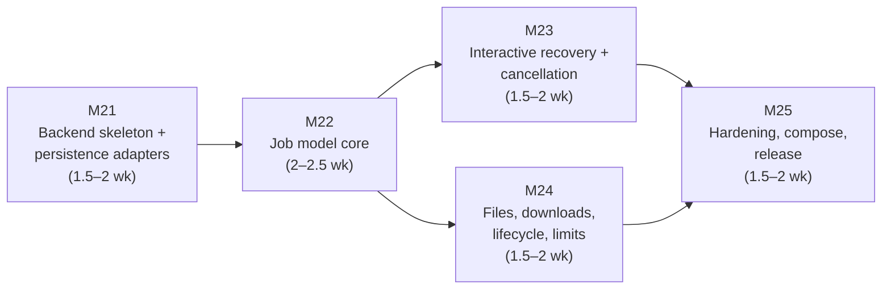

# ChemBridge — v0.5 Implementation Plan

> **Document status:** Execution plan for Version 0.5 ("Service — REST API", per `docs/Incremental_Roadmap_v1.0.md` §6). It **supersedes the roadmap's §6 prose for execution purposes** while preserving its scope decisions: the FastAPI backend per Part 6, the async job model including `awaiting_recovery` (interactive recovery arrives *here*, exactly as Part 10 §2 decision 4 planned), PostgreSQL and object-storage adapters behind the Tier 0-compatible interfaces, the Tier 1 compose stack, and the job-lifecycle test suite. **Omitted, per the roadmap:** hosted public instance (a v1.0-time decision), accounts/OAuth (self-hosted anonymous mode + static API key only), SSE/WebSockets (rejected in Part 6 §3.1 anyway), horizontal scaling.
>
> **Design-intent re-validation duty (Revision 1.2 notes, Parts 6 & 9):** the endpoint table, job-state enum, refusals-as-HTTP-200 rule, report-schemas-verbatim rule, and error envelope are **binding**; auth/CSRF mechanics, exact rate-limit defaults, and queue/migration tooling detail are **design intent** written 12+ months ahead — each such choice made in this version is re-validated against the current ecosystem and recorded as a D-numbered decision, not inherited silently.
>
> **Assumed inputs:** v0.4 shipped — all seven Phase 1 formats, streaming engine, nightly matrix, governed corpus. This version needs **consecutive days, not weekends** (roadmap §6: the job state machine is the one piece where half-finished weekend state is actively dangerous); it is planned for a summer block. Milestone numbering continues globally: v0.5 = **M21–M25**.

---

## 1. Shape of the plan

Five milestones, M21–M25. Each is mergeable, testable, a resting state. Estimates in **summer-weeks** (~25–30 h of consecutive-day work). The roadmap budgets 8–12 weeks; the ranges below sum to **8–11** with buffer inside the ranges.

Structural notes:

- **The API layer stays thin by law** (Part 1 §2): it validates requests, manages jobs and storage, and delegates every scientific decision to the library that five versions have hardened. Any PR that puts conversion logic in `backend/` is wrong by construction — the import-linter contract from M0 extends to enforce it (`backend` imports the library; nothing in the library imports `backend`).
- **M23 and M24 parallelize after M22.** Interactive recovery and the file/lifecycle surface both sit on the job core but not on each other. In a summer block this is sequencing freedom, not a second developer assumption.
- **The critical path is M22.** The job state machine (`queued/running/awaiting_recovery/completed/failed/expired/cancelled`) is why this version demands consecutive days; it gets the largest single budget and the strictest done-means.

---

## 2. Milestones

### M21 — Backend skeleton + persistence adapters (1.5–2 weeks)

Everything stateful, behind interfaces Tier 0 can still satisfy — a parser bug fix must never require Docker (Part 9 §1.1).

**Deliverables**

1. **`backend/` package** (FastAPI app factory, settings from environment variables only per Part 9 §2, `.env.example` started day one); repo layout and dependency-direction lint updated; D-numbered decisions for the queue library and migration tool (design-intent re-validation: RQ vs arq vs Celery; Alembic assumed but confirmed).
2. **Storage adapters, two backends each behind one interface** (Part 9 §1.1): database — SQLite (Tier 0) and PostgreSQL; object storage — local filesystem (Tier 0) and S3-compatible (MinIO in Tier 1). The adapter test suite runs identically against both backends of each interface — parity is a test, not a hope.
3. **Relational model** per Part 1 §4.4: uploads, jobs, conversions, reports (Conversion/Validation/Discovery JSON persisted verbatim — no parallel DTOs, Part 6 preamble), provenance linkage; migration chain from empty; **reports-outlive-bytes** expressed in the schema (report rows carry no dependency on stored file bytes).
4. **First endpoints (synchronous, no jobs yet):** `GET /v1/health` (liveness + `?ready=true` dependency checks), `GET /v1/capabilities` and `/v1/capabilities/{format_id}` (straight from the registry — seven formats appear with zero API-side format knowledge), `GET /v1/limits` (values from config). Error envelope (Part 6 §6) implemented as the single exception-to-response path from the start — retrofitting an envelope under thirty endpoints is the rewrite this milestone exists to avoid.
5. **Tier 1 compose, first shape:** `backend` + `postgres` + `minio` + `queue` services boot; MinIO bucket + lifecycle rules created by an init job (so §5.2 expiry is locally testable from the first week).

**Done means:** `docker compose up` then `curl /v1/health?ready=true` shows all dependencies green; the adapter suite passes against SQLite/Postgres and filesystem/MinIO alike; `GET /v1/capabilities` output equals `chembridge capabilities --json`.
**Dependencies:** none within v0.5. **Cut line:** compose polish (profiles, resource hints) — never adapter parity tests or the envelope-first rule.

---

### M22 — Job model core (2–2.5 weeks) — the critical path

The async job model of Part 6 §3, minus the recovery pause (M23): submit → poll → retrieve, uniformly.

**Deliverables**

1. **Job envelope** (Part 6 §3.2) as a pydantic model: `job_id`, `kind`, `state`, timestamps, `expires_at`, `progress` (phase + frame counters wired to the v0.3 chunked engine's natural boundaries), `result`, `error`.
2. **States and transitions:** `queued → running → completed | failed`, `queued → failed` on lost preconditions (e.g. `FILE_EXPIRED` at dequeue), with every transition persisted and timestamped. The state machine is a single, tested module — not conditionals scattered across handlers. **A refusal is a completed job** (HTTP 200, `ConversionReport.status="refused"` in the result) — the binding rule that makes the API honest, enforced by an explicit test.
3. **Worker:** same image, second entrypoint (Part 9 §2 — one artifact, no API/worker version skew); executes inspect/convert/validate jobs by calling the library exactly as the CLI does; structured JSON logs carrying `request_id`/`job_id` (never scientific content, Part 9 §6.1).
4. **Endpoints:** `POST /v1/inspect` (with `format_override` and the idempotency key of Part 6 §2 — same file + override + registry version returns the existing job), `POST /v1/convert` (full request schema of Part 6 §2.1 — `mode`, `recovery_choices` presets, acknowledgments, `tolerance_profile`), `GET /v1/jobs/{job_id}` with **long-poll `?wait=` (max 30 s)** — the uniform-202 contract of Part 6 §3.1; small jobs feel synchronous through one response shape.
5. **`POST /v1/validate`** (re-thresholding of stored measurements under a different profile — a query over persisted reports, available after byte expiry by construction).

**Done means:** the full preset-driven pipeline works over HTTP end to end — upload (a stub direct-to-storage path until M24), convert with `recovery_choices`, poll to `completed`, retrieve the verbatim reports; a deliberately crashed worker mid-job yields `failed` with a structured envelope error, never a stuck `running` row; the state-machine module has a transition-table test covering every legal and illegal edge.
**Dependencies:** M21. **Cut line:** long-poll (degrade to plain polling, tracked) — never envelope verbatim-ness, the refusal-is-200 rule, or transition persistence.

**Risk & go/no-go:** this is the milestone the summer exists for. If week 4 of the version ends without M22's done-means, stop feature work and finish the state machine — M23/M24 built on a shaky job core is the "half-finished weekend state" failure mode the roadmap forbids, relocated to summer.

---

### M23 — Interactive recovery + cancellation (1.5–2 weeks)

The reason the API exists in the ladder at all: `awaiting_recovery` gives the Recovery Engine's pause-and-ask model its natural home (Part 10 §2 decision 4). The engine itself is untouched — five versions of scenario machinery gain a transport.

**Deliverables**

1. **Pause:** an unresolved fabricative/selective scenario with no preset moves the job to `awaiting_recovery`; the parsed Canonical Object and draft report persist server-side (Part 1 §4.3); the envelope's `awaiting_recovery` block carries the **computed** option lists (Part 4 §3.3's ✳-logic — no `non_periodic` for a POSCAR target) plus `parameters_schema` hints, verbatim per Part 6 §3.2 — the future UI renders from this block alone, so its completeness is tested now.
2. **Resume:** `POST /v1/jobs/{job_id}/recovery` validates choices against the *offered* list (`422 INVALID_RECOVERY_CHOICE` with `offered_choices`), applies them through the ordinary Recovery Engine (Assumptions recorded with `origin: "user"`), returns to `running`.
3. **Expiry:** `awaiting_recovery` TTL (config; `awaiting_recovery_ttl_minutes` in `LimitsResponse` (Revision 1.4 rename; hosted default 30 min, capped by the input's `expires_at`)) → state `expired`, conversion report `status="refused"`, `refusal.code="RECOVERY_REQUIRED"` — **the bright line as infrastructure: a timeout can never apply a default** (Part 6 §3.2). Enforced by a clock-controlled test.
4. **Cancellation** (`POST /v1/jobs/{job_id}/cancel`): immediate from `queued`/`awaiting_recovery`; best-effort at the next frame-chunk boundary from `running` (the v0.3 chunked engine provides the boundaries — a worker checks a flag between chunks); idempotent; `409 JOB_ALREADY_TERMINAL` on finished jobs; a cancelled conversion produces **no output and no Conversion Report** — cancellation is withdrawal, not an outcome deserving a fabricated report (Part 6 §3.2).
5. **Job-lifecycle test suite** (the roadmap's named deliverable): every transition of the Part 6 §3.2 state diagram exercised, including `awaiting_recovery → expired → refused`, cancellation from each non-terminal state, and resume-after-partial-choices (two scenarios, one resolved — still paused).

**Done means:** the Part 4 §5 worked example runs *interactively* over HTTP — submit without presets, observe the pause with exactly the spec's two scenarios and computed options, resume with choices, poll to completed, reports byte-equivalent to the preset-driven run of the same input.
**Dependencies:** M22. **Cut line:** best-effort mid-`running` cancellation (degrade to queued/awaiting-only with a tracking issue) — never expiry-to-refusal or option-list honesty.

---

### M24 — Files, downloads, lifecycle, limits (1.5–2 weeks; parallel-safe with M23)

The bytes-handling surface and the protections around it.

**Deliverables**

1. **Upload:** `POST /v1/upload` streaming multipart to object storage (never whole-file in API memory), returning `UploadResponse` (`file_id`, `sha256`, `expires_at`); `413 FILE_TOO_LARGE` enforced during streaming.
2. **Download:** `GET /v1/download/{conversion_id}` streaming with correct `Content-Disposition`; the **failed-validation acknowledgment gate** — `409 VALIDATION_ACK_REQUIRED` unless `?acknowledge_validation_failure=true` (Part 5 §2's access rule as transport); `410 OUTPUT_EXPIRED` after byte expiry.
3. **Lifecycle:** expiry via **bucket lifecycle rules** (the platform's guarantee, not an app cron — Part 9 §5.2), testable locally against MinIO's init-job rules; `DELETE /v1/files/{file_id}` for immediate removal; **reports remain retrievable after byte expiry** (`GET /v1/conversions/{id}` with `download.available=false`) — the reports-outlive-bytes promise as an integration test. **Report retention (Revision 1.5):** the daily `report_retention_days` sweeper (30 days on the hosted instance, `null` = indefinite for self-hosts) that deletes conversion records and their reports after the window, joining the byte sweeper of Part 9 §5.2 — the second, longer of the two retention windows, with account deletion cascading immediately.
4. **Records and history:** `GET /v1/conversions/{conversion_id}` (`ConversionRecordResponse`, reports verbatim); `GET /v1/history` with cursor pagination and `HistoryItem` summaries (`summary_counts` computed from the reports — the chips the v0.6 UI will render).
5. **Limits and auth (v0.5 scope only):** every Part 6 §5 constraint config-driven and surfaced in `GET /v1/limits` — including `report_retention_days` (Revision 1.5) alongside the byte-retention and `awaiting_recovery` TTL fields; rate limiting (`429` + `Retry-After`), concurrent-job cap, frame cap already enforced by the parser (`FRAME_LIMIT_EXCEEDED` surfaced through the envelope); **auth = anonymous self-hosted mode + optional static API key(s) from environment** — `/v1/auth/*` and `/v1/keys*` return `404 NOT_ENABLED` (Part 6 §4; account machinery is hosted-instance work, deferred with it). Default limit *values* re-validated rather than inherited (design-intent duty).
6. **Uploaded-file security posture** (Part 9 §5.3): private buckets only, downloads stream through the API, files are data never code, per-job resource caps (container limits + wall-clock timeout) so a pathological file fails *its own* job.

**Done means:** upload → convert → download round-trips a real file through MinIO; the ack-gate blocks a failed-validation download until acknowledged; a file past its (test-shortened) lifecycle 410s while its conversion record still serves both reports; an over-limit upload fails with the envelope, not a stack trace.
**Dependencies:** M22 (M23 not required). **Cut line:** history pagination richness and `HistoryItem` field breadth — never the ack gate, private-bucket rule, or reports-outlive-bytes.

---

### M25 — Hardening, compose, release (1.5–2 weeks)

**Deliverables**

1. **Tier 1 compose finalized** (Part 9 §1.2): `backend`, `worker`, `postgres`, `minio`, `queue` — one command yields the full upload → inspect → convert (pause/resume) → validate → download loop locally, including expiry. (The `frontend` service row waits for v0.6; the compose file gains it then.)
2. **Backend integration suite complete** (Part 8 §1.1 `backend` row): error envelope per code, limit enforcement, idempotent inspect, ownership-boundary behavior in anonymous mode; the API's OpenAPI schema generated and committed as a build artifact (the v1.0 freeze will diff against it — start the paper trail now).
3. **Feedback-loop *logging*** (Part 5 §7, the Part 10 v0.2-row item that becomes possible only now that reports persist in PostgreSQL): the `(scenario, choice, parameters) → validation status` aggregation implemented as a documented query/view over existing rows — metadata only, never file contents. *Logging only*; advisory surfacing is UI work (v0.6+), and no default ever changes because of statistics (the bright line is untouchable by construction).
4. **CI:** backend tests join `ci.yml`; a compose-based integration job (spin the stack, run the lifecycle suite) joins `main.yml` or nightly per runtime cost; images built and pushed per Part 9 §3.
5. **Docs and release:** API quickstart (curl walkthrough of the full flow — Persona 2's onboarding); `.env.example` complete and commented; README updated (the library/CLI story unchanged, the service story added); CHANGELOG; **tag and publish v0.5** (PyPI + GHCR images + GitHub release).

**Done means:** a fresh clone + `docker compose up` + the documented curl sequence reproduces the interactive worked example without reading source; CI green including the integration job; the OpenAPI artifact is attached to the release.
**Dependencies:** M23, M24. **Cut line:** docs breadth and the compose integration job's CI placement — never the OpenAPI artifact or the lifecycle suite.

---

## 3. Schedule and checkpoints

| Milestone | Summer-weeks | Cumulative | Go/no-go checkpoint |
|---|---|---|---|
| M21 | 1.5–2 | 1.5–2 | Adapter parity suite green against both backends of both interfaces before any endpoint logic lands on them. |
| M22 | 2–2.5 | 3.5–4.5 | **The version's gate (week 4):** state machine done-means green, or stop feature work and finish it. Nothing builds on a shaky job core. |
| M23 | 1.5–2 | 5–6.5 | Interactive worked example over HTTP = the version's payoff demo; record the session. |
| M24 | 1.5–2 | 5–6.5 (parallel) | Reports-outlive-bytes integration test green before lifecycle shortening tricks are removed. |
| M25 | 1.5–2 | 8–10.5 (–11 w/ buffer) | Tag v0.5. |

If the summer ends early: M21–M22 is a coherent resting state (preset-driven API, no pause); M23 alone is the next coherent increment. Do **not** tag a version whose `awaiting_recovery` is half-implemented — a pause that can't reliably expire to refusal is the one state this project must never ship, because its failure mode is a silently applied default.

## 4. Standing rules during v0.5

1. **The API contains no scientific logic** — it is a presenter over the library; the import-linter contract enforces the direction, and code review enforces the spirit.
2. **Reports embed verbatim** — no DTOs, no field renames, no "API-friendly" reshaping (Part 6 preamble). The pydantic models *are* the wire format.
3. **Refusals are HTTP 200 completed jobs; expiry resolves to refusal, never a default.** Both rules get named tests that a future refactor cannot delete quietly.
4. **Design-intent choices are re-decided, not inherited:** queue library, migration tool, CSRF posture (moot until accounts exist), limit defaults — each lands as a D-numbered decision with the ecosystem check that Revision 1.2 asks for.
5. **Nothing from v0.6+** (frontend, recovery cards, format explorer UI, hosted-instance machinery, accounts) enters v0.5 — the deferral table is binding.
6. **The slip rule** still governs: cut endpoint conveniences, never envelope completeness or lifecycle honesty.

## 5. Verification of the release as a whole

Before tagging v0.5, from a clean machine:

1. Fresh clone → `docker compose up` → `curl /v1/health?ready=true` all green.
2. The documented curl walkthrough end to end: upload `relax.traj` → inspect (Discovery Report) → convert without presets → observe `awaiting_recovery` with the spec's computed options → resume with `frame_selection=last` + `missing_lattice=bounding_box` → poll to `completed` → reports match the Part 4 §5 / Part 5 §6 shapes → download the POSCAR.
3. Same conversion with presets in the initial request: byte-equivalent reports; refused variant (no presets, then cancel instead of resume) leaves a terminal `cancelled` job with no report, and a second identical convert refuses as `completed` HTTP-200 with exit-code-2-equivalent semantics.
4. Expiry drills against MinIO with shortened TTLs: paused job → `expired` → refused report; uploaded bytes gone at TTL while `GET /v1/conversions/{id}` still serves both reports.
5. Limits: an oversized upload 413s; a rate burst 429s with `Retry-After`; a static-API-key instance rejects keyless mutating requests.
6. `pip install chembridge` still works standalone — Tier 0 unharmed; the CLI acceptance pass of v0.1 §5 still passes unchanged.
7. CI green on the tag including the compose integration job; OpenAPI artifact published; CHANGELOG and README match what shipped.
