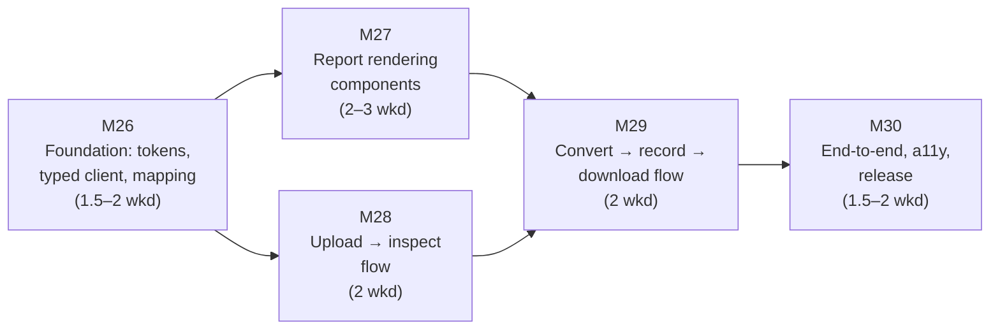

# Xtalate — v0.6 Implementation Plan

> **Document status:** Execution plan for Version 0.6 ("Humans — Web UI Core", per `docs/Incremental_Roadmap_v1.0.md` §7). It **supersedes the roadmap's §7 prose for execution purposes** while preserving its scope decisions: the Next.js upload → inspect → convert → report → download journey, report rendering in the ✓/✗/◆/⚠ loss-communication language (Part 7 §4), and fixture-driven component tests. **Omitted, per the roadmap:** interactive recovery decision cards, the format explorer, history, and the docs site (all → v0.7); all visualization (post-1.0, Part 7 §6).
>
> **Design-intent re-validation duty (Revision 1.2 note, Part 7):** the page/route map (§1), the presentation-layer "Must NOT" rules, and the ✓/✗/◆/⚠ vocabulary (§4) are **binding**. Wireframe detail, component architecture (§5), and page copy are **design intent** — re-validated now that the UI is actually being built, with deviations recorded as D-numbered decisions, not silently absorbed.
>
> **Assumed inputs:** v0.5 shipped — the `/v1` API with job model and interactive recovery live over HTTP, the committed OpenAPI artifact (the typed client generates from it), Tier 1 compose. Milestone numbering continues globally: v0.6 = **M26–M30**.

---

## 1. Shape of the plan

Five milestones, M26–M30. Estimates in **weekends** (~9 h, semester cadence). The roadmap budgets 8–10 weekends; the ranges below sum to **9–12** with buffer inside the ranges.

Structural notes:

- **M27 is the design-critical 40%** (Part 10's own estimate rationale): the report panels and the loss-communication components are what the product *is* on screen. They are built as components against fixtures *before* the pages that host them, so the pages assemble proven parts.
- **The UI is a faithful presentation layer, structurally:** no scientific logic, ever (Part 1 §2 "Must NOT"). Every piece of scientific content on screen is a rendering of a `DiscoveryReport`, `ConversionReport`, `ValidationReport`, or job envelope. The one apparent exception — the pre-flight preview (M28) — is set intersection over two *server-provided* structures, and its unit tests pin that boundary.
- **The roadmap's named risk is design perfectionism.** The palette, iconography, and plain-language mapping are *specified* (Part 7 §3.3–§4). The standing rule: **implement them, don't redesign them.** Aesthetic disagreements become tracked issues for a post-v0.7 design pass, not rework now.

---

## 2. Milestones

### M26 — Frontend foundation (1.5–2 weekends)

**Deliverables**

1. **`frontend/` scaffold:** Next.js App Router per Part 1 §5; D-numbered decisions (design-intent re-validation) for the framework version, component test tooling (e.g. Vitest + Testing Library), and e2e tooling (e.g. Playwright) — each with a rejected alternative.
2. **Typed API client generated from the v0.5 OpenAPI artifact** (Part 7 §5.1) + TanStack Query setup: job polling as a `?wait=5` long-poll query with refetch-on-focus; reports cached immutable (they never mutate — re-validation appends). **Server state is the state**: no global client store; every wizard step's URL carries the resource ID, so refresh/back/share reconstruct from a `GET` (the rejected-Redux rationale of Part 7 §5.1 honored by construction).
3. **Design tokens:** the §4 palette as `--cb-*` CSS custom properties, defined once; icon components (✓ ✗ ○ ◆ ⚠ ✕ –) that always pair icon + text label — color is never the sole carrier.
4. **The plain-language mapping table** (Part 7 §3.3) as one exported frontend constant: scenario codes and canonical paths → plain labels, machine code always available in a tooltip/disclosure. Plus its **coverage lint** (Part 8 §1.1 frontend row): CI fails if any scenario code in the engine's catalog or any canonical path lacks a mapping entry — the lint reads the same registry the backend serves, so a future plugin scenario surfaces as a lint failure, not a raw code on screen.
5. Compose gains the `frontend` service (hot reload, API proxy — the Part 9 §1.2 row deferred from v0.5); CI gains eslint + tsc + component tests (the Part 8 §5 frontend lanes).

**Done means:** `docker compose up` serves the app shell against the real API; the typed client compiles from the committed OpenAPI artifact with no hand-written endpoint types; the mapping-coverage lint fails when a scenario is deliberately removed from the constant.
**Dependencies:** none within v0.6. **Cut line:** tooling niceties (storybook-style catalogs) — never the mapping lint or the token-once rule.

---

### M27 — Report rendering components (2–3 weekends) — the design-critical core

Fixture-first: every component below is developed and tested against the worked reports of Part 4 §5 and Part 5 §6 **verbatim** — the same JSON committed as golden fixtures since v0.1 (Part 8 §1.1). The spec's central examples become the UI's development fixtures, so the documentation's load-bearing examples are what the UI provably renders.

**Deliverables**

1. **Loss-language primitives:** presence/outcome row (icon + label + `detail`), summary count chips ("4 preserved · 3 removed · 2 assumptions · 2 warnings") including the **affirmative empty state** ("0 removed · 0 assumptions" as a green chip — absence of loss is a positive statement, never an unlabeled blank).
2. **Conversion Report panel** (Part 7 §2.5 item 3): five sections mirroring the schema — Preserved (green), Removed (red, `reason` rendered inline from the schema's own text, never UI-paraphrased), **Supplied and Assumptions adjacent in shared ◆ violet** (the two faces of one act: what was fabricated beside why; prominence equal to Removed, per Part 4 §7), Warnings (amber, `code` badges). The severity-collapsed alternative is rejected in the spec — the component structure makes it unbuildable by accident.
3. **Validation Report panel:** one row per `CheckResult` (status icon, name, `message`); the quantitative substance (`measured`, `tolerance_applied`, the representational-bound explanation) behind per-row disclosure — present for the skeptic, invisible to the hurried; `skipped` rendered with `skip_reason`, never hidden.
4. **Refusal rendering:** `status="refused"` heads the same panel structure with `refusal.code` and unresolved scenarios in plain language via the mapping table — a refusal is a first-class outcome on screen exactly as it is on the wire.
5. **Error-envelope component:** `code` as a badge, `message` as text, `details` as specifics — **the UI never paraphrases error codes into vaguer language** (Part 7 §2.2), one component enforcing it everywhere.
6. **Fixture-driven test suite:** both worked reports render with every entry accounted for (a snapshot-plus-assertions test that counts rows against the fixture's arrays, so a silently dropped row fails loudly); the empty-state, refusal, and skipped-check fixtures likewise.

**Done means:** the Part 4 §5 report renders pixel-stable with all 3 removed rows' reasons inline, the fabricated lattice in violet ◆ tracing to Assumption A2, and the summary chips correct; the test suite fails if any report array element lacks a rendered row.
**Dependencies:** M26. **Cut line:** visual polish (spacing, motion) — never row completeness, the reason-verbatim rule, or the violet-equals-prominence rule.

---

### M28 — Upload → inspect flow (2 weekends; parallel-safe with M27)

**Deliverables**

1. **Landing (`/`):** the three blocks of Part 7 §2.1 — mission sentence + the Conversion Report concept first (the differentiator is the report, not a format count), primary "Convert a file" action, and the three-step strip that teaches the §4 iconography before the first upload. No marketing artifice; the audience is persuaded by precision. (The "Explore formats" link points at `/formats` and renders as "coming in v0.7" until then — honest, not broken.)
2. **Upload (`/convert`):** drop zone with the instance's limits shown inline *before* failure is possible (from `GET /v1/limits`: "Files up to 100 MB · deleted within 30 minutes, immediately after download · delete anytime" — Revision 1.4 values); upload progress from progress events; failure states through the M27 envelope component. On `201`, route to `/files/[file_id]`, which submits `POST /v1/inspect` (idempotent per the v0.5 contract, so revisits are cheap).
3. **Inspection results (`/files/[file_id]`)** — the "✓ Species / ✗ Lattice" page, four regions per Part 7 §2.3: file header with sniff confidence and the "Not the right format?" disclosure offering `format_override` re-inspection; structure summary; the **contents inventory** with the crucial nuance rendered — *absent-but-expressible* ("your file has none") visually distinct from *absent-and-inexpressible* ("this format cannot hold it"), the ○/✗-muted distinction of §4; parse warnings in an amber band **above** the inventory, never below the fold.
4. **Target picker with client-computed pre-flight preview:** a write-capable format grid; selecting a target overlays "will carry / will drop / will need recovery" by intersecting the Discovery Report's present fields with the target's `FormatCapabilities` — presentation-side set intersection over two server structures, **unit-tested against `FormatCapabilities` fixtures** (Part 8 §1.1), with the authoritative pre-flight remaining the engine's draft report. Mode toggle (default permissive, strict explained in one sentence) and Convert button.

**Done means:** upload → inspect renders a real Discovery Report for each of the seven formats' golden files; the `docx` negative case shows the `UNKNOWN_FORMAT` envelope with sniff candidates and the override hint; the preview's intersection tests pass, including a case where preview and draft would diverge if the intersection were computed wrong.
**Dependencies:** M26 (M27 not required — the inventory rows use the primitives, which land early in M27; sequence the two milestones' first weekends accordingly). **Cut line:** **the pre-flight preview overlay** — the version's designated cut (fall back to submit-and-render-the-draft-report, tracked); never the expressibility distinction or the above-the-fold warnings rule.

---

### M29 — Convert → record → download flow (2 weekends)

**Deliverables**

1. **Active conversion (`/convert/[job_id]`)**, rendered entirely from the long-polled job envelope: phase indicator from `progress.phase` with frame counts when reported and **no fake progress bars** (no percentage from the backend ⇒ phase + elapsed time, never an animation easing toward 90%); Cancel control in all non-terminal states with the honest best-effort caption for `running`; terminal states — `failed` (envelope), `expired` (**the explicit statement that the conversion was refused because no recovery choice was made — never worded as if a default was applied**), `cancelled` (a card stating no report exists because none does, not an empty report shell).
2. **`awaiting_recovery` interim treatment (v0.6-honest placeholder):** the decision cards are v0.7 scope, but the API pauses jobs today, so the page must not dead-end. v0.6 renders the pause honestly: the unresolved scenarios in plain language via the mapping table, the `expires_at` deadline, a Cancel action, and a short pointer to resolving via CLI/API presets — plus "interactive resolution arrives in the next version." Named in the release scope statement. (Rejected alternative: hiding the state or auto-cancelling — both misrepresent a first-class job state.)
3. **Conversion record (`/conversions/[conversion_id]`)** per Part 7 §2.5: outcome header with honest quantitative phrasing (never celebratory when loss occurred); **download panel below the outcome header and summary chips — the page structurally forces the loss summary into view before the file can be taken** (the consolidated-page decision and its P1 rationale, honored as layout law); the M27 Conversion + Validation panels side-by-side on wide viewports, stacked on mobile; the re-validate action (`POST /v1/validate` with a profile picker); the provenance strip (sha256 prefix, timestamps, mode, tolerance profile, report IDs — everything needed to cite the conversion).
4. **Failed-validation interim:** the full acknowledgment-gate UX is v0.7 scope; in v0.6 a failed validation renders the `409 VALIDATION_ACK_REQUIRED` envelope verbatim through the M27 component when download is attempted, with the failed checks visible in the Validation panel above. Honest, if terse; named in the scope statement.
5. Refused conversions route to the same record page and render via M27's refusal component, with "resolve and retry" deferred to v0.7 (it re-enters the wizard through recovery cards that don't exist yet); v0.6 offers "convert again with different choices" → back to `/files/[file_id]`.

**Done means:** two journeys prove the flow. (a) Fully in-browser: a conversion needing no recovery (extXYZ → XYZ) runs upload → inspect → preview → convert → record → download end to end. (b) The preset worked example (`relax.traj` → POSCAR, driven via API with presets since the cards are v0.7): its `/conversions/[id]` link renders the complete record. Additionally, a cancelled and an expired job each show their honest terminal cards, and an in-browser `relax.traj` → POSCAR attempt reaches the `awaiting_recovery` placeholder with both scenarios named.
**Dependencies:** M27, M28. **Cut line:** the re-validate profile picker (defer to v0.7's record-completeness milestone, tracked) — never the download-below-summary layout law or the no-fake-progress rule.

---

### M30 — End-to-end tests, accessibility, release (1.5–2 weekends)

**Deliverables**

1. **E2E suite against the compose stack:** the full journey (upload → inspect → convert → record → download) as a browser test; the negative journeys (unknown format, oversized file, expired file, cancelled job) asserting the honest states of M28–M29.
2. **Accessibility pass to the spec's own bar (Part 7 §4):** WCAG AA contrast on all `--cb-*` tokens; icons + labels verified as never color-only; the palette checked under common color-vision-deficiency simulations; keyboard traversal of the wizard.
3. **Responsive pass:** side-by-side vs stacked report panels; the inventory table on mobile.
4. **Release:** README gains the UI story with screenshots of the worked-example record page; scope statement names the v0.6 interims (recovery placeholder, ack-gate envelope, no formats/history/docs pages — all v0.7); CHANGELOG; **tag and publish v0.6** (images per Part 9 §3).

**Done means:** the roadmap's own stopping-point bar, executed literally — **a non-programmer collaborator completes a conversion and reads what happened without help** (see §5); e2e suite green in CI.
**Dependencies:** M29. **Cut line:** screenshot/README polish — never the a11y pass or the non-programmer test.

---

## 3. Schedule and checkpoints

| Milestone | Weekends | Cumulative | Go/no-go checkpoint |
|---|---|---|---|
| M26 | 1.5–2 | 1.5–2 | Typed client generates from the OpenAPI artifact untouched — any hand-patching means the v0.5 artifact is wrong; fix it there. |
| M27 | 2–3 | 3.5–5 | **Design-perfectionism tripwire:** if a weekend ends with token/spacing debates instead of merged components, invoke the standing rule — implement the spec, file the disagreement. |
| M28 | 2 | 4.5–6 (partly parallel) | Preview intersection tests green before the preview ships; else take the pre-authorized cut. |
| M29 | 2 | 6.5–8 | The download-below-summary layout reviewed against Part 7 §2.5 explicitly — this is the page collaborators will see. |
| M30 | 1.5–2 | 8–10 (–12 w/ buffer) | Tag v0.6 after the non-programmer test passes, not before. |

## 4. Standing rules during v0.6

1. **Implement the design language, don't redesign it.** Palette, icons, mapping table, and layout laws are specified; deviations are D-numbered decisions or tracked issues, never silent drift. (This is the roadmap's named risk, made a rule.)
2. **No scientific logic in the client, ever** — the pre-flight preview's set intersection is the outer boundary, and its tests pin it there. No WASM parsers, no client-side unit math, no re-derived anything.
3. **Never paraphrase, never bury:** error codes render verbatim; report reasons are the schema's text; loss summaries precede downloads in document order; warnings sit above the fold. Each of these is a component-level or layout-level invariant with a test where testable.
4. **Fixtures are the worked examples, verbatim** — if a component needs a fixture the spec doesn't provide, the fixture is generated by the engine, never hand-mocked into a shape the engine might not produce.
5. **Nothing from v0.7+** (recovery cards, format explorer, history, docs site, ack-gate UX) enters v0.6 — the deferral table is binding; the interims of M29 are the honest boundary markers.

## 5. Verification of the release as a whole

Before tagging v0.6, against a compose stack from a clean checkout:

1. **The non-programmer test, literally:** hand a collaborator (not the author) the URL and one sentence — "convert this extXYZ file to XYZ and tell me what got lost." They complete upload → inspect → convert → record → download unaided, and correctly answer *what was removed and why* from the record page.
2. The Part 4 §5 worked-example record (driven via API presets) renders complete: 2 preserved, 2 supplied in violet tracing to A2, 3 removed with verbatim reasons, 2 assumptions with full descriptions, 2 warnings — counted against the fixture.
3. An `awaiting_recovery` job shows the honest placeholder with deadline and plain-language scenarios; an expired one states refusal-not-default; a cancelled one shows no report shell.
4. `UNKNOWN_FORMAT`, `FILE_TOO_LARGE`, and `OUTPUT_EXPIRED` each render their envelopes verbatim where they occur.
5. Accessibility: automated WCAG AA checks green; manual color-vision simulation on the record page; the record page read by screen reader conveys preserved/removed/supplied distinctions through labels, not color.
6. E2E suite green in CI on the tag; scope statement names every interim honestly.
