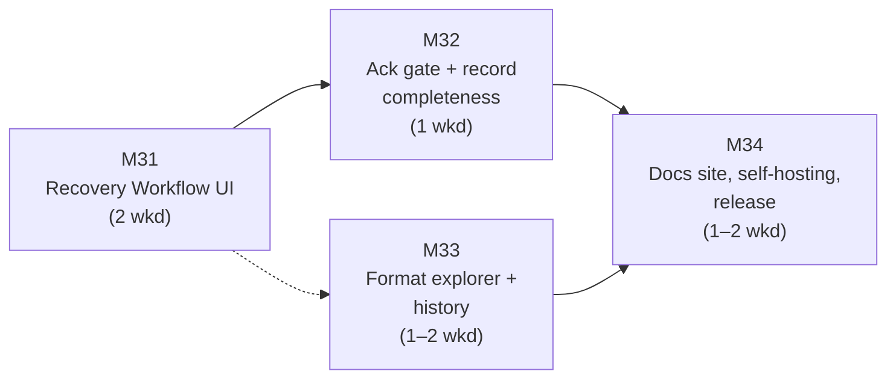

# ChemBridge — v0.7 Implementation Plan

> **Document status:** Execution plan for Version 0.7 ("Interactive Recovery + Polish", per `docs/Incremental_Roadmap.md` §8). It **supersedes the roadmap's §8 prose for execution purposes** while preserving its scope decisions: the Recovery Workflow UI rendered from the `awaiting_recovery` job envelope, the failed-validation acknowledgment gate (`VALIDATION_ACK_REQUIRED`), the format explorer from `/v1/capabilities`, the history page, and the production/self-hosting compose (Part 9 §4–§5). At this version's end the product is **feature-complete against Parts 6–7**; only v1.0's freezing discipline remains.
>
> **Assumed inputs:** v0.6 shipped — report rendering, upload → inspect → convert → record → download journey, the honest interims for the recovery pause and the ack gate (both replaced here), design tokens and the plain-language mapping table with its coverage lint. Milestone numbering continues globally: v0.7 = **M31–M34**.
>
> **One scope judgment, flagged:** Part 10's milestone table places *feedback-loop advisory surfacing* (Part 5 §7) in its "v0.5" (this ladder's v0.6–v0.7), but the roadmap's §7–§8 text does not name it. This plan schedules it as an explicitly cuttable deliverable in M31 (it renders on the recovery cards), with a pre-authorized cut to post-1.0 — a fresh self-hosted instance has no aggregation data for it to show, so its user value before a long-running instance exists is near zero.

---

## 1. Shape of the plan

Four milestones, M31–M34. Estimates in **weekends** (~9 h; the roadmap sizes this version for a winter break plus spares — concentrated days help M31, but nothing here has the half-finished-state danger that made v0.5 demand them). The roadmap budgets 4–6 weekends; the ranges below sum to **5–7** with buffer inside the ranges.

Structural notes:

- **M31 is the version's reason to exist** and the last design-critical work in the ladder: the decision card is the moment the project's philosophy faces a human — consent and provenance as the same artifact. It gets the first and largest budget.
- **M33 is off the critical path.** The explorer and history pages read existing endpoints with components that already exist; they can interleave with M31/M32 or absorb a slip.
- **Everything renders from objects that already exist on the wire.** v0.5 built the envelope precisely so the UI could be a pure reader of it (the `awaiting_recovery` block's completeness was tested then, for now); v0.7 contains no backend changes beyond, at most, additive fields discovered missing — each of which would be a flagged v0.5 test gap, not routine work.

---

## 2. Milestones

### M31 — Recovery Workflow UI (2 weekends) — the philosophy on screen

The wizard step of Part 7 §3, replacing v0.6's honest placeholder in `/convert/[job_id]`.

**Deliverables**

1. **The wizard step, not a modal** (Part 7 §3.1): full-width within the active-conversion page — supplying a lattice is a scientific decision, not a confirmation; the paused job is URL-addressable, so leaving and returning works by construction. The step shows the one-line framing ("This conversion needs 2 decisions before it can proceed"), the **visible `expires_at` deadline**, and the pre-flight draft as §4 summary chips — decisions are made in full view of what will already be dropped.
2. **Decision cards rendered from the envelope, one per unresolved scenario, in engine dependency order** (frame selection above lattice, with copy making the dependency explicit: "the box will be computed on the frame you choose above"). Options and `parameters_schema` come from `unresolved_scenarios` — **the card can never offer an option the engine would reject**, and a POSCAR target shows no `non_periodic` because the envelope never sent it.
3. **No option is ever preselected** — a preselected radio is a default with extra steps (Part 7 §3.2); this is a component-level invariant with a test, not a styling choice.
4. **Parameter widgets per the catalog:** 3×3 lattice grid (Å) for `manual_input`; mini upload/file picker for `upload_reference` (reusing the v0.6 upload machinery against `POST /v1/upload`); `padding_ang` input for `bounding_box`; frame index picker; species-map editor for `missing_species`; `temperature_K` + `seed` for `maxwell_boltzmann` (seed visible and editable — reproducibility is the user's to control, R11). Widgets are driven by `parameters_schema`, so a future plugin scenario gets a generic-but-functional form rather than a blank card.
5. **The Assumption preview:** on selection, the card shows the exact `description` text that will be recorded — the user confirms the record they are creating, not just the action; consent and provenance are the same artifact (P4).
6. **"Why does this matter?" progressive disclosure** per scenario: collapsed, three plain-language options a non-expert can act on; expanded, the scientific stakes (what a cell is; that a bounding box is an artifact, not simulation data; which choices are safe for which purposes). Copy for the full catalog is content work — budget it as such, and keep it in the constants file beside the §3.3 mapping so the coverage lint extends to it.
7. **Decline is first-class:** "Cancel conversion" always present, producing the refused/cancelled outcome — never a trap.
8. **Advisory surfacing (the flagged scope judgment):** when the v0.5 aggregation query returns data for a scenario/choice, an advisory note renders on the option ("this padding commonly produces close periodic contacts") — *never* a changed default, never a preselection; the bright line is untouchable. **Pre-authorized cut to post-1.0.**
9. **Fixture-driven card tests** using the envelope fixtures from v0.5's job-lifecycle suite: every cataloged scenario renders; the no-preselection invariant; submission produces exactly the `POST /v1/jobs/{job_id}/recovery` body the engine validated in v0.5; an `INVALID_RECOVERY_CHOICE` response renders its envelope with `offered_choices`.

**Done means:** the Part 4 §5 worked example runs **entirely in the browser**: upload `relax.traj`, convert to POSCAR, hit the pause, choose `last` + `bounding_box`/5.0 through the cards — previewing both Assumption texts before confirming — and land on a record page whose report matches the spec fixture. Recorded as the project's flagship demo.
**Dependencies:** none within v0.7 (all inputs are v0.5/v0.6 artifacts). **Cut line:** deliverable 8, then disclosure-copy breadth beyond the v0.1-era scenarios (`missing_lattice`, `frame_selection` copy is un-cuttable — it is the flagship) — never the no-preselection invariant or the Assumption preview.

---

### M32 — Acknowledgment gate + record completeness (1 weekend)

The v0.6 interims retired.

**Deliverables**

1. **The failed-validation acknowledgment gate** (Part 7 §2.5 item 2): when `download.requires_ack`, the download button is replaced by a gate **stating the failed checks by name** (from the Validation panel's own rows); confirming re-requests with `?acknowledge_validation_failure=true`. The gate's copy states what acknowledgment means — "you are taking a file that failed verification, and the record says so" — the Part 5 §2 access rule as UX.
2. **"Resolve and retry" on refused records:** the action v0.6 couldn't offer — from a refused conversion's record, re-enter the wizard with the same file and target; the unresolved scenarios become M31 cards (a fresh convert submission; the refused record is immutable history).
3. **Re-validate profile picker** lands here if v0.6 took its cut; otherwise verified against the M31-era record page.
4. E2E additions: the gate journey (force a failed validation with a deliberately tight custom tolerance file — legitimate, no test hooks needed); the resolve-and-retry journey from refusal to completed record.

**Done means:** a failed-validation conversion cannot be downloaded without passing a gate that names the failures; a refused conversion converts successfully after resolve-and-retry through the cards; both journeys in the e2e suite.
**Dependencies:** M31 (retry re-enters the cards). **Cut line:** none — this milestone *is* two spec rules; at one weekend it is the plan's smallest and least cuttable.

---

### M33 — Format explorer + history (1–2 weekends; off the critical path)

**Deliverables**

1. **`/formats`** (Part 7 §2.7): the Capability Matrix as a browsable grid **generated from `GET /v1/capabilities`** — it can never drift from the running instance's registry, and an installed plugin format appears with zero UI changes (the P6 payoff on screen). Format detail view: read/write declarations, `required_fields` framed as "converting *into* this format requires…" (a preview of recovery scenarios), `max_frames`, `lossy_notes`. The landing page's "Explore formats" link goes live.
2. **`/history`** (Part 7 §2.6): cursor-paginated table from `GET /v1/history` — date, source/target, status chips (the v0.6 summary-chip component at one-line granularity, so loss is visible even in a table row); per-row actions: open record, re-convert (routes to `/files/[file_id]` while the upload is unexpired), delete file behind a confirmation naming the retention policy. **Expired artifacts stay listed with their reports** — "expired" as a rendered state with its explanation, never a surprise `410`.
3. Component tests: the grid renders from a capabilities fixture including a fictional plugin format; history rows render all four status combinations (completed/refused × validation states) plus the expired state.

**Done means:** "can extXYZ hold stress?" is answerable in two clicks without leaving the browser; a user deletes an uploaded file from history and its conversion report remains readable — reports-outlive-bytes, visible in the UI at last.
**Dependencies:** M26-era components only; interleaves freely. **Cut line:** format-detail polish and history filtering — never the generated-not-hand-written grid rule or the expired-state honesty.

---

### M34 — Docs site, self-hosting, release (1–2 weekends)

The remaining Part 7/Part 9 surface, and the tag that declares Parts 6–7 feature-complete.

**Deliverables**

1. **`/docs/*` static site** (Part 7 §1, Part 10 §4.6): one source, two renderings — the same `docs/` Markdown builds the site at CI time (`main.yml` gains the docs build per Part 9 §3); no wiki, no second corpus, ever. Includes the user-facing additions: quickstart, CLI reference (Appendix A), and the **error-code reference page per code** — every `documentation_url` the error envelope has emitted since v0.5 must now resolve; a **CI link-check** enforces it from this version forward.
2. **Production/self-hosting deployment** (Part 9 §4–§5): `docker-compose.prod.yml` — hardened settings, no dev mounts, external Postgres/object-storage endpoints; the **self-hosting guide** on the docs site, stating the backup posture honestly (nightly `pg_dump`, the RPO tradeoff of Part 9 §6.2, in plain words); `.env.example` final-reviewed against every implemented limit and mode; structured-logging and `/metrics` notes with the four alerts worth having (Part 9 §6.1) documented, not bundled. **Self-hosting is the primary supported deployment** — the guide is a release deliverable, not an afterthought.
3. **Zero-SaaS review:** the hard criterion of Part 9 §5.4 — every feature works self-hosted with no external service dependencies — walked as a checklist against the finished surface.
4. **Release:** README updated (the full-product story; SDK-instability warning still prominent per R12 — v1.0 is the freeze, and this tag is not it); scope statement (feature-complete against Parts 6–7; advisory surfacing named if cut); CHANGELOG; **tag and publish v0.7**.

**Done means:** the self-hosting drill — a clean machine, the guide, `docker-compose.prod.yml`, and nothing else produces a working instance whose docs links all resolve; the link-check is green in CI.
**Dependencies:** M32, M33 (the release ships them). **Cut line:** docs-site *breadth* (guides beyond quickstart/self-hosting/error-codes) — never the link-check, the prod compose, or the honesty of the backup-posture paragraph.

---

## 3. Schedule and checkpoints

| Milestone | Weekends | Cumulative | Go/no-go checkpoint |
|---|---|---|---|
| M31 | 2 | 2 | **The flagship gate:** the in-browser worked example green before anything else merges on top. If weekend 2 ends without it, M33 waits — the cards are the version. |
| M32 | 1 | 3 | Gate journey in e2e before the interim code is deleted, not after. |
| M33 | 1–2 | 4–5 (interleavable) | — |
| M34 | 1–2 | 5–7 | Self-hosting drill on a genuinely clean machine (not the dev laptop) before the tag. |

## 4. Standing rules during v0.7

1. **The bright line reaches the pixels:** no preselected fabricative options, no advisory that becomes a default, no ack gate that can be skipped by URL knowledge alone (the API enforces; the UI must not teach workarounds). These are tests, not intentions.
2. **Implement the design language, don't redesign it** — carried over from v0.6; the decision-card copy in Part 7 §3.2 is the template, not a suggestion.
3. **The UI renders envelopes; it never extends them client-side.** A missing field in the `awaiting_recovery` block is a v0.5 defect to fix at the source with a schema test, never patched over with client inference.
4. **Docs are one source, two renderings** — content fixes land in `docs/` and flow to the site; nothing is written only on the site.
5. **Nothing from v1.0** (SDK freeze declarations, schema `1.0.0`, hosted-instance decision, 30-day matrix accounting) is anticipated here — v0.7 finishes the *product surface*; v1.0 is the discipline pass, and blurring them dilutes both.

## 5. Verification of the release as a whole

Before tagging v0.7, against a production-compose instance on a clean machine:

1. **The flagship demo, unassisted and in-browser:** upload `relax.traj` → convert to POSCAR → two decision cards in dependency order with no preselection → Assumption previews confirmed → completed record matching the Part 4 §5 fixture → download below the loss summary. Recorded; this recording is the README's centerpiece.
2. A collaborator (non-author) resolves a `missing_species` pause on a VASP-4 POSCAR using the species-map card, guided only by the card and its "Why does this matter?" content.
3. Ack-gate drill: a conversion validated under an absurdly tight custom tolerance profile fails; download is gated; the gate names the failed checks; acknowledging downloads the file; the record still shows the failure.
4. Refused → resolve-and-retry → completed, entirely in-browser.
5. `/formats` answers a capability question in two clicks; `/history` shows an expired upload's report as readable with download honestly unavailable; deleting a file leaves its report.
6. Every `documentation_url` from a forced sample of API errors resolves on the docs site; CI link-check green.
7. The self-hosting drill of M34, plus: `pip install chembridge` and the v0.1 CLI acceptance pass still green — the library remains a first-class product beneath the service.
8. CI green on the tag; scope statement declares feature-completeness against Parts 6–7 and names anything cut.
