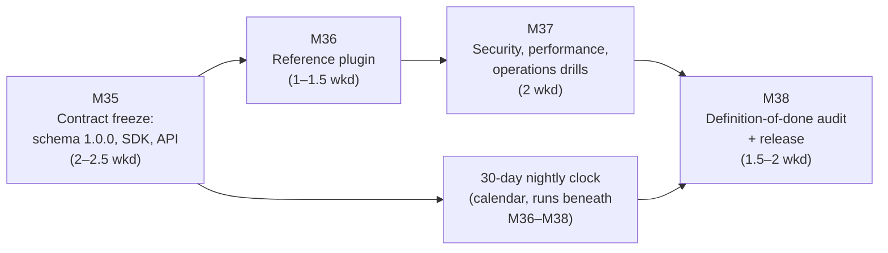

# Xtalate — v1.0 Implementation Plan

> **Document status:** Execution plan for Version 1.0 ("Frozen Contracts", per `docs/Incremental_Roadmap_v1.0.md` §9). The roadmap's rule for this version is absolute and this plan honors it: **the definition of done is Part 10 §6, verbatim and unchanged — this plan adds nothing to it and removes nothing from it.** What this document decides is only *sequencing, packaging into milestones, and the calendar mechanics* of getting every §6 line true at the same moment. Part 10's own characterization governs the temperament: this is "the discipline milestone, not the feature milestone" — mostly verification, documentation, and API-surface review.
>
> **Assumed inputs:** v0.7 shipped — feature-complete against Parts 6–7; docs site with enforced link-check; production/self-hosting compose drilled; nightly matrix, benchmarks, and property suites running since v0.3. Milestone numbering continues globally: v1.0 = **M35–M38**.
>
> **No new features.** Anything discovered during this version that is not a §6 item or a defect goes to the post-1.0 backlog (Part 10 §5's ordering: formats → visualization → repair → analysis → assistant). The freeze is the feature.

---

## 1. Shape of the plan

Four milestones, M35–M38, **plus a calendar constraint no earlier version had**: §6 item 1 requires the full nightly n×n round-trip matrix green for **30 consecutive days**. That clock only counts runs against frozen contracts, and any engine/format-touching fix resets confidence if not the count itself — so the plan is shaped as *freeze early, then verify under a code freeze*:

Estimates in **weekends** (~9 h). The roadmap budgets 6–8; the ranges sum to **7–9** with buffer inside the ranges — but the binding constraint is likely the **wall clock**: M38 cannot tag until the matrix has 30 consecutive green days behind it, so the last engine-touching merge (normally M35's migration) starts a window that M36–M38's work deliberately fits inside. A nightly red during the window is a stop-the-line defect: fix it, and restart the count — a v1.0 tagged on "green except that one flake" would make §6 item 1 a lie in the release notes.

**Standing posture from M35's merge onward: code freeze below the presentation layer.** Only defect fixes touch `src/xtalate/`; each one restarts the 30-day clock consciously and is worth it — the clock exists to prove stability, not to be outrun.

---

## 2. Milestones

### M35 — Contract freeze: schema 1.0.0, SDK, API, CLI (2–2.5 weekends)

Everything §4.2 of Part 10 names as the public surface, reviewed once, frozen together.

**Deliverables**

1. **Canonical schema review → `1.0.0`:** every field of all eight categories reviewed against seven formats and six versions of real use — names, shapes, unit annotations, absence semantics. **The standing promotion candidate is decided here:** occupancy (Part 3 §3 n.11 flagged it as the known schema gap; Part 2 §6 rule 4 is its path) — promote to a first-class field now, or explicitly re-affirm the carry-through with a documented rationale. Every change the review makes ships as migration functions in the registry, so the `0.x → 1.0.0` migration is **real, not synthetic** (§6 item 3's exact demand): before/after golden JSON pairs committed, the chain exercised against the *entire* golden corpus (the Part 8 §3.3 machinery, doing at scale what it was built for), and a loaded old-version object gains its `ConversionRecord(operation="migrate")`.
2. **Plugin SDK declared stable:** the ABCs (`ParserPlugin`/`ExporterPlugin`, streaming surface, `ParseResult`/`ParseIssue`, `FormatCapabilities`) reviewed as *the* interface third parties build on for the 1.x era; anything embarrassing is fixed **now** (the last free breaking change) or accepted aloud. The R12 instability warnings come **out** of README/CONTRIBUTING and are replaced by the stability promise and its scope.
3. **`/v1` API frozen:** endpoint table, envelopes, and error codes diffed against Part 6; the OpenAPI schema published as a versioned release artifact (the paper trail started in v0.5 becomes the contract); additive-evolution policy (Part 6 §7) restated in the docs.
4. **CLI surface review** against Appendix A: flags, exit codes 0–5, `--json` conventions — documented flags are frozen; undocumented behavior is either documented or removed.
5. **SemVer promises published** (Part 10 §4.2): the README states exactly what the version number protects — schema models, report schemas, SDK ABCs, `/v1`, documented CLI flags — and the schema/product version coupling. Release notes template gains the mandatory `schema_version` line.

**Done means:** schema `1.0.0` tagged in code with the real migration green over the whole corpus; the SDK/API/CLI reviews each closed by a D-numbered decision record (even when the decision is "no change"); CI green. **From this merge, the 30-day clock starts.**
**Dependencies:** none within v1.0. **Cut line:** none — this milestone is the version. Timebox the schema review hard (the v0.1 perfectionism rule returns for its finale): unresolved *niceties* become 1.x additive candidates; only genuine 1.0-or-never questions (renames, restructures, occupancy) block.

---

### M36 — Reference plugin (1–1.5 weekends)

§6 item 3's last clause: the SDK is stable when someone *outside the wall* can build on it — proven with a first-party stand-in.

**Deliverables**

1. **`plugins/example-format`:** a complete, published, deliberately simple format plugin (a toy line format is fine; pedagogy over utility) — parser, exporter, honest capability declarations, golden cases with manifests, entry-point packaging — living as a separate installable distribution, built **only** against the frozen public SDK (no private imports; the import-linter proves it).
2. **The compatibility canary in CI** (risk R12's named mitigation): every PR builds and tests the reference plugin against the current SDK; a core change that breaks it fails CI — the SDK freeze gains mechanical teeth.
3. **The add-a-format guide finalized** around the reference plugin as its worked example: the Part 10 §4.3 checklist (implement, declare honestly — PARTIAL with notes beats optimistic FULL — golden cases, identity round-trips, table row) now points at real code for every step.

**Done means:** `pip install` of the reference plugin wheel into a clean xtalate environment makes the toy format appear in `xtalate capabilities`, the format explorer, and the nightly matrix with zero core changes; the canary demonstrably fails on a deliberate SDK-breaking commit in a scratch branch.
**Dependencies:** M35 (builds against the frozen SDK). **Cut line:** the toy format's breadth (single-frame, three fields is enough) — never the no-private-imports rule or the canary.

---

### M37 — Security, performance, operations drills (2 weekends)

§6 items 5 and parts of 6 — the operational claims, exercised rather than asserted. None of this touches engine code; the 30-day clock runs beneath it.

**Deliverables**

1. **Security hardening pass** (Part 9 §5.3, Part 10's named v1.0 item): the threat-decomposed checklist walked — private buckets and authenticated streaming verified from outside; files-as-data audit (no parser shells out or evals — a grep-and-review with a written result); per-job resource caps demonstrated with a pathological input that exhausts *its own* job and nothing else; nightly dependency audit clean or waived-with-issue; the parser fuzz corpus reviewed and topped up (R6's "permanent maintenance duty" gets its scheduled instance).
2. **Performance targets met on a pinned runner** (§6 item 5): the Part 8 §4 table — `parse_xdatcar_10k` ≤ 30 s, `convert_xdatcar_to_extxyz_10k` ≤ 90 s, RSS bounds, `preflight_latency` ≤ 1 s — measured on fixed hardware, with the >20%-regression tripwire active on the 14-day median. *Honest flag:* the deferral table placed pinned-runner gating "earliest v0.5", but no earlier plan stood the runner up; if it does not exist yet, standing it up is **this deliverable**, budgeted here, and the targets are met on it before M38.
3. **Restore drill** (§6 item 5, recurring on every future release checklist): latest `pg_dump` restored to a scratch database; the migration chain — including M35's real migration — green against the restored data; the drill's runbook committed so the *next* release's drill is a procedure, not an adventure.
4. **Lifecycle expiry verified against a real S3-compatible store** (§6 item 5): not MinIO-in-compose but an actual deployment target, confirming bucket lifecycle rules delete on schedule and reports survive.
5. **The hosted-instance decision** (Part 10's "optional hosted instance decision"): made and D-numbered, either way. If yes: it is post-tag operational work with the Part 9 §5.4 posture — nothing in the architecture assumes it exists, so it is **not** a tag blocker. If no: the README says self-hosting is the supported deployment, without apology.

**Done means:** each drill has a written result in the repo (runbook, measurement artifact, or decision record) — the difference between "we checked" and "it is checked" is the artifact.
**Dependencies:** M36 (the canary is part of the CI being verified). **Cut line:** none of the §6-mandated drills; the fuzz-corpus top-up is the only elastic edge (minimum: reviewed, gaps ticketed).

---

### M38 — Definition-of-done audit + release (1.5–2 weekends + the calendar)

The final pass is an *audit*, not a sprint: walk Part 10 §6 line by line and produce evidence for each.

**Deliverables**

1. **§6 item 1** — all seven formats with golden coverage; **the 30-day matrix accounting**: the nightly history shows ≥ 30 consecutive green days since the last engine-touching merge. If a red intervened, the tag waits; the clock is the feature.
2. **§6 item 2** — the completeness property test runs against every golden case and the generated corpus with **zero waivers** — audited by grepping for skip/xfail markers in the property suites, not by trusting memory.
3. **§6 item 3** — frozen contracts: schema `1.0.0` + real migration (M35), stable SDK + reference plugin canary (M36), `/v1` OpenAPI artifact attached to the release.
4. **§6 item 4** — **the worked-example reproduction, by a stranger:** the Part 2 §8, Part 4 §5, and Part 5 §6 examples reproduced end-to-end on all four surfaces (library, CLI, API, UI) by someone who is not the author, **following only the public docs**. Every gap they hit is a docs defect and a release blocker by §6 item 7's own rule.
5. **§6 item 6** — honesty checks: every ⚠ risk in the register (R1 symmetric bugs, R3 ambiguous units, R7 semantics-free carry-through, R8 chunking, R10 dependency CVEs, R12 — now resolved by the freeze and closed as such) has a tracking issue with current status; README states the §4.2 SemVer promises; `ATTRIBUTIONS.md` complete and CI-enforced.
6. **§6 item 7** — **docs–code drift review as a release blocker:** the spec set read against shipped reality (the accumulated Revision-note entries from every version are the worklist — the standing rule since v0.1 that drift is logged in the same PR now pays out as a finite list instead of an archaeology project); every drift fixed in docs or code before the tag.
7. **Release:** CHANGELOG for the 1.0 era; the v1.0 announcement states what is frozen, what SemVer now promises, and what post-1.0 looks like (Part 10 §5, explicitly non-binding); **tag and publish v1.0** — PyPI, GHCR images, GitHub release with the OpenAPI artifact and schema migration notes attached.

**Done means:** a completed §6 checklist where every line links to its evidence artifact, committed to the repo as the release review record; the tag pushed only after it.
**Dependencies:** M35–M37 + the 30-day clock. **Cut line:** none, definitionally — §6 says "this list is the finish line; nothing else is," and it cuts in neither direction: nothing may be dropped, and nothing new may be smuggled in.

---

## 3. Schedule and checkpoints

| Milestone | Weekends | Cumulative | Go/no-go checkpoint |
|---|---|---|---|
| M35 | 2–2.5 | 2–2.5 | Schema review timeboxed; **the clock starts at this merge** — everything after is freeze discipline. |
| M36 | 1–1.5 | 3–4 | Canary proves it can fail before it is trusted to pass. |
| M37 | 2 | 5–6 | Pinned runner live and targets met — the one §6 item with real standing-up risk; surface it early in the milestone, not at its end. |
| M38 | 1.5–2 | 6.5–8 (–9 w/ buffer) | **Wall-clock gate:** ≥ 30 consecutive nightly greens. Tag v1.0. |

The weekend arithmetic fits the roadmap's 6–8; the wall clock is the likelier constraint. If a late defect forces an engine fix, the honest sequence is fix → clock restarts → M38's audit re-verifies affected items. A slipped v1.0 date costs weeks; a v1.0 whose stability claim is decorative costs the project its premise.

## 4. Standing rules during v1.0

1. **Code freeze below the presentation layer from M35's merge.** Defect fixes only; each restarts the clock knowingly. Features found tempting go to the post-1.0 backlog with a note.
2. **Every drill leaves an artifact.** Runbooks, measurements, decision records, the audited checklist — v1.0's product *is* evidence.
3. **The last free breaking change is M35.** After it, anything that would break schema, SDK, `/v1`, or documented CLI flags waits for 2.0 or ships additively — no exceptions in the name of "before anyone depends on it"; the freeze declaration is exactly when they start depending on it.
4. **Docs drift is a blocker, both directions:** code contradicting docs and docs describing the unbuilt are the same defect (§6 item 7).
5. **Nothing post-1.0 is anticipated** (new formats, visualization, repair, analysis, assistant) — the seams exist (Part 1 §6, Part 7 §6); building on them belongs to the issue tracker the day after the tag, not the weeks before it.

## 5. Verification of the release as a whole

The verification *is* M38 — Part 10 §6 walked with evidence. The final sequence, from clean environments:

1. `pip install xtalate` (built artifact): the v0.1 CLI acceptance pass still green, seven formats plus the reference plugin's toy format when its wheel is added.
2. The three worked examples reproduced by a non-author on all four surfaces from public docs alone (§6 item 4) — the stranger test that has closed every version, at maximum strength.
3. Self-hosting drill from the v0.7 guide on a clean machine, now including the restore drill and a lifecycle-expiry check against the real store.
4. Nightly history: 30 consecutive greens; benchmark dashboard on the pinned runner within targets; property suites zero-waiver by audit.
5. The §6 checklist artifact committed; CI green on the tag; the announcement's claims cross-checked against the checklist — the last honesty check is that the release notes themselves contain nothing the evidence doesn't back.
