# ChemBridge — MASTER_SPEC

> **ChemBridge is the trusted translation layer between computational chemistry file formats — a converter that tells you exactly what it kept, what it lost, and why.**

## Preface

This document is the project's **constitution**: the complete engineering specification for ChemBridge, organized as eleven numbered Parts (Part 0 through Part 10) that trace back to eleven originally separate drafting documents (`00_Project_Overview.md` through `10_Roadmap.md`). It is committed at `docs/MASTER_SPEC.md` and is suitable as direct input to **Claude Code's Plan Mode**: it defines binding vocabulary, component boundaries, normative schemas, explicit "must / must not" rules, and the rationale (with rejected alternatives) behind every nontrivial decision — enough for an implementation plan to be derived without re-litigating the architecture.

**How this file maps to the original document set.** Each numbered document appears here as a correspondingly numbered Part, content preserved in full — every table, Mermaid diagram, schema block, worked example, and tradeoff discussion carries over verbatim (headings are demoted one level; each document's original H1 is replaced by the Part heading). **`docs/MASTER_SPEC.md` is the single, editable source of truth** (Revision 1.2, item 7 below): the standalone `00`–`10` files named in the table below and formerly listed in Part 1 §5's repository tree do not exist as separate committed files, and none should be created or assumed — this file is edited directly, in place. The Part numbering is retained purely as a stable citation scheme (e.g. `04 §3.3` still means "Part 4 §3.3").

| Part | Source document | Role |
|---|---|---|
| Part 0 | `docs/00_Project_Overview.md` | Mission, design principles P1–P6, scope, non-goals, personas, binding glossary |
| Part 1 | `docs/01_Architecture.md` | Components and boundaries, tech stack rationale, monorepo layout, extensibility seams |
| Part 2 | `docs/02_Canonical_Data_Model.md` | The Canonical Model: schema, units, absence convention, coordinate policy, versioning |
| Part 3 | `docs/03_Parsers.md` | Parser SDK, per-format capabilities, Information Discovery Engine, Capability Matrix, error contract |
| Part 4 | `docs/04_Conversion_Engine.md` | Conversion algorithm, Conversion Report schema, Recovery Engine, strict/permissive modes |
| Part 5 | `docs/05_Validation.md` | Validation checks, Validation Report schema, tolerance policy, round-trip strategy |
| Part 6 | `docs/06_API.md` | REST endpoints, async job model, auth, limits, error envelope, API versioning |
| Part 7 | `docs/07_Web_UI.md` | Page map, per-page API mapping, Recovery Workflow UI, loss-visualization language |
| Part 8 | `docs/08_Testing.md` | Testing pyramid, round-trip suites, golden data governance, benchmarks, CI pipeline |
| Part 9 | `docs/09_Deployment.md` | Local dev tiers, GitHub Actions, production architecture, scaling, file security |
| Part 10 | `docs/10_Roadmap.md` | Milestones and estimates, MVP scope, risk register, open-source mechanics, definition of done |

**Cross-reference convention.** The documents cite one another as, e.g., `04_Conversion_Engine.md §3.3` or the short form `04 §3.3`. In this merged file, such a reference resolves to **Part 4, §3.3**. Section numbering inside each Part is unchanged from its source document, so every cross-reference remains valid in both the split and merged forms.

**Reading order.** New contributors and planning agents should read Part 0 first (it fixes the vocabulary every other Part treats as binding), then Parts 1–2, then the pipeline Parts 3–5, then the surfaces (6–7), then operations (8–9), and Part 10 last. Part 0 §7 gives the same order with rationale.

### Assembly and consistency notes

The following editorial actions were taken while assembling this file; no technical content was altered beyond what is listed:

1. **Endpoint parameter normalization.** Two diagram edge labels and one prose mention used shorthand path parameters; normalized to the canonical forms defined in Part 6 §2: `POST /v1/jobs/{job_id}/recovery`, `GET /v1/download/{conversion_id}`, `DELETE /v1/files/{file_id}`.
2. **Entity-diagram caption added (Part 2 §7).** The class diagram uses unit-suffixed display labels (`time_fs`, `positions_ang`, …); a caption now states that binding field names are the unsuffixed identifiers of Part 2 §3, preventing the display labels from being mistaken for schema names.
3. **Terminology audit result.** The three report names — `DiscoveryReport`, `ConversionReport`, `ValidationReport` — and all canonical field paths, recovery `scenario`/`choice` codes, job states, and request option names were verified identical across all Parts. The only occurrence of the synonym "Conversion Summary" is Part 0 §6's explicit prohibition of it. No renames were required.
4. **Refinements, not contradictions (recorded for readers of Part 1).** Part 1 §3's end-to-end sequence shows the *logical* flow; Part 6 §3 binds it to the async job model — a refinement Part 6 itself flags. The job framework, formerly left open in Part 1 §4 as "Celery/RQ or FastAPI background + broker," is now **decided as RQ on Redis** in Part 1 §4.1–§4.2 with rejected alternatives, and Part 9 §1.2 configures it. Part 5 §4.2 extends `FormatCapabilities` additively with `numeric_precision`, as flagged in Part 5 §8. Part 10 §2 scopes the MVP to four of the seven Phase 1 formats; Phase 1 as defined in Part 0 remains the seven-format set, completed in v0.2 (now stated at the point of definition, Part 0 §3.1).
5. **Supplements (a recorded deviation from the assembly instruction).** The assembly brief directed merging without new content. Two appendices nevertheless add material: Appendix A specifies the CLI surface that Part 10 §2 ships in the MVP but that no standalone document defined — leaving it unspecified would have shipped an MVP deliverable with no design authority; Appendix B is a non-normative requirements-traceability matrix for reviewers and planning agents. The deviation is deliberate and disclosed here; if the standalone set later gains a CLI document, Appendix A should be regenerated from it like every other Part.
6. **Revision 1.1 — post-assembly consistency pass (historical).** A review of this file against the original brief and the generation prompts found items that note 3 (as originally written) had overclaimed as clean. This revision corrects them in three tranches. **Brief/prompt alignment:** the MVP format-staging contradiction between Part 0 §3.1 and Part 10 §2 is now stated where the MVP is defined (Part 0 §3.1); three deliberate deviations from the brief are named and justified in place (`source_code` in Simulation Metadata not Provenance, Part 2 §3.8; the Download page and report views consolidated into the conversion record, Part 7 §2.5; the project name retained, Part 0 §1); a CIF asymmetric-unit expansion policy is specified (Part 3 §3 n.13; Part 2 §3.4); the "no default for fabricative scenarios" stance is stated categorically (Part 4 §3.2); the domain strategy is expanded to a recommendation with a rejected alternative (Part 9 §5.4); a documentation policy joins the open-source mechanics (Part 10 §4.6); and `GET /v1/limits` plus the auxiliary response schemas are made normative (Part 6 §2, §2.2). **Internal consistency:** `field_presence()` and its `PresenceMap` return type are now defined (Part 2 §3.11) and all citations repointed off the Provenance section, with the `present`/`absent`/`mixed` trichotomy resolving the dual-appearance path case; the extXYZ `cell.lattice_vectors`/`cell.pbc` capability cells are corrected to partial to match their declaration (Part 3 §3); recovery-fabricated fields now file under a new `supplied` report list rather than `preserved`, threaded through the schema, worked examples, UI panel, and validation (Parts 4, 5, 7); `ConversionRecord.operation` gains `"migrate"` (Part 2 §3.9); the validation trigger is assigned to the Conversion Engine and the Recovery→UI layer violation removed (Part 1 §3); the two-class hazard model gains an explicit "selective reductive" case for frame selection (Part 4 §3.1); the variable-atom-count claim is scoped by a constant-N invariant (Part 2 §3.2); a carry-through routing rule fixes inconsistent metadata placement (Part 2 §6.1); the Discovery worked example is completed to honor its one-entry-per-path guarantee (Part 3 §6.2); the entity diagram gains `calculator`/`temperature` (Part 2 §7); the job framework is decided as RQ (Part 1 §4); and the CLI `--json`/report-flag drift is unified (Appendix A). **Scientific correctness:** sign/quantity conventions are fixed for stress, charges, magnetic moments, and `total_spin` (the last no longer "carried verbatim") (Part 2 §3.7.1); the GPa stress rendering is made a concrete derived display value (Part 2 §3.1.1); the POSCAR⇄CONTCAR byte-identical sniff case gets an explicit resolution (Part 3 §6.1); `frame_count` becomes a computed property, not stored state (Part 2 §3.5); re-validation is split into always-available re-thresholding vs. inputs-bounded re-parse, making the "self-contained" claim precise (Part 5 §4.5); and persistence of parsed Canonical Objects is specified (Part 1 §4.3). **Supplements (completing the review's final tranche):** a normative PostgreSQL relational model with Alembic migrations (Part 1 §4.4); observability, backup, and disaster-recovery policy with a `/v1/health` endpoint and a drilled restore (Part 9 §6; Part 10 §6 item 5); first-class job cancellation with a `cancelled` state, best-effort running-job semantics, and no fabricated report for withdrawn work (Part 6 §2, §3.2; Part 7 §2.4); the hosted-instance auth surface — signup/login/logout, API-key issue/list/revoke, and a double-submit CSRF policy for the cookie path (Part 6 §2, §4); quantified sniff acceptance threshold (0.5) and ambiguity margin (0.2), CI-pinned via the golden corpus (Part 3 §6.1); a documented `awaiting_recovery` TTL in the limits table (Part 6 §5); and inspect idempotency keyed by `(file_id, format_override, parser-registry version)` (Part 6 §2 notes). A closing consistency pass propagated these into their consumers: the error envelope gains the new codes (`JOB_ALREADY_TERMINAL`, `CSRF_TOKEN_MISSING`, `NOT_ENABLED`, `NOT_READY`, credential codes), the job state diagram gains `cancelled` and a `queued → failed` dequeue-precondition transition, the Part 8-facing lifecycle tests cover cancellation, the binding glossary's Conversion Report entry explicitly acknowledges the `supplied` addition rather than extending a binding term silently, the property-test statement of `08 §1.2` now matches the full two-direction invariant including `mixed` paths, and Appendix B's endpoint traceability row names the added surface. **No known open items remain** as of Revision 1.1; future findings should append a Revision 1.2 note rather than editing this one — the record of what was wrong and when it was fixed is itself provenance, and this file practices what it specifies.
7. **Revision 1.2 — pre-implementation architecture review.** A lead-architect review conducted before any code was written (recorded in full in `docs/ARCHITECTURE_REVIEW.md`, alongside `docs/IMPLEMENTATION_PLAN_v0.1.md`) found a further set of internal inconsistencies and omissions, corrected here in four tranches. **Source-of-truth correction:** the split-vs-merged framing from the original drafting stage — the claim that eleven standalone `00`–`10` files are "the editable source of truth" and this file "is regenerated from them" — is retired (Preface); `docs/MASTER_SPEC.md` is now edited directly as the single source of truth, and Part 1 §5's repository tree no longer lists the nonexistent standalone files. **Worked-example correction:** Part 2 §8.2's POSCAR title line and Part 5 §6's corresponding `metadata_preservation` check are moved to `user_metadata.custom_global["poscar:comment"]`, matching the carry-through routing rule exactly as Part 2 §6.1 already states it (both previously and inconsistently showed `simulation.extra["poscar:comment_line"]`, contradicting §6.1's own worked distinction between free text and structural parameters). **Schema pre-release versioning:** worked examples now carry `schema_version: "0.1.0"` rather than `"1.0.0"` (Part 2 §5) — the schema reaching `1.0.0` is itself a v1.0 deliverable (`10 §6` item 3), so no pre-1.0 object should claim it; the generic illustrative mentions of "e.g. `1.0.0`" as a semver *shape* (Part 2 §§3.2, 5) are left as shape examples, not version claims. **Discovery Report presence trichotomy:** `FieldPresenceEntry.status` (Part 3 §6.2) gains `"mixed"` and an optional `present_frames`, matching the trichotomy `field_presence()` already defines (Part 2 §3.11) — a per-frame field present in only some frames of a trajectory was previously unrepresentable in a Discovery Report. **Capability Matrix:** the `fields` key convention now states the `"<category>.*"` wildcard's meaning explicitly (Part 3 §4.1), and the Part 3 §3 format table gains its missing `electronic.total_spin` row. **Dependency graph:** Part 1 §5.1's acyclic rule now names `plugin-sdk` explicitly, states that `FormatCapabilities`/`FieldCapability`/`CapabilityLevel` are defined in `plugin-sdk` (so every parser/exporter can return them without depending on the matrix package) and merely assembled and queried by `capability-matrix`, and gives the Information Discovery Engine/Format Sniffer (`packages/discovery`) and the CLI (`packages/cli`) their previously unplaced homes in the repository tree — both fully specified elsewhere (Part 3 §6, Appendix A) but absent from Part 1 §5 until now. **Packaging:** a clarifying note (Part 1 §5.2) states that `packages/*` are subpackages of one publishable distribution, `chembridge`, not separate PyPI distributions — resolving an ambiguity between Part 1 §5.1's "standalone, importable" language and Part 9 §3's singular "the `chembridge` distribution." **Version-ladder terminology:** Part 10 §1 gains a note acknowledging that `docs/Incremental_Roadmap_v1.0.md` re-slices this Part's v0.1–v1.0 labels into v0.1–v0.7, and disambiguating what "MVP" means across the two documents. **Design-intent scoping:** Parts 6, 7, and 9's status headers now distinguish contracts and vocabulary (binding) from implementation detail specified many versions ahead of when it will be built (design intent, re-validated when that version's work begins) — reducing the drift surface Part 10 §6 item 7 treats as a release blocker. **Minor clarifications:** `Constraint.parameters` must be JSON-serializable (Part 2 §3.6); `TrajectoryMetadata`'s single-field shape is an intentional seam for future trajectory-level metadata, not an oversight (Part 2 §3.5); sniff confidence values are ordinal signals pinned by the golden corpus, not calibrated probabilities (Part 3 §6.1); entry-point-based plugin discovery (Part 3 §7.1) is a mechanism for when third-party plugins exist — an explicit first-party registration list is sufficient before then and does not require this section's machinery. **Flagged, deliberately not resolved:** the repository's `LICENSE` file (MIT) still conflicts with Part 10 §4.1's binding Apache-2.0 decision. This revision does not resolve it, because the choice belongs to the project owner, not to an editorial pass — it is recorded here as the one open item pending that decision, exactly the discipline this note itself asks future findings to follow. **Addendum (M0 scaffolding pass, following the review's acceptance):** (item 8) the previously-flagged license item is now **resolved — Apache-2.0**: the `LICENSE` file carries the Apache-2.0 text and a `NOTICE` file was added as the golden-corpus attribution home (Part 8 §3.2). (item 9) Part 1 §5's repository tree now shows the concrete realization of the single distribution: `src/chembridge/` with subpackages `schema`/`sdk`/`parsers`/`exporters`/`capabilities`/`discovery`/`conversion`/`recovery`/`validation`/`cli`, replacing the earlier `packages/<hyphenated-name>/` sketch whose directory names could not be Python import names; the descriptive component names (`canonical-schema`, `plugin-sdk`, `capability-matrix`) are retained in prose, with the tree stating the mapping. Parsers and exporters remain separate subpackages (not a combined `formats/`) to honor their distinct Part 1 §2 contracts. (item 10) the concrete build-time decisions the review left open — packaging, Python floor, build backend, tooling, CLI framework, per-format strategy, array-serialization/golden-equality — are recorded in `docs/DECISIONS.md` (D1–D10), each with a rejected alternative. (item 11) the Preface gains a "Working conventions for AI coding agents" note: commits must not attribute authorship to an AI, and the standing rules of `docs/DECISIONS.md` / `docs/IMPLEMENTATION_PLAN_v0.1.md` §4 govern agent-written code.

## Table of Contents


- [Part 0: Project Overview](#part-0-project-overview)
- [Part 1: Architecture](#part-1-architecture)
- [Part 2: Canonical Data Model](#part-2-canonical-data-model)
- [Part 3: Parsers, Information Discovery, and the Capability Matrix](#part-3-parsers-information-discovery-and-the-capability-matrix)
- [Part 4: Conversion Engine and Recovery Engine](#part-4-conversion-engine-and-recovery-engine)
- [Part 5: Validation Engine](#part-5-validation-engine)
- [Part 6: REST API Specification](#part-6-rest-api-specification)
- [Part 7: Web UI Design](#part-7-web-ui-design)
- [Part 8: Testing Strategy](#part-8-testing-strategy)
- [Part 9: Deployment and Operations](#part-9-deployment-and-operations)
- [Part 10: Roadmap, Risks, and Open-Source Mechanics](#part-10-roadmap-risks-and-open-source-mechanics)
- [Appendix A: Command-Line Interface Surface (Supplement)](#appendix-a-command-line-interface-surface-supplement)
- [Appendix B: Requirements Traceability Matrix (Supplement)](#appendix-b-requirements-traceability-matrix-supplement)


---


## Part 0: Project Overview

*Source: `docs/00_Project_Overview.md`*

> **Document status:** Binding. This file orients every contributor — human or AI (including Claude Code's Plan Mode) — to ChemBridge's mission, philosophy, scope, and vocabulary. Later documents (`01_Architecture.md` through `10_Roadmap.md`) assume the definitions here are final. Implementation details of parsers, the API, and the architecture deliberately do **not** live in this file.

---

### 1. Mission Statement

> **ChemBridge is the trusted translation layer between computational chemistry file formats — a converter that tells you exactly what it kept, what it lost, and why.**

The first clause is the original working mission ("the trusted translation layer between computational chemistry file formats") and it survives intact: it is short, accurate, and positions the project correctly as *infrastructure* rather than an application. The appended clause is a deliberate refinement. **Justification for the change:** "trusted" is an aspiration, not a mechanism. Anyone can claim trust; ChemBridge *earns* it through a specific, verifiable behavior — total transparency about information preservation and loss. Stating that mechanism in the mission sentence means a reader who sees only this one line still understands what makes ChemBridge different from every existing converter. If a single-clause version is ever needed (e.g., a GitHub repo description), the first clause stands alone.

**Project name.** The brief invites better alternatives to the working title. Candidates were considered and rejected: *FormatBridge* (drops the domain), *ChemPort* (connotes I/O, not translation), *ChemLingua*-style coinages (opaque to the target personas). "ChemBridge" states the mission in two morphemes — "Chem" scopes the domain, "Bridge" states the function — and is short, pronounceable, and searchable. **The working title is retained**, subject to the routine package-namespace and trademark check that precedes the first public release (`10_Roadmap.md`).

---

### 2. Guiding Philosophy and Design Principles

The project's single guiding philosophy is:

> **Never silently lose scientific information.**

Every architectural decision in the documents that follow is downstream of this sentence. To make it actionable rather than decorative, it is expanded into six concrete design principles. Later docs reference these by identifier (**P1**–**P6**); they are binding constraints, not suggestions.

| ID | Principle | What it means in practice |
|----|-----------|---------------------------|
| **P1** | **Every loss is reported, never assumed.** | Any conversion that drops, transforms, or approximates information must declare it in a structured, machine-readable Conversion Report. "The user probably doesn't need velocities" is never a valid reason for silence. |
| **P2** | **No parser talks to another parser.** | All translation flows through one Canonical Model: `Native File → Canonical Object → Target Format`. There are no format-to-format shortcuts, ever — even for "trivially similar" pairs like XYZ → extXYZ. This keeps correctness auditable in one place and makes the cost of adding a new format linear (one parser + one exporter) instead of quadratic. |
| **P3** | **Absence is information.** | The Canonical Model must distinguish "this field was never present in the source file" from "this field was present and its value is zero/empty." A trajectory with no velocities is scientifically different from a trajectory at rest. The Information Discovery Engine, Recovery Engine, and Conversion Report all depend on this distinction being first-class in the schema. |
| **P4** | **Recover explicitly, never guess.** | When a target format requires information the source lacks (e.g., POSCAR needs a lattice; the XYZ source has none), ChemBridge never invents a value silently. It offers an explicit Recovery Workflow with scientifically reasonable options, and whatever the user chooses is recorded as an Assumption in the Conversion Report — making every conversion reproducible from its report alone. |
| **P5** | **Know the formats before converting.** | A Capability Matrix — a queryable description of what every supported format can and cannot express — drives conversion logic. Preservation and loss are *predicted from the matrix before conversion runs*, then *verified by validation after it runs*. Loss handling is data-driven, never hard-coded per format pair. |
| **P6** | **Extensibility over optimization.** | The Canonical Model, parser interface, and exporter interface are designed so that new formats, new metadata categories, and future features (visualization, repair, analysis, AI assistance) attach at defined seams without core redesign. Where extensibility and raw performance conflict in the MVP, extensibility wins; performance is reclaimed later behind stable interfaces. |

A useful litmus test used throughout the spec: *if a user diffed the source and output files by hand, would anything surprise them that ChemBridge didn't already tell them about?* If yes, the design violates P1.

---

### 3. Scope: MVP (Primary Goals) vs. Future (Secondary Goals)

The MVP is defined entirely by the seven Primary Goals. Secondary Goals are explicitly out of scope for Version 1, but the architecture (see `01_Architecture.md`, "Extensibility Seams") must allow each to attach later without major redesign.

#### 3.1 Primary Goals — the MVP

| # | Primary Goal | One-line definition |
|---|--------------|---------------------|
| 1 | **Universal File Parsing** | Extensible parser system; Phase 1 formats: XYZ, extXYZ, CIF, POSCAR, CONTCAR, XDATCAR, ASE trajectory. |
| 2 | **Canonical Internal Representation** | A single, extensible schema (geometry, cell, trajectory, dynamics, electronic info, simulation metadata, provenance, user metadata) that every parser writes into and every exporter reads from. The heart of the project. |
| 3 | **Information Extraction** | An Information Discovery Engine that inspects any uploaded file and reports exactly which scientific fields it does (✓) and does not (✗) contain. |
| 4 | **Capability Matrix** | A structured database of what each supported format can express, consumed by the conversion engine to predict preservation and loss. |
| 5 | **Intelligent Conversion Engine** | All conversions route through the Canonical Model and emit a structured Conversion Report (Preserved / Removed / Reason / Assumptions / Warnings). |
| 6 | **Recovery Engine** | Explicit, user-facing workflows for supplying or generating information the target format requires but the source lacks (e.g., missing lattice → manual input / upload / bounding box / non-periodic). |
| 7 | **Validation** | Automatic post-conversion checks (atom count, species, RMSD, lattice consistency, frame count, metadata preservation) producing a structured Validation Report. |

**Format staging within Goal 1 — a deliberate deviation from the master brief.** The brief places all seven Phase 1 formats under the MVP heading. This specification stages them: **the MVP (v0.1) ships four — XYZ, extXYZ, POSCAR, CONTCAR — and Phase 1 completes in v0.2 with CIF, XDATCAR, and ASE trajectory** (`10_Roadmap.md §2`). The four MVP formats are chosen because together they exercise every engine code path (no-cell vs. full-cell, Cartesian vs. fractional, single- vs. multi-frame, velocities, constraints, custom arrays, format-defined PBC, and a fabricative recovery); the three deferred formats each add *format complexity* (CIF symmetry/occupancy/multi-block, XDATCAR per-frame cells at scale, `.traj` binary richness) but **no new engine path**. "MVP" throughout this specification therefore means **capability-complete** — all seven Primary Goal capabilities present and tested — not format-complete; "Phase 1 formats" continues to denote the seven-format set everywhere it appears. **Alternative rejected: all seven formats in v0.1.** It adds roughly eight part-time dev-weeks before anyone can use anything, for coverage the engine design does not need in order to be validated — and deferring three formats to v0.2 is itself the cheapest possible proof of the claim that adding a format later is O(1) (`03_Parsers.md §4.3`).

#### 3.2 Secondary Goals — deferred, with justification

| Secondary Goal | Examples | Why it is deferred (one line each) |
|----------------|----------|-------------------------------------|
| **Visualization** | Interactive 3D viewer (Mol\*), trajectory animation, atom selection, unit-cell display, side-by-side comparison | Visualization is a large, self-contained frontend effort that adds zero conversion correctness; it consumes the same Canonical Model the MVP already produces, so it can bolt on cleanly later. |
| **File Repair** | Wrap atoms into cell, center structures, deduplicate atoms, reorder species, fix malformed files | Repair *modifies* scientific data, which raises the trust bar dramatically; ChemBridge must first prove it can translate without lying before it earns the right to edit. |
| **Analysis** | Composition, density, coordination numbers, RDF, neighbor lists, trajectory statistics | Analysis is an unbounded feature surface best delivered as plugins against a stable Canonical Model and plugin SDK — both of which must exist and stabilize first. |
| **AI Assistant** | Explain files, recommend formats, explain information loss, flag suspicious structures | An assistant is only as good as the structured reports it explains; the MVP's Discovery/Conversion/Validation reports are the prerequisite substrate, so the assistant is sequenced after them. |

**The deferral pattern is deliberate:** every Secondary Goal is a *consumer* of MVP artifacts (the Canonical Model, the reports, the plugin SDK), never a *dependency* of them. That is what makes deferral safe.

---

### 4. Non-Goals

ChemBridge is deliberately **not** the following, and pull requests that drift toward these should be redirected:

- **Not a DFT engine.** ChemBridge never computes energies, forces, or electronic structure. It faithfully carries values computed elsewhere.
- **Not a molecular dynamics package.** It stores and translates trajectories; it never integrates equations of motion. (The one nuanced edge: Recovery options like "initialize velocities from a Maxwell–Boltzmann distribution" *generate* data — but only explicitly, at the user's request, and recorded as an Assumption per P4.)
- **Not a molecular editor.** No building, mutating, or hand-editing of structures. File Repair (a Secondary Goal) is the closest it will ever come, and even that is constrained to well-defined, reported corrections.
- **Not a visualization-first application.** Rendering is a future convenience for *verifying* conversions, never the product's center of gravity.
- **Not a replacement for ASE or pymatgen.** This deserves a full paragraph:

**How ChemBridge complements existing tools.** ASE and pymatgen are outstanding *scientific computing libraries* — Swiss-army toolkits for building, manipulating, and analyzing atomistic systems, with file I/O included as one feature among dozens. Their converters are optimized for *getting on with the science*, which means they make reasonable silent decisions: dropping fields a format can't hold, filling defaults, normalizing representations. That behavior is correct for their purpose and wrong for ours. ChemBridge inverts the priority: conversion transparency *is* the entire product. It uses ASE and pymatgen internally as parsing/writing workhorses where they are reliable (see `01_Architecture.md`), and wraps them in the discovery, capability, recovery, reporting, and validation machinery they were never meant to provide. A researcher might use pymatgen to *build* a structure, ChemBridge to *move* it between toolchains with a full audit trail, and ASE to *run* the next calculation. The tools are collaborators, not competitors — ChemBridge is the trust layer between them.

---

### 5. Who Is This For?

Three realistic personas anchor design decisions throughout the spec. When a design question arises, "which persona does this serve, and how?" is a legitimate tiebreaker.

#### Persona 1 — Dr. Ines Ferrara, computational chemist
Runs VASP on an HPC cluster; her collaborator's group works entirely in a GROMACS/ASE ecosystem. Today she hand-writes one-off Python snippets to convert `XDATCAR` output, and twice last year discovered — weeks late — that a conversion had silently dropped the lattice on a variable-cell run. **What she needs from ChemBridge:** upload a file, see instantly what's inside it (Discovery Report), convert with an explicit record of what survived (Conversion Report), and attach that report to the email she sends her collaborator. Her tolerance for silent data loss is zero; her tolerance for reading source code to find out what a converter did is also zero.

#### Persona 2 — Marcus Oyelaran, materials-pipeline engineer
Maintains an automated screening pipeline that processes thousands of structures per week across several simulation codes. He never touches the web UI. **What he needs from ChemBridge:** a programmatic interface (library/API) where conversion results, Conversion Reports, and Validation Reports are structured objects he can assert against in CI — e.g., *fail the pipeline if any conversion reports removed fields or emits validation warnings above tolerance*. For Marcus, machine-readable reports (P1) and predictable capability queries (P5) are the product; everything visual is irrelevant.

#### Persona 3 — Claude Code (Plan Mode), AI developer agent
An AI agent handed this repository and its docs, asked to plan and implement features. **What it needs from ChemBridge's documentation:** unambiguous component boundaries, binding vocabulary, explicit schemas, and stated rationale for decisions — so that its plans extend the architecture rather than accidentally re-litigating it. This persona is why the docs favor tables, structured schemas, and explicit "must / must not" language over narrative prose, and why this overview fixes a glossary (§6) that all later docs must reuse verbatim.

---

### 6. Glossary — Binding Vocabulary

Every document in `docs/` must use these terms exactly as defined here. If a later doc needs a new domain term, it should be added to this glossary rather than coined locally. (Do not introduce synonyms — e.g., never "Conversion Summary" for "Conversion Report.")

| Term | Definition |
|------|------------|
| **Canonical Model** (also: Canonical Object, canonical schema) | The single internal data representation into which every parser writes and from which every exporter reads. The schema is defined normatively in `02_Canonical_Data_Model.md`. A *Canonical Object* is one instance of the schema; the *Canonical Model* is the schema itself. |
| **Parser** | A component that reads exactly one native file format and produces a Canonical Object. Parsers never write files and never communicate with other parsers (P2). |
| **Exporter** | A component that reads a Canonical Object and writes exactly one native file format. Exporters never read native files. |
| **Information Discovery Engine** | The subsystem that inspects an uploaded file (format sniffing + field-presence introspection) and produces a **Discovery Report**: the ✓/✗ inventory of which canonical fields the file contains. Defined in `03_Parsers.md`. |
| **Capability Matrix** | The structured, queryable database describing, per supported format, which canonical fields that format can express (coordinates, lattice, PBC, trajectories, velocities, forces, stress, energies, arbitrary arrays, metadata, constraints). Seeded in `03_Parsers.md`, consumed by the Conversion Engine in `04_Conversion_Engine.md`. |
| **Conversion Engine** | The subsystem that executes `Canonical Object → Exporter → Target Format`, using the Capability Matrix to predict preservation/loss, invoking the Recovery Engine when required, and emitting a Conversion Report. |
| **Conversion Report** | The structured, machine-readable record of a single conversion: **Preserved / Removed / Reason / Assumptions / Warnings**, plus one deliberate schema-level addition to the brief's five-part shape — a **Supplied** list for Recovery-fabricated fields, justified where the schema is defined (`04_Conversion_Engine.md §2`). Surfaced through the API (`06_API.md`) and web UI (`07_Web_UI.md`). |
| **Recovery Engine / Recovery Workflow** | The subsystem (and its per-scenario decision flows) that handles information required by the target format but absent from the source — offering explicit options (e.g., missing lattice → manual input / upload another structure / bounding box / non-periodic) instead of guessing. Every chosen option is recorded as an **Assumption** in the Conversion Report (P4). |
| **Validation Engine / Validation Report** | The subsystem that automatically checks every conversion (atom count, species, RMSD, lattice consistency, frame count, metadata preservation) and its structured output. Defined in `05_Validation.md`. |
| **Round-trip** | Converting `Format A → Canonical → Format B → Canonical` (or back to A) and diffing the two Canonical Objects within defined tolerances; the core strategy for catching silent parser/exporter bugs. |
| **Provenance** | The Canonical Model's record of where data came from and what has happened to it: source software, parser version, and full conversion history including all Assumptions. |
| **Plugin SDK** | The stable interface through which third-party developers add new parsers, exporters, and (later) analysis modules without modifying core ChemBridge code. |
| **Phase 1 formats** | The seven MVP formats: XYZ, extXYZ, CIF, POSCAR, CONTCAR, XDATCAR, ASE trajectory. |

---

### 7. Reading Order

For a new contributor (or a planning agent), the intended path through the documentation set:

1. **This file** — mission, principles, scope, vocabulary.
2. `01_Architecture.md` — components, boundaries, tech stack, repository layout.
3. `02_Canonical_Data_Model.md` — the schema at the heart of everything.
4. `03_Parsers.md` → `04_Conversion_Engine.md` → `05_Validation.md` — the scientific pipeline.
5. `06_API.md` → `07_Web_UI.md` — how the pipeline is exposed.
6. `08_Testing.md` → `09_Deployment.md` — how it is kept correct and shipped.
7. `10_Roadmap.md` — sequencing, risks, and the definition of done.

One sentence to carry forward into all of them: **a conversion you can't audit is a conversion you can't trust.**

**Working conventions for AI coding agents.** This file doubles as the repository's standing brief for AI coding agents (it is the `CLAUDE.md`-equivalent). Two conventions bind every agent session: (1) **Commits must not attribute authorship to an AI** — no `Co-Authored-By` AI trailer, no "Generated with …" line, and no AI listed as author or contributor in commit metadata, `CITATION.cff`, or release notes; the human maintainer is the author of record. (2) The engineering decisions and standing rules in `docs/DECISIONS.md` and `docs/IMPLEMENTATION_PLAN_v0.1.md` §4 govern any code an agent writes — in particular, no parser defaulting (Part 2 §2), and spec drift found while coding is recorded in the appropriate Revision note in the same change, never fixed silently in code alone.


---


## Part 1: Architecture

*Source: `docs/01_Architecture.md`*

> **Document status:** Binding contract. This document fixes component names, boundaries, and terminology for the entire project. Later documents (`02`–`10`) and Claude Code's Plan Mode build against the names defined here. Where this document says a component "must not" do something, that prohibition is enforceable in code review. All references to principles **P1–P6** and to glossary terms are defined in `00_Project_Overview.md`.

---

### 1. High-Level Architecture

ChemBridge is a pipeline with a single spine — `Native File → Parser → Canonical Object → Exporter → Target Format` — surrounded by four advisory subsystems (Information Discovery Engine, Capability Matrix, Recovery Engine, Validation Engine) that inspect or guide the spine but never bypass it. This is the physical embodiment of **P2** (no parser talks to another parser) and **P5** (know the formats before converting).

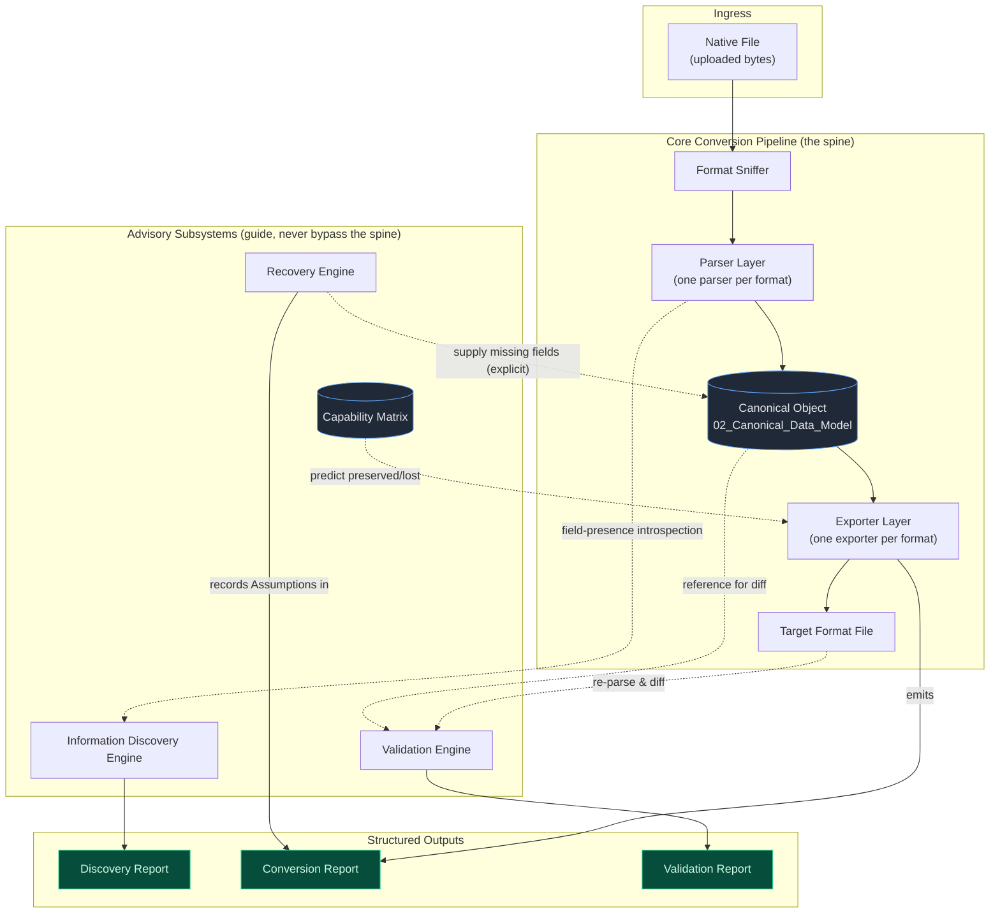

**Reading the diagram.** Every byte of scientific data flows `NF → SNIFF → PARSE → CANON → EXPORT → TF`. The four advisors touch that flow only at defined points: the Discovery Engine reads what the parser found; the Capability Matrix tells the exporter what the target can hold *before* it writes; the Recovery Engine writes missing fields into the Canonical Object *only with explicit user consent* (**P4**); the Validation Engine re-parses the output and diffs it against the original Canonical Object. Nothing crosses from one parser to another (**P2**).

---

### 2. Component Responsibility Table

Each component has exactly one responsibility. The "Must NOT" column is the enforcement mechanism — it is how **P2** and the pipeline's integrity are kept honest in code review.

| Component | Single Responsibility | Must NOT |
|-----------|----------------------|----------|
| **Format Sniffer** | Given raw bytes + filename, identify the most likely format(s) and select a parser. | Parse scientific content; make conversion decisions; access other formats' parsers. |
| **Parser Layer** (one `Parser` per format) | Read one native format → produce a Canonical Object, marking every field as *present* or *explicitly absent* (**P3**). | Read any other format; call another parser; write files; make loss decisions; silently default an absent field to zero. |
| **Canonical Schema** (`packages/canonical-schema`) | Define and validate the single in-memory/serialized representation of a structure/trajectory + all metadata & provenance. | Contain format-specific logic; know that XYZ or CIF exist. |
| **Capability Matrix** (`packages/capability-matrix`) | Answer "can format *F* express canonical field *X*?" as queryable data. | Perform conversions; read files; hard-code per-pair conversion rules. |
| **Conversion Engine** (`packages/conversion`) | Orchestrate Canonical Object → capability lookup → (Recovery if needed) → Exporter → Conversion Report, then invoke the Validation Engine on the output as the pipeline's final step. | Contain format parsing/writing logic (delegates to parsers/exporters); guess missing values (delegates to Recovery); perform validation checks itself (delegates to the Validation Engine). |
| **Recovery Engine** (`packages/recovery`) | Offer explicit, scientifically reasonable options for target-required-but-source-absent fields; record the chosen option as an Assumption. | Apply any recovery without an explicit choice or an explicitly configured default; hide a recovery from the Conversion Report. |
| **Validation Engine** (`packages/validation`) | Automatically verify a conversion (counts, species, RMSD, lattice, frames, metadata) and emit a Validation Report. | Modify the Canonical Object or the output file; suppress a discrepancy above tolerance. |
| **Exporter Layer** (one `Exporter` per format) | Read a Canonical Object → write one native format. | Read native files; call a parser; invent data the Canonical Object marks absent (must instead trigger Recovery via the engine). |
| **API Layer** (`backend/`, FastAPI) | Expose upload/inspect/convert/validate/download/history/capabilities as REST endpoints and async jobs. | Contain scientific logic (delegates entirely to `packages/*`); reformat report schemas. |
| **Web UI** (`frontend/`, Next.js) | Present the workflow and render Discovery/Conversion/Validation reports faithfully. | Re-implement conversion logic; hide reported losses; compute science client-side. |
| **Plugin SDK** (`packages/plugin-sdk`) | Provide the stable base classes/entry points for third-party parsers, exporters, and (future) analysis modules. | Grant plugins access to core internals beyond the published interfaces; let a plugin bypass the Canonical Object. |

---

### 3. End-to-End Sequence: upload → inspect → convert → validate → download

The following sequence uses the exact operation names the API document (`06_API.md`) will expose as endpoints. It also shows the async job boundary: `convert` and `validate` on large trajectories run as background jobs (see `06_API.md §3`), but the logical flow is shown end-to-end here.

```mermaid
sequenceDiagram
    autonumber
    actor User
    participant UI as Web UI (frontend)
    participant API as API Layer (FastAPI)
    participant Store as Object Storage
    participant Sniff as Format Sniffer
    participant Parse as Parser Layer
    participant IDE as Info Discovery Engine
    participant Conv as Conversion Engine
    participant Cap as Capability Matrix
    participant Rec as Recovery Engine
    participant Exp as Exporter Layer
    participant Val as Validation Engine
    participant DB as PostgreSQL

    User->>UI: select file, choose "inspect"
    UI->>API: POST /v1/upload (multipart)
    API->>Store: put(raw bytes)
    API->>DB: record file_id, metadata
    API-->>UI: { file_id }

    UI->>API: POST /v1/inspect { file_id }
    API->>Sniff: detect(file_id)
    Sniff-->>API: format = "xyz"
    API->>Parse: parse(file_id, "xyz")
    Parse-->>API: Canonical Object (fields marked present/absent)
    API->>IDE: discover(canonical)
    IDE-->>API: Discovery Report (✓/✗ inventory)
    API-->>UI: Discovery Report
    UI-->>User: show ✓ Species ✓ Positions ✗ Lattice ✗ Velocities

    User->>UI: choose target = POSCAR, click "convert"
    UI->>API: POST /v1/convert { file_id, target, options }
    API->>Conv: convert(canonical, target="poscar", mode)
    Conv->>Cap: lookup(target="poscar")
    Cap-->>Conv: capabilities (needs lattice; 1 frame; no velocities)
    alt required field absent (e.g., lattice)
        Conv->>Rec: resolve(missing="lattice", options)
        Rec-->>Conv: unresolved → draft report (status="awaiting_recovery")
        Conv-->>API: job awaiting_recovery (draft report + computed options)
        API-->>UI: recovery prompt (rendered from job envelope, 06 §3.2)
        User->>UI: choose "bounding box"
        UI->>API: POST /v1/jobs/{job_id}/recovery { choices }
        API->>Conv: resume(job, choices)
        Conv->>Rec: apply(choice)
        Rec-->>Conv: canonical (+lattice, supplied), Assumption recorded
    end
    Conv->>Exp: export(canonical, "poscar")
    Exp-->>Conv: target bytes
    Conv->>Val: validate(source_canonical, output_bytes)
    Val->>Parse: re-parse(output) → canonical'
    Val-->>Conv: Validation Report (counts, species, RMSD, ...)
    Conv-->>API: Conversion Report + Validation Report
    API->>Store: put(output bytes)
    API->>DB: record conversion + both reports
    API-->>UI: Conversion Report + Validation Report
    UI-->>User: show reports, enable download

    User->>UI: click "download"
    UI->>API: GET /v1/download/{conversion_id}
    API->>Store: get(output bytes)
    API-->>UI: file stream
    UI-->>User: saves target file
```

**Ownership notes (binding, resolving two boundary questions this diagram makes concrete).** (1) *Recovery never talks to the UI.* The Recovery Engine returns an unresolved result to the Conversion Engine, which surfaces it as an `awaiting_recovery` job the API renders (`06_API.md §3.2`); the user's choice returns by the same path. This keeps the advisor-guides-the-spine rule of §1 intact — no subsystem reaches past the API to the user. (2) *The Conversion Engine owns automatic validation.* Post-conversion validation is the final step of the conversion pipeline, invoked by the Conversion Engine (matching `04_Conversion_Engine.md §1`), not by the API layer — the engine holds the source Canonical Object and the output bytes the Validation Engine needs, and coupling the two guarantees the "every completed conversion has exactly one Validation Report" rule (`05_Validation.md §3`) cannot be bypassed by an API path that forgets to call it. The API's `/v1/validate` endpoint (`06_API.md §2`) triggers only *re-validation under a new tolerance profile*; it is the sole case where validation runs outside the Conversion Engine.

---

### 4. Recommended Tech Stack and Rationale

Each choice below states the decision and rejects at least one reasonable alternative, per the project's requirement that architectural decisions be justified (**P6** favors long-term maintainability and extensibility over short-term convenience).

#### 4.1 Summary

| Layer | Choice | Primary reason |
|-------|--------|----------------|
| Frontend framework | **Next.js + React** | SSR/SSG for docs + rich client for the multi-step conversion flow, one toolchain. |
| Styling | **Tailwind CSS** | Utility-first speed; consistent design tokens for the ✓/✗ loss-communication treatment (`07_Web_UI.md`). |
| Backend framework | **FastAPI (Python)** | Native `pydantic` schema validation; must be Python to call ASE/pymatgen in-process. |
| Scientific core | **ASE + pymatgen** | Complementary coverage of Phase 1 formats; battle-tested I/O to wrap. |
| Future visualization | **Mol\*** | Web-native, handles large trajectories; deferred (Secondary Goal). |
| Relational DB | **PostgreSQL** | Structured job/history/report records with JSONB for flexible report bodies. |
| Blob storage | **Object storage (S3-compatible)** | Uploaded files are large blobs, not rows; lifecycle expiry for privacy. |
| Job queue | **RQ (Redis Queue) on a Redis broker** | Simplest durable queue that fits a solo-maintainer project; Redis is already the broker (§4.2). |

#### 4.2 Rationale with rejected alternatives

**FastAPI (chosen) vs. Flask / Django (rejected).**
The backend *must* be Python because the scientific core (ASE, pymatgen) is Python and we want in-process calls, not a subprocess boundary. Among Python web frameworks: **Django** carries an ORM-centric, batteries-included model that is heavy for what is fundamentally a stateless conversion API with a thin persistence layer — its admin/templating/auth stack is dead weight here. **Flask** is light but pushes request validation, async support, and OpenAPI generation onto the developer. **FastAPI** wins because its `pydantic`-based request/response validation is the *same* type system we'll use to define the Canonical Model and the report schemas (`02`, `04`, `05`) — one schema language from database to API boundary — and it generates OpenAPI docs for free, which serves Persona 2 (pipeline engineer) directly.

**PostgreSQL (chosen) vs. SQLite (rejected for production) vs. MongoDB (rejected).**
We store two *kinds* of data: (a) structured, relational records — files, conversions, jobs, history — and (b) semi-structured report bodies (Conversion/Validation Reports) whose shape may evolve with the schema version. **SQLite** is perfect for local dev and is used there (`09_Deployment.md`), but lacks the concurrency and managed-hosting story for a multi-user hosted instance. **MongoDB** handles the flexible report bodies well but weakens the relational integrity we want for job/history/audit trails, and would tempt us to scatter scientific data into schemaless documents. **PostgreSQL** gives us both: strict relational tables for the audit trail *and* `JSONB` columns for report bodies — flexibility where we want it, integrity where we need it. This directly supports **P1** (reports are first-class, queryable records).

**ASE + pymatgen together (chosen) vs. either alone (rejected).**
Neither library alone cleanly covers the Phase 1 set with the fidelity we need. **pymatgen** is strongest on crystallographic/VASP-world formats (CIF, POSCAR/CONTCAR, XDATCAR, symmetry). **ASE** is strongest on the trajectory/atomistic-simulation world (XYZ, extXYZ, ASE `.traj`, calculators, velocities/forces plumbing). Choosing only one would force us to re-implement I/O the other already does well — the opposite of complementing existing tools (`00_Project_Overview.md §4`). We wrap both behind our own `Parser`/`Exporter` interfaces (§2) so that *which* library backs a given format is an internal detail invisible to the Canonical Model — and replaceable later without touching core logic. **Important boundary:** we use these libraries as I/O workhorses only; their *silent* loss behavior is exactly what ChemBridge exists to wrap, so their converters are never exposed directly — output always passes through our Capability Matrix and Conversion Report machinery.

**Object storage (chosen) vs. storing files in Postgres (rejected).**
Uploaded trajectories can be hundreds of MB. Putting large binary blobs in the database bloats it, complicates backups, and couples file lifecycle to row lifecycle. Object storage with a lifecycle policy (auto-expire uploads after N days) directly serves the "security of uploaded files" risk and privacy goals (`09_Deployment.md §5`), while Postgres holds only the *metadata and reports* that point at those blobs.

**Async job model (chosen) vs. synchronous requests (rejected).**
A synchronous `POST /convert` that blocks for 90 seconds parsing a 10,000-frame XDATCAR is a poor fit for HTTP timeouts, retries, and browser memory. An async submit → poll → retrieve model (detailed in `06_API.md §3`) is the correct shape for CPU/memory-bound scientific jobs and lets the UI stay responsive with progress polling.

**RQ (chosen) vs. Celery (rejected) vs. FastAPI `BackgroundTasks` (rejected).**
The job framework choice is fixed here because it has real downstream consequences — `awaiting_recovery` requires jobs that *persist* across a pause (`06_API.md §3.2`), and job durability across a worker restart is a correctness property, not a nicety (a lost job is a conversion the user believes is running). **FastAPI `BackgroundTasks`** is rejected outright: it runs work in the API process, so it neither survives a restart nor isolates the CPU/memory-bound conversion from request handling — the opposite of the async goal. **Celery** is the powerful option (rich routing, scheduling, result backends) but its configuration surface and operational weight are disproportionate for a solo-maintainer project (`10_Roadmap.md`), and its feature set targets problems this workload does not have (complex task graphs, multi-broker fan-out). **RQ** — a small Redis-backed queue — provides exactly what is needed: durable enqueue, worker isolation, job status/TTL that map cleanly onto the job envelope's states and `expires_at` (`06_API.md §3.2`), and Redis is already in the stack as the broker, so no new infrastructure is introduced. If a future need arises (scheduled jobs, priority lanes), migrating RQ→Celery is a worker-package change behind the same job-envelope API contract (**P6**) — the queue engine is an implementation detail the `/v1/jobs` surface hides.

### 4.3 Persistence of parsed Canonical Objects

Three features need a parsed Canonical Object to outlive the single function call that produced it: an `awaiting_recovery` job that pauses mid-conversion and must resume without re-parsing (`04 §3.2`); the "parse once, use twice" optimization where an inspect job's parse feeds the following convert (`03 §6.1`); and full re-parse re-validation, which needs the *expected object* as its reference (`05 §4.5`). Left unspecified, each would invent its own answer. The policy is one mechanism for all three:

- **Where.** The parsed source Canonical Object is serialized (the same JSON serialization the schema already defines, `02 §3`) and stored **keyed by job/conversion**, with a size-based split that mirrors the file-vs-report split above: objects under a configurable threshold (default 4 MB serialized) live in a Postgres `JSONB` column on the conversion/job row for cheap retrieval; larger ones (big trajectories) are written to **object storage** as gzipped JSON, with only the storage key in Postgres — keeping the database lean for exactly the large-trajectory case that would otherwise bloat it. This is the §4.2 object-storage rationale applied to canonical objects, not just raw uploads.
- **How long.** A persisted Canonical Object shares the lifecycle of the conversion's *input bytes*, not its reports: it lives for the standard retention window (`09 §5.2`, default 7 days) and is deleted on the same schedule as the source file, because it is derived input state, not an audit record. Reports (which *do* outlive bytes) never depend on it being present — a report is self-contained (`05 §4.5`). This is why full re-parse re-validation is time-bounded while re-thresholding is not.
- **The large-trajectory caveat (interaction with frame-chunking, risk R8).** For trajectories processed in frame chunks, the whole object may never be materialized in memory at once (`04 §6`); persistence then stores the object in its serialized form incrementally (chunked write to object storage) rather than requiring a full in-memory instance. A paused `awaiting_recovery` job for such a file holds a storage key plus its resolved/unresolved scenario state, not a live multi-GB object — so pausing is O(1) in memory regardless of trajectory size. **Alternative rejected: re-parsing the source file on resume** instead of persisting the object. Simpler storage, but it makes resume cost proportional to file size, reintroduces a second parse that could disagree with the first (a P1 hazard the "parse once" rule exists to remove), and fails outright once the source upload has expired mid-pause. Persisting the derived object once is cheaper and safer than parsing twice.

### 4.4 Relational Data Model (Normative)

PostgreSQL is core infrastructure (§4.2), and every downstream document assumes rows it can point at — jobs, conversions, reports, keys — so the table model is fixed here rather than left for implementation to invent. Column *types* below are indicative (documentation, not DDL); names, keys, and relationships are **normative**. Report bodies are `JSONB` per the §4.2 rationale: relational integrity for the audit trail, schema flexibility for the versioned report payloads.

| Table | Key columns | Notes |
|---|---|---|
| `files` | `file_id` PK · `owner_id` FK→`users` nullable · `filename` · `size_bytes` · `sha256` · `storage_key` · `uploaded_at` · `expires_at` · `deleted_at` nullable | One row per upload. `deleted_at` implements `DELETE /v1/files/{file_id}` as a soft delete of the *row* (bytes are hard-deleted from object storage immediately) so history rendering never dangles. `sha256` indexed — it keys the inspect-idempotency and parse-cache lookups (`06 §2` notes). |
| `jobs` | `job_id` PK · `owner_id` FK nullable · `kind` (`inspect` \| `convert` \| `validate`) · `state` (`06 §3.2` enum incl. `cancelled`) · `file_id` FK · `created_at` · `updated_at` · `expires_at` nullable · `cancelled_at` nullable · `error` JSONB nullable · `recovery_state` JSONB nullable | The job envelope's persistent backing; RQ holds queue position, Postgres holds the record of truth (a queue entry is ephemeral, a job row is auditable). `recovery_state` stores the unresolved/resolved scenario map for `awaiting_recovery`. |
| `canonical_objects` | `object_id` PK · `job_id` FK · `serialized` JSONB nullable · `storage_key` nullable · `size_bytes` · `expires_at` | The §4.3 persistence policy as a table: exactly one of `serialized`/`storage_key` populated per the size threshold. Reaped on the input-bytes lifecycle. |
| `conversions` | `conversion_id` PK · `job_id` FK · `file_id` FK · `owner_id` FK nullable · `source_format_id` · `target_format_id` · `mode` · `created_at` · `output_storage_key` nullable · `output_expires_at` nullable · `conversion_report` JSONB | One row per conversion (including refusals — a refused conversion has a report and no `output_storage_key`). The `ConversionReport` is embedded verbatim (`04 §2`); it is the row's reason to exist and outlives the output bytes. |
| `validation_reports` | `validation_id` PK · `conversion_id` FK · `created_at` · `tolerance_profile` JSONB · `report` JSONB | **Append-only**: automatic validation inserts the first row; each re-thresholding (`05 §4.5`, `POST /v1/validate`) appends another. Never updated in place — a replaced report would rewrite history, the exact thing the trail exists to prevent. |
| `users` | `user_id` PK · `email` unique · `password_hash` (argon2id) · `created_at` | Hosted mode only (`06 §4`); the table is absent-by-migration-flag on anonymous self-hosted instances, not merely empty. |
| `api_keys` | `key_id` PK · `user_id` FK · `key_hash` · `label` · `created_at` · `last_used_at` nullable · `revoked_at` nullable | Secrets stored only as salted hashes (`06 §4`); revocation is a timestamp, not a delete, so key usage history remains auditable. |

Integrity rules worth stating once: every FK is `ON DELETE RESTRICT` except `files → conversions`, where the conversion row survives file deletion (reports outlive bytes, `09 §5.2`) — the FK is nullable-on-delete via `deleted_at` soft-deletion rather than a cascading wipe. Cursor pagination on `/v1/history` reads `(created_at, conversion_id)` composite indexes.

**Migrations: Alembic (chosen) vs. hand-rolled SQL scripts (rejected).** The schema will evolve (v0.2 adds nothing structural, but the post-1.0 sketch does), and the *canonical schema* already treats migration as a first-class, tested operation (`02 §5`); the relational schema deserves the same discipline. **Alembic** is the standard companion to the SQLAlchemy layer FastAPI projects use, autogenerates draft migrations from model diffs, and — decisively — supports the same forward-only, fixture-tested pattern `02 §5` mandates: every Alembic revision ships with a before/after test in `backend/tests/` and CI runs the full chain against an empty database (`08 §5`). Hand-rolled SQL scripts are simpler on day one and drift by month three: no dependency ordering, no autogeneration guard against forgotten columns, and no shared convention for contributors. Deployment applies migrations as a release step, never at container boot (`09 §4.1` — a fleet of containers racing to migrate is a classic self-inflicted outage).

---

### 5. Repository Structure (Annotated Monorepo)

```text
chembridge/
├── README.md                     # One-paragraph pitch + quickstart; links into docs/.
├── LICENSE                       # Apache-2.0 (Part 10 §4.1).
├── NOTICE                        # Apache-2.0 attribution home; golden-corpus credits (08 §3.2).
├── pyproject.toml                # The single distribution `chembridge` (§5.2): build, deps, ruff/
│                                 #   mypy/pytest/import-linter config. Python ≥ 3.11.
├── CONTRIBUTING.md               # Contribution guide (outlined in 10_Roadmap.md). [v0.2]
├── docker-compose.yml            # Local dev: backend + frontend + postgres + minio. [v0.5]
├── .github/                      # CI/CD workflows, issue & PR templates (08/10).
│   └── workflows/                #   ci.yml runs ruff + mypy + import-linter + pytest on every PR.
│
├── docs/                         # THE source of truth: MASTER_SPEC.md (single editable file, Preface),
│                                 #   ARCHITECTURE_REVIEW.md, IMPLEMENTATION_PLAN.md, DECISIONS.md.
│
├── frontend/                     # Next.js + React + Tailwind web app (07_Web_UI.md).
│   ├── app/                      # Routes: landing, upload, inspect, convert, report, history, docs.
│   ├── components/               # Reusable UI (report viewers, ✓/✗ loss badges, recovery prompts).
│   └── lib/                      # API client, typed against the API's OpenAPI schema.
│
├── backend/                      # FastAPI app (06_API.md). THIN — orchestration only.
│   ├── app/
│   │   ├── main.py               # ASGI entrypoint, router registration.
│   │   ├── api/v1/               # Versioned endpoints (upload/inspect/convert/validate/...).
│   │   ├── jobs/                 # Async job submission, worker tasks, status tracking.
│   │   ├── storage/              # Object-storage + Postgres adapters.
│   │   └── deps.py               # Dependency wiring into packages/*.
│   └── tests/                    # API-level integration tests.
│
├── src/chembridge/               # THE scientific core: subpackages of the one distribution (§5.2),
│   │                             #   importable without FastAPI. Component-name → subpackage:
│   │                             #   canonical-schema→schema, plugin-sdk→sdk, capability-matrix→
│   │                             #   capabilities (the prose keeps the descriptive names).
│   ├── schema/                   # 02: the Canonical Model. Depends on nothing else in the package.
│   ├── sdk/                      # 03 §2, §5: ParserPlugin/ExporterPlugin ABCs, ParseResult/ParseIssue,
│   │                             #   and the FormatCapabilities/FieldCapability data model (§5.1).
│   │                             #   Depends only on schema.
│   ├── parsers/                  # 03: one Parser per format (module per format); depends on schema + sdk.
│   ├── exporters/                # one Exporter per format; depends on schema + sdk.
│   ├── capabilities/             # 03/04: assembles FormatCapabilities declarations (defined in sdk)
│   │                             #   into a queryable registry; format→capability data.
│   ├── discovery/                # 03 §6: Format Sniffer + Information Discovery Engine. Generic by
│   │                             #   construction — no per-format code (03 §6.1).
│   ├── conversion/               # 04: Conversion Engine; orchestrates the above.
│   ├── recovery/                 # 04: Recovery Engine + recovery workflows.
│   ├── validation/               # 05: Validation Engine + Validation Report.
│   └── cli/                      # Appendix A: chembridge CLI. Thin presenter over the subpackages
│                                 #   above, same rule as the API layer (§2); ships without backend/
│                                 #   or frontend/ existing (`10 §2` decision 1).
│
├── plugins/                      # First-party & example plugins built against plugin-sdk.
│   └── example-format/           # Reference plugin proving the SDK (03_Parsers.md §6).
│
├── examples/                     # Runnable end-to-end usage samples (CLI + library).
│
└── tests/                        # Cross-cutting suites (08_Testing.md).
    ├── golden/                   # Curated real-world files + known-correct canonical objects.
    ├── roundtrip/                # A→Canonical→B→Canonical diff tests.
    └── performance/              # Large-trajectory benchmarks.
```

#### 5.1 Purpose of each top-level directory

- **`docs/`** — The engineering constitution (this set). Committed at repo root so Claude Code Plan Mode and contributors read intent before code.
- **`frontend/`** — The Next.js web application. Contains *no* scientific logic; it is a faithful presentation layer over the API (see `07_Web_UI.md`).
- **`backend/`** — The FastAPI service. Deliberately **thin**: it validates requests, manages jobs and storage, and calls into `packages/*`. All science lives in `packages/`.
- **`packages/`** — The heart of ChemBridge. Every scientific capability is a framework-agnostic Python module importable *without* FastAPI (packaging shape: §5.2). This is what lets Persona 2 (`pip install chembridge`, use as a library) and the CLI ship independently of the web stack. The internal dependency rule is strict and acyclic: `canonical-schema` depends on nothing; `plugin-sdk` depends only on `canonical-schema` — it owns the `ParserPlugin`/`ExporterPlugin` ABCs, the `ParseResult`/`ParseIssue` error contract, and the `FormatCapabilities`/`FieldCapability`/`CapabilityLevel` data model (`03 §2, §4.1`), so that a parser can declare its capabilities without importing the matrix package; `parsers`, `exporters` depend on `canonical-schema` and `plugin-sdk`; `capability-matrix` depends on `canonical-schema` and `plugin-sdk`, assembling the `FormatCapabilities` declarations plugins already produce into a queryable registry (it is consumer, not owner, of that data model); `discovery` depends on `canonical-schema`, `plugin-sdk`, and the parser registry (`03 §6`); `conversion`, `recovery`, `validation` depend on those; `cli` depends on `conversion`, `recovery`, `validation`, and `discovery`; nothing depends on `backend/` or `frontend/`. This dependency direction is what physically enforces **P2**, and it is the contract the import-graph lint (`08 §1.1`) checks mechanically.
- **`plugins/`** — Parsers/exporters built against `plugin-sdk`, kept out of core so that "add a format" never means "edit core." Ships with at least one reference plugin.
- **`examples/`** — Copy-pasteable end-to-end samples for both the library and the CLI, doubling as living documentation.
- **`tests/`** — Cross-package suites that don't belong to a single package: golden datasets, round-trip diffs, and performance benchmarks (`08_Testing.md`). Package-local unit tests live beside their package.

#### 5.2 Why a monorepo, not polyrepo (tradeoff)

**Decision: monorepo.**

The scientific packages, the API, and the frontend evolve *together* around one shared contract — the Canonical Model. A schema field added in `packages/canonical-schema` typically requires coordinated changes in parsers, exporters, the API's response models, and the UI's report viewers. In a **polyrepo**, that single logical change becomes several PRs across repos with version-pinning dance, and it is dangerously easy to ship a parser that emits a field the exporter or UI doesn't yet understand — a silent-loss risk that directly threatens **P1**. A **monorepo** makes such changes atomic: one PR, one CI run that tests the whole pipeline round-trip, one review.

**The tradeoff we accept:** monorepos can blur boundaries and let packages reach into each other's internals. We counter that with the strict, enforced dependency direction in §5.1 (packages must import only "downward"; CI can lint import graphs), so we keep the *logical* separation of a polyrepo while gaining the *atomic-change* safety of a monorepo. For a solo developer (the roadmap's assumption), a single repo with one issue tracker and one CI config is also simply less operational overhead — the polyrepo tax is not worth paying at this scale.

**Packaging clarification: one distribution, not one distribution per `packages/*` directory.** The directories under `packages/` are Python *subpackages* of a single publishable distribution, `chembridge` — not separate PyPI projects with their own `pyproject.toml`, version number, and release cadence. This is what Part 9 §3's singular phrasing ("publish the Python packages under `packages/` to PyPI as the `chembridge` distribution") already implies but never states outright; it is made explicit here to remove the ambiguity. **Alternative rejected: eight separately-versioned distributions** (one per `packages/*` directory), on the theory that independent installability maximizes reuse. For a solo-maintained project pre-v1.0, this multiplies `pyproject.toml`s, editable-install wiring, and cross-package version pinning for zero users — nothing external depends on installing `capability-matrix` without `conversion`. The *logical* separation these directories exist for is fully delivered by the acyclic import rule (§5.1) and its CI enforcement, which works identically whether the boundary is a package or a distribution. Splitting into multiple distributions remains available later — e.g., a slim `chembridge-sdk` for third-party plugin authors once the SDK freezes (`10 §6` item 3) — as an additive packaging change behind the same import structure, not a redesign.

---

### 6. Extensibility Seams

The Secondary Goals (`00_Project_Overview.md §3.2`) must attach *without core rework*. Each attaches at a specific, already-defined seam:

| Future feature | Attachment seam | Why no core rework is needed |
|----------------|-----------------|------------------------------|
| **Visualization** (Mol\*, trajectory animation, side-by-side) | Consumes the **Canonical Object** and the **Discovery/Conversion/Validation Reports** the MVP already produces; renders in a new `frontend/app/` route. | It reads existing artifacts read-only; the pipeline doesn't change. Mol\* is fed geometry/cell/frames straight from the Canonical Model. |
| **File Repair** (wrap, center, dedupe, reorder) | A new `packages/repair` operating *on a Canonical Object → Canonical Object*, inserted between parse and export, each repair recorded in **Provenance** and the Conversion Report. | The Canonical Object is the natural input/output; Provenance and the report schema already exist to record modifications transparently (**P1**). |
| **Analysis** (composition, density, RDF, neighbor lists) | Plugins via **`plugin-sdk`**, reading a Canonical Object, emitting results as **User Metadata / annotations** on the Canonical Model. | The plugin SDK and the User Metadata extension point (`02_Canonical_Data_Model.md`) are designed for exactly this; analysis never touches parsers or exporters. |
| **AI Assistant** (explain files, recommend formats, explain loss) | Consumes the **structured reports** (Discovery/Conversion/Validation) as its input substrate; a new `backend/app/api/v1/assistant` endpoint. | The reports are already machine-readable and complete; the assistant is a *reader* of them, requiring no pipeline change. |
| **New file formats** (LAMMPS, QE, CP2K, Gaussian, ORCA, GROMACS, Open Babel, pymatgen objects) | A new `Parser`/`Exporter` pair via **`plugin-sdk`** + one new row in the **Capability Matrix**. | Adding a format is O(1): implement two interfaces and register capabilities; the Conversion Engine, Recovery, Validation, API, and UI all consume it without modification (the payoff of **P2**). |

The through-line: **every future feature is a consumer of an existing seam — the Canonical Object, the reports, the plugin SDK, or the Capability Matrix — never a modifier of the conversion spine.** That property is the architectural promise this document exists to guarantee.


---


## Part 2: Canonical Data Model

*Source: `docs/02_Canonical_Data_Model.md`*

> **Document status:** Binding and normative. This document defines the Canonical Model — the single data representation into which every Parser writes and from which every Exporter reads (`01_Architecture.md §2`). It is the most load-bearing contract in ChemBridge: the Information Discovery Engine, Capability Matrix, Conversion Engine, Recovery Engine, and Validation Engine all operate on the structures defined here. Field names in this document are **binding vocabulary**; later docs and code must use them verbatim.
>
> Design principles referenced as **P1–P6** are defined in `00_Project_Overview.md §2`. The most important one for this document is **P3: absence is information** — the schema must distinguish "this field was never present in the source file" from "this field was present with value zero."

---

### 1. Modeling Language: pydantic-style Schema (Decision)

The schema below is written as **pydantic v2-style models** (Python type annotations with validators), not plain dataclasses.

**Rationale.** The backend is FastAPI (`01_Architecture.md §4.2`), whose request/response validation *is* pydantic. Defining the Canonical Model in pydantic means one type system spans the entire stack: the same model that a Parser produces is validated at construction time, serialized to JSON for storage in PostgreSQL `JSONB` columns, and embedded directly in API response schemas (`06_API.md`) without a translation layer. pydantic also gives us declarative validators (shape checks on arrays, unit-bearing field constraints) and first-class JSON Schema export, which the plugin SDK uses to tell third-party parser authors exactly what they must produce.

**Alternative considered and rejected: plain `dataclasses` + manual validation.** Dataclasses are lighter-weight and dependency-free, but every invariant this document specifies (array shape consistency, absence semantics, unit discipline) would need hand-written validation scattered across parsers — precisely the kind of duplicated, drift-prone logic that causes silent data corruption. Since pydantic is already a hard dependency via FastAPI, the "extra dependency" cost is zero.

**Numeric arrays.** Fields typed `Array[shape]` below are NumPy arrays in memory (for interop with ASE/pymatgen, which are array-native) with pydantic custom types handling validation and JSON serialization as nested lists. In-memory: `np.ndarray` (float64). Serialized: nested JSON lists. Shape notation: `N` = number of atoms in a frame, `F` = number of frames.

---

### 2. The Absence Convention (P3) — Normative

This section governs every optional field in the schema. It is the mechanism behind "never silently lose scientific information."

| State | Representation | Meaning |
|-------|----------------|---------|
| **Absent** | `None` | The source file did not contain this information at all. |
| **Present** | An actual value (including zeros, empty strings kept verbatim, etc.) | The source file contained this information; the value is the value. |

**Normative rules:**

1. `None` means exactly one thing: *not present in the source*. It is never a stand-in for "zero," "default," or "unknown but probably fine."
2. **Parsers are forbidden from defaulting.** A parser must never populate a field the source file does not contain — no zero velocities, no identity lattice, no `energy = 0.0`. Filling absent fields is exclusively the Recovery Engine's job, only with explicit user consent, and always recorded as an Assumption (**P4**).
3. **Zero is data.** `velocities` as an `(N, 3)` array of zeros means the source *stated* the system is at rest. `velocities = None` means the source said nothing about velocities. These are scientifically different and the schema keeps them different.
4. **Present-but-unparseable is an error, not an absence.** If a field exists in the source but cannot be parsed (corrupt block, ambiguous units), the parser must not silently record `None`. It must raise or record a structured parse issue per the error contract in `03_Parsers.md §5`. Encoding "corrupt" as "absent" would be silent loss.
5. **Discovery is derived, not stored.** The Information Discovery Engine computes its ✓/✗ Discovery Report by introspecting which fields are `None` versus populated on the Canonical Object (via the `field_presence()` method, §3.11). Presence is never tracked in a parallel bookkeeping structure that could drift out of sync with the data itself.

**Alternative considered and rejected: a tri-state wrapper type (`Present(value) / Absent / Unknown`).** An explicit algebraic wrapper makes absence maximally visible in code, but it infects every call site with unwrapping boilerplate, breaks direct NumPy/ASE interop, and its third state ("unknown") turns out to be unnecessary: rule 4 routes the only genuine third case (present-but-unparseable) into the error contract instead. `Optional[T]` with the strict rules above achieves the same semantics at zero ergonomic cost.

---

### 3. Schema Definition

#### 3.1 Canonical units (normative)

All values in a Canonical Object are stored in **one fixed unit system**. Parsers convert at parse time and record the source's original units in `provenance`. Exporters convert back to whatever the target format requires. No field in the Canonical Model ever carries "whatever units the file used."

| Quantity | Canonical unit | Symbol |
|----------|---------------|--------|
| Length / positions / lattice vectors | ångström | Å |
| Time | femtosecond | fs |
| Velocity | Å/fs | Å·fs⁻¹ |
| Energy | electronvolt | eV |
| Force | eV/Å | eV·Å⁻¹ |
| Stress | eV/ų (also surfaced in GPa for display — derived, never stored, §3.1.1) | eV·Å⁻³ |
| Mass | unified atomic mass unit | u (amu) |
| Charge | elementary charge | e |
| Magnetic moment | Bohr magneton | μB |
| Temperature (metadata) | kelvin | K |

**Rationale.** This is the ASE unit system (eV/Å/fs/amu), chosen because ASE and pymatgen interop is in-process and constant unit shuffling at the library boundary is the classic source of subtle scientific bugs (the master risk list names "unit mismatches" explicitly). **Alternative rejected: SI units internally.** SI is unambiguous but alien to every file format and library in scope; it would maximize, not minimize, the number of conversions performed, and each conversion is a bug opportunity.

##### 3.1.1 The GPa stress rendering (derived display value)

Stress is *stored* only in eV/ų, the one canonical unit — storing a second copy in GPa would be the redundant-cached-state anti-pattern §4 rejects. Because materials scientists read stress in GPa, it is *rendered* additionally in GPa wherever stress is shown, computed on demand (`1 eV/ų = 160.21766208 GPa`, the CODATA factor pinned in a shared constants module). Concretely, this appears in exactly two places, so the promise is not left abstract: the web UI's Conversion Report panel (`07_Web_UI.md §2.5`) shows a GPa value beside the eV/ų value for any preserved/supplied `electronic.stress` entry; and the CLI/JSON report attaches a non-authoritative `display` annotation (`{"gpa": …}`) to the stress entry's `detail`, clearly marked as derived. No report *field* stores GPa and no validation check reads it — it is presentation only, and eV/ų remains the single source of truth.

#### 3.2 Root object

```python
class CanonicalObject(BaseModel):
    """The single internal representation. One instance = one structure
    or one trajectory (a structure is a trajectory with one frame)."""

    schema_version: str                  # e.g. "1.0.0" — see §5. REQUIRED.
    frames: list[Frame]                  # ≥ 1. A static structure has exactly one frame. REQUIRED.
    trajectory: TrajectoryMetadata | None = None   # None for single-frame sources with no time axis.
    simulation: SimulationMetadata | None = None   # None when source carries no simulation context.
    provenance: Provenance               # REQUIRED — always known, because ChemBridge itself creates it.
    user_metadata: UserMetadata          # REQUIRED container; its contents may be empty.
```

**Design decision — everything is a trajectory.** A single structure (POSCAR, CIF) is represented as `frames` of length 1 with `trajectory = None`. **Alternative rejected: separate `Structure` and `Trajectory` root types.** Two root types would force every downstream component (Discovery, Conversion, Validation, API, UI) to branch on type everywhere, and the "is a single frame a structure or a 1-frame trajectory?" ambiguity would resurface in every parser. One root type with `len(frames)` as the discriminator keeps the pipeline uniform; the Capability Matrix expresses "this format holds only one frame" as a capability constraint, not a type difference.

**Design decision — per-frame state, not global-plus-deltas.** Each `Frame` carries its own atoms, cell, dynamics, and electronic data. This permits variable-cell MD (NPT XDATCAR), per-frame energies/forces (extXYZ), and — as a deliberately reserved extension point — future formats with per-frame atom-count changes (grand-canonical or reactive trajectories). **Alternative rejected: global `atoms`/`cell` with per-frame positions only.** That layout is more compact for the common case but *cannot represent* variable-cell trajectories without bolted-on exceptions — a foreclosure of scope the master prompt explicitly lists (XDATCAR is Phase 1). Compactness is an optimization; per **P6**, extensibility wins. Serialized size is mitigated at the storage layer, not in the schema.

**Constant-atom-count invariant (v1.0 scope) — and its interaction with root-level per-atom user arrays.** Although the `Frame` structure *could* hold a different atom count per frame, the v1.0 Canonical Model enforces a **constant N across all frames** of one object (a pydantic validator on `CanonicalObject`: every `frame.atoms` has the same length). This is what makes the root-level `user_metadata.custom_per_atom` arrays (first dimension `N`, §3.10) well-defined — a single N describes every frame. All seven Phase 1 formats satisfy this. The variable-N future is therefore *reserved but not yet open*: enabling it is a **major** schema bump (§5) that will relocate per-atom custom arrays from root-level to per-frame (`Frame.custom_per_atom`) so that each frame carries arrays matching its own atom count. Recording the constraint here — rather than leaving §3.2's "changing atom counts" aspiration to collide silently with §3.10's shape rule — is itself an application of **P3**: the limitation is stated, not discovered. Until then, a source that would require varying N (none in Phase 1) is a `ParseError` with a `recovery_hint`, never a silently truncated or padded object.

#### 3.3 Geometry (per frame)

```python
class AtomsBlock(BaseModel):
    symbols: list[str]                   # Chemical symbols, e.g. ["O", "H", "H"]. REQUIRED.
    atomic_numbers: list[int]            # Derived from symbols at construction; kept explicit for interop. REQUIRED.
    positions: Array[(N, 3)]             # Cartesian, Å. REQUIRED. See §4 for the Cartesian decision.
    masses: Array[(N,)] | None = None    # u. None = source did not specify (exporters may use standard masses
                                         #   ONLY via an explicit, reported default — see 04_Conversion_Engine.md).
```

| Field | Type | Units | Optionality | Absent (`None`) means |
|-------|------|-------|-------------|----------------------|
| `symbols` | `list[str]` | — | **required** | n/a — a file with no identifiable species fails parsing (error contract, `03_Parsers.md §5`). |
| `atomic_numbers` | `list[int]` | — | **required** (derived) | n/a. |
| `positions` | `(N, 3)` float | Å | **required** | n/a — no positions, no structure. |
| `masses` | `(N,)` float | u | optional | Source carried no per-atom masses (most formats). |

Invariants (pydantic validators): `len(symbols) == len(atomic_numbers) == positions.shape[0]`; symbols must be valid element symbols or the reserved `"X"` for unknown species (which the parser must accompany with a parse warning, never silently).

#### 3.4 Simulation Cell (per frame)

```python
class Cell(BaseModel):
    lattice_vectors: Array[(3, 3)]       # Rows are a, b, c in Å, Cartesian. REQUIRED within Cell.
    pbc: tuple[bool, bool, bool]         # Periodicity per lattice direction. REQUIRED within Cell.
    space_group: str | None = None       # Hermann–Mauguin symbol as *declared by the source* (e.g. CIF).
                                         #   ChemBridge never computes symmetry in the MVP — carried, not derived.
```

The `Frame.cell` field itself is `Cell | None`:

| State | Meaning |
|-------|---------|
| `cell = None` | The source expresses no cell at all (plain XYZ). Discovery reports ✗ Lattice. |
| `cell` present, `pbc = (False, False, False)` | The source *declares* a bounding box / non-periodic cell. This is data, not absence. |
| `cell` present, `pbc = (True, True, True)` | Fully periodic crystal (POSCAR, CIF). |

**Note.** The distinction between the first two rows is exactly why `pbc` lives inside `Cell` rather than as a separate optional: "no cell" and "a cell with no periodicity" are different physical statements, and conflating them is a classic silent-loss bug in existing converters.

| Field | Type | Units | Optionality | Absent means |
|-------|------|-------|-------------|--------------|
| `cell` (on Frame) | `Cell \| None` | — | optional | Source has no concept of a cell in this file. |
| `lattice_vectors` | `(3, 3)` float | Å | required within `Cell` | n/a. |
| `pbc` | `(bool, bool, bool)` | — | required within `Cell` | n/a — if the source declares a cell but no PBC flags, the parser records the format's *documented* convention (e.g. POSCAR ⇒ `(True, True, True)`) and notes this in `provenance.parse_notes`, because it is a format-defined fact, not a guess. |
| `space_group` | `str \| None` | — | optional | Source declared no symmetry information. |

**Symmetry scope.** `space_group` carries the *declared* symbol only; ChemBridge never derives symmetry from coordinates (Non-Goals, `00_Project_Overview.md §4`). Declared symmetry **operations** (as in CIF) are deliberately not schema fields: parsers **apply** them to populate the full atom set — reading the file as its format standard defines it, a format-defined fact in the same category as POSCAR ⇒ periodic (see `03_Parsers.md §3` note 13 for the normative CIF policy) — and carry the operation strings verbatim in `simulation.extra` so that no declared information is dropped. A schema that stored an asymmetric unit plus unapplied operations would push symmetry expansion into every downstream consumer, guaranteeing divergent interpretations — the exact class of bug a single Canonical Model exists to prevent.

#### 3.5 Trajectory (root-level) and per-frame time

```python
class TrajectoryMetadata(BaseModel):
    timestep: float | None = None        # fs. None = frames exist but the source declared no timestep (XDATCAR).
    # NOTE: frame_count is NOT a stored field — see below. It is exposed as a computed
    #       property on CanonicalObject: `frame_count == len(frames)`, always.

class Frame(BaseModel):
    index: int                           # 0-based position in the trajectory. REQUIRED.
    time: float | None = None            # fs, absolute simulation time if the source states it (extXYZ Time=...).
    atoms: AtomsBlock                    # REQUIRED (§3.3).
    cell: Cell | None = None             # §3.4.
    dynamics: Dynamics                   # REQUIRED container; fields inside may be None (§3.6).
    electronic: Electronic               # REQUIRED container; fields inside may be None (§3.7).
```

**`frame_count` is derived, never stored (consistency with §4).** An earlier draft stored `frame_count` on `TrajectoryMetadata` "for cheap checks." That is the same duplicated-derived-state hazard §4 rejects for fractional coordinates: a stored count and `len(frames)` can desynchronize, and a stale count is exactly the kind of quiet inconsistency a trust-focused tool must not carry. It is therefore a **computed property** — `CanonicalObject.frame_count` returns `len(frames)` — costing an O(1) list length, never persisted and never able to disagree with the frames it counts. Serialized report/discovery payloads (`structure.frame_count`, §6.2; the `frame_count` shown in Discovery) are *rendered* from this property at emit time, so consumers still see the number without the model storing it. Wherever a serialized envelope shows `frame_count` (e.g. `trajectory.frame_count` in a round-tripped object), it is a projection of the property, authoritative only as `len(frames)`.

**Why `TrajectoryMetadata` holds a single field.** After `frame_count` moved to a computed property (above), `timestep` is the container's only remaining field — an intentional seam, not an oversight: it is the reserved home for future trajectory-level (as opposed to per-frame) metadata that isn't yet needed by any Phase 1 format, following the same "extension surface first, curation second" pattern as `simulation.extra` (§6). Folding `timestep` onto the root object would save one level of nesting today at the cost of that seam.

**Container convention.** `dynamics` and `electronic` are *required containers with optional contents*. This makes Discovery introspection uniform (`frame.dynamics.velocities is None`) instead of requiring two-level null checks (`frame.dynamics is None or ...`). A container whose fields are all `None` is semantically identical to "no dynamics information" and serializes compactly.

#### 3.6 Dynamics (per frame)

```python
class Constraint(BaseModel):
    kind: str                            # e.g. "fixed_atoms", "fixed_plane", "fixed_line".
    atom_indices: list[int]              # 0-based indices into this frame's atoms.
    parameters: dict[str, Any] = {}      # Kind-specific (e.g. plane normal). Documented per kind in 03_Parsers.md.
                                         #   MUST be JSON-serializable (str/int/float/bool/list/dict/None
                                         #   only) — the same constraint every other schema field satisfies
                                         #   implicitly via typed fields; Constraint is the one place a
                                         #   plain dict could otherwise smuggle in a non-serializable value.

class Dynamics(BaseModel):
    velocities: Array[(N, 3)] | None = None   # Å/fs.
    forces:     Array[(N, 3)] | None = None   # eV/Å.
    constraints: list[Constraint] | None = None  # None = source says nothing; [] = source explicitly
                                                 #   declares "no constraints" (rare but real, e.g. selective
                                                 #   dynamics block present with all T T T).
```

| Field | Type | Units | Optionality | Absent means |
|-------|------|-------|-------------|--------------|
| `velocities` | `(N, 3)` float | Å/fs | optional | Source carries no velocities. All-zeros = source states system at rest (§2 rule 3). |
| `forces` | `(N, 3)` float | eV/Å | optional | Source carries no forces. |
| `constraints` | `list[Constraint] \| None` | — | optional | `None` = no constraint info; `[]` = explicitly unconstrained. |

#### 3.7 Electronic Information (per frame)

```python
class Electronic(BaseModel):
    total_energy: float | None = None            # eV. The source's stated total energy for this frame.
    stress: Array[(3, 3)] | None = None          # eV/ų, full symmetric tensor, TENSION-POSITIVE sign
                                                 #   convention (§3.7.1). Parsers expand Voigt-6 sources to
                                                 #   3×3 and normalize sign/order, recording both in
                                                 #   provenance.parse_notes.
    charges: Array[(N,)] | None = None           # e (elementary charge), per-atom net charge, ELECTRON-
                                                 #   DEFICIENT-POSITIVE (a cation is +). Scheme label in
                                                 #   simulation.extra (§3.7.1).
    magnetic_moments: Array[(N,)] | None = None  # μB, per-atom collinear projection; sign follows the
                                                 #   spin-up-positive convention (§3.7.1).
    total_spin: float | None = None              # Dimensionless: total S (not 2S, not Sz), in units of ħ.
                                                 #   Normalized on parse to S — see §3.7.1; the source's
                                                 #   original declaration is preserved in parse_notes.
```

| Field | Type | Units | Optionality | Absent means |
|-------|------|-------|-------------|--------------|
| `total_energy` | `float` | eV | optional | Source states no energy for this frame. |
| `stress` | `(3, 3)` float | eV/ų (tension-positive) | optional | No stress tensor in source. |
| `charges` | `(N,)` float | e (cation-positive) | optional | No per-atom charges in source. |
| `magnetic_moments` | `(N,)` float | μB (spin-up-positive) | optional | No magnetic moments in source. |
| `total_spin` | `float` | S, in ħ | optional | No spin state declared. |

**Scope note.** These fields *carry* values stated by source files; ChemBridge never computes them (Non-Goals, `00_Project_Overview.md §4`). Charge/magnetization *schemes* (Mulliken vs Bader vs Hirshfeld) are recorded in `simulation.extra` when the source declares them — the value array is meaningless without its scheme, and dropping the scheme label would be silent semantic loss.

##### 3.7.1 Sign and quantity conventions (normative)

A unit fixes *scale*; it does not fix *sign* or *which quantity a number represents*. For the electronic fields these are the classic conversion-bug sources — VASP reports stress in kBar with the **opposite** sign of the tension-positive convention, and "spin" appears in files variously as `S`, `2S`, `Sz`, or a number of unpaired electrons. Leaving these to "as declared, verbatim" would reintroduce exactly the silent-corruption class §3.1 rejects for units, so the canonical model fixes one convention per field and normalizes at the parser boundary — the sign/quantity analogue of the parse-time unit conversion of §3.1:

| Field | Canonical convention | Normalized at parse from | Recorded in `parse_notes` |
|---|---|---|---|
| `stress` | **Tension-positive** (a stretched cell has positive diagonal stress), full symmetric 3×3, row/col in the same Cartesian basis as `lattice_vectors` | VASP/pressure-positive sources: sign flipped; kBar/GPa → eV/ų; Voigt-6 → 3×3 with the (xx,yy,zz,yz,xz,xy) ordering stated | the source's original sign convention, unit, and (if Voigt) component order |
| `charges` | **Cation-positive net charge** in e (a site missing electrons is positive) | sources using electron-count or opposite sign: converted; formal-oxidation-state integers carried as-is with scheme label | source scheme (Mulliken/Bader/Hirshfeld/formal) and original sign |
| `magnetic_moments` | **Spin-up-positive** collinear projection in μB | sources with opposite polarity: sign aligned | source convention |
| `total_spin` | **Total spin quantum number S** (e.g. a triplet is `S = 1`), in units of ħ | `2S` → divided by 2; `Sz` → carried as S only when the source states it equals S, else a `ParseIssue`; unpaired-electron counts → `S = n_unpaired / 2` | the source's original spin quantity and value |

This resolves the earlier contradiction in which `total_spin` was described as "carried verbatim" while every other field obeys a fixed canonical system: **`total_spin` is normalized to S like everything else**, and verbatim preservation happens where verbatim preservation belongs — in `provenance.parse_notes` and, for the raw source string, `simulation.extra`. Where a source's sign or quantity convention cannot be determined (not merely differs), the parser emits a `ParseIssue` (warning) naming the ambiguity rather than guessing — an unresolved convention is reported, never silently assumed (**P3**). Exporters reverse these normalizations for targets whose format mandates the opposite convention and report the transformation as a Warning with a stable code (e.g. `STRESS_SIGN_CONVENTION_CHANGED`), exactly as coordinate and unit transformations are reported (`04 §1`).

#### 3.8 Simulation Metadata (root-level)

```python
class SimulationMetadata(BaseModel):
    source_code: str | None = None       # Generating software as *declared in the file* (e.g. "VASP 6.4.2").
    calculator: str | None = None        # Method family, e.g. "DFT", "force-field", if declared.
    xc_functional: str | None = None     # e.g. "PBE", "HSE06", if declared.
    pseudopotentials: dict[str, str] | None = None   # element symbol → potential label, if declared.
    thermostat: str | None = None        # e.g. "Nose-Hoover", if declared.
    md_ensemble: str | None = None       # e.g. "NVT", "NPT", if declared.
    temperature: float | None = None     # K, target/thermostat temperature if declared.
    extra: dict[str, str] = {}           # Format-declared metadata with no dedicated field above,
                                         #   preserved verbatim (key → raw string). Never invented.
```

Every field is optional with the standard absence meaning: `None` = the file did not declare it. `extra` is the *carry-through* bucket that prevents "unsupported metadata" (a named risk) from becoming silent loss: anything a parser recognizes as metadata but cannot map to a dedicated field goes here verbatim and is reported by Discovery as present.

**Placement note — `source_code` lives here, not in Provenance (a deliberate deviation from the brief's grouping).** The master brief lists "source software" under Provenance. This schema instead records the generating software in `simulation.source_code`, because it is a claim *declared inside the file* — optional, carried verbatim, possibly absent, possibly wrong — whereas `Provenance` (§3.9) is reserved for facts **ChemBridge itself establishes and guarantees** (source format, source units, original coordinate system, conversion history). Mixing file-declared claims into the guaranteed record would blur the one category the schema promises is always trustworthy. **Alternative rejected: duplicating the value in both places** — two copies of one fact is the desynchronization pattern §4 rejects for coordinate caching, applied to metadata.

#### 3.9 Provenance (root-level) — required

```python
class ConversionRecord(BaseModel):
    """One entry in the object's conversion history. Append-only."""
    timestamp: str                       # ISO 8601 UTC.
    operation: str                       # "parse" | "convert" | "recovery" | "migrate" | "repair" (future).
                                         #   "migrate" is appended by a schema migration (§5); "repair" is
                                         #   reserved for the future File Repair feature (00 §3.2).
    source_format: str | None            # e.g. "xyz" (None for operations after initial parse).
    target_format: str | None            # e.g. "poscar" (None for "parse").
    tool_version: str                    # ChemBridge version performing the operation.
    parser_version: str | None           # Version of the specific parser/exporter plugin used.
    assumptions: list[str] = []          # Human-readable Assumption strings, mirrored from the
                                         #   Conversion Report (04_Conversion_Engine.md) for self-containedness.

class Provenance(BaseModel):
    source_filename: str | None          # As uploaded (None if constructed programmatically).
    source_format: str                   # Sniffed + confirmed format identifier. REQUIRED.
    source_units: dict[str, str] = {}    # Original units per quantity, e.g. {"positions": "angstrom"}.
    original_coordinate_system: str      # "cartesian" | "fractional" — what the SOURCE used (§4). REQUIRED.
    parse_notes: list[str] = []          # Structured notes for format-defined interpretations (see §3.4 pbc note).
    history: list[ConversionRecord] = [] # Append-only. Every operation ChemBridge performs adds one record.
```

Provenance is the only category that is **always fully populated** — not because source files provide it, but because ChemBridge itself is the source of this information. It is the reproducibility backbone: a Canonical Object's history plus its Assumptions must be sufficient to explain how the object came to be (**P1**, **P4**).

#### 3.10 User Metadata (root-level) — the extension surface

```python
class UserMetadata(BaseModel):
    tags: list[str] = []                            # Free-form labels.
    annotations: dict[str, str] = {}                # Key → text notes.
    custom_global: dict[str, JsonValue] = {}        # Arbitrary global values (JSON-serializable).
    custom_per_atom: dict[str, PerAtomValue] = {}   # First dim = N (§below). e.g. extXYZ extra columns.
    custom_per_frame: dict[str, PerFrameValue] = {} # First dim = F (§below). e.g. XYZ comment lines.
```

**Per-atom / per-frame value type (Revision 1.3).** A `custom_per_atom` / `custom_per_frame` value is any **sequence whose first dimension is N / F** — either a numeric array (`Array[(N, ...)]` / `Array[(F, ...)]`, e.g. extXYZ extra columns) **or a length-N / length-F list of JSON scalars** (e.g. the per-frame free-text comments the carry-through rule §6.1 routes here — see the worked example §8.1, whose `custom_per_frame["xyz:comment"]` is `["frame 0", "frame 1"]`). The earlier `Array[...]`-only annotation was written for the numeric case and could not hold the string comments §6.1 and §8.1 already require; broadening the *value* type — not the surface, the namespacing, or the first-dimension rule, all of which stand unchanged — reconciles the type with those examples. This is the minimal fix that keeps "shape-validated, serializability-checked, semantics-free" (§6 rule 1) intact: the first dimension is still validated against N / F, the value is still required to be JSON-serializable, and its meaning is still never interpreted. Recorded in `docs/DECISIONS.md` D12.

See §6 for the namespacing rules that keep this surface from polluting the scientific core.

#### 3.11 Field-presence introspection: `field_presence()` and `PresenceMap`

Presence is the load-bearing derived view of a Canonical Object: the Information Discovery Engine (`03_Parsers.md §6`), the Conversion Engine's pre-flight diff and completeness invariant (`04_Conversion_Engine.md §2`), and two Validation checks (`05_Validation.md §2`, `metadata_preservation` and `absence_conformance`) all consume it. Because the philosophy forbids a parallel bookkeeping structure that could drift from the data (§2 rule 5), presence is **computed on demand** from the `None`/populated state of the object — never stored.

```python
class PathPresence(BaseModel):
    path: str                          # A canonical field path, e.g. "dynamics.velocities",
                                       #   "cell.lattice_vectors", "user_metadata.custom_per_atom['extxyz:c_q']".
    status: Literal["present", "absent", "mixed"]
                                       # "mixed" = a per-frame field present in some frames, absent in others
                                       #   (see granularity rules below). Root-level fields are never "mixed".
    present_frames: list[int] | None = None   # For per-frame paths: the frame indices where the field is
                                              #   present. None for root-level paths and for uniformly
                                              #   present/absent per-frame paths (status carries the answer).

class PresenceMap(BaseModel):
    """The return type of CanonicalObject.field_presence(). One entry per canonical
    field path defined in §3, in a stable, schema-declaration order."""
    schema_version: str
    entries: list[PathPresence]

    def status_of(self, path: str) -> Literal["present", "absent", "mixed"]: ...
    def present_paths(self) -> list[str]: ...    # paths with status in {"present", "mixed"}.
```

`CanonicalObject.field_presence() -> PresenceMap` walks the schema once and classifies **every** optional field path, applying these normative granularity rules:

1. **Root-level fields** (`trajectory.*`, `simulation.*`, `provenance.*`, `user_metadata.*`) are `present` or `absent` — never `mixed`.
2. **Per-frame fields** (everything under `Frame`: `atoms.*`, `cell.*`, `dynamics.*`, `electronic.*`, `frame.time`) are evaluated across all frames. Uniformly populated → `present`; uniformly `None` → `absent`; populated in some frames only → **`mixed`**, with `present_frames` listing the indices. This is the single mechanism by which a field can legitimately be *both* carried and dropped in one conversion (e.g. a per-frame energy present throughout the source but retained only for the one frame a single-frame target keeps).
3. **Presence, not validity.** `field_presence()` reports what exists, never whether it is correct — validity is the parser's contract (`03_Parsers.md §5`) and validation's job (`05_Validation.md`).

**How `mixed` maps onto reports (resolves the "one path, two lists" case).** The Conversion Report's completeness invariant (`04 §2`) is stated over paths, but a `mixed`/multi-frame path may legitimately appear in **both** `preserved` and `removed` — preserved for the retained frames, removed for the dropped ones — each entry carrying a `detail` naming the frames it covers (see the worked example, `04 §5`). The invariant is therefore precisely: *every path with status `present` or `mixed` on the source appears in `preserved` ∪ `removed`, and a `mixed` path retained only in part appears in both.* The `absence_conformance` check (`05 §2`) reads the same way: a path listed as `removed` for specific frames must be absent **in exactly those frames** of the re-parsed output, which for a single-frame target means absent everywhere the target no longer represents.

**Alternative rejected: collapsing `mixed` into `present`.** Simpler enum, but it would make a per-frame field that the source populates only sporadically indistinguishable from one populated throughout — and it would leave the legitimate both-lists case (§`04 §5`) with no schema-level justification, forcing readers to infer it from prose. `mixed` is the honest third state, mirroring the absence convention's own refusal to conflate distinct situations (§2).

See §6 for how custom-array paths (which vary per file) enter the `PresenceMap` without being enumerated in the schema.

---

### 4. Cartesian vs. Fractional Coordinates (Decision)

**The Canonical Model stores positions exclusively in Cartesian coordinates (Å).** Fractional (direct) coordinates never appear in `positions`; the source's convention is preserved as a fact in `provenance.original_coordinate_system`.

**Rationale.**

1. **Cartesian is total; fractional is partial.** Fractional coordinates are undefined without a cell. Plain XYZ files — a Phase 1 format — have no cell, so a fractional-internal model would need a special case from day one. Cartesian represents every system the project will ever meet, periodic or not.
2. **One conversion point, not many.** Fractional→Cartesian conversion (`r_cart = f · L`, with `L` the lattice-vector matrix) happens exactly once, inside the parser, where the cell is guaranteed to be in hand and the source convention is unambiguous. Exporters targeting fractional formats (POSCAR "Direct", CIF) convert back exactly once. Centralizing at the two ends of the spine means one place to test, one place for tolerance analysis — versus fractional-vs-Cartesian ambiguity leaking through every intermediate component. Master-risk "Cartesian vs fractional coordinates" is retired by construction.
3. **Round-trip honesty.** Fractional→Cartesian→fractional introduces floating-point round-trip error at the last-digit level. The Validation Engine's tolerance policy (`05_Validation.md §4`) accounts for this explicitly; recording `original_coordinate_system` lets validation and users know when such a round-trip occurred. Exporters additionally default to writing the target's *conventional* representation (POSCAR ⇒ Direct) and note the representation in the Conversion Report.

**Alternative rejected: store both representations.** Caching fractional alongside Cartesian invites the deadliest desynchronization bug in structural codes — two arrays claiming to describe the same atoms, one stale. A single source of truth with on-demand conversion is strictly safer; the negligible recompute cost is not worth a coherence invariant that every mutation site must maintain.

**Wrapping policy (explicit non-action).** Parsers must **not** wrap atoms into the cell, even if fractional inputs contain coordinates outside [0, 1). Out-of-cell positions can be scientifically meaningful (unwrapped MD trajectories encode diffusion paths). Wrapping is a *repair* operation — a future Secondary Goal — and performing it silently at parse time would be silent modification of scientific data (**P1**).

---

### 5. Schema Versioning Strategy

```python
schema_version: str   # Semantic version of the SCHEMA, e.g. "1.0.0". Required on every Canonical Object.
```

The schema itself is versioned **independently of the ChemBridge package version**, using semantic versioning with schema-specific semantics. **Pre-1.0 schema versions are a `0.x.y` series** — e.g. `0.1.0` ships with product v0.1 — because reaching `1.0.0` is itself a normative v1.0 deliverable (`10 §6` item 3: "canonical schema tagged `1.0.0`"). An object claiming `schema_version: "1.0.0"` before that milestone would misstate the very thing this section's discipline exists to make trustworthy; every worked example in this document accordingly shows `"0.1.0"`. The bump rules below (patch/minor/major) apply identically within the `0.x` series in the interim.

| Bump | Meaning | Example |
|------|---------|---------|
| **Patch** (`1.0.0 → 1.0.1`) | Documentation/validator tightening; no serialized-shape change. Old objects load unchanged. | Clarify a unit comment; add a validator that all conforming objects already satisfy. |
| **Minor** (`1.0.0 → 1.1.0`) | **Additive only**: new optional fields (default `None`/empty). Old serialized objects load under the new schema with the new fields absent. | Add `Electronic.dipole_moment: Array \| None`. |
| **Major** (`1.x → 2.0.0`) | Breaking: field renamed/removed/retyped, units changed, structural reshaping. Requires migration. | Splitting `Dynamics` into separate momentum/force models. |

**Migration mechanism.** `packages/canonical-schema` ships a migration registry: pure functions `migrate_1_x_to_2_0(obj_json) -> obj_json`, chained automatically when a stored object with an older `schema_version` is loaded. Migrations are:

- **Forward-only** (old→new). Exporting to old schema versions is out of scope; the serialized JSON of old objects is retained unmodified in storage, so nothing is destroyed.
- **Provenance-recording**: every applied migration appends a `ConversionRecord` with `operation="migrate"` — a schema migration is a transformation of scientific data and is reported like one (**P1**).
- **Golden-tested**: each migration ships with before/after fixtures in `tests/golden/` (`08_Testing.md`).

**Policy commitment:** additive evolution (minor bumps) is strongly preferred; major bumps are a last resort. The `extra`/`user_metadata` surfaces (§3.8, §3.10) exist precisely so that most new needs can be absorbed additively.

**Alternative rejected: no explicit version field (infer from package version).** Serialized Canonical Objects outlive processes — they sit in PostgreSQL `JSONB`, in test fixtures, in users' pipelines (Persona 2 asserts against them in CI). An object that cannot state its own schema version is unmigratable the moment two versions coexist, which is the moment the second version ships.

---

### 6. Extensibility: User Data Without Polluting the Core

The scientific fields (§3.3–§3.9) are a **closed, curated set** — every field has defined type, units, and absence semantics, and downstream engines reason about them via the Capability Matrix. Arbitrary user/plugin data attaches *only* through `UserMetadata` (§3.10), under these normative rules:

1. **Shape-validated, semantics-free.** `custom_per_atom` arrays must have first dimension `N` (validated), `custom_per_frame` first dimension `F`. ChemBridge validates shape and serializability — never meaning. It carries these arrays; it does not interpret them.
2. **Namespacing.** Keys written by plugins must be namespaced `"<plugin-name>:<key>"` (e.g. `"rdf-analysis:g_of_r"`). Un-namespaced keys are reserved for end users and for parser carry-through of source-file extras (e.g. an extXYZ column `c_my_label` arrives as `custom_per_atom["extxyz:c_my_label"]`). The plugin SDK (`packages/plugin-sdk`) enforces the prefix at write time — this is the concrete contract referenced in `01_Architecture.md §6`.
3. **Capability-visible.** "Arbitrary arrays" is itself a row in the Capability Matrix. If a target format cannot carry custom arrays, the Conversion Report lists each dropped key by name under **Removed** — user data gets the same never-silent treatment as scientific data (**P1**).
4. **Promotion path.** If a custom key proves broadly useful, it is *promoted* to a first-class schema field via a minor schema bump (§5), with a migration note mapping the old namespaced key. Extension surface first, curation second — this is how the schema grows without ad-hoc core edits.

**Relation to the plugin SDK.** Future analysis plugins (`00_Project_Overview.md §3.2`) read a Canonical Object and write results into `user_metadata` under their namespace. They never add fields to the core models — which is what allows plugins to be installed and removed without schema migrations.

#### 6.1 Carry-through routing rule (normative)

Every parser faces the same question for content that has no dedicated schema field: *which carry-through surface receives it?* Left unspecified, parsers drift — one puts a title line in `simulation.extra`, another in `user_metadata` — and Discovery/validation cross-format comparisons become unreliable. The routing is therefore fixed by the **nature of the content**, not the whim of the parser author:

| Content kind | Destination | Key convention | Examples |
|---|---|---|---|
| Recognized **simulation context** — a declared property of the calculation/method | `simulation.extra` (or a dedicated `simulation.*` field if one exists) | `"<format>:<key>"` | XC functional string not fitting `xc_functional`; k-point mesh; CIF `_diffrn_ambient_temperature`; charge/magnetization *scheme* labels (§3.7) |
| **Per-atom** data with no field | `user_metadata.custom_per_atom` | `"<format>:<key>"`, first dim = N | extXYZ extra `Properties=` columns; CIF `_atom_site_occupancy` (§`03 §3` n.11) |
| **Per-frame** data with no field | `user_metadata.custom_per_frame` | `"<format>:<key>"`, first dim = F | extXYZ per-frame comment key-values; XYZ comment lines |
| **Global**, opaque, or restart-only blocks not describing simulation method | `user_metadata.custom_global` | `"<format>:<key>"` | CONTCAR predictor-corrector block; format-specific binary blobs |
| Free-text **titles / comments** | `user_metadata` (per-frame if the format attaches them per frame, else `custom_global`); **never** `simulation.extra` unless the text is recognized simulation metadata | `"<format>:comment"` / `"<format>:title"` | XYZ comment line; POSCAR/CONTCAR title line |

The discriminating principle in one sentence: **`simulation.extra` is for content ChemBridge recognizes as a property of the simulation/method; `user_metadata.*` is for everything else it carries but does not interpret** (§6 rule 1, "semantics-free"). This reclassifies one earlier example for consistency — a POSCAR *title line* is free text and belongs in `user_metadata.custom_global["poscar:comment"]`, whereas a POSCAR *scaling factor* (a genuine structural parameter the exporter must honor) belongs in `simulation.extra` only if not already reflected in the reconstructed lattice; the worked examples in §8 follow this rule. Whichever surface receives an item, the field-presence introspection (§3.11) reports it and the Capability Matrix decides whether a target can carry it — routing changes *where* content lives, never *whether* its loss is reported (**P1**).

---

### 7. Entity Diagram

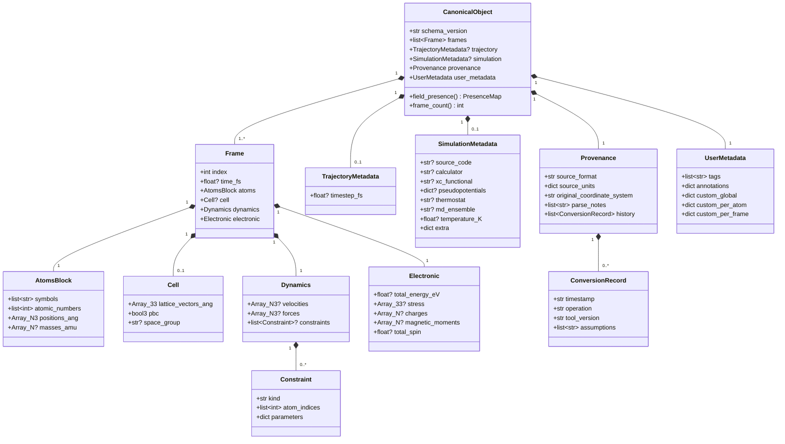

*Diagram caption:* labels in this diagram carry unit suffixes for readability (`time_fs`, `positions_ang`, `total_energy_eV`, …). These are **display labels only** — the binding field names are the unsuffixed identifiers defined in §3 (`time`, `positions`, `total_energy`, …), with units fixed globally by §3.1. `Array_N3`/`Array_33`/`Array_N`/`bool3` likewise abbreviate the shape notation of §1.

---

### 8. Worked Examples

#### 8.1 A 2-frame, 3-atom XYZ trajectory

Source file `water_traj.xyz` (plain XYZ: species + Cartesian positions + comment lines; **no** cell, velocities, forces, or energies):

```text
3
frame 0
O   0.000  0.000  0.000
H   0.757  0.586  0.000
H  -0.757  0.586  0.000
3
frame 1
O   0.000  0.000  0.010
H   0.757  0.586  0.010
H  -0.757  0.586  0.010
```

Resulting Canonical Object (serialized JSON, abridged only by eliding the second frame's repeated shape):

```json
{
  "schema_version": "0.1.0",
  "frames": [
    {
      "index": 0,
      "time": null,
      "atoms": {
        "symbols": ["O", "H", "H"],
        "atomic_numbers": [8, 1, 1],
        "positions": [[0.0, 0.0, 0.0], [0.757, 0.586, 0.0], [-0.757, 0.586, 0.0]],
        "masses": null
      },
      "cell": null,
      "dynamics": { "velocities": null, "forces": null, "constraints": null },
      "electronic": {
        "total_energy": null, "stress": null,
        "charges": null, "magnetic_moments": null, "total_spin": null
      }
    },
    { "index": 1, "...": "as frame 0 with positions z += 0.010" }
  ],
  "trajectory": { "timestep": null, "frame_count": 2 },
  "simulation": null,
  "provenance": {
    "source_filename": "water_traj.xyz",
    "source_format": "xyz",
    "source_units": { "positions": "angstrom" },
    "original_coordinate_system": "cartesian",
    "parse_notes": ["comment lines preserved in user_metadata.custom_per_frame['xyz:comment']"],
    "history": [
      { "timestamp": "2026-07-04T10:00:00Z", "operation": "parse",
        "source_format": "xyz", "target_format": null,
        "tool_version": "0.1.0", "parser_version": "xyz-parser 0.1.0", "assumptions": [] }
    ]
  },
  "user_metadata": {
    "tags": [], "annotations": {}, "custom_global": {},
    "custom_per_atom": {},
    "custom_per_frame": { "xyz:comment": ["frame 0", "frame 1"] }
  }
}
```

Points to notice, keyed to the rules above: `cell: null` (not an identity matrix — §2 rule 2); every dynamics/electronic field explicitly `null` (containers present, contents absent — §3.5); `trajectory.timestep: null` because XYZ declares frames but no time base; the comment lines — information! — survive verbatim in `user_metadata` under the parser's namespace (§6 rule 2). The Information Discovery Engine reads this object and reports exactly the master prompt's example: ✓ Species, ✓ Cartesian positions, ✓ 2 frames, ✓ Comments, ✗ Lattice vectors, ✗ Velocities, ✗ Forces, ✗ Energies.

#### 8.2 A POSCAR structure (fractional source)

Source file `POSCAR` (VASP 5 format, Direct coordinates, cubic NaCl-like 2-atom cell):

```text
NaCl primitive test
1.0
  5.640  0.000  0.000
  0.000  5.640  0.000
  0.000  0.000  5.640
Na Cl
1 1
Direct
  0.00 0.00 0.00
  0.50 0.50 0.50
```

Resulting Canonical Object (abridged to the fields that differ from §8.1's pattern):

```json
{
  "schema_version": "0.1.0",
  "frames": [
    {
      "index": 0,
      "time": null,
      "atoms": {
        "symbols": ["Na", "Cl"],
        "atomic_numbers": [11, 17],
        "positions": [[0.0, 0.0, 0.0], [2.82, 2.82, 2.82]],
        "masses": null
      },
      "cell": {
        "lattice_vectors": [[5.64, 0.0, 0.0], [0.0, 5.64, 0.0], [0.0, 0.0, 5.64]],
        "pbc": [true, true, true],
        "space_group": null
      },
      "dynamics": { "velocities": null, "forces": null, "constraints": null },
      "electronic": { "total_energy": null, "stress": null, "charges": null,
                      "magnetic_moments": null, "total_spin": null }
    }
  ],
  "trajectory": null,
  "simulation": { "source_code": null, "calculator": null, "xc_functional": null,
                  "pseudopotentials": null, "thermostat": null, "md_ensemble": null,
                  "temperature": null,
                  "extra": { "poscar:scaling_factor": "1.0" } },
  "provenance": {
    "source_filename": "POSCAR",
    "source_format": "poscar",
    "source_units": { "positions": "fractional", "lattice_vectors": "angstrom" },
    "original_coordinate_system": "fractional",
    "parse_notes": [
      "Direct coordinates converted to Cartesian using lattice matrix (§4).",
      "pbc set to (true,true,true) per POSCAR format definition (format-defined, not assumed)."
    ],
    "history": [
      { "timestamp": "2026-07-04T10:05:00Z", "operation": "parse",
        "source_format": "poscar", "target_format": null,
        "tool_version": "0.1.0", "parser_version": "poscar-parser 0.1.0", "assumptions": [] }
    ]
  },
  "user_metadata": { "tags": [], "annotations": {},
                     "custom_global": { "poscar:comment": "NaCl primitive test" },
                     "custom_per_atom": {}, "custom_per_frame": {} }
}
```

Points to notice: fractional `(0.5, 0.5, 0.5)` became Cartesian `(2.82, 2.82, 2.82)` at the parser boundary, with the original convention recorded in `provenance.original_coordinate_system` (§4); `pbc` is populated by *format definition* with a `parse_notes` entry, not by guess (§3.4); `trajectory: null` because a POSCAR is a single structure with no time axis (§3.2); per the carry-through routing rule (§6.1) the POSCAR **title line** (free text) is carried in `user_metadata.custom_global["poscar:comment"]` while the **scaling factor** (a structural parameter) is recorded in `simulation.extra["poscar:scaling_factor"]` — neither dropped; `space_group: null` because POSCAR declares no symmetry — even though one *could* be computed, ChemBridge carries declared information only (§3.4).

---

### 9. Consequences for Downstream Documents

- **`03_Parsers.md`** must map every Phase 1 format field-for-field onto §3's models, and its Capability Matrix rows must use these field names as column identities.
- **`04_Conversion_Engine.md`**'s Conversion Report enumerates preservation/loss *per canonical field* named here; the Recovery Engine writes into these fields and appends `ConversionRecord` entries with `operation="recovery"`.
- **`05_Validation.md`** diffs Canonical Objects field-by-field under the tolerance policy that §4's coordinate-conversion analysis motivates.
- **`06_API.md`** embeds these pydantic models directly in response schemas — no parallel DTOs.

Any downstream need to change a name or type defined here must come back to this document first (project consistency rule): the schema is edited in one place or not at all.


---


## Part 3: Parsers, Information Discovery, and the Capability Matrix

*Source: `docs/03_Parsers.md`*

> **Document status:** Binding. This document defines (a) the Parser interface that every format implementation — Phase 1 or plugin — must satisfy, (b) what each Phase 1 format can natively express, mapped field-for-field onto the Canonical Model, (c) the Information Discovery Engine, (d) the Capability Matrix data structure that drives the Conversion Engine, (e) the parser error contract, and (f) how third parties add new formats via the Plugin SDK without touching core code.
>
> Prerequisites: component boundaries and the "Must NOT" rules are defined in `01_Architecture.md §2`; all schema field names used below (`symbols`, `positions`, `lattice_vectors`, `pbc`, `velocities`, `forces`, `total_energy`, `stress`, `charges`, `magnetic_moments`, `constraints`, `timestep`, etc.) are defined normatively in `02_Canonical_Data_Model.md` and are used here verbatim. Design principles **P1–P6** are defined in `00_Project_Overview.md §2`.

---

### 1. Position in the Architecture

A **Parser** reads exactly one native format and produces a `CanonicalObject`. It never reads another format, never calls another parser, never writes files, and never fills absent fields (**P2**, **P3**; `01_Architecture.md §2`). Everything in this document — the interface, the capability declarations, the error contract — exists to make that boundary mechanically checkable.

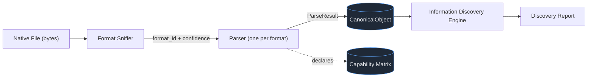

---

### 2. The Parser Interface (SDK Contract)

Every parser — the seven Phase 1 formats (XYZ, extXYZ, CIF, POSCAR, CONTCAR, XDATCAR, ASE trajectory) and every future format (LAMMPS, Quantum ESPRESSO, CP2K, Gaussian, ORCA, GROMACS, Open Babel adapters, pymatgen-object adapters) — implements the abstract base class published by `packages/plugin-sdk`. First-party and third-party parsers use the **same** interface; core formats hold no privileged API (this is what makes the SDK trustworthy).

```python
class ParserPlugin(ABC):
    """Base class for all format parsers. Published by packages/plugin-sdk."""

    # ---- Identity & registration -------------------------------------------
    format_id: str            # Stable machine identifier, e.g. "xyz", "poscar". Lowercase, unique.
    format_name: str          # Human-readable, e.g. "Plain XYZ".
    version: str              # Parser version, recorded in Provenance.history[].parser_version.
    file_extensions: tuple[str, ...]   # Hints only, e.g. (".xyz",). Never authoritative (POSCAR has none).

    # ---- Sniffing -----------------------------------------------------------
    @abstractmethod
    def sniff(self, head: bytes, filename: str | None) -> float:
        """Return a confidence in [0.0, 1.0] that `head` (first ≤ 64 KiB of the
        file) is this parser's format. Must be cheap, side-effect free, and must
        never raise. 0.0 = definitely not; 1.0 = unambiguous signature."""

    # ---- Parsing ------------------------------------------------------------
    @abstractmethod
    def parse(self, stream: BinaryIO, *, filename: str | None) -> ParseResult:
        """Read the full file and return a ParseResult (§5) whose
        `canonical` is a CanonicalObject conforming to 02_Canonical_Data_Model.md.
        MUST honor the absence convention (02 §2): no defaulting, ever.
        MUST convert to canonical units (02 §3.1) and record source units
        and original_coordinate_system in Provenance.
        MUST populate Provenance.history with one ConversionRecord
        (operation="parse")."""

    # ---- Capability declaration ---------------------------------------------
    @abstractmethod
    def capabilities(self) -> FormatCapabilities:
        """Return this format's read-side capability declaration (§4).
        This is the parser's contribution to the Capability Matrix; the
        matrix is assembled from these declarations at registry load, never
        hand-maintained centrally."""
```

The exporter side mirrors this shape (`ExporterPlugin` with `format_id`, `export(canonical, stream)`, `capabilities()` for the write side); its behavioral rules are specified with the Conversion Engine in `04_Conversion_Engine.md`, since export decisions are inseparable from conversion reporting.

**Field-for-field obligation.** For every canonical field defined in `02 §3`, a parser must do exactly one of three things, and its `capabilities()` declaration must say which:

1. **Populate it** from source content, in canonical units;
2. **Leave it `None`** because the format cannot express it (declared capability `NONE`);
3. **Leave it `None` for this file** because the format *can* express it but this file omitted it (declared capability `FULL`/`PARTIAL`; presence decided per file).

There is no fourth option. "The format has it but parsing it is inconvenient" is not permissible — a capability declared `FULL` obliges the parser to extract the field whenever present (**P1**).

**Wrapping ASE/pymatgen (implementation note, normative).** Phase 1 parsers may delegate low-level reading to ASE or pymatgen (`01_Architecture.md §4.2`), but the wrapper must **launder library defaults back into absences**. Example: an ASE `Atoms` object *always* carries a cell (possibly all zeros) and `pbc=(False, False, False)` even when the source file said nothing — a zero cell read from a plain XYZ must become `cell = None` in the Canonical Object, not a degenerate `Cell`. Failing to strip such defaults is exactly the silent fabrication the absence convention forbids, and it is the single most likely bug class in this package; `08_Testing.md` targets it directly with golden tests.

---

### 3. Phase 1 Formats: Native Expressiveness (Field-for-Field)

The table below documents what each Phase 1 format can natively express, using canonical field paths as column identities. This table is *descriptive documentation*; the machine-readable equivalent is each parser's `capabilities()` declaration (§4), and the two are kept in sync by a test that renders this table from the declarations (`08_Testing.md`).

Legend: **●** full support · **◐** partial/conditional (see footnote) · **○** cannot express.

| Canonical field | XYZ | extXYZ | CIF | POSCAR | CONTCAR | XDATCAR | ASE traj |
|---|---|---|---|---|---|---|---|
| `atoms.symbols` | ● | ● | ● | ◐¹ | ◐¹ | ◐¹ | ● |
| `atoms.positions` | ● (Cartesian) | ● (Cartesian) | ●¹³ (fractional) | ● (both) | ● (both) | ● (fractional) | ● (Cartesian) |
| `atoms.masses` | ○ | ◐² | ○ | ○ | ○ | ○ | ● |
| `cell.lattice_vectors` | ○ | ◐² | ● | ● | ● | ● | ● |
| `cell.pbc` | ○ | ◐² | ◐³ | ◐³ | ◐³ | ◐³ | ● |
| `cell.space_group` | ○ | ○ | ● | ○ | ○ | ○ | ○ |
| Multi-frame (`frames` > 1) | ● | ● | ○⁴ | ○ | ○ | ● | ● |
| `frame.time` / `trajectory.timestep` | ○ | ◐² | ○ | ○ | ○ | ○⁵ | ● |
| `dynamics.velocities` | ○ | ◐² | ○ | ● | ● | ○ | ● |
| `dynamics.forces` | ○ | ◐² | ○ | ○ | ○ | ○ | ● |
| `dynamics.constraints` | ○ | ◐⁶ | ○ | ●⁷ | ●⁷ | ○ | ● |
| `electronic.total_energy` | ○ | ◐² | ○ | ○ | ○ | ○ | ● |
| `electronic.stress` | ○ | ◐² | ○ | ○ | ○ | ○ | ● |
| `electronic.charges` | ○ | ◐² | ◐⁸ | ○ | ○ | ○ | ● |
| `electronic.magnetic_moments` | ○ | ◐² | ○ | ○ | ○ | ○ | ● |
| `electronic.total_spin` | ○ | ◐² | ○ | ○ | ○ | ○ | ● |
| Simulation metadata (`simulation.*`) | ○ | ◐² | ◐⁹ | ○ | ○ | ○ | ◐¹⁰ |
| Custom arrays (`user_metadata.custom_per_atom`) | ○ | ● | ◐¹¹ | ○ | ○ | ○ | ● |
| Comments / free text (carry-through) | ● (comment line) | ● (comment line) | ● | ● (title line) | ● (title line) | ● (title line) | ○ |

Footnotes (each ◐ is a conditional the parser must handle explicitly, never silently):

1. **VASP symbol availability.** POSCAR/CONTCAR carry element symbols only in VASP ≥ 5 format; VASP 4 files list counts without symbols. Since `atoms.symbols` is **required** (`02 §3.3`), a VASP 4 file without species information is a *recoverable parse error* (§5): the parser raises with a structured recovery hint ("supply species") rather than inventing placeholder elements. XDATCAR carries symbols in its header.
2. **extXYZ key-value/column dependence.** extXYZ expresses velocities, forces, energy, stress, masses, charges, time, and arbitrary metadata only when the file's `Properties=` column spec or comment-line key-value pairs declare them. Capability is `PARTIAL`: the format *can* hold these; any given file may not.
3. **PBC by format definition.** CIF and the VASP family do not carry explicit PBC flags; full 3-D periodicity is part of the format's definition. Parsers set `pbc = (true, true, true)` and record this as a `parse_notes` entry (format-defined fact, not a guess — `02 §3.4`).
4. **CIF multi-block.** A CIF file may contain multiple `data_` blocks, but these are independent structures, not an ordered trajectory. MVP policy: parse the first block, emit a `warning`-severity ParseIssue naming the ignored blocks. **Alternative rejected:** mapping blocks to `frames` — CIF blocks carry no time axis or ordering semantics, and presenting unrelated polymorphs as a "trajectory" would be fabricated information.
5. **XDATCAR time.** XDATCAR labels frames (`Direct configuration N`) but declares no timestep; `trajectory.timestep = None`, frame ordering preserved via `frame.index`.
6. **extXYZ move masks.** Some extXYZ files carry a `move_mask`-style column; parsed as a `Constraint(kind="fixed_atoms_mask")` when present, otherwise the column carries through as a custom array.
7. **Selective dynamics.** POSCAR/CONTCAR selective-dynamics flags map to `Constraint(kind="selective_dynamics", atom_indices=[...], parameters={"mask": [[T,T,F], ...]})`. A selective-dynamics block that is present with all-`T` flags yields `constraints = []` (explicitly unconstrained), which is distinct from `constraints = None` (`02 §3.6`).
8. **CIF charges.** CIF may declare formal oxidation states (`_atom_type_oxidation_number`); parsed into `electronic.charges` with the scheme label `"formal_oxidation_state"` recorded in `simulation.extra` (`02 §3.7` scope note).
9. **CIF metadata.** Rich bibliographic/experimental metadata (authors, journal, temperature of measurement) carries through verbatim into `simulation.extra` under `cif:`-prefixed keys.
10. **ASE calculator metadata.** `.traj` files may embed calculator name and parameters; mapped to `simulation.calculator` / `simulation.extra` when present.
11. **CIF occupancies — known schema gap (flagged, not glossed).** CIF expresses partial site occupancy (`_atom_site_occupancy`); the v1.0 Canonical Model has **no first-class occupancy field**. Policy: the parser stores occupancies verbatim in `user_metadata.custom_per_atom["cif:occupancy"]` and emits a `warning` ParseIssue stating that occupancy is carried as a custom array, not modeled. This is an explicit promotion candidate under the schema-evolution path of `02 §6` (rule 4) — recorded here so the limitation is documented rather than silent. Structures with occupancy ≠ 1.0 will additionally surface a Conversion Report warning for any target format (all Phase 1 targets lack occupancy).
12. **CONTCAR extras.** CONTCAR's predictor-corrector block (MD restart coefficients) has no canonical mapping; carried under `user_metadata.custom_global["contcar:predictor_corrector"]` with a warning ParseIssue, per the same carry-through rule.
13. **CIF symmetry expansion (asymmetric unit) — normative.** A CIF commonly stores only the *asymmetric unit* plus symmetry operations (`_space_group_symop_operation_xyz` / legacy `_symmetry_equiv_pos_as_xyz`). Applying those **declared** operations to produce the full cell contents is *reading the file as the CIF standard defines it* — a **format-defined fact**, in the same category as note 3's PBC rule, **not** computed symmetry (the Non-Goal forbids *deriving* symmetry from coordinates, not honoring operations the file explicitly declares). Policy: `atoms.*` holds the **expanded** atom set; the expansion is recorded in `provenance.parse_notes` (operation count, site multiplicities); duplicate positions arising from special-position expansion are merged per the CIF's own site rules within a documented distance threshold, each merge noted; the declared operation strings are carried verbatim under `simulation.extra["cif:symmetry_operations"]`; and `cell.space_group` carries the declared symbol (`02 §3.4`). A CIF whose operations are declared but unparseable is a `ParseError` (§5 rule 4), never a silent fall-back to the asymmetric unit. **Alternative rejected: carrying the asymmetric unit only.** It yields a Canonical Object with a fraction of the physical atoms — silently wrong stoichiometry in every downstream conversion, the exact failure class this project exists to prevent.

---

### 4. The Capability Matrix

#### 4.1 Data structure

The Capability Matrix (`packages/capability-matrix`) is assembled at registry load from each plugin's `capabilities()` declaration — read side from parsers, write side from exporters. It is data, not code: the Conversion Engine queries it; it never executes format logic (`01_Architecture.md §2`). The `CapabilityLevel`/`FieldCapability`/`FormatCapabilities` models below are defined in `packages/plugin-sdk` (`01_Architecture.md §5.1`), since a plugin must be able to declare its capabilities without depending on the matrix package that assembles them; `capability-matrix` owns the registry and query API, not the data model.

```python
class CapabilityLevel(str, Enum):
    FULL = "full"        # Format can always express this field.
    PARTIAL = "partial"  # Format can express it under conditions (see notes).
    NONE = "none"        # Format cannot express it.

class FieldCapability(BaseModel):
    level: CapabilityLevel
    notes: str | None = None          # Human-readable condition, surfaced verbatim in
                                      #   Conversion Report "Reason" text.

class FormatCapabilities(BaseModel):
    format_id: str                    # Matches ParserPlugin/ExporterPlugin.format_id.
    format_name: str
    direction: Literal["read", "write"]
    fields: dict[str, FieldCapability]        # Keyed by canonical field path, e.g.
                                              #   "dynamics.velocities", "cell.lattice_vectors",
                                              #   "user_metadata.custom_per_atom".
    max_frames: int | None = None             # None = unlimited; 1 = single-structure format.
    required_fields: list[str] = []           # Canonical paths that MUST be present to write
                                              #   this format (write side only). Drives Recovery.
    native_coordinate_system: Literal["cartesian", "fractional", "both"]
    lossy_notes: list[str] = []               # Format-level caveats (e.g. fixed decimal precision),
                                              #   feeding Conversion Report Warnings.
```

Every key in `fields` must be a valid canonical path from `02 §3`, **or** a wildcard of the form `"<category>.*"` (e.g. `"simulation.*"`, `"user_metadata.custom_per_atom"` used as a whole-container key), which the registry expands at load time to every leaf path under that prefix and applies the same declared `FieldCapability` to each. The registry rejects declarations with unknown paths or unknown category prefixes at load time, which keeps the matrix and the schema from drifting apart.

#### 4.2 Example rows

Write-side declaration for POSCAR (the shape the Conversion Engine consumes in `04_Conversion_Engine.md`'s worked example):

```json
{
  "format_id": "poscar",
  "format_name": "VASP POSCAR",
  "direction": "write",
  "fields": {
    "atoms.symbols":              { "level": "full" },
    "atoms.positions":            { "level": "full" },
    "cell.lattice_vectors":       { "level": "full" },
    "cell.pbc":                   { "level": "partial", "notes": "Only fully periodic (T,T,T); other PBC combinations cannot be represented." },
    "cell.space_group":           { "level": "none" },
    "dynamics.velocities":        { "level": "full" },
    "dynamics.forces":            { "level": "none" },
    "dynamics.constraints":       { "level": "partial", "notes": "Only per-axis fixed-atom masks (selective dynamics)." },
    "electronic.total_energy":    { "level": "none" },
    "electronic.stress":          { "level": "none" },
    "electronic.charges":         { "level": "none" },
    "electronic.magnetic_moments":{ "level": "none" },
    "simulation.*":               { "level": "none" },
    "user_metadata.custom_per_atom": { "level": "none" },
    "user_metadata.custom_per_frame": { "level": "none" }
  },
  "max_frames": 1,
  "required_fields": ["atoms.symbols", "atoms.positions", "cell.lattice_vectors"],
  "native_coordinate_system": "both",
  "lossy_notes": ["Positions written with 16 significant digits; sub-ulp differences possible on round-trip."]
}
```

Read-side declaration for extXYZ (abridged to fields that differ from `NONE`):

```json
{
  "format_id": "extxyz",
  "format_name": "Extended XYZ",
  "direction": "read",
  "fields": {
    "atoms.symbols":           { "level": "full" },
    "atoms.positions":         { "level": "full" },
    "atoms.masses":            { "level": "partial", "notes": "Only when declared in Properties= columns." },
    "cell.lattice_vectors":    { "level": "partial", "notes": "Only when Lattice= key present." },
    "cell.pbc":                { "level": "partial", "notes": "Only when pbc= key present." },
    "dynamics.velocities":     { "level": "partial", "notes": "Only when declared in Properties= columns." },
    "dynamics.forces":         { "level": "partial", "notes": "Only when declared in Properties= columns." },
    "electronic.total_energy": { "level": "partial", "notes": "Only when energy= key present." },
    "electronic.stress":       { "level": "partial", "notes": "Only when stress= or virial= key present." },
    "user_metadata.custom_per_atom":  { "level": "full", "notes": "Arbitrary Properties= columns." },
    "user_metadata.custom_per_frame": { "level": "full", "notes": "Arbitrary comment-line key-value pairs." }
  },
  "max_frames": null,
  "required_fields": [],
  "native_coordinate_system": "cartesian",
  "lossy_notes": []
}
```

#### 4.3 How the Conversion Engine consumes the matrix

Before any bytes are written, the Conversion Engine (specified fully in `04_Conversion_Engine.md`) performs a **pre-flight diff** — the mechanical realization of **P5**:

1. Compute the source object's field presence via `field_presence()` (`02 §3.11`, §5 below).
2. For every **present** field, look up the target's write capability:
   - `FULL` → predicted **Preserved**;
   - `PARTIAL` → predicted **Preserved** or **Removed** depending on the declared condition, with the `notes` text surfaced as the **Reason**;
   - `NONE` → predicted **Removed**, `notes`/default reason surfaced.
3. For every path in the target's `required_fields` that is **absent** on the source → invoke the **Recovery Engine** before export (**P4**); a resolved recovery populates the report's **Supplied** list (`04 §2`), never **Preserved**.
4. If `frame_count > max_frames` → frame-selection recovery workflow (multi-frame → single-frame targets).
5. `lossy_notes` → predicted **Warnings**.

The output of this pre-flight is the *draft Conversion Report*, shown to the user **before** conversion runs; the post-export report and the Validation Engine then confirm the prediction. Loss is therefore predicted from data, executed transparently, and verified — never discovered by the user after the fact.

**Alternative rejected: hard-coded per-pair conversion rules** (e.g., a function per (source, target) pair encoding what transfers). With *n* formats that is O(n²) hand-maintained rules — unmaintainable, unauditable, and exactly the design that produces silent loss when a pair is forgotten. The matrix reduces the problem to O(n) per-format declarations plus one generic diff algorithm.

---

### 5. Parse Results and the Error Contract

All parsers share one result/error shape so that the API, UI, and Discovery Engine handle malformed files uniformly (master-prompt risk: "malformed input files").

```python
class ParseIssue(BaseModel):
    severity: Literal["warning", "error"]
    code: str                    # Stable machine code, e.g. "XYZ_INCONSISTENT_ATOM_COUNT".
    message: str                 # Human-readable, specific: what, where, why it matters.
    location: str | None = None  # e.g. "line 4192", "frame 17", "data block 2".
    recovery_hint: str | None = None   # Machine-consumable hint the Recovery Engine can act on,
                                       #   e.g. "supply_species" for VASP-4 POSCAR (§3 note 1).

class ParseResult(BaseModel):
    canonical: CanonicalObject   # Present iff parse succeeded (possibly with warnings).
    issues: list[ParseIssue]     # All warnings encountered; empty for a clean parse.

class ParseError(Exception):
    """Raised when no valid CanonicalObject can be produced.
    Carries issues: list[ParseIssue] with ≥ 1 error-severity entry."""
```

**Normative rules:**

1. **Warnings accompany success; errors preclude it.** A `ParseResult` may carry warnings (recoverable oddities the parser resolved *by documented format rules*, each one noted); a `ParseError` means no trustworthy Canonical Object exists. There is no "best-effort object plus errors" middle state — a half-parsed structure presented as data is silent loss wearing a lab coat.
2. **Never skip silently.** A parser that ignores a line, block, or frame must emit a ParseIssue naming it (e.g., CIF extra data blocks, §3 note 4). "Unrecognized but carried through" (→ `user_metadata`/`extra`) and "unrecognized and dropped" (→ warning) are both permitted; *unrecognized and unmentioned* is not.
3. **Ambiguity resolves by format rule or not at all.** If the format's specification defines the resolution (POSCAR ⇒ periodic), apply it and record a `parse_notes` entry. If it does not, that is an `error` with a `recovery_hint`, not a coin flip.
4. **Worked example — inconsistent XYZ atom counts.** An XYZ trajectory whose frame 17 header declares 64 atoms but provides 63 coordinate lines: the parser raises `ParseError` with `code="XYZ_INCONSISTENT_ATOM_COUNT"`, `location="frame 17"`, message stating declared vs found counts, and `recovery_hint="truncate_at_last_valid_frame"`. The Recovery Engine may then *offer* "keep frames 0–16, discard the corrupt tail" as an explicit, Assumption-recorded choice (`04_Conversion_Engine.md`) — the parser itself never makes that call.
5. **Issues are surfaced end-to-end.** ParseIssues appear in the Discovery Report (§6), are echoed into the Conversion Report's Warnings when a conversion proceeds from a warned parse, and are returned in API error envelopes (`06_API.md`) on `ParseError`.

---

### 6. The Information Discovery Engine

#### 6.1 Algorithm (generic by construction)

The Discovery Engine contains **no per-format logic**. It composes three generic steps; formats plug in via the same `sniff`/`parse`/`capabilities` interface as everything else, so a newly installed plugin is discoverable with zero Discovery-Engine changes.

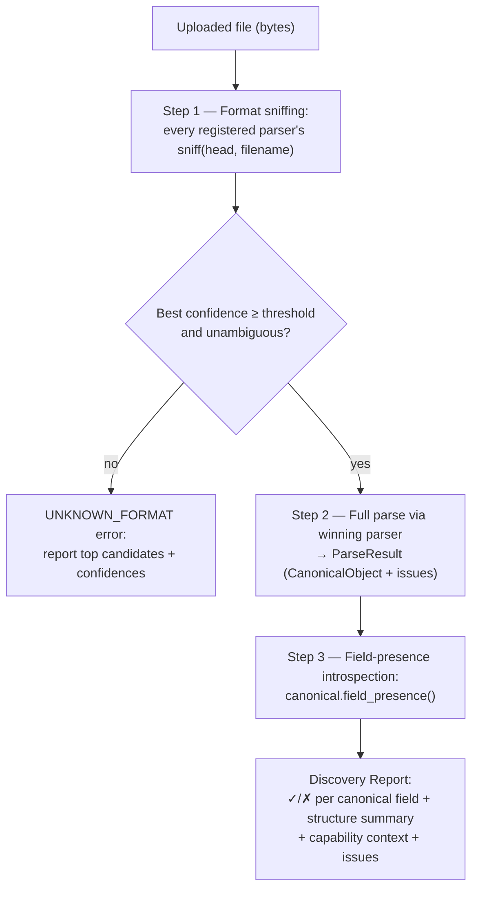

**Step 1 — sniffing.** All registered parsers score the file head; extension is a tie-breaker hint, never authoritative (POSCAR/CONTCAR/XDATCAR have conventional *names*, not extensions — `sniff` receives the filename for this reason). The decision rule is quantified so implementations cannot drift: with `best` the top confidence and `margin = best − runner_up`, the sniffer **accepts** when `best ≥ sniff_accept_threshold` (default **0.5**); below that, the file is `UNKNOWN_FORMAT` (`06 §6`) with all candidates listed — a low-confidence guess silently applied would be a misparse waiting to happen. When accepted but `margin < sniff_ambiguity_margin` (default **0.2**), the result is **ambiguous**: the tie-break rules apply — in favor of the *more expressive* candidate if its signature keys are present, otherwise the simpler one (e.g., plain XYZ vs extXYZ, where extXYZ is a superset) — and the runner-up candidates are always recorded in the report's `sniff_evidence` so the user can override the detection via the API (`06_API.md`). Both constants are instance-configurable (`09 §2`) but ship with these defaults; the golden corpus (`08 §3`) pins expected sniff outcomes per fixture so a threshold change that flips a detection fails CI visibly rather than shifting behavior quietly. Confidence values themselves are **ordinal signals for ranking candidates, not calibrated probabilities** — a parser's `sniff()` score need only be internally consistent (more format-specific evidence ⇒ higher score) for the accept/ambiguity thresholds to behave correctly; the golden corpus, not a probabilistic calibration exercise, is what keeps four parsers' scores mutually sensible.

**The POSCAR ⇄ CONTCAR case — where "more expressive" does not apply.** POSCAR and CONTCAR are structurally **byte-identical formats** (CONTCAR is simply the name VASP writes a POSCAR-shaped file to at the end of a run; it may additionally carry a velocity/predictor-corrector tail, but a CONTCAR without one is indistinguishable from a POSCAR, and a POSCAR *may* carry velocities too). The expressiveness tie-break therefore has no signal to act on. The resolution is explicit and filename-driven, in this order: (1) if the filename is exactly `POSCAR` or `CONTCAR` (VASP's fixed conventional names, case-sensitive), that name selects the parser; (2) if a velocity/predictor-corrector tail is present, prefer `contcar` (only CONTCAR conventionally carries it) but record the ambiguity; (3) otherwise the two candidates are reported at **equal confidence** in `sniff_evidence` and the file is parsed as `poscar` (the more general reading — a CONTCAR read as POSCAR loses nothing, since the canonical fields are identical and any tail is carried through per §3 note 12), with the report stating the tie so the user can `format_override` if the CONTCAR identity matters to them. Crucially, because both parsers populate the *same* canonical fields, this choice never changes the scientific content — it changes only the recorded `source_format` label, and that label's uncertainty is surfaced rather than hidden (**P3**). This is the one Phase 1 case where two `format_id`s legitimately tie; the generic tie-break rule above is documented as not covering it precisely so an implementer does not force a false winner.

**Step 2 — parse.** The winning parser produces the Canonical Object under the full absence convention. Discovery is therefore *exactly as trustworthy as parsing* — there is no separate lightweight "peek" code path that could disagree with the real parse. **Alternative rejected: a header-only inspection mode** that reports contents without full parsing. Cheaper for huge files, but it creates two sources of truth about what a file contains, and a divergence between "what inspect said" and "what convert found" is a direct P1 violation. Cost is instead managed by running inspection as an async job for large files (`06_API.md §3`) and caching the parsed Canonical Object for the subsequent conversion (parse once, use twice).

**Step 3 — introspection.** `CanonicalObject.field_presence()` (`02 §3.11`) walks the schema and classifies every optional field as **present**, **absent**, or **mixed** (present in some frames of a trajectory but not others, `02 §3.11`) per the `None` convention — presence is *derived from the data itself*, never bookkept separately (`02 §2` rule 5). The report enriches each entry with capability context: a field can be *absent-and-inexpressible* ("plain XYZ cannot hold lattice vectors") or *absent-but-expressible* ("extXYZ can hold forces; this file has none") — a distinction users need when deciding whether the *file* or the *format* is the limitation.

#### 6.2 Discovery Report schema

```python
class FieldPresenceEntry(BaseModel):
    path: str                          # Canonical field path, e.g. "dynamics.velocities".
    status: Literal["present", "absent", "mixed"]   # "mixed" mirrors PresenceMap (02 §3.11): present
                                       #   in some frames of a trajectory, absent in others.
    present_frames: list[int] | None = None   # Populated only when status="mixed" — the frame
                                              #   indices where the field is present (02 §3.11).
    format_capability: CapabilityLevel # Read-side capability of the detected format for this path.
    detail: str | None = None          # e.g. "500 frames × 64 atoms × 3", "2 comment lines".

class DiscoveryReport(BaseModel):
    file: dict                         # filename, size_bytes, sha256.
    format: dict                       # {format_id, format_name, confidence, sniff_evidence: [...]}.
    structure: dict                    # {frame_count, atom_count (per frame or constant), species: [...]}.
    fields: list[FieldPresenceEntry]   # One entry per canonical field path.
    extras: list[str]                  # Carried-through keys in user_metadata / simulation.extra.
    issues: list[ParseIssue]           # Warnings from the parse (§5).
    schema_version: str                # Of the Canonical Object produced.
```

#### 6.3 Worked example, end-to-end

Input: `water_traj.xyz` from `02 §8.1` (2 frames, 3 atoms, plain XYZ).

1. **Sniff.** `xyz` parser scores 0.9 (integer-count/comment/coordinate-line pattern); `extxyz` scores 0.2 (no `Lattice=`/`Properties=` keys in comment lines); others ≈ 0. Winner: `xyz`, evidence recorded.
2. **Parse.** Produces the exact Canonical Object shown in `02 §8.1`; no issues.
3. **Introspect + report:**

```json
{
  "file": { "filename": "water_traj.xyz", "size_bytes": 236, "sha256": "…" },
  "format": { "format_id": "xyz", "format_name": "Plain XYZ", "confidence": 0.9,
              "sniff_evidence": [ { "format_id": "extxyz", "confidence": 0.2 } ] },
  "structure": { "frame_count": 2, "atom_count": 3, "species": ["O", "H"] },
  "fields": [
    { "path": "atoms.symbols",            "status": "present", "format_capability": "full",    "detail": "O, H, H" },
    { "path": "atoms.positions",          "status": "present", "format_capability": "full",    "detail": "2 frames × 3 atoms, Cartesian (Å)" },
    { "path": "atoms.masses",             "status": "absent",  "format_capability": "none" },
    { "path": "frame.time",               "status": "absent",  "format_capability": "none" },
    { "path": "cell.lattice_vectors",     "status": "absent",  "format_capability": "none" },
    { "path": "cell.pbc",                 "status": "absent",  "format_capability": "none" },
    { "path": "cell.space_group",         "status": "absent",  "format_capability": "none" },
    { "path": "trajectory.timestep",      "status": "absent",  "format_capability": "none" },
    { "path": "dynamics.velocities",      "status": "absent",  "format_capability": "none" },
    { "path": "dynamics.forces",          "status": "absent",  "format_capability": "none" },
    { "path": "dynamics.constraints",     "status": "absent",  "format_capability": "none" },
    { "path": "electronic.total_energy",  "status": "absent",  "format_capability": "none" },
    { "path": "electronic.stress",        "status": "absent",  "format_capability": "none" },
    { "path": "electronic.charges",       "status": "absent",  "format_capability": "none" },
    { "path": "electronic.magnetic_moments","status": "absent","format_capability": "none" },
    { "path": "electronic.total_spin",    "status": "absent",  "format_capability": "none" }
  ],
  "extras": [ "user_metadata.custom_per_frame['xyz:comment']" ],
  "issues": [],
  "schema_version": "0.1.0"
}
```

The `fields` list is **complete over the canonical scientific leaf paths** (`02 §3.3`–`§3.7`, plus `frame.time` and `trajectory.timestep`) — every one appears exactly once, present or absent, honoring the schema's "one entry per canonical field path" guarantee; a Discovery Report that silently omitted an absent path would let a reader mistake "not shown" for "not checked." Root-level metadata containers (`simulation.*`, `provenance.*`) and carried-through user data are summarized in `structure`/`extras` rather than enumerated field-by-field, since their presence is reported at the container level and their contents are format-specific rather than drawn from a fixed schema of leaf paths.

Rendered by the UI (`07_Web_UI.md`), this is precisely the ✓/✗ inventory the project mission calls for: ✓ Species, ✓ Cartesian positions, ✓ 2 frames, ✓ Comments; ✗ Lattice vectors, ✗ Velocities, ✗ Forces, ✗ Energies — with each ✗ additionally explained as a *format* limitation (`format_capability: "none"`), not a deficiency of this particular file.

---

### 7. Adding a New Format via the Plugin SDK

#### 7.1 Mechanism

Third-party parsers register through Python entry points — no core code is modified, forked, or even imported beyond `packages/plugin-sdk`. **This mechanism is required once third-party plugins exist; it is not required to ship first-party formats.** Until a version's scope calls for third-party plugins (per `10 §3` risk R12, realistically v0.3+), the registry may load first-party parsers/exporters from an explicit, in-code registration list — the `ParserPlugin`/`ExporterPlugin` interfaces and the capability declarations are identical either way, so switching a first-party format from explicit registration to entry-point discovery later is not a rewrite, only a registry-loading change:

```toml
# pyproject.toml of a third-party package, e.g. chembridge-lammps-dump
[project.entry-points."chembridge.parsers"]
lammps_dump = "chembridge_lammps_dump:LammpsDumpParser"
```

At startup, the plugin registry loads all `chembridge.parsers` (and `chembridge.exporters`) entry points, validates each `capabilities()` declaration against the canonical schema paths (§4.1), and adds the format to the Capability Matrix. From that moment the new format participates in sniffing, Discovery, conversion, validation, the `/v1/capabilities` API endpoint, and the UI's format pickers — none of which contain format-specific code (**P6**; `01_Architecture.md §6`).

**Alternative rejected: a plugins-as-config approach** (declaring formats in YAML with regex extraction rules). Attractive for trivial formats, but real chemistry formats have conditional structure (extXYZ `Properties=`, VASP version differences) that a declarative rule language would either fail to express or grow into an ad-hoc programming language. A Python ABC with a validated capability declaration is the honest shape of the problem.

#### 7.2 Minimal worked example

A skeletal LAMMPS dump parser (pseudocode; illustrative, not implementation):

```python
from chembridge.plugin_sdk import ParserPlugin, ParseResult, ParseIssue
from chembridge.canonical_schema import (
    CanonicalObject, Frame, AtomsBlock, Cell, Dynamics, Electronic, Provenance,
)
from chembridge.capability_matrix import FormatCapabilities, FieldCapability

class LammpsDumpParser(ParserPlugin):
    format_id = "lammps_dump"
    format_name = "LAMMPS dump (text)"
    version = "0.1.0"
    file_extensions = (".dump", ".lammpstrj")

    def sniff(self, head, filename):
        return 0.95 if head.startswith(b"ITEM: TIMESTEP") else 0.0

    def parse(self, stream, *, filename):
        frames, issues = [], []
        for i, raw in enumerate(read_dump_frames(stream)):        # format-local helper
            has_v = {"vx", "vy", "vz"} <= set(raw.columns)
            frames.append(Frame(
                index=i,
                time=raw.timestep_fs,                              # converted: dump units → fs
                atoms=AtomsBlock(symbols=raw.symbols,
                                 atomic_numbers=raw.numbers,
                                 positions=raw.positions_ang),     # converted → Å, Cartesian
                cell=Cell(lattice_vectors=raw.box_ang,
                          pbc=raw.pbc_flags),                      # from ITEM: BOX BOUNDS pp/ff
                dynamics=Dynamics(
                    velocities=raw.velocities_ang_fs if has_v else None,  # ABSENT, not zeros
                    forces=None, constraints=None),
                electronic=Electronic(),                           # all None: dump has no energies
            ))
        return ParseResult(
            canonical=CanonicalObject(
                schema_version="0.1.0", frames=frames,
                provenance=Provenance(
                    source_filename=filename, source_format=self.format_id,
                    source_units={"positions": "lammps metal (Å)"},
                    original_coordinate_system="cartesian",
                    history=[make_parse_record(self)]),
                user_metadata=empty_user_metadata()),
            issues=issues)

    def capabilities(self):
        return FormatCapabilities(
            format_id=self.format_id, format_name=self.format_name, direction="read",
            fields={
                "atoms.symbols":        FieldCapability(level="partial",
                                          notes="Requires element column or type→element map."),
                "atoms.positions":      FieldCapability(level="full"),
                "cell.lattice_vectors": FieldCapability(level="full"),
                "cell.pbc":             FieldCapability(level="full"),
                "dynamics.velocities":  FieldCapability(level="partial",
                                          notes="Only when vx/vy/vz columns present."),
            },
            max_frames=None, required_fields=[],
            native_coordinate_system="cartesian")
```

Note the SDK contract doing its work even in a skeleton: absent velocity columns yield `velocities=None` (never zeros), unit conversion happens at the boundary, `Provenance` is populated at construction, and the `symbols` capability honestly declares `PARTIAL` because LAMMPS dumps frequently carry numeric types rather than elements — which, per §3 note 1's precedent, becomes a recoverable parse error with `recovery_hint="supply_species"` when no mapping is available.

---

### 8. Consequences for Downstream Documents

- **`04_Conversion_Engine.md`** consumes `FormatCapabilities` exactly as defined in §4.1 (including `required_fields`, `max_frames`, `lossy_notes`) for its pre-flight diff, and consumes `recovery_hint` codes from §5 for parse-time recovery workflows.
- **`05_Validation.md`** relies on the guarantee that Discovery and conversion share one parse (§6.1, step 2) when diffing round-tripped objects.
- **`06_API.md`** returns the `DiscoveryReport` of §6.2 verbatim from `/v1/inspect`, exposes the assembled Capability Matrix at `/v1/capabilities`, and wraps `ParseError.issues` in its error envelope.
- **`08_Testing.md`** enforces §2's "launder library defaults" rule and §3's table-vs-declaration sync with dedicated golden tests.


---


## Part 4: Conversion Engine and Recovery Engine

*Source: `docs/04_Conversion_Engine.md`*

> **Document status:** Binding. This document specifies how ChemBridge converts between formats: the end-to-end algorithm, the exact schema of the **Conversion Report** (consumed verbatim by `06_API.md` and `07_Web_UI.md`), the **Recovery Engine**'s decision workflows for every major missing-information scenario, the refuse-vs-warn policy (strict and permissive modes), and the rationale for routing every conversion through the Canonical Model.
>
> Prerequisites: component boundaries in `01_Architecture.md §2`; canonical field names and the absence convention in `02_Canonical_Data_Model.md` (§2, §3); the `FormatCapabilities` structure, pre-flight diff, `ParseIssue`/`recovery_hint` contract, and Phase 1 capability data in `03_Parsers.md` (§4, §5). Design principles **P1–P6** are defined in `00_Project_Overview.md §2`. All names are used here verbatim.

---

### 1. The Conversion Algorithm, End to End

Module names below match the monorepo layout of `01_Architecture.md §5`: `packages/parsers`, `packages/capability-matrix`, `packages/conversion`, `packages/recovery`, `packages/exporters`. The Validation Engine (`packages/validation`) runs after export and is specified in `05_Validation.md`; it appears here only as the final step.

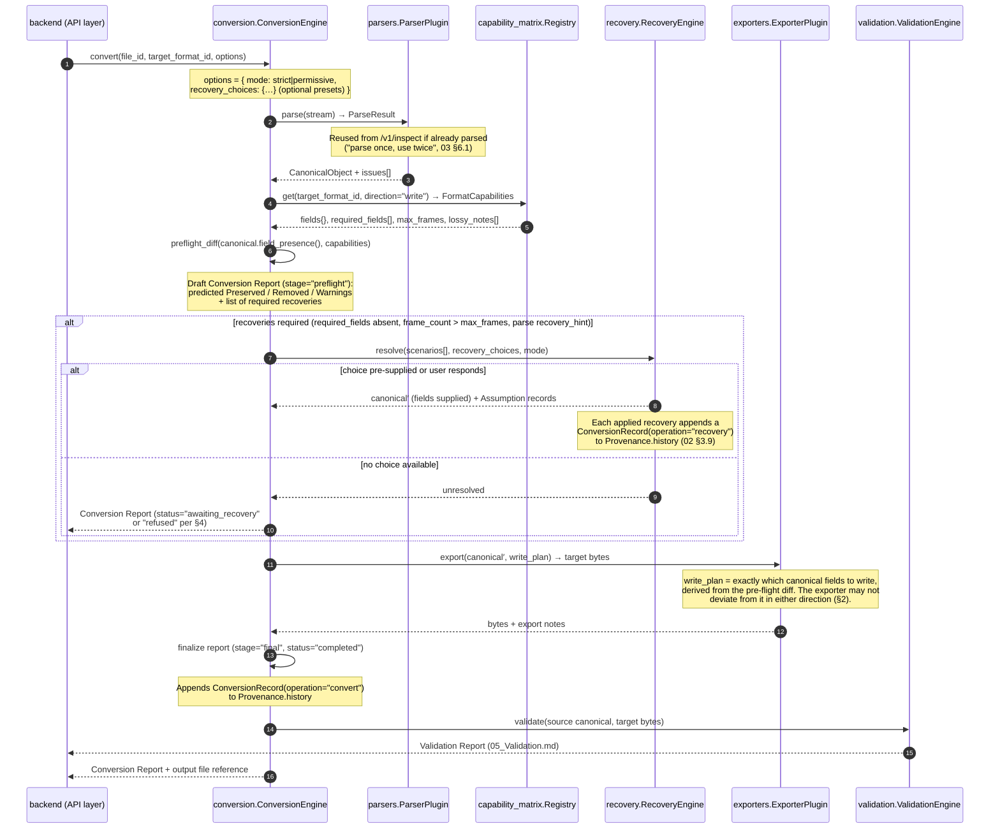

**Exporter behavioral rules (normative — completes the `ExporterPlugin` contract deferred from `03 §2`):**

1. An exporter writes **exactly** the fields in the `write_plan` handed to it by the Conversion Engine — no more (it may not opportunistically emit fields the plan excludes) and no less (a field in the plan that the exporter cannot write is an exporter bug, since the plan was derived from that exporter's own `capabilities()` declaration).
2. An exporter never reads native files, never calls a parser, and never fabricates values for absent fields — absence at export time means the Recovery Engine either supplied the field already or the conversion never reached the exporter (`01_Architecture.md §2`).
3. Representation changes required by the target (Cartesian → fractional per `02 §4`; 3×3 stress → Voigt; unit conversions from canonical units per `02 §3.1`) are performed by the exporter and reported by the engine as **Warnings** entries with stable codes (e.g. `COORDINATE_REPRESENTATION_CHANGED`), because they are format-mandated transformations, not choices — choices are Assumptions, transformations are Warnings.
4. Precision limitations declared in `lossy_notes` (e.g. POSCAR's fixed decimal width) surface as Warnings verbatim.

---

### 2. The Conversion Report (Exact Schema)

The Conversion Report is the structured record named in the binding glossary (`00_Project_Overview.md §6`): **Preserved / Removed / Reason / Assumptions / Warnings**. "Reason" is not a separate top-level list — every `Removed` entry carries its own `reason`, which is the faithful structuring of the master format. One addition to the glossary's five-part shape is normative here: a **Supplied** list. Fields written to the output that the Recovery Engine *fabricated* (a missing lattice, initialized velocities) are neither preserved (nothing in the source was carried) nor removed (nothing was dropped) — they are a third kind of fact, and conflating them with `preserved` would let a fabricated cell read as if it came from the source, the precise misrepresentation **P4** exists to prevent. `Supplied` is the report-schema counterpart of the UI's third visual category (`07_Web_UI.md §4`, the ◆ "Assumption/fabricated" treatment). The same schema serves both the **pre-flight draft** (shown to the user before conversion; `03 §4.3`) and the **final report**, distinguished by `stage`; this guarantees the promise made to the user and the record of what happened are structurally comparable, and any divergence between them is itself a defect the Validation Engine flags (`05_Validation.md`).

```python
class PreservedEntry(BaseModel):
    path: str                      # Canonical field path, e.g. "atoms.positions" (02 §3).
    detail: str | None = None      # e.g. "1 frame × 64 atoms", "converted to fractional (Direct)".

class RemovedEntry(BaseModel):
    path: str                      # Canonical field path that was present in the source
                                   #   but is absent from the output.
    reason: str                    # REQUIRED. Sourced from the target's FieldCapability.notes
                                   #   (03 §4.1) or generated from CapabilityLevel, e.g.
                                   #   "Target format cannot store forces."
    detail: str | None = None      # e.g. "10 frames × 64 atoms × 3 dropped".

class SuppliedEntry(BaseModel):
    path: str                      # Canonical field path fabricated by Recovery and written to the
                                   #   output — NOT present on the source (02 §3.11 status "absent").
    from_assumption: str           # REQUIRED. The Assumption.id (below) that authorized this value,
                                   #   so every supplied field is traceable to a recorded choice (P4).
    detail: str | None = None      # e.g. "3×3 lattice; pbc (T,T,T) — bounding box of frame 9 + 5.0 Å".

class Assumption(BaseModel):
    id: str                        # Stable per-report identifier, e.g. "A1".
    scenario: str                  # Machine code: "missing_lattice", "frame_selection", … (§3).
    choice: str                    # Machine code of the selected option: "bounding_box", … (§3).
    parameters: dict[str, JsonValue] = {}   # e.g. {"padding_ang": 5.0}.
    origin: Literal["user", "preset"]       # Interactive choice vs pre-supplied in the API call.
    description: str               # Human-readable sentence, e.g. "Lattice constructed as the
                                   #   bounding box of frame 9 positions plus 5.0 Å padding."

class ReportWarning(BaseModel):
    code: str                      # Stable machine code, e.g. "COORDINATE_REPRESENTATION_CHANGED".
    message: str
    source: Literal["parse", "capability", "export"]   # ParseIssue echo (03 §5 rule 5),
                                                       #   lossy_notes, or exporter transformation.

class ConversionReport(BaseModel):
    report_id: str                 # UUID.
    stage: Literal["preflight", "final"]
    status: Literal["completed", "awaiting_recovery", "refused"]
    mode: Literal["strict", "permissive"]          # §4.
    created_at: str                # ISO 8601 UTC.
    source: dict                   # { format_id, filename, sha256, schema_version }.
    target: dict                   # { format_id, filename }.
    preserved: list[PreservedEntry]
    removed: list[RemovedEntry]    # Every entry carries its Reason.
    supplied: list[SuppliedEntry]  # Recovery-fabricated fields; each links to its Assumption.
                                   #   Empty list = nothing fabricated.
    assumptions: list[Assumption]  # Empty list = a conversion with no fabricated information.
    warnings: list[ReportWarning]
    refusal: dict | None = None    # Populated iff status="refused":
                                   #   { code, message, unresolved_scenarios: [...] } (§4).
```

**Supplied vs. Assumptions — why both.** They are one-to-(one-or-more): an `Assumption` records the *decision* ("bounding box, 5 Å padding, on frame 9"); a `SuppliedEntry` records each *canonical field that decision wrote* ("`cell.lattice_vectors`", "`cell.pbc`"). One assumption often supplies several fields, and separating decision from effect lets the completeness accounting stay field-level while the provenance stays choice-level. `pre-flight` drafts populate `supplied` with the fields a *chosen* recovery will write (empty while scenarios are still unresolved).

**Completeness invariant (normative).** For every canonical field path with status `present` or `mixed` on the source object (`field_presence()`, `02 §3.11`), the final report must account for that path in `preserved`, `removed`, or — for a partially retained `mixed` path — both (`02 §3.11`). Conversely, every path in `supplied` must have status `absent` on the source (a fabricated field cannot also have been present) and must trace to an `Assumption` via `from_assumption`. A source-present path appearing in none of `preserved`/`removed`, or a supplied path that was actually present in the source, are both reporting bugs of the highest severity — they are the definition of silent loss and silent fabrication respectively (**P1**, **P4**) — and `08_Testing.md` enforces both directions property-style across the golden datasets.

Reports are persisted in PostgreSQL `JSONB` (`01_Architecture.md §4.2`) keyed by conversion, and each report's `assumptions` are mirrored into the Canonical Object's `Provenance.history[].assumptions` (`02 §3.9`) so that the object and the report each remain independently self-explanatory.

---

### 3. The Recovery Engine

#### 3.1 Two hazard classes, one bright line

Every conversion hazard the pre-flight diff detects falls into exactly one of two classes, and the distinction governs everything the Recovery Engine is allowed to do:

| Hazard class | Definition | Examples | Policy |
|---|---|---|---|
| **Reductive — bulk** | Information present in the source cannot be carried by the target; *all* of it is dropped and no scientific choice selects *which* survives. | Forces → POSCAR; custom arrays → CIF; energies → XYZ | May proceed automatically in permissive mode, always fully reported as `removed` entries. Strict mode requires acknowledgment (§4). |
| **Reductive — selective** | Data is dropped, but *which subset is kept changes the scientific meaning of the output*, so the selection is a choice ChemBridge will not make unrecorded. | 10 frames → single-frame target (which frame?); general constraints → POSCAR selective-dynamics subset (which constraints project?) | **Requires an explicit choice in any mode** — interactive or preset — recorded as an `Assumption`, exactly like fabricative. Nothing is invented (the kept data is real), so it is not fabricative; but nothing is auto-selected either. |
| **Fabricative** | Information *required or offered* for the target does not exist in the source. Data must be *created*. | Missing lattice for POSCAR; velocity initialization; species for a VASP-4 file | **Never automatic in any mode.** Requires an explicit choice — interactive or pre-supplied preset — recorded as an `Assumption`. No exceptions. Fabricated fields land in the report's `supplied` list (§2). |

The bright line is the operational form of **P4** (recover explicitly, never guess), stated precisely across three cases rather than two: *ChemBridge may drop wholesale with a report (bulk reductive); it may neither choose which real data to keep (selective reductive) nor invent absent data (fabricative) without a recorded instruction.* The distinction between the two "requires a choice" rows is worth keeping sharp: a selective-reductive choice records an `Assumption` but produces **no `supplied` entry** (the retained data is genuine source data, filed under `preserved`/`removed` per frame); a fabricative choice records an `Assumption` **and** a `supplied` entry (the written field did not exist in the source). Format-defined facts (e.g. POSCAR ⇒ fully periodic, `03 §3` note 3) are none of the three — they are properties of the format applied at parse time and logged in `parse_notes`.

**Why "selective reductive" is a named case, not a silent exception (**correcting an earlier over-simplification**).** An earlier framing put `frame_selection` under plain reductive loss and let §4's mode table carry the "still requires a choice" behavior implicitly. That understated the rule: dropping 9 of 10 frames is reductive, but *which* frame becomes the output is the scientific content of the conversion, and a tool that silently kept frame 0 would mislead as surely as one that fabricated a lattice. Naming the case makes the obligation explicit at the point the hazard is classified, rather than leaving a reader to reconstruct it from the strict/permissive table.

**Alternative rejected: a single "risk level" scale** (low/medium/high) governing what proceeds automatically. A scalar scale invites threshold creep — "Maxwell–Boltzmann velocities are only *medium* risk" — and eventually automates fabrication. The categorical model above is deliberately discrete precisely so that no configuration, mode, or future convenience feature can ever make ChemBridge invent scientific data — or silently choose which real data to discard.

#### 3.2 Resolution flow

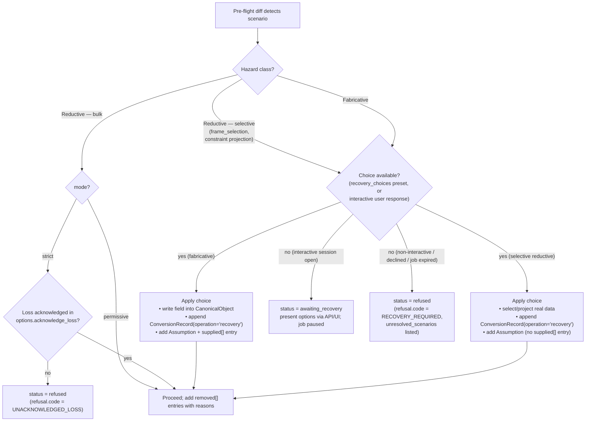

A paused job (`awaiting_recovery`) holds its parsed Canonical Object and draft report server-side; the API's async job model defines resumption and expiry (`06_API.md §3`). **There is no timeout-triggered default for fabricative or selective-reductive scenarios** — an expired job resolves to `refused`, never to a silently applied option. The natural design question "what is the default when the user does not respond?" is thereby answered categorically rather than per scenario: **refusal is the default** — the only default that neither fabricates data nor silently chooses which real data to discard. Any per-scenario fallback (however "reasonable") would relocate that decision from an explicit instruction to a timeout, and §3.3's "Non-interactive behavior" column exists to state this per scenario so the answer is never implicit.

#### 3.3 Scenario catalog

Each scenario has a stable `scenario` code (referenced by `Assumption.scenario` and by the UI's recovery prompts in `07_Web_UI.md §3`). Options marked ✳ are only offered when scientifically coherent for the specific source/target pair — the option list is computed, not static.

| `scenario` code | Trigger (pre-flight condition) | Options (`choice` codes) | Non-interactive behavior without preset |
|---|---|---|---|
| `missing_lattice` | Target `required_fields` includes `cell.lattice_vectors`; source `cell = None` | `manual_input` (user supplies 3×3 vectors, Å) · `upload_reference` (lattice taken from a second uploaded structure; atom-count compatibility checked) · `bounding_box` (axis-aligned box of positions + `padding_ang` parameter; if multi-frame, box of the *selected* frame) · ✳`non_periodic` (only if target can express `pbc=(F,F,F)` — offered for extXYZ, not for POSCAR per its `cell.pbc` PARTIAL note, `03 §4.2`) | `refused` |
| `missing_species` | Parse-time `recovery_hint="supply_species"` (VASP-4 POSCAR, typed LAMMPS dumps; `03 §3` note 1, `03 §7.2`) | `species_map` (user supplies ordered symbols or type→element map, validated against counts) · `upload_reference` (symbols from a matching structure) | `refused` (symbols are required, `02 §3.3` — no export path exists without them) |
| `missing_velocities` | Target *requires* velocities, or user requests velocity emission for a target that supports them | `zero_init` (explicit rest state — becomes *data* per `02 §2` rule 3, so it must be a recorded Assumption, never a silent fill) · `maxwell_boltzmann` (parameters: `temperature_K`, `seed`; requires masses — may chain `missing_masses`) · `upload_reference` (velocities from a separate file; shape-checked) · ✳`omit` (only when the target field is optional) | `omit` is applied *only if* it is a legal option (optional field) **and** mode is permissive — omission is reductive-adjacent (nothing fabricated). Otherwise `refused`. |
| `missing_masses` | An applied recovery or target requirement needs masses; source `masses = None` | `standard_masses` (IUPAC standard atomic weights by element — a *reported default*, per the pointer in `02 §3.3`) · `manual_input` | `refused` (even standard masses are fabricative and need the preset `standard_masses` to be named) |
| `missing_energy` | Target *requires* a per-frame energy the source lacks | `upload_reference` (energies from a separate file, frame-count checked) · **no synthetic option exists** — there is no scientifically defensible default energy, so none is offered | `refused` |
| `frame_selection` | `frame_count > target.max_frames` (e.g. trajectory → POSCAR) | `first` · `last` · `index` (parameter: `frame_index`) · ✳`split_all` (one output file per frame, archived; offered when the job's output mode permits multiple files) | `refused` in strict; in permissive, **still refused** — dropping 9 of 10 frames is reductive, but *which* frame survives changes the scientific meaning of the output, so the selection is treated as a choice ChemBridge will not make unrecorded. |
| `truncate_corrupt_tail` | Parse-time `recovery_hint="truncate_at_last_valid_frame"` (`03 §5` rule 4) | `truncate` (keep frames `0…k`, discard corrupt remainder — Assumption records `k` and the ParseIssue) · `abort` | `refused` |
| `constraint_representation` | Source `constraints` present; target capability PARTIAL (e.g. general constraints → POSCAR selective dynamics) | `project` (map to the target's representable subset — e.g. fixed-atom masks — with the unrepresentable remainder listed in `removed`) · `drop_all` | `refused` unless preset — a *partial* constraint translation changes the physics of any downstream relaxation and must be chosen knowingly. (Full drop of constraints when the target capability is NONE is ordinary reductive loss: reported, proceeds in permissive.) |

Two structural points about the catalog:

- **Recoveries compose.** The worked example in §5 chains `frame_selection` → `missing_lattice` (the bounding box must be computed on the *chosen* frame, so ordering matters); `maxwell_boltzmann` may chain `missing_masses`. The Recovery Engine resolves scenarios in dependency order and records one Assumption per applied choice.
- **The catalog is extensible.** New scenarios register with the Recovery Engine the same way formats register with the plugin registry (`03 §7.1`), keyed by `recovery_hint` codes and capability conditions — a new format plugin can ship its own recovery scenarios without core changes (**P6**).

---

### 4. Refusing vs. Proceeding: Strict and Permissive Modes

`mode` is set per conversion request (`06_API.md`, `POST /v1/convert` options; the web UI defaults to permissive-with-preview, `07_Web_UI.md`).

| | **permissive** (default) | **strict** |
|---|---|---|
| Reductive loss — bulk (fields dropped wholesale) | Proceeds; every drop in `removed` with reason | Refused unless `options.acknowledge_loss: true` (a blanket acknowledgment of the *pre-flight draft* the caller has seen) |
| Reductive loss — selective (frame selection, partial constraint projection, §3.1) | Explicit choice required (§3.3) — **identical in both modes** | Identical |
| Fabricative scenarios | Explicit choice required (preset or interactive) — **identical in both modes** | Identical |
| Parse warnings present | Proceed; echoed into `warnings` | Refused unless `options.acknowledge_parse_warnings: true` |
| Intended audience | Interactive web users who see the pre-flight draft and recovery prompts | Persona 2 pipelines (`00_Project_Overview.md §5`): CI that must *fail* on any unreviewed loss |

**Refusal is a first-class outcome, not an error.** A refused conversion returns a complete Conversion Report with `status="refused"`, the full pre-flight `preserved`/`removed` prediction, and `refusal.unresolved_scenarios` — everything a pipeline needs to decide programmatically whether to supply presets and retry. Refusing loudly with a machine-readable explanation is the correct failure mode for a tool whose entire value is trustworthiness; an HTTP 4xx with a prose message would discard exactly the structure callers need.

**When the engine refuses in *any* mode:** an unresolved fabricative *or selective-reductive* scenario (§3.1–§3.2); a `missing_energy`-class scenario with no coherent option; or an exporter/write-plan mismatch detected at write time (a bug, surfaced as a refusal plus an internal error report rather than a partially written file — a truncated output masquerading as a completed conversion would be silent loss of the worst kind).

**Alternative rejected: a third "force" mode** that auto-applies documented defaults for fabricative scenarios (zero velocities, bounding-box lattice with fixed padding) to maximize pipeline convenience. Rejected because it relocates fabrication from the user's explicit instruction to a mode flag set once and forgotten — six months later, nobody on the pipeline team remembers that `force` invents lattices. The preset mechanism (`recovery_choices` in the request body) already gives pipelines full automation, with the crucial difference that every fabrication is *named in the request* and lands in the report as `origin: "preset"`. Convenience is preserved; deniability is not.

---

### 5. Worked Example: ASE Trajectory → POSCAR

**Source.** `relax.traj` — an ASE trajectory of an isolated 3-atom water molecule during optimization: 10 frames, each with `atoms.symbols`/`positions`, `dynamics.forces`, `electronic.total_energy`. The `.traj` file carries ASE's default zero cell, which the parser launders to `cell = None` per `03 §2` — the source genuinely expresses no lattice. No velocities, stress, charges, or constraints.

**Target.** POSCAR — write capabilities per `03 §4.2`: `max_frames = 1`; `required_fields = ["atoms.symbols", "atoms.positions", "cell.lattice_vectors"]`; forces/energy `NONE`; `lossy_notes` on decimal precision.

**Step 1 — pre-flight diff** (`conversion.ConversionEngine.preflight_diff`):

| Source-present field | Target capability | Predicted outcome |
|---|---|---|
| `atoms.symbols` | FULL | Preserved |
| `atoms.positions` (10 frames × 3 × 3) | FULL, but `max_frames = 1` | Preserved for one frame → `frame_selection` scenario; other frames → Removed |
| `dynamics.forces` | NONE | Removed — "Target format cannot store forces." |
| `electronic.total_energy` | NONE | Removed — "Target format cannot store energies." |
| `cell.lattice_vectors` | **required, absent** | → `missing_lattice` scenario; once resolved → **Supplied** (not Preserved), `cell.pbc` supplied by the same choice |

The draft report (`stage="preflight"`, `status="awaiting_recovery"`) is returned with two unresolved scenarios. Because POSCAR's `cell.pbc` capability is PARTIAL (only fully periodic), the computed option list for `missing_lattice` **excludes** `non_periodic` (§3.3).

**Step 2 — recovery.** The user (interactive session) chooses:

- `frame_selection` → `last` (frame index 9 — the relaxed geometry);
- `missing_lattice` → `bounding_box` with `padding_ang: 5.0`, computed on frame 9's positions.

The Recovery Engine writes the constructed `Cell` (with `pbc = (true, true, true)`, required by the target and stated in the Assumption description) into the working Canonical Object and appends `ConversionRecord(operation="recovery", assumptions=[…])` to `Provenance.history`.

**Step 3 — export.** The `exporters` POSCAR plugin receives the write plan {`atoms.symbols`, `atoms.positions` (frame 9), `cell.lattice_vectors`, `cell.pbc`}; converts Cartesian → Direct (fractional) per `02 §4`; writes the file.

**Final Conversion Report:**

```json
{
  "report_id": "b7c1e2a4-…",
  "stage": "final",
  "status": "completed",
  "mode": "permissive",
  "created_at": "2026-07-04T11:32:07Z",
  "source": { "format_id": "ase_traj", "filename": "relax.traj",
              "sha256": "…", "schema_version": "0.1.0" },
  "target": { "format_id": "poscar", "filename": "POSCAR" },
  "preserved": [
    { "path": "atoms.symbols",   "detail": "O, H, H" },
    { "path": "atoms.positions", "detail": "frame 9 of 10; written as Direct (fractional)" }
  ],
  "supplied": [
    { "path": "cell.lattice_vectors", "from_assumption": "A2",
      "detail": "3×3 lattice; bounding box of frame 9 positions + 5.0 Å padding — a conversion artifact, not simulation data." },
    { "path": "cell.pbc", "from_assumption": "A2",
      "detail": "(T, T, T) — required by POSCAR; set by the same recovery choice as the lattice." }
  ],
  "removed": [
    { "path": "atoms.positions",
      "reason": "Target format stores a single structure (max_frames = 1).",
      "detail": "Frames 0–8 (9 of 10 frames) dropped; frame 9 retained per assumption A1." },
    { "path": "dynamics.forces",
      "reason": "Target format cannot store forces.",
      "detail": "10 frames × 3 atoms × 3 components dropped." },
    { "path": "electronic.total_energy",
      "reason": "Target format cannot store energies.",
      "detail": "10 per-frame values dropped." }
  ],
  "assumptions": [
    { "id": "A1", "scenario": "frame_selection", "choice": "last",
      "parameters": { "frame_index": 9 }, "origin": "user",
      "description": "Frame 9 (final frame) selected for the single-structure target." },
    { "id": "A2", "scenario": "missing_lattice", "choice": "bounding_box",
      "parameters": { "padding_ang": 5.0, "computed_on_frame": 9 }, "origin": "user",
      "description": "Lattice constructed as the axis-aligned bounding box of frame 9 positions plus 5.0 Å padding on each side; pbc set to (T,T,T) as required by POSCAR. The source expressed no lattice; this cell is an artifact of conversion, not simulation data." }
  ],
  "warnings": [
    { "code": "COORDINATE_REPRESENTATION_CHANGED",
      "message": "Positions converted from Cartesian (canonical) to fractional (Direct) for POSCAR.",
      "source": "export" },
    { "code": "PRECISION_LIMIT",
      "message": "Positions written with 16 significant digits; sub-ulp differences possible on round-trip.",
      "source": "capability" }
  ],
  "refusal": null
}
```

Note the completeness invariant (§2) holding in both directions: every source-present path (`atoms.symbols`, `atoms.positions`, `dynamics.forces`, `electronic.total_energy`) appears in `preserved` or `removed` — `atoms.positions` legitimately appears in *both*, preserved for the selected frame and removed for the other nine, each entry carrying its own detail (the `mixed`-path rule of `02 §3.11`); and every fabricated field (`cell.lattice_vectors`, `cell.pbc`) appears in `supplied`, not `preserved`, each traced to Assumption A2 via `from_assumption`. The lattice is thus filed as what it is — created, not carried — so a collaborator receiving the POSCAR plus this report cannot mistake the fabricated cell for simulation output, a guarantee the schema now enforces structurally rather than relying on a caveat buried in a `detail` string. The Validation Report for this same conversion is worked in `05_Validation.md §5`.

---

### 6. Why Every Conversion Routes Through the Canonical Model

The obvious optimization is a direct path for closely related pairs — XYZ → extXYZ is nearly a superset embedding, convertible by streaming line rewrites at a fraction of the cost of parse-to-object → export. The decision is to **forbid all such shortcuts**: every conversion, without exception, is `Parser → CanonicalObject → Exporter` (**P2**).

**Costs accepted.** For an XYZ → extXYZ conversion of a large trajectory, canonical routing means materializing frame objects and re-serializing rather than pattern-rewriting a stream — plausibly several times slower and memory-heavier for this pair. Large-trajectory memory pressure is real (a named project risk) and is addressed where it belongs: frame-chunked parsing/export behind the stable `ParserPlugin`/`ExporterPlugin` interfaces and the async job model (`06_API.md §3`) — performance work *inside* the single path rather than a second path (**P6**).

**Why the costs are worth it:**

1. **One auditable correctness surface.** Every guarantee this project makes — the absence convention, the completeness invariant, the pre-flight prediction, Provenance — is enforced at the Canonical Object boundary. A shortcut path bypasses all of it and would need its own parallel Discovery, capability diff, report generator, and provenance writer; two implementations of "never silently lose information" is one more than can be kept honest.
2. **O(n) vs O(n²).** Shortcuts are per-pair. Every shortcut added is a new code path to test, and the *tempting* pairs (near-supersets) are exactly where subtle divergence hides — an XYZ comment line that extXYZ would reinterpret as a key-value header is a silent corruption a streaming rewrite invites and the canonical path structurally cannot commit (the comment is data in `user_metadata`, `02 §8.1`).
3. **Reports stay truthful by construction.** The Conversion Report is generated from the same field-presence data that drives the conversion. A shortcut would generate its report from *predicted* behavior of a text rewrite rather than from the object actually written — reintroducing the gap between "what we said" and "what we did" that the architecture exists to close.
4. **Round-trip validation stays meaningful.** `05_Validation.md`'s re-parse-and-diff strategy assumes output files are exporter products; validating a stream rewrite against a canonical diff would compare artifacts produced by unrelated code, weakening the check precisely where it is most needed.

If a specific pair's performance ever becomes a genuine bottleneck, the sanctioned remedy is a faster parser/exporter for those formats — the shortcut's speed, inside the single path's guarantees.

---

### 7. Consequences for Downstream Documents

- **`05_Validation.md`** validates the §5 example, checks pre-flight-vs-final report divergence (§2), and defines the numerical tolerances behind `PRECISION_LIMIT`-class warnings.
- **`06_API.md`** exposes `mode`, `recovery_choices`, `acknowledge_loss`, and `acknowledge_parse_warnings` as `POST /v1/convert` options; represents `awaiting_recovery` in the async job lifecycle; and returns the `ConversionReport` schema of §2 verbatim.
- **`07_Web_UI.md`** renders the pre-flight draft as the conversion preview, presents §3.3's computed option lists as recovery prompts, and displays `assumptions` with the same visual prominence as `removed` — a fabricated lattice deserves the same visibility as a dropped force array.
- **`08_Testing.md`** enforces the §2 completeness invariant property-style across golden datasets and tests recovery scenario composition ordering (§3.3).


---


## Part 5: Validation Engine

*Source: `docs/05_Validation.md`*

> **Document status:** Binding. This document specifies the Validation Engine (`packages/validation`): the checks that run automatically after every conversion, the exact schema of the **Validation Report** (consumed verbatim by `06_API.md` and `07_Web_UI.md`), the round-trip validation strategy, and the numerical tolerance policy that keeps validation scientifically honest without drowning users in floating-point false positives.
>
> Prerequisites: the Canonical Model, absence convention, canonical units, and the Cartesian-internal coordinate decision in `02_Canonical_Data_Model.md` (§2, §3.1, §4); the `FormatCapabilities` structure and Capability Matrix in `03_Parsers.md §4`; the Conversion Report schema, `write_plan`, completeness invariant, and the worked ASE-trajectory → POSCAR example in `04_Conversion_Engine.md` (§2, §5). Design principles **P1–P6** are defined in `00_Project_Overview.md §2`.

---

### 1. What Validation Actually Validates

A subtle but load-bearing framing decision: the Validation Engine does **not** check that "nothing was lost." Loss is often intentional, chosen, and reported — the ASE → POSCAR example legitimately drops forces, energies, and nine frames. Validating against the full source object would flag every honest conversion as a failure.

Instead, the Validation Engine checks that **the Conversion Report told the truth**:

> *Everything the report claims was preserved is verifiably present and numerically faithful in the output file; everything the report claims was removed is verifiably absent; and nothing happened that the report does not mention.*

Operationally, the reference for comparison is the **expected object**: the source Canonical Object filtered through the conversion's `write_plan` (`04 §1`) with Recovery-supplied fields included. The output file is re-parsed into `canonical′` using the ordinary parser registry — the same parsers, under the same absence convention, that power everything else (`03 §6.1`, "Discovery is exactly as trustworthy as parsing") — and `canonical′` is diffed against the expected object.

**Alternative rejected: validating output files against the raw source object.** Besides the false-failure problem above, it conflates two different questions — "did we lose information?" (answered *before* conversion by the pre-flight diff, `03 §4.3`) and "did the conversion do what it said?" (answerable only *after*). Keeping the questions separate is what makes a `passed` validation meaningful: it certifies the report, and the report describes the loss. Together they are the trust claim; neither alone is.

**Alternative rejected: skipping the re-parse and inspecting exporter-internal state.** Cheaper, but it validates the exporter using the exporter's own bookkeeping — circular. Re-parsing through the independent read path is what gives the check teeth: a bug must exist *symmetrically* in both the exporter and the parser to escape detection, and the golden-dataset tests (`08_Testing.md`) exist to prevent exactly that symmetric case.

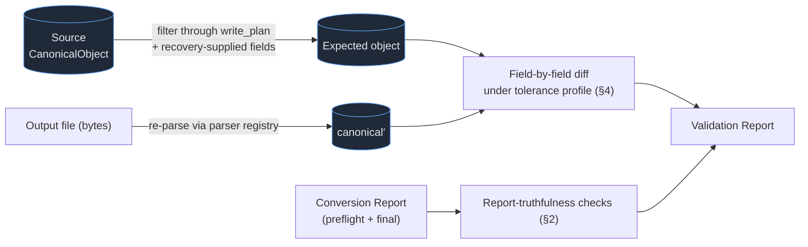

One structural consequence worth stating: because validation re-parses the output, **every conversion is automatically a half round-trip** (`Format A → Canonical → Format B → Canonical`). §5 builds the full round-trip strategy on this foundation.

---

### 2. The Check Catalog

Every check has a stable `check_id` (machine code, mirrored in the Validation Report), a defined severity policy, and a scientific justification. Severity semantics: **fail** = the output file cannot be trusted to mean what the Conversion Report says it means; **warn** = the output is usable but a caveat exists that the user must see; **pass** = verified within tolerance. A check can also report **skipped** with a reason (e.g., RMSD is skipped when a Recovery-fabricated lattice makes source/output comparison of that field meaningless).

| `check_id` | What it checks | Why it matters scientifically | How it is computed | Severity policy |
|---|---|---|---|---|
| `atom_count` | Atom count in every retained frame of `canonical′` equals the expected object's count. | A silently dropped or duplicated atom changes stoichiometry, charge balance, and every downstream property; it is the most catastrophic conversion bug possible. | `len(atoms.symbols)` per frame, exact integer comparison. | **fail** on any mismatch. Never tolerance-based. |
| `species_preservation` | Element identity per atom is preserved, modulo any exporter-declared reordering. | Swapping species (or reordering without a map) corrupts the chemistry while keeping counts intact — invisible to `atom_count`, ruinous to results. | Exporters that reorder atoms (e.g. POSCAR groups atoms by element) must emit an index **permutation map** alongside the output; the check compares `symbols[perm[i]]` element-wise. Reordering itself surfaces as an `ATOM_ORDER_CHANGED` Conversion Report warning. No declared map ⇒ order must be identical. | **fail** on any element mismatch; **fail** if reordering occurred without a declared map. |
| `positions_rmsd` | Geometric fidelity: RMSD between expected and re-parsed positions (Cartesian, Å, after applying the permutation map). Max per-atom displacement also recorded. | Positions are the primary scientific payload; drift beyond representational precision means the exporter or parser is corrupting geometry. | `sqrt(mean(‖r′ᵢ − rᵢ‖²))` per retained frame, in canonical Cartesian coordinates. No PBC wrapping is applied on either side (wrapping is forbidden at parse/export time, `02 §4`), so the comparison is direct. | **warn** above the warn tolerance, **fail** above the fail tolerance (§4). |
| `lattice_consistency` | `cell.lattice_vectors` element-wise agreement and exact `cell.pbc` equality between expected and `canonical′`. | The cell defines periodic images, density, and pressure; a perturbed lattice silently changes the physics of everything downstream. | Max absolute element-wise difference of the 3×3 matrices (Å); boolean triple comparison for `pbc`. Applied equally to source-carried and Recovery-supplied lattices — a fabricated cell must still round-trip faithfully. | **warn**/**fail** by tolerance for the matrix; **fail** on any `pbc` mismatch (booleans admit no tolerance). |
| `frame_count` | Re-parsed frame count equals the write plan's frame count. | A trajectory missing frames (or duplicating them) misrepresents the simulation's time evolution; off-by-one truncation is a classic exporter bug. | Exact integer comparison of `len(frames)`. | **fail** on mismatch. |
| `numeric_field_fidelity` | Every numeric field in the write plan beyond positions/lattice — `dynamics.velocities`, `dynamics.forces`, `electronic.total_energy`, `electronic.stress`, `electronic.charges`, `electronic.magnetic_moments`, `atoms.masses`, `frame.time` — agrees within its per-quantity tolerance (§4). | Each carries physical meaning in canonical units (`02 §3.1`); silent corruption of, e.g., forces poisons any downstream fit or restart. | Max absolute (and where meaningful, relative) element-wise difference per field, one sub-result per field path. | **warn**/**fail** by the per-quantity tolerance table (§4). |
| `metadata_preservation` | Every metadata and custom-array path in the write plan (`simulation.*`, `user_metadata.*`, comments/carry-through) is present in `canonical′`; string content compared semantically (whitespace-normalized), arrays numerically. | Metadata is scientific information (**P1**); a dropped XC-functional label or custom array is loss like any other. Formats legitimately re-wrap whitespace, so exact byte equality would be a false-positive machine. | Path-presence check via `field_presence()` (`02 §3.11`) plus normalized-content comparison per path. | **warn** on content drift (normalized mismatch); **fail** on a planned path being absent. |
| `absence_conformance` | Every path the Conversion Report lists as `removed` is genuinely absent (`None`) in `canonical′`. | A "removed" field that reappears in the output means the exporter deviated from the write plan — the report is now lying in the safe-looking direction, which still destroys reproducibility (a collaborator would believe data is absent that is actually present, or worse, fabricated). | `field_presence()` on `canonical′`, asserting `absent` for each removed path. | **fail** on any violation. |
| `report_consistency` | (a) The final Conversion Report satisfies the completeness invariant in both directions (`04 §2`) — every source-present path in `preserved`/`removed`, every `supplied` path absent-on-source and traced to an Assumption; (b) the final report does not diverge from the pre-flight draft except through recorded Assumptions. | The pre-flight draft is the promise shown to the user before conversion (`03 §4.3`); an unexplained divergence means the user consented to one conversion and received another. | Structural diff of `preserved`/`removed`/`supplied`/`warnings` between `stage="preflight"` and `stage="final"` reports; every delta must trace to an `Assumption.id`, and every `supplied` entry's `from_assumption` must resolve to a present Assumption. | **fail** on invariant violation, an untraceable divergence, or a dangling `from_assumption`; **warn** on traceable-but-notable deltas (e.g. a warning added at export time). |

**Behavior on failure.** A `failed` Validation Report never blocks *access* — the output file and both reports remain retrievable, because a researcher debugging a failure needs the artifact. It does change *posture*: the API marks the conversion `validation_failed`, the UI presents the download behind an explicit acknowledgment, and strict-mode jobs (`04 §4`) report the job itself as failed so pipelines halt. **Alternative rejected: deleting or withholding failed outputs.** Quarantining information from the person best positioned to diagnose it serves no one; the danger was never the file's existence but the possibility of trusting it unknowingly, and a loud `failed` status plus acknowledgment gate eliminates the "unknowingly."

---

### 3. The Validation Report (Exact Schema)

The Validation Report deliberately mirrors the Conversion Report's conventions (`04 §2`) — same identifier style, timestamp format, machine-code discipline, and severity vocabulary — so the two render side-by-side in the API and UI without adapter logic.

```python
class CheckResult(BaseModel):
    check_id: str                    # Stable machine code from §2, e.g. "positions_rmsd".
    status: Literal["pass", "warn", "fail", "skipped"]
    paths: list[str]                 # Canonical field paths examined, e.g. ["atoms.positions"].
    measured: dict[str, JsonValue]   # Check-specific measurements, e.g.
                                     #   {"rmsd_ang": 3.2e-13, "max_displacement_ang": 8.9e-13,
                                     #    "frames_compared": 1}.
    tolerance_applied: dict[str, JsonValue] | None = None
                                     # The effective thresholds used, e.g.
                                     #   {"warn_ang": 1.0e-5, "fail_ang": 1.0e-3,
                                     #    "representational_bound_ang": 5.0e-13} (§4).
    message: str                     # Human-readable outcome, specific and quantitative.
    skip_reason: str | None = None   # Populated iff status="skipped".

class ValidationReport(BaseModel):
    report_id: str                   # UUID.
    conversion_report_id: str        # Links to the ConversionReport this validates (04 §2).
    created_at: str                  # ISO 8601 UTC.
    status: Literal["passed", "passed_with_warnings", "failed"]
                                     # Worst individual CheckResult determines the aggregate.
    checks: list[CheckResult]        # One entry per executed/skipped check from §2.
    tolerance_profile: dict          # The full profile in force (§4): name + every effective
                                     #   threshold, so the report is self-contained and the
                                     #   same validation is reproducible later.
    reparse_issues: list[ParseIssue] # Warnings raised while re-parsing the output (03 §5) —
                                     #   an output file that parses only with warnings is
                                     #   itself a finding.
    schema_version: str              # Canonical schema version used for the diff.
```

Persistence follows the Conversion Report: PostgreSQL `JSONB`, keyed to the conversion (`01_Architecture.md §4.2`). The pairing rule is one-to-one and unconditional — **every completed conversion has exactly one Validation Report**; there is no configuration to skip validation, because an unvalidated conversion is exactly the artifact this project exists to abolish. (Refused conversions produce no output file and therefore no Validation Report.)

---

### 4. Numerical Tolerance Strategy

#### 4.1 The problem

Formats disagree about decimal precision, and honest conversions accumulate benign representational error: POSCAR writes 16 significant digits, plain XYZ conventionally 6–8 decimals, CIF fractional coordinates often 4–6 decimals. Fractional round-trips compound this — a fractional coordinate stored with *d* decimals in a cell of lattice matrix **L** carries a per-component Cartesian uncertainty of up to `0.5 · 10⁻ᵈ · max‖Lᵢ‖` (`02 §4`, round-trip honesty). A CIF with 4-decimal fractional coordinates in a 10 Å cell legitimately differs from its source by up to ~5×10⁻⁴ Å per component — physically meaningless, but far above float64 noise. A fixed universal tolerance therefore either false-fails legitimate CIF conversions or waves through genuine corruption in high-precision formats.

#### 4.2 The mechanism: base tolerances scaled by declared representational bounds

Each exporter's `FormatCapabilities` declaration is extended with a `numeric_precision` map — declared decimal precision per canonical field path (this is the machine-readable generalization of the prose `lossy_notes` already defined in `03 §4.1`, and the source of `PRECISION_LIMIT` warnings in `04 §1`). At validation time, the **effective tolerance** per field is:

```
effective_warn(field) = max( base_warn(field),  k_warn × representational_bound(field) )
effective_fail(field) = max( base_fail(field),  k_fail × representational_bound(field) )
```

where `representational_bound` is computed from the declared precision (for fractional-coordinate formats, scaled by the actual lattice as above), and `k_warn = 2`, `k_fail = 10` provide headroom over the theoretical bound. Both the base values and the effective values in force are recorded in `tolerance_applied` — a reader of the report can always see *why* a given deviation passed.

**Alternative rejected: one global absolute tolerance (e.g. 1×10⁻⁶ everywhere).** Simple, but wrong in both directions per §4.1 — and silently wrong, since users would never learn that CIF conversions were being judged by a standard the format cannot meet. **Alternative rejected: purely relative tolerances.** Relative comparison degenerates near zero (a force component of 10⁻¹² eV/Å would demand absurd absolute agreement) and positions near the origin are not less important than positions far from it. Absolute-first with per-quantity bases, precision-scaled, is the defensible middle.

#### 4.3 Default tolerance table (`tolerance_profile: "default"`)

| Quantity (canonical units, `02 §3.1`) | Base warn | Base fail | Notes |
|---|---|---|---|
| Positions / RMSD (Å) | 1×10⁻⁵ | 1×10⁻³ | RMSD and max-displacement judged against the same thresholds. |
| Lattice vectors (Å, element-wise) | 1×10⁻⁵ | 1×10⁻³ | Applied to the 3×3 matrix. |
| Velocities (Å/fs) | 1×10⁻⁶ | 1×10⁻⁴ | |
| Forces (eV/Å) | 1×10⁻⁶ | 1×10⁻⁴ | |
| Total energy (eV) | 1×10⁻⁶ | 1×10⁻⁴ | Absolute; energies are extensive, so profiles for large systems may prefer per-atom scaling (configurable). |
| Stress (eV/ų) | 1×10⁻⁸ | 1×10⁻⁶ | Voigt↔3×3 expansion is exact; tolerance covers decimal representation only. |
| Charges (e), magnetic moments (μB) | 1×10⁻⁴ | 1×10⁻² | Source precision for these is typically low. |
| Time (fs) | 1×10⁻⁶ | 1×10⁻³ | |
| Counts, species, `pbc`, path presence | — | exact | Discrete quantities admit no tolerance, ever. |

#### 4.4 Configurability

The tolerance profile is set per conversion request (`06_API.md`, `POST /v1/convert` options): named profiles (`"default"`, `"strict"` — bases tightened 100×, for round-trip regression hunting; `"loose"` — bases relaxed 100×, for knowingly low-precision workflows) or a full custom table. Two rules are not configurable: discrete checks stay exact, and the representational-bound floor cannot be disabled (a profile may be *stricter* than physics allows only by accepting that representational error will then fail — the report will say so via `tolerance_applied`). The profile in force is always embedded in the Validation Report (§3), keeping every report self-contained and re-checkable.

#### 4.5 Re-validation: what it needs, and why it always works

"Re-checkable" is a specific, bounded claim, and it is worth stating exactly what re-validation requires so the guarantee is not mistaken for one the system cannot keep. Re-validation means *evaluating the same conversion under a different tolerance profile* (`06_API.md §2`, `POST /v1/validate`; CLI `validate --tolerance-profile`). The essential observation: **a tolerance profile changes only the pass/fail thresholds applied to already-measured quantities; it never changes the measurements themselves.** Every continuous check stores its raw measured value in the Validation Report (`positions_rmsd`, `max_atomic_displacement`, per-quantity deltas — see §3's `measured` fields), and every discrete check is exact and profile-independent. Therefore:

1. **Server-side re-validation (`POST /v1/validate`) is re-thresholding, not re-parsing.** It reads the stored Validation Report's `measured` values, applies the new profile's thresholds, and emits a new report. It needs **only the stored reports**, which outlive the file bytes by design (`09_Deployment.md §5.2` — "reports outlive bytes"). This is why the endpoint remains available after the 7-day source/output expiry: there is nothing to re-parse. The earlier implication that `/v1/validate` could fail with `OUTPUT_EXPIRED` is removed in `06_API.md §2` accordingly — re-thresholding has no output-byte dependency.

2. **A full re-parse re-validation** (re-running the checks against a freshly re-parsed output, e.g. to hunt a suspected exporter or parser bug rather than a threshold question) is a distinct, heavier operation. It requires the **expected object** — the source Canonical Object filtered through the conversion's `write_plan` plus Recovery-supplied fields (§2) — and the output bytes. Server-side this is available only while both the persisted source Canonical Object (`01_Architecture.md §4.3`) and the output bytes remain within retention; after expiry it is genuinely impossible and the API says so rather than pretending. Offline, the CLI performs it from files the user still holds: `chembridge validate --output FILE --source FILE --conversion-report REPORT.json` reconstructs the expected object locally from the source file and the report's `preserved`/`supplied` path lists (which *are* the write plan, §2), then re-parses the output — no server state needed.

The two operations are deliberately separated because they answer different questions: re-thresholding answers "does this conversion pass under my stricter/looser bar?" (always answerable from the report); full re-parse answers "is the stored measurement itself still reproducible?" (answerable only with the inputs). Conflating them — e.g. forcing a re-parse for every tolerance tweak — is what made the "self-contained" claim ring hollow; splitting them makes it precise.

---

### 5. Round-Trip Validation

Round-trip diffing — re-expressing data through the pipeline and comparing Canonical Objects — is the project's systematic weapon against *symmetric* silent bugs that single-direction checks miss. It appears in two settings:

**Runtime (every conversion).** As established in §1, post-conversion validation *is* the half round-trip `A → Canonical → B → Canonical′`. This ships in the MVP and runs unconditionally.

**Test suite (`08_Testing.md`).** Two deeper patterns run over the golden datasets:

1. **Identity round-trip** `A → Canonical → A → Canonical′`: diff `Canonical` vs `Canonical′` over *all* fields the format supports (read capability ∩ write capability, per the Capability Matrix). Any drift is a parser/exporter defect by definition — there is no capability excuse inside one format.
2. **Two-hop round-trip** `A → Canonical → B → Canonical′ (→ A → Canonical″)`: diff restricted to the **comparable subspace** — the intersection of formats A and B's capabilities, computed from the Capability Matrix rather than hand-listed per pair. The matrix thus does double duty: it drives conversion (`03 §4.3`) and defines what round-trip equality even means. Fields outside the intersection are asserted *absent* in `Canonical′` (the `absence_conformance` logic reused at test time).

The known blind spot, stated plainly: a bug replicated symmetrically in a format's parser and exporter (both misinterpret a field the same way) survives its own identity round-trip. This is why golden datasets — real files with independently established, hand-verified canonical representations — are the round-trip strategy's necessary complement, not an optional extra (`08_Testing.md`). Round-trips catch asymmetric bugs cheaply and continuously; golden files anchor the loop to external truth.

---

### 6. Worked Example: Validating the ASE Trajectory → POSCAR Conversion

Continuing `04_Conversion_Engine.md §5` (conversion `b7c1e2a4-…`: frame 9 of `relax.traj`, bounding-box lattice via Assumption A2, forces/energies removed). The expected object is frame 9's `atoms` block plus the Recovery-supplied `Cell`; the written POSCAR is re-parsed by the ordinary POSCAR parser (which converts Direct → Cartesian and sets `pbc` by format definition, `03 §3` note 3).

```json
{
  "report_id": "e91f4c7d-…",
  "conversion_report_id": "b7c1e2a4-…",
  "created_at": "2026-07-04T11:32:09Z",
  "status": "passed",
  "checks": [
    { "check_id": "atom_count", "status": "pass",
      "paths": ["atoms.symbols"],
      "measured": { "expected": 3, "found": 3, "frames_compared": 1 },
      "tolerance_applied": null,
      "message": "3 atoms expected, 3 found (exact check)." },

    { "check_id": "species_preservation", "status": "pass",
      "paths": ["atoms.symbols"],
      "measured": { "permutation_map": [0, 1, 2], "mismatches": 0 },
      "tolerance_applied": null,
      "message": "Species O, H, H preserved; exporter grouping by element yielded the identity permutation (O first, then H, H)." },

    { "check_id": "positions_rmsd", "status": "pass",
      "paths": ["atoms.positions"],
      "measured": { "rmsd_ang": 3.2e-13, "max_displacement_ang": 8.9e-13,
                    "frames_compared": 1 },
      "tolerance_applied": { "warn_ang": 1.0e-5, "fail_ang": 1.0e-3,
                             "representational_bound_ang": 5.4e-13,
                             "bound_source": "poscar: 16 significant digits, Direct coordinates, max lattice vector 6.51 Å" },
      "message": "RMSD 3.2e-13 Å over 1 frame — consistent with Direct-coordinate representational precision; the Cartesian→fractional→Cartesian round-trip (02 §4) fully accounts for the deviation." },

    { "check_id": "lattice_consistency", "status": "pass",
      "paths": ["cell.lattice_vectors", "cell.pbc"],
      "measured": { "max_element_diff_ang": 0.0, "pbc_expected": [true, true, true],
                    "pbc_found": [true, true, true] },
      "tolerance_applied": { "warn_ang": 1.0e-5, "fail_ang": 1.0e-3 },
      "message": "Recovery-supplied bounding-box lattice (Assumption A2) round-tripped exactly; pbc (T,T,T) as required by target. Note: pbc in the re-parse is format-defined for POSCAR (03 §3 n.3), matching the expected object." },

    { "check_id": "frame_count", "status": "pass",
      "paths": ["frames"],
      "measured": { "expected": 1, "found": 1 },
      "tolerance_applied": null,
      "message": "1 frame planned, 1 frame found." },

    { "check_id": "numeric_field_fidelity", "status": "skipped",
      "paths": [],
      "measured": {},
      "tolerance_applied": null,
      "message": "No numeric fields beyond positions and lattice in the write plan.",
      "skip_reason": "write_plan contains no velocities, forces, energies, stress, charges, magnetic moments, masses, or time." },

    { "check_id": "metadata_preservation", "status": "pass",
      "paths": ["user_metadata.custom_global['poscar:comment']"],
      "measured": { "planned_paths": 1, "present": 1, "content_drift": 0 },
      "tolerance_applied": null,
      "message": "Generated POSCAR title line present and semantically identical on re-parse." },

    { "check_id": "absence_conformance", "status": "pass",
      "paths": ["dynamics.forces", "electronic.total_energy", "atoms.positions"],
      "measured": { "removed_paths_checked": 3, "violations": 0 },
      "tolerance_applied": null,
      "message": "All removed paths verified absent in re-parse: forces (None), total_energy (None), frames 0–8 (not present — single-frame output)." },

    { "check_id": "report_consistency", "status": "pass",
      "paths": [],
      "measured": { "completeness_invariant": "satisfied",
                    "preflight_final_deltas": 2,
                    "untraceable_deltas": 0,
                    "supplied_traced": 2 },
      "tolerance_applied": null,
      "message": "Every source-present path accounted for in preserved/removed, and both supplied paths (cell.lattice_vectors, cell.pbc) trace to Assumption A2 (04 §2). Both preflight→final deltas (lattice+pbc supplied via recovery; frame 9 selected) trace to Assumptions A2 and A1 respectively." }
  ],
  "tolerance_profile": {
    "name": "default",
    "positions_warn_ang": 1.0e-5, "positions_fail_ang": 1.0e-3,
    "lattice_warn_ang": 1.0e-5, "lattice_fail_ang": 1.0e-3,
    "k_warn": 2, "k_fail": 10,
    "representational_bound_floor": "enabled"
  },
  "reparse_issues": [],
  "schema_version": "0.1.0"
}
```

Points to notice: `positions_rmsd` shows the §4.2 mechanism in action — the measured 3.2×10⁻¹³ Å is *explained*, not merely tolerated, by the declared-precision bound, and the report says so quantitatively; `lattice_consistency` validates the *fabricated* lattice with the same rigor as source data (a Recovery artifact that fails to round-trip would be a real exporter bug); `report_consistency` demonstrates the pre-flight-vs-final divergence check promised in `04 §2`, with both deltas traced to Assumption IDs; and the `skipped` check is reported rather than omitted — an absent check result would leave the reader guessing whether fidelity was verified or forgotten.

---

### 7. Feedback Loop into Recovery (v0.2+, Not MVP)

Validation outcomes are a natural quality signal for the Recovery Engine's option design. Planned for v0.2+, explicitly out of MVP scope, and attaching at existing seams only (**P6**):

- **Aggregation.** Log `(Assumption.scenario, Assumption.choice, parameters)` → `ValidationReport.status` pairs across conversions (both reports already persist in PostgreSQL, so this is a query, not new plumbing).
- **Surfacing.** Statistical patterns — e.g., `bounding_box` recoveries with `padding_ang < 2.0` disproportionately yielding warnings on downstream re-conversions — feed back as *advisory notes on recovery options* in the UI ("this padding commonly produces close periodic contacts"), never as changed defaults: the fabricative bright line (`04 §3.1`) is untouched, and no recovery becomes automatic because statistics favor it.
- **Privacy boundary.** Aggregation uses scenario/choice/parameter metadata and report statuses only — never file contents — consistent with the uploaded-file lifecycle policy (`09_Deployment.md`).

This section is recorded now so the report schemas (which already carry everything the loop needs: `Assumption` structure in `04 §2`, `status` and `measured` here) are recognized as the loop's substrate — no schema change will be required to build it.

---

### 8. Consequences for Downstream Documents

- **`06_API.md`** returns the `ValidationReport` of §3 verbatim (`/v1/validate` and as part of conversion job results), exposes `tolerance_profile` in `POST /v1/convert` options, and reflects `validation_failed` in the job/download state machine (§2, behavior on failure).
- **`07_Web_UI.md`** renders Conversion and Validation Reports side-by-side (same conventions by design, §3), presents the acknowledgment gate for failed validations, and shows `tolerance_applied` details behind progressive disclosure so the quantitative story in §6 is available without overwhelming non-expert users.
- **`08_Testing.md`** implements §5's identity and two-hop round-trip suites over the golden datasets, using the §4 tolerance machinery (with the `"strict"` profile) and the Capability-Matrix-derived comparable subspace.
- **`03_Parsers.md` cross-reference note:** the `numeric_precision` map introduced in §4.2 extends `FormatCapabilities` — it is an *additive* refinement of the `lossy_notes` mechanism already defined there, not a rename; the prose `lossy_notes` remain the human-readable complement.


---


## Part 6: REST API Specification

*Source: `docs/06_API.md`*

> **Document status:** Binding. This document specifies the FastAPI backend's public REST interface: every endpoint, the async job model, authentication, rate/size limits, the error envelope, and API versioning. The API layer is deliberately thin (`01_Architecture.md §2`): it validates requests, manages jobs and storage, and delegates all scientific logic to `packages/*`. Response bodies embed the pydantic report models **verbatim** — the `DiscoveryReport` (`03_Parsers.md §6.2`), `ConversionReport` (`04_Conversion_Engine.md §2`), and `ValidationReport` (`05_Validation.md §3`) — with no parallel DTOs (`02_Canonical_Data_Model.md §9`).
>
> Design principles **P1–P6** are defined in `00_Project_Overview.md §2`. The primary API consumer personas are the web UI (`07_Web_UI.md`) and Persona 2, the pipeline engineer who asserts against structured reports in CI (`00_Project_Overview.md §5`).
>
> **Binding vs. design intent (Revision 1.2).** This Part is binding for contracts and vocabulary that other Parts and future surfaces depend on: the endpoint table (§2), the job-state enum and refusals-as-HTTP-200 rule (§1, §3.2), the report schemas embedded verbatim, and the error envelope (§6). Implementation-level detail below that layer (specific CSRF/auth mechanics in §4, exact rate-limit defaults in §5) is **design intent** — the reasoning is worth preserving, but this API is not built until roadmap v0.2, and the detail should be re-validated against the ecosystem at that time rather than treated as frozen today (`10 §6` item 7 makes docs-vs-code drift a release blocker, so premature bindingness here is a self-inflicted drift risk).

---

### 1. Conventions

- **Base path:** all endpoints live under `/v1/` (§7).
- **Content types:** JSON request/response bodies (`application/json`); file upload via `multipart/form-data`; file download as a binary stream with correct `Content-Disposition`.
- **Identifiers:** `file_id`, `job_id`, `conversion_id`, `report_id` are opaque UUIDs.
- **Timestamps:** ISO 8601 UTC, matching report conventions (`04 §2`).
- **Refusals are not HTTP errors.** A conversion the engine refuses (`04 §4`) is a *successfully completed job* whose result is a `ConversionReport` with `status: "refused"` — HTTP 200 on retrieval. HTTP error codes are reserved for transport/request problems (malformed input, missing resources, auth, limits) and genuine internal failures. Collapsing refusals into 4xx would discard exactly the structured pre-flight prediction and `refusal.unresolved_scenarios` a pipeline needs to supply presets and retry.

---

### 2. Endpoint Table

| Method | Path | Purpose | Request | Success response | Notable errors (§6) |
|---|---|---|---|---|---|
| `POST` | `/v1/upload` | Upload a source file to object storage | `multipart/form-data`: `file` | `201` — `{ file_id, filename, size_bytes, sha256, expires_at }` | `413 FILE_TOO_LARGE`, `429 RATE_LIMITED` |
| `POST` | `/v1/inspect` | Run the Information Discovery Engine on an uploaded file | `{ file_id, format_override? }` | `202` — job envelope (§3); result payload: `DiscoveryReport` | `404 FILE_NOT_FOUND`, `410 FILE_EXPIRED` |
| `GET` | `/v1/capabilities` | The assembled Capability Matrix (all registered formats, read + write) | — | `200` — `{ formats: [FormatCapabilities…] }` (`03 §4.1`, incl. `numeric_precision`, `05 §4.2`) | — |
| `GET` | `/v1/capabilities/{format_id}` | One format's declarations | — | `200` — `{ read: FormatCapabilities?, write: FormatCapabilities? }` | `404 FORMAT_NOT_FOUND` |
| `GET` | `/v1/limits` | Every enforced instance limit (§5), so clients can pre-check instead of failing | — | `200` — `LimitsResponse` (§2.2) | — |
| `POST` | `/v1/convert` | Submit a conversion | Body in §2.1 | `202` — job envelope (§3) | `404`, `410`, `422 UNKNOWN_FORMAT`, `422 PARSE_ERROR` |
| `GET` | `/v1/jobs/{job_id}` | Poll job status (optional long-poll `?wait=<s>`, max 30) | — | `200` — job envelope, incl. `awaiting_recovery` detail (§3.2) | `404 JOB_NOT_FOUND` |
| `POST` | `/v1/jobs/{job_id}/recovery` | Resume an `awaiting_recovery` job with choices | `{ choices: { <scenario>: { choice, parameters } } }` (`04 §3.3` codes) | `200` — job envelope (back to `running`) | `404`, `409 JOB_NOT_AWAITING_RECOVERY`, `422 INVALID_RECOVERY_CHOICE` |
| `POST` | `/v1/jobs/{job_id}/cancel` | Cancel a `queued`/`awaiting_recovery`/`running` job (§3.2 cancellation semantics) | — | `200` — job envelope (`state: "cancelled"`); idempotent | `404`, `409 JOB_ALREADY_TERMINAL` |
| `GET` | `/v1/conversions/{conversion_id}` | Retrieve a finished conversion's full record | — | `200` — `{ conversion_id, created_at, source, target, conversion_report: ConversionReport, validation_report: ValidationReport?, download: { available, requires_ack } }` | `404 CONVERSION_NOT_FOUND` |
| `POST` | `/v1/validate` | Re-evaluate an existing conversion's stored measurements under a different tolerance profile (re-thresholding, `05 §4.5`) | `{ conversion_id, tolerance_profile }` | `202` — job envelope; result payload: a new `ValidationReport` | `404 CONVERSION_NOT_FOUND` |
| `GET` | `/v1/download/{conversion_id}` | Download the output file | `?acknowledge_validation_failure=true` required iff validation `failed` (`05 §2`) | `200` — file stream | `404`, `409 VALIDATION_ACK_REQUIRED`, `410 OUTPUT_EXPIRED` |
| `GET` | `/v1/history` | List the caller's uploads/conversions | `?cursor=&limit=` (cursor pagination) | `200` — `{ items: [summary…], next_cursor? }` | `401 UNAUTHORIZED` |
| `DELETE` | `/v1/files/{file_id}` | Immediately delete an uploaded file and derived artifacts | — | `204` | `404` |
| `GET` | `/v1/health` | Liveness/readiness for orchestrators and uptime monitors (`09 §6.1`) | `?ready=true` for readiness (checks DB/Redis/storage), else liveness only | `200` — `{ status, checks? }` | `503 NOT_READY` (readiness only) |
| `POST` | `/v1/auth/signup`, `POST /v1/auth/login`, `POST /v1/auth/logout` | Hosted-instance account lifecycle (§4; absent in self-hosted anonymous mode) | `{ email, password }` (signup/login) | `204` — session cookie set/cleared | `401 INVALID_CREDENTIALS`, `409 EMAIL_TAKEN`, `429` |
| `GET`/`POST` | `/v1/keys` | List / create the caller's API keys (§4) | create: `{ label }` | `200` — `{ keys: […] }` / `201` — `{ key_id, label, secret }` (secret shown **once**, stored hashed) | `401` |
| `DELETE` | `/v1/keys/{key_id}` | Revoke an API key | — | `204` | `401`, `404` |

Notes:

- **`/v1/validate` semantics.** Every completed conversion is validated automatically and unconditionally (`05 §3` — "there is no configuration to skip validation"); the initial `ValidationReport` arrives inside the conversion job result. The `/v1/validate` endpoint exists for **re-validation under a different `tolerance_profile`**, which is *re-thresholding of the stored measured values* (`05 §4.5`), not a re-parse — so it depends only on the stored reports and remains available even after the 7-day source/output byte expiry (reports outlive bytes, `09 §5.2`). It fails only with `404` if the conversion is unknown. Prior reports are retained; re-validation appends, never replaces. A full re-parse re-validation (needed only to re-verify a measurement itself, not a threshold) is the CLI's offline `validate --output --source` path (`05 §4.5`), not this endpoint.
- **`format_override` on `/v1/inspect`** implements the sniffing override anticipated in `03 §6.1`: when a user knows better than the Format Sniffer (e.g., an extensionless POSCAR misdetected), they name the `format_id` and the sniff step is skipped; the override is recorded in the `DiscoveryReport.format.sniff_evidence`.
- **`/v1/inspect` is idempotent per `(file_id, format_override, parser-registry version)`.** Re-submitting the same inspect (same file, same override, no plugin installed/upgraded since) returns `202` with the **existing** job's envelope — completed, in-flight, or otherwise — rather than enqueueing duplicate work; the parsed Canonical Object is the shared artifact (`01 §4.3`, "parse once, use twice"). The registry version is part of the key because a new or upgraded parser can legitimately change what Discovery reports; the UI's `/files/[file_id]` page can therefore re-submit on every visit (`07 §2.2`) at the cost of a lookup, not a re-parse. `format_override` re-inspection is a *different* key by construction, so "Not the right format?" always does real work.
- **`DELETE /v1/files/{file_id}`** exists for privacy: users should never have to wait for lifecycle expiry (`09_Deployment.md §5`) to remove their data.
- **`/v1/health` is unauthenticated and rate-limit-exempt** — orchestrator probes and uptime monitors must never be throttled into false alarms; it exposes no user data (component up/down states only, `09 §6.1`).

#### 2.1 `POST /v1/convert` request body (full schema)

Options names match `04_Conversion_Engine.md` exactly:

```json
{
  "file_id": "3f8a…",
  "target_format_id": "poscar",
  "options": {
    "mode": "permissive",
    "recovery_choices": {
      "frame_selection": { "choice": "last", "parameters": {} },
      "missing_lattice": { "choice": "bounding_box", "parameters": { "padding_ang": 5.0 } }
    },
    "acknowledge_loss": false,
    "acknowledge_parse_warnings": false,
    "tolerance_profile": "default",
    "output_filename": "POSCAR"
  }
}
```

| Field | Type | Required | Semantics |
|---|---|---|---|
| `file_id` | string | yes | From `/v1/upload`. |
| `target_format_id` | string | yes | A `format_id` with a registered write capability (`/v1/capabilities`). |
| `options.mode` | `"strict"` \| `"permissive"` | no (default `"permissive"`) | `04 §4`. |
| `options.recovery_choices` | object | no | Presets keyed by `scenario` code; each value `{ choice, parameters }` per `04 §3.3`. Presets land in the report as `origin: "preset"`. |
| `options.acknowledge_loss` | bool | no (default `false`) | Strict mode only: blanket acknowledgment of the pre-flight draft (`04 §4`). |
| `options.acknowledge_parse_warnings` | bool | no (default `false`) | Strict mode only (`04 §4`). |
| `options.tolerance_profile` | string \| object | no (default `"default"`) | Named profile or full custom table (`05 §4.4`); governs the automatic validation. |
| `options.output_filename` | string | no | Defaults to a format-conventional name. |

#### 2.2 Auxiliary response schemas (normative)

The endpoint table references several response shapes that are not report schemas. They are defined here so that every response in §2 is fully specified — Persona 2 asserts against these in CI, and an undefined `summary` object is an undefined contract. Like the reports, these are pydantic models embedded verbatim; clients must ignore unknown fields (§7).

```python
class UploadResponse(BaseModel):
    file_id: str
    filename: str
    size_bytes: int
    sha256: str
    expires_at: str                    # ISO 8601 UTC; lifecycle policy per §5 / 09 §5.2.

class LimitsResponse(BaseModel):
    """GET /v1/limits — the instance's effective values for every §5 constraint."""
    max_upload_bytes: int
    max_frames: int
    upload_rate_per_hour: int
    job_rate_per_hour: int
    poll_rate_per_hour: int
    max_concurrent_jobs: int
    retention_days: int
    awaiting_recovery_ttl_hours: int   # Expiry window for paused jobs (§3.2's expires_at).

class DownloadInfo(BaseModel):
    """The `download` object on conversion records."""
    available: bool                    # False once output bytes have expired (410 semantics, §5).
    requires_ack: bool                 # True iff validation failed — the 05 §2 gate.
    filename: str
    size_bytes: int | None = None      # None when available = false.
    expires_at: str | None = None

class HistoryItem(BaseModel):
    """One `items[]` entry from GET /v1/history."""
    conversion_id: str
    created_at: str
    source: dict                       # { format_id, filename } — ConversionReport.source minus hashes.
    target: dict                       # { format_id, filename }.
    conversion_status: Literal["completed", "refused"]
    validation_status: Literal["passed", "passed_with_warnings", "failed"] | None
                                       # None for refused conversions (no output ⇒ no validation, 05 §3).
    summary_counts: dict               # { preserved, removed, assumptions, warnings } — the chip
                                       #   counts rendered per 07_Web_UI.md §4.
    file_id: str | None = None         # Present while the source upload is unexpired
                                       #   (drives the re-convert affordance, 07 §2.6).

class ConversionRecordResponse(BaseModel):
    """GET /v1/conversions/{conversion_id}."""
    conversion_id: str
    created_at: str
    source: dict
    target: dict
    conversion_report: ConversionReport            # 04 §2, verbatim.
    validation_report: ValidationReport | None     # 05 §3; None only while validation is running.
    download: DownloadInfo
```

---

### 3. The Async Job Model

#### 3.1 Rationale

Parsing, converting, and validating a 10,000-frame XDATCAR is CPU- and memory-bound work measured in tens of seconds to minutes — hostile to synchronous HTTP (client timeouts, proxy limits, browser tab memory if the client were made to wait or process locally; both named project risks). All pipeline operations therefore run as **background jobs**: submit → poll → retrieve. The job model also gives `awaiting_recovery` (`04 §3.2`) a natural home: a paused job is just another observable job state, holding its parsed Canonical Object and draft report server-side.

**Alternative rejected: dual-mode endpoints** (synchronous 200 for small files, 202 + job for large ones). Friendlier for tiny files, but it forces every client to implement both response shapes and makes behavior depend on file size — a moving target. Instead, **every** `/v1/inspect`, `/v1/convert`, and `/v1/validate` call returns `202` with a job envelope, and `GET /v1/jobs/{job_id}?wait=<seconds>` offers long-polling: a small file's job is `completed` by the time the first `wait=5` poll returns, giving near-synchronous ergonomics through one uniform contract. **Alternative rejected: WebSocket/SSE push.** Better latency for the UI, but it adds a second transport to secure, test, and self-host for marginal benefit at MVP scale; long-polling suffices and SSE can attach later without breaking the polling contract (**P6**).

#### 3.2 Job envelope and lifecycle

```json
{
  "job_id": "9d2c…",
  "kind": "convert",
  "state": "awaiting_recovery",
  "created_at": "2026-07-04T11:31:58Z",
  "updated_at": "2026-07-04T11:32:01Z",
  "expires_at": "2026-07-04T23:32:01Z",
  "progress": { "phase": "recovery", "frames_processed": null, "frames_total": null },
  "awaiting_recovery": {
    "draft_report": { "…": "ConversionReport, stage='preflight', status='awaiting_recovery'" },
    "unresolved_scenarios": [
      { "scenario": "frame_selection",
        "options": [ { "choice": "first" }, { "choice": "last" },
                     { "choice": "index", "parameters_schema": { "frame_index": "int 0–9" } } ] },
      { "scenario": "missing_lattice",
        "options": [ { "choice": "manual_input", "parameters_schema": { "vectors_ang": "3×3 float" } },
                     { "choice": "upload_reference", "parameters_schema": { "file_id": "uuid" } },
                     { "choice": "bounding_box", "parameters_schema": { "padding_ang": "float > 0" } } ] }
    ]
  },
  "result": null,
  "error": null
}
```

The `awaiting_recovery` block carries the **computed** option lists of `04 §3.3` (note: no `non_periodic` offered for a POSCAR target) plus the pre-flight draft, so the UI's recovery prompt (`07_Web_UI.md §3`) is rendered entirely from this envelope. On completion, `result` carries the kind-specific payload: `{ discovery_report }` for inspect jobs; `{ conversion_id, conversion_report, validation_report, download: {…} }` for convert jobs; `{ validation_report }` for validate jobs.

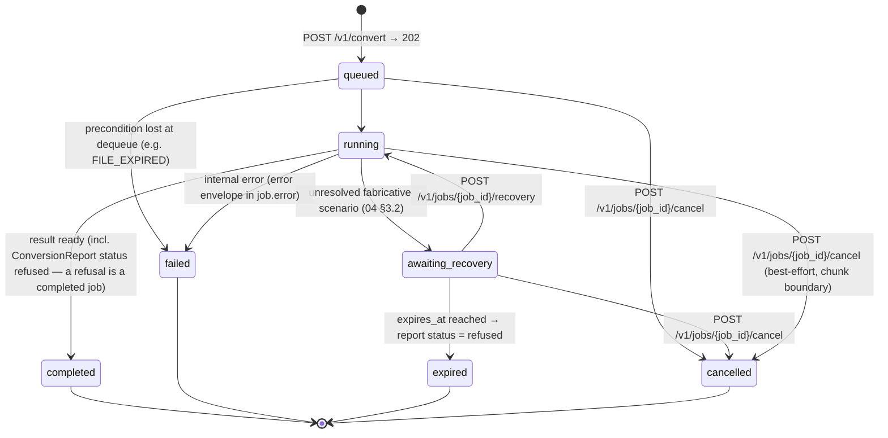

Job expiry honors the bright line of `04 §3.2`: an expired `awaiting_recovery` job resolves to a **refused** conversion (`refusal.code = "RECOVERY_REQUIRED"`), never to a silently applied default.

**Cancellation (`POST /v1/jobs/{job_id}/cancel`).** A user must be able to stop work they no longer want — the UI shows a cancel control on in-flight jobs (`07_Web_UI.md §2.4`), and pipelines need a programmatic abort — so cancellation is a first-class transition, not an omission left to timeouts. Semantics: cancelling a `queued` or `awaiting_recovery` job takes effect immediately (the job is dequeued or unpaused-to-nowhere; a paused job's persisted Canonical Object, `01 §4.3`, is released on the normal lifecycle). Cancelling a `running` job is **best-effort at the next frame-chunk boundary** (`04 §6`) — a worker checks a cancellation flag between chunks; mid-chunk work is never interrupted forcibly, because a killed worker cannot guarantee it has not half-written state. A cancelled conversion produces **no output file and no Conversion Report** — unlike refusal (a scientific outcome deserving a full report), cancellation is a user's withdrawal of the request, and fabricating a report for work not performed would misrepresent what happened; the job envelope's terminal `cancelled` state with a `cancelled_at` timestamp is the complete record. The endpoint is idempotent (cancelling a `cancelled` job returns the envelope unchanged) and returns `409 JOB_ALREADY_TERMINAL` for `completed`/`failed`/`expired` jobs — a finished job cannot be un-happened, only its artifacts deleted (`DELETE /v1/files/{file_id}`). **Alternative rejected: `DELETE /v1/jobs/{job_id}`.** REST-conventional, but DELETE implies the *resource* disappears; the job record must remain queryable (a pipeline that cancels still needs to read the terminal state), so a state-transition POST is the honest verb.

#### 3.3 End-to-end async sequence

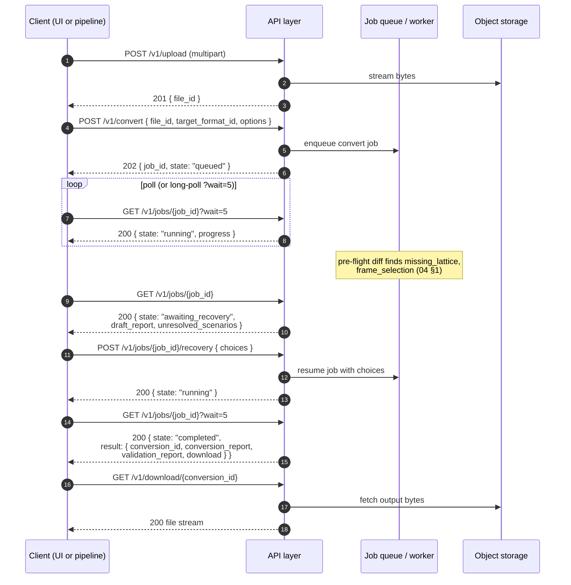

This is the API-level realization of the architecture's end-to-end sequence (`01_Architecture.md §3`); that diagram showed the logical flow, and the job boundary it anticipated is made concrete here.

---

### 4. Authentication and Authorization

Proportionate to an open-source project with two deployment shapes (`09_Deployment.md`): self-hosted instances and an optional public hosted instance. Not enterprise IAM.

| Deployment | Web UI | Programmatic |
|---|---|---|
| **Self-hosted (default)** | Anonymous single-tenant mode: no accounts; history is instance-wide | Optional static API key(s) set via environment config |
| **Hosted public instance** | Lightweight accounts; session cookie (HttpOnly, SameSite) | Per-user API keys: `Authorization: Bearer <key>`, stored hashed, revocable, listable |

Rules:

- **Ownership scoping.** On authenticated deployments, `file_id`/`conversion_id`/`job_id` resources are visible only to their creator; `/v1/history` is always caller-scoped. On anonymous self-hosted instances, scoping is the instance boundary itself.
- **Capability endpoints are public** (`/v1/capabilities*`): they expose format metadata, not user data, and pipelines need them before authenticating.
- **No roles/permissions system in MVP.** Every authenticated user has the same abilities; there is nothing to administer through the API. Role machinery would be speculative complexity (**P6** argues for seams, not prebuilt features — an `is_admin` flag can be added additively if a hosted instance ever needs moderation).
- **Account and key endpoints (hosted mode only).** The §2 table's `/v1/auth/*` and `/v1/keys*` endpoints exist only when accounts are enabled; on a self-hosted anonymous instance they return `404 NOT_ENABLED`, so self-hosters carry no dormant account machinery. Signup is email + password (argon2id-hashed), deliberately minimal: no email verification loop at MVP (a hosted operator may front the instance with one later; the API seam is the session abstraction). API-key secrets are generated server-side, returned **exactly once** at creation, stored only as salted hashes, and displayed thereafter as `key_id` + label + `last_used_at` — the same never-recoverable discipline as every serious key issuer, because a recoverable key is a stored plaintext secret.
- **CSRF protection (cookie path only).** The session cookie is `HttpOnly; Secure; SameSite=Lax`, which blocks the classic cross-site POST for modern browsers; because state-changing endpoints are all POST/DELETE and the split-origin layout (`09 §5.4`) makes the API a cross-origin target for the app itself, the API **additionally requires a double-submit CSRF token** (`X-CSRF-Token` header echoing a non-HttpOnly cookie issued at login) on every cookie-authenticated mutating request, returning `403 CSRF_TOKEN_MISSING` otherwise. Bearer-key requests are exempt — a header credential cannot be attached by a hostile third-party page, which is precisely why the browser path needs the extra token and the pipeline path does not. **Alternative rejected: SameSite alone.** It is one browser-policy change away from insufficient and does not cover legacy user agents; the double-submit token costs one header and removes the bet.

**Alternative rejected: full OAuth2/OIDC integration at MVP.** Standard advice for hosted services, but it front-loads significant configuration burden onto every self-hoster (client IDs, redirect URIs, provider choice) for a tool many will run on a workstation or lab server. Bearer API keys + session cookies cover both personas today; OIDC can be added behind the same session abstraction later without breaking the API surface.

---

### 5. Rate Limiting and Size Constraints

Limits exist to protect the service and to make the large-file risks (master-prompt: "large trajectory performance", "browser memory limitations") explicit rather than discovered at timeout. All limits are **instance-configurable**; defaults below are for the hosted instance. Every enforced limit is discoverable at `GET /v1/limits` (unauthenticated) so clients can pre-check instead of failing.

| Constraint | Default | Enforcement | Rationale |
|---|---|---|---|
| Max upload size | 500 MB | `413 FILE_TOO_LARGE` at upload; streamed to object storage, never buffered whole in API memory | Covers multi-thousand-frame XDATCAR/extXYZ; protects worker memory. Server-side processing + polling is the browser-memory strategy — the client never parses, only uploads and polls (`07_Web_UI.md §5`). |
| Max frames per file | 100,000 | `422 PARSE_ERROR` (code `FRAME_LIMIT_EXCEEDED`) during parse | Bounds worker memory for frame-chunked processing (`04 §6`); benchmark target in `08_Testing.md`. |
| Upload rate | 20/hour per key/session | `429 RATE_LIMITED` + `Retry-After` | Object storage cost control (`09_Deployment.md §5`). |
| Job submissions | 60/hour per key/session | `429 RATE_LIMITED` | CPU-bound worker pool protection. |
| Polling | 600/hour per key/session (long-poll `wait` counts once) | `429 RATE_LIMITED` | Encourages `?wait=` over tight loops. |
| Concurrent active jobs | 4 per key/session | `429 TOO_MANY_ACTIVE_JOBS` | Fair scheduling on a shared worker pool. |
| Uploaded file retention | 7 days (then auto-deleted) | `410 FILE_EXPIRED` / `410 OUTPUT_EXPIRED` afterward | Privacy and storage lifecycle (`09_Deployment.md §5`); `expires_at` returned at upload; `DELETE /v1/files/{file_id}` for immediate removal. |
| `awaiting_recovery` job TTL | 12 hours (then `expired` → report `status="refused"`) | Job envelope's `expires_at` (§3.2); surfaced as `awaiting_recovery_ttl_hours` in `LimitsResponse` (§2.2) | A paused job holds server-side state (`01 §4.3`); an unbounded pause is a slow resource leak — and the expiry-to-refusal rule (`04 §3.2`) guarantees the timeout can never silently apply a default. |

---

### 6. Error Envelope

One envelope for every non-2xx response, mirroring the machine-code discipline of the reports:

```json
{
  "error": {
    "code": "UNKNOWN_FORMAT",
    "message": "The uploaded file could not be identified as any registered format.",
    "details": { "…": "code-specific structured payload" },
    "request_id": "req_7f3e…",
    "documentation_url": "https://…/docs/errors#UNKNOWN_FORMAT"
  }
}
```

| HTTP | `code` | `details` payload |
|---|---|---|
| 400 | `MALFORMED_REQUEST` | pydantic validation errors, field-by-field |
| 401 | `UNAUTHORIZED` / `INVALID_CREDENTIALS` | — |
| 403 | `CSRF_TOKEN_MISSING` | — (cookie-authenticated mutating requests only, §4) |
| 404 | `FILE_NOT_FOUND` / `JOB_NOT_FOUND` / `CONVERSION_NOT_FOUND` / `FORMAT_NOT_FOUND` / `NOT_ENABLED` | `NOT_ENABLED`: account endpoints on an anonymous self-hosted instance (§4) |
| 409 | `JOB_NOT_AWAITING_RECOVERY` | current job `state` |
| 409 | `JOB_ALREADY_TERMINAL` | current job `state` — cancel refused for `completed`/`failed`/`expired` (§3.2) |
| 409 | `VALIDATION_ACK_REQUIRED` | `{ validation_report_id, status: "failed" }` — download gate of `05 §2` |
| 409 | `EMAIL_TAKEN` | — (signup, §4) |
| 410 | `FILE_EXPIRED` / `OUTPUT_EXPIRED` | `{ expired_at }` |
| 413 | `FILE_TOO_LARGE` | `{ limit_bytes, received_bytes }` |
| 422 | `UNKNOWN_FORMAT` | sniff candidates (below) |
| 422 | `PARSE_ERROR` | `{ issues: [ParseIssue…] }` — the parser error contract surfaced verbatim (`03 §5` rule 5) |
| 422 | `INVALID_RECOVERY_CHOICE` | `{ scenario, offered_choices }` |
| 429 | `RATE_LIMITED` / `TOO_MANY_ACTIVE_JOBS` | `{ retry_after_s }` |
| 500 | `INTERNAL_ERROR` | `{ request_id }` only — no stack traces across the wire |
| 503 | `NOT_READY` | per-dependency `checks` map (`/v1/health?ready=true` only, `09 §6.1`) |

**Worked example — unsupported format.** A user uploads `notes.docx` and calls `/v1/inspect`; the job fails fast and the job envelope's `error` field (same envelope shape) carries:

```json
{
  "error": {
    "code": "UNKNOWN_FORMAT",
    "message": "No registered parser recognizes this file. Best candidates are shown with confidence scores; if you know the format, retry with format_override.",
    "details": {
      "filename": "notes.docx",
      "sniff_candidates": [
        { "format_id": "cif", "confidence": 0.05 },
        { "format_id": "xyz", "confidence": 0.02 }
      ],
      "registered_formats": ["xyz", "extxyz", "cif", "poscar", "contcar", "xdatcar", "ase_traj"],
      "hint": "POST /v1/inspect with { \"format_override\": \"<format_id>\" } to bypass sniffing."
    },
    "request_id": "req_a41b…"
  }
}
```

This is the `UNKNOWN_FORMAT` outcome defined by the Discovery algorithm (`03 §6.1` — "report top candidates + confidences") in transport form: even a refusal to guess comes with the evidence and a path forward.

---

### 7. API Versioning

- **Path-prefix versioning:** all endpoints under `/v1/`. A breaking change to any request/response contract ships as `/v2/` with `/v1/` maintained through a published deprecation window. **Alternative rejected: header-based versioning** (`Accept: application/vnd.chembridge.v1+json`) — cleaner URLs, but invisible in logs, curl examples, and browser tools; for a project whose users copy-paste API calls into lab pipelines, explicitness beats elegance.
- **Additive evolution within `/v1/`:** new optional request fields, new response fields, new endpoints, and new error codes are non-breaking by policy; clients must ignore unknown response fields. This mirrors the canonical schema's own additive-minor policy (`02 §5`), and report payloads additionally self-describe via their embedded `schema_version`.
- **New formats are data, not API surface.** A plugin parser/exporter registered via the SDK (`03 §7.1`) appears as new entries in `/v1/capabilities`, new legal values for `format_id` / `target_format_id`, and potentially new recovery `scenario` codes in job envelopes — all of which are *values within existing schemas*. Installing a LAMMPS plugin on a self-hosted instance changes no endpoint, no schema, and no client code: this is the API-level payoff of the O(1)-per-format architecture (`01_Architecture.md §6`, **P6**). Clients are accordingly required to treat `format_id` and `scenario` as open enumerations.

---

### 8. Consequences for Downstream Documents

- **`07_Web_UI.md`** builds every page on these endpoints: the upload → inspect → convert → validate → download journey maps to §3.3's sequence; recovery prompts render from the `awaiting_recovery` job envelope (§3.2); the failed-validation acknowledgment gate uses `409 VALIDATION_ACK_REQUIRED` (§6); client-side large-file strategy is "upload, poll, never parse locally" (§5).
- **`08_Testing.md`** exercises the API integration surface in `backend/tests/` (`01_Architecture.md §5`): job lifecycle transitions (including `awaiting_recovery → expired → refused` and cancellation from every non-terminal state, §3.2), the error envelope contract per code, and limit enforcement.
- **`09_Deployment.md`** owns the configurability of every §5 limit, the object-storage lifecycle behind `expires_at`, and the worker-pool sizing the concurrency limits assume.


---


## Part 7: Web UI Design

*Source: `docs/07_Web_UI.md`*

> **Document status:** Binding for frontend structure, terminology, and the loss-communication design language. This document specifies the Next.js web application (`frontend/`, `01_Architecture.md §5`): the page/route map, what each page renders and which API endpoints it calls, the Recovery Workflow UI, the visual treatment of information loss, and the frontend architecture for large files and multi-step state.
>
> The web UI is a **faithful presentation layer**: it contains no scientific logic, never re-implements conversion behavior, and never hides reported losses (`01_Architecture.md §2`, "Must NOT"). Every piece of scientific content on screen is a rendering of a structured object defined elsewhere: the `DiscoveryReport` (`03_Parsers.md §6.2`), the `ConversionReport` (`04_Conversion_Engine.md §2`), the `ValidationReport` (`05_Validation.md §3`), and the job envelope (`06_API.md §3.2`). Design principles **P1–P6** are defined in `00_Project_Overview.md §2`; the one this document operationalizes most directly is **P1**: every loss is reported, never assumed — here, *never visually buried* either.
>
> **Binding vs. design intent (Revision 1.2).** This Part is binding for the page/route map (§1), the presentation-layer "Must NOT" rules above, and the ✓/✗/◆/⚠ loss-communication vocabulary (§4) — later Parts and this UI's own components must not reinvent that language. Page-level wireframe detail, exact component architecture (§5), and page-by-page copy are **design intent**: this UI is not built until roadmap v0.5+, and re-validating the detail then (rather than treating a wireframe-in-prose as frozen now) is what keeps docs-vs-code drift from becoming a release blocker (`10 §6` item 7).

---

### 1. Page and Route Map

Routes live under `frontend/app/` (Next.js App Router). Resource IDs in URLs make every step refresh-safe and shareable — a Conversion Report link pasted into an email or lab notebook resolves for any collaborator with access (§5.1).

| Route | Page | Purpose | Primary API calls (`06_API.md §2`) |
|---|---|---|---|
| `/` | Landing | Orient and route: what ChemBridge is, start a conversion, explore formats | `GET /v1/capabilities` (format count for display), `GET /v1/limits` |
| `/convert` | Upload | Drag-and-drop upload; entry to the wizard | `POST /v1/upload`, `GET /v1/limits` |
| `/files/[file_id]` | Inspection results | Render the Discovery Report (✓/✗ inventory); choose a target format | `POST /v1/inspect` → `GET /v1/jobs/{job_id}?wait=5`; `GET /v1/capabilities` |
| `/convert/[job_id]` | Active conversion | Job progress; pre-flight preview; Recovery Workflow prompts | `GET /v1/jobs/{job_id}?wait=5`, `POST /v1/jobs/{job_id}/recovery` |
| `/conversions/[conversion_id]` | Conversion record | Conversion Report + Validation Report side-by-side; download | `GET /v1/conversions/{conversion_id}`, `GET /v1/download/{conversion_id}`, `POST /v1/validate` (re-validation) |
| `/history` | History | Past uploads and conversions; re-open any record; delete files | `GET /v1/history`, `DELETE /v1/files/{file_id}` |
| `/formats` | Format explorer | Human-readable Capability Matrix: what each format can and cannot hold | `GET /v1/capabilities`, `GET /v1/capabilities/{format_id}` |
| `/docs/*` | Documentation | Statically rendered project docs (this set), guides, error-code reference (`documentation_url` targets, `06 §6`) | — (static) |

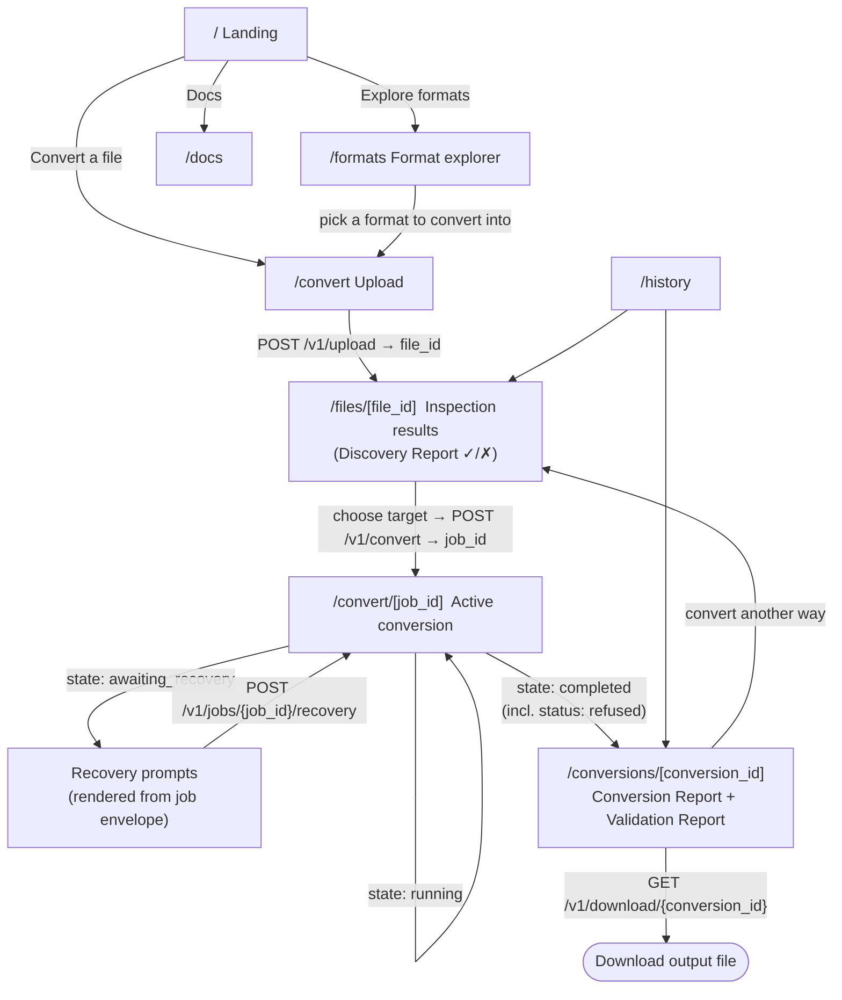

---

### 2. Page Specifications (Wireframe-in-Prose)

#### 2.1 Landing (`/`)

Single-screen orientation, in three blocks top to bottom: (1) the mission sentence from `00_Project_Overview.md §1` with a one-paragraph explanation of the Conversion Report concept — the product's differentiator is the *report*, so the landing leads with it, not with a format-count boast; (2) a primary "Convert a file" action and a secondary "What can each format hold?" link to `/formats`; (3) a three-step strip (*Inspect → Convert with a report → Verify*) using the same ✓/✗/⚠ iconography defined in §4, so the design language is learned before the first upload. No marketing carousel, no fabricated testimonials — the audience is Persona 1 and Persona 2 (`00_Project_Overview.md §5`), who are persuaded by precision.

#### 2.2 Upload (`/convert`)

A drop zone accepting one file, with the instance's limits shown inline before any failure can occur (max size and retention period from `GET /v1/limits` — e.g. "Files up to 500 MB · auto-deleted after 7 days · delete anytime"). During upload: a progress bar driven by upload progress events, filename, and a cancel control. On `201`, route to `/files/[file_id]`, which immediately submits `POST /v1/inspect`. Failure states render the error envelope (`06 §6`) verbatim in structure: the `code` as a badge, `message` as text, and `details` (e.g. `limit_bytes` for `FILE_TOO_LARGE`) as specifics — the UI never paraphrases error codes into vaguer language.

#### 2.3 Inspection Results (`/files/[file_id]`)

The Discovery Report page — the master mission's "✓ Species / ✗ Lattice" view — in four regions:

1. **File header:** filename, size, detected format with confidence, and the `sniff_evidence` runner-ups behind a "Not the right format?" disclosure that offers re-inspection with `format_override` (`06 §2`, `03 §6.1`).
2. **Structure summary:** frame count, atom count, species — from `DiscoveryReport.structure`.
3. **Contents inventory:** one row per `FieldPresenceEntry`, grouped under the canonical categories (Geometry, Cell, Trajectory, Dynamics, Electronic, Metadata; `02 §3`). Each row: the §4 presence icon, a plain-language field label (mapping table in §3.3), and `detail` when present. The `format_capability` value drives the crucial nuance: **absent-but-expressible** rows ("extXYZ can hold forces; this file has none") render differently from **absent-and-inexpressible** rows ("plain XYZ cannot hold lattice vectors") — the former says *your file*, the latter says *this format* (`03 §6.1` step 3).
4. **Target picker:** a format grid from `GET /v1/capabilities` (write-capable formats only). Selecting a target immediately overlays a **client-computed preview** of the pre-flight outcome — the UI intersects the Discovery Report's present fields with the target's `FormatCapabilities` to show "will carry / will drop / will need recovery" *before* submission. This is presentation-side set intersection over two server-provided structures, not scientific logic; the authoritative pre-flight remains the engine's draft report (`03 §4.3`), and any divergence between preview and draft would itself indicate a defect. A mode toggle (default `permissive`; `strict` explained in one sentence with a link to docs) and the Convert button complete the page. Parse warnings (`DiscoveryReport.issues`) render in an amber band above the inventory — never below the fold.

#### 2.4 Active Conversion (`/convert/[job_id]`)

Rendered entirely from the job envelope, long-polled via `GET /v1/jobs/{job_id}?wait=5`:

- **`queued`/`running`:** phase indicator from `progress.phase` (parse / preflight / recovery / export / validate) with frame counts when reported. No fake progress bars — if the backend reports no percentage, the UI shows phase and elapsed time, not an invented animation easing toward 90%. A **Cancel** control (`POST /v1/jobs/{job_id}/cancel`, `06 §3.2`) is present in all three non-terminal states, with a confirm step and the honest caption for `running` jobs ("stops at the next processing checkpoint") — best-effort semantics stated, not hidden.
- **`awaiting_recovery`:** the Recovery Workflow (§3), rendered from `awaiting_recovery.draft_report` and `unresolved_scenarios`. Cancelling here is the UI form of declining recovery entirely.
- **`completed`:** route to `/conversions/[conversion_id]` from `result.conversion_id`. A `ConversionReport.status` of `refused` also arrives here as a *completed job* (`06 §1`) and routes to the same record page, which renders the refusal (§2.5).
- **`failed`/`expired`:** the job's error envelope, plus for `expired` the explicit statement that the conversion was **refused because no recovery choice was made** — never worded as if a default was applied (`04 §3.2`, `06 §3.2`).
- **`cancelled`:** a terminal card stating the job was cancelled at the user's request, with `cancelled_at`; no report is shown because none exists (`06 §3.2` — cancellation produces no Conversion Report), and the copy says exactly that rather than displaying an empty report shell.

#### 2.5 Conversion Record (`/conversions/[conversion_id]`)

The page a researcher sends to a collaborator. Layout, top to bottom:

1. **Outcome header.** Honest, quantitative phrasing — never celebratory when loss occurred: "Converted `relax.traj` → `POSCAR` · 4 preserved · 3 removed · 2 assumptions · 2 warnings · validation passed." A refused conversion heads the same page with "Conversion refused" plus `refusal.code` and the unresolved scenarios, with a "resolve and retry" action back into the wizard.
2. **Download panel.** The download button sits **below** the outcome header and summary counts — the page structurally forces the loss summary into view before the file can be taken. If `download.requires_ack` (validation `failed`, `05 §2`): the button is replaced by an acknowledgment gate stating the failed checks by name; confirming re-requests with `?acknowledge_validation_failure=true` (`409 VALIDATION_ACK_REQUIRED` flow, `06 §6`).
3. **Conversion Report panel.** Five sections mirroring the schema: **Preserved** (green rows with `detail`), **Removed** (red rows, each with its `reason` rendered inline — reasons are the schema's own text, e.g. "Target format cannot store forces", never UI-invented), **Supplied** (violet rows — Recovery-fabricated fields, each showing its `detail` and a link to the `from_assumption` that authorized it), **Assumptions** (violet rows — full `description` text shown, with `scenario`/`choice`/`parameters` behind disclosure; equal visual weight to Removed per `04 §7`), **Warnings** (amber rows with `code` badges). Supplied and Assumptions share the ◆ violet treatment (`§4`) because they are the two faces of one act — the fields created and the decision that created them — and sit adjacent so a reader sees *what* was fabricated beside *why*.
4. **Validation Report panel.** Side-by-side with the Conversion Report on wide viewports, stacked beneath on mobile — the two reports share conventions by design (`05 §3`) and are presented as one story: *what we did* and *proof it's what we said*. Each `CheckResult` renders as a row: status icon, check name, `message`. The quantitative substance (`measured`, `tolerance_applied`, including the representational-bound explanation of `05 §4.2`) sits behind a per-row disclosure — present for the skeptic, invisible to the hurried (§3.2's progressive-disclosure pattern applied to validation). `skipped` checks render with their `skip_reason`, not hidden. A "Re-validate with different tolerances" action exposes `POST /v1/validate` with a profile picker.
5. **Provenance strip.** Source file identity (`sha256` prefix), timestamps, mode, tolerance profile name, report IDs — everything needed to cite this conversion.

**Alternative rejected: a standalone Download page and separate report-view pages (a deliberate deviation from the brief's page list).** The master brief enumerates a Download page, a conversion-report view, and a validation-report view as distinct pages. This design consolidates all three into the conversion record deliberately: a route whose sole purpose is "take the file" would let the output be taken without the loss summary in view — the polite form of silent loss, and a structural violation of **P1** that no amount of link discipline elsewhere could repair — while splitting the two reports across pages would break the "what we did / proof it's what we said" pairing that item 4 exists to present as one story. The consolidation is a conscious design decision, not an omission from the brief's list; the download *capability* is fully present (item 2), merely never separable from the record of what it contains.

#### 2.6 History (`/history`)

A cursor-paginated table from `GET /v1/history`: date, source filename and format, target format, conversion status (`completed`/`refused`), validation status chip, and per-row actions — open record, re-convert (routes to `/files/[file_id]` if the upload is unexpired), and delete file (`DELETE /v1/files/{file_id}` behind a confirmation naming the retention policy). Expired artifacts stay listed with their reports (reports persist; bytes do not, `06 §5`) and an "expired" chip explaining why download is unavailable (`410` semantics surfaced as state, not as a surprise error).

#### 2.7 Format Explorer (`/formats`)

The Capability Matrix as a browsable reference: a format-by-field grid (the human-readable rendering of `03 §3`'s table, generated from `GET /v1/capabilities` so it can never drift from the running instance's registry — including installed plugins, `06 §7`). Clicking a format opens its detail: read/write declarations, `required_fields` (flagged as "converting *into* this format requires…" — a preview of recovery scenarios), `max_frames`, and `lossy_notes`. This page exists because format capability questions ("can extXYZ hold stress?") are half of Persona 1's daily uncertainty; answering them *before* upload prevents surprise loss, which is cheaper than reporting it.

---

### 3. The Recovery Workflow UI

#### 3.1 Placement and structure

Recovery renders as a **wizard step within `/convert/[job_id]`** — not a modal. A modal implies a quick confirmation; supplying a lattice is a scientific decision that deserves a full-width page, and the paused job (`awaiting_recovery`, held server-side with an `expires_at`) means the user can leave and return by URL. The step shows:

- A one-line framing: "This conversion needs 2 decisions before it can proceed." — with the `expires_at` deadline visible.
- The **pre-flight draft report** in compact form (the §4 summary chips), so decisions are made in full view of what will already be dropped.
- One **decision card per unresolved scenario**, in the dependency order the engine resolves them (`04 §3.3` — frame selection before bounding-box lattice, with the card copy making the dependency explicit: "the box will be computed on the frame you choose above").

#### 3.2 The decision card (missing lattice, worked)

Rendered from the `unresolved_scenarios` entry — options and `parameters_schema` come from the envelope (`06 §3.2`), so the card shows exactly the choices the engine computed (no `non_periodic` for a POSCAR target) and can never offer an option the engine would reject:

> **This file has no simulation cell — POSCAR requires one.**
> Your file contains atom positions but no lattice vectors. POSCAR cannot be written without a cell. Choose how to supply one:
>
> - ○ **Enter lattice vectors manually** — reveals a 3×3 grid input (Å) on selection
> - ○ **Take the cell from another file** — reveals a mini upload / file picker (`upload_reference`)
> - ○ **Build a box around the atoms** — reveals a single `padding (Å)` input, placeholder `5.0`
>
> ▸ *Why does this matter?*

No option is preselected — fabricative choices are never defaulted (`04 §3.1`), and a preselected radio is a default with extra steps. The **"Why does this matter?"** disclosure is the progressive-disclosure mechanism: collapsed, the card is three plain-language options a non-expert can act on; expanded, it explains the scientific stakes in three short paragraphs (what a cell is and why the format needs it; what each option physically means — including that a bounding box creates an artificial cell that is *not* simulation data; which choices are safe for which purposes, e.g. "a padded box is fine for visualization, usually wrong for a periodic DFT calculation"). Honesty without overwhelm: the simple layer is complete enough to act on; the expanded layer is complete enough to act *correctly*.

On selection, the card previews the exact **Assumption** that will be recorded — the same `description` text that will appear in the final report ("Lattice constructed as the axis-aligned bounding box of frame 9 positions plus 5.0 Å padding…"). The user confirms the record they are creating, not just the action; consent and provenance are the same artifact (**P4**). A "Cancel conversion" action is always present and produces a `refused` outcome — declining is a first-class exit, not a trap.

#### 3.3 Plain-language mapping

Scenario codes and canonical paths are machine vocabulary; the UI maintains one binding mapping table (a frontend constant, exported for reuse in all pages) from codes to plain labels — e.g. `missing_lattice` → "No simulation cell", `frame_selection` → "Pick which snapshot to keep", `dynamics.velocities` → "Atom velocities", `cell.lattice_vectors` → "Simulation cell (lattice vectors)". The machine code is always available in a tooltip/disclosure so that UI text and API/report fields remain correlatable — a user reading the JSON report next to the page must be able to match every row.

---

### 4. Visual Language for Information Loss

One design language used identically across Discovery, pre-flight preview, Conversion Report, and Validation Report — learned once on the landing page, trusted everywhere. Color is never the sole carrier (icons + text labels always accompany it; WCAG AA contrast; the palette is distinguishable under common color-vision deficiencies):

| Meaning | Icon | Color token | Used for |
|---|---|---|---|
| Present / preserved / check passed | ✓ | green (`--cb-preserve`) | Discovery `present`, Report `preserved`, Validation `pass` |
| Absent — format cannot express it | ✗ (muted) | neutral gray (`--cb-absent-format`) | Discovery `absent` + `format_capability: none` — a fact about the format, visually calm |
| Absent — file simply lacks it | ○ (hollow) | slate (`--cb-absent-file`) | Discovery `absent` + capability `full`/`partial` — "your file could have this" |
| Removed by conversion | ✗ (strong) | red (`--cb-removed`) | Report `removed` — always with its `reason` inline |
| Assumption / supplied — data fabricated by explicit choice | ◆ | violet (`--cb-assumption`) | Report `assumptions` and `supplied`; Recovery previews. Deliberately **not** green: supplied data is not "preserved", and not red: it is not loss — it is a third thing, and gets a third color with prominence equal to Removed (`04 §7`) |
| Warning | ⚠ | amber (`--cb-warning`) | Report `warnings`, parse issues, Validation `warn` |
| Failed | ✕ in filled circle | red, filled (`--cb-fail`) | Validation `fail`, refusals |
| Skipped | – | gray with label | Validation `skipped` + `skip_reason` |

Layout rules that enforce the philosophy structurally: summary count chips ("4 preserved · 3 removed · 2 assumptions · 2 warnings") appear in every context where a report is referenced — record pages, history rows, download confirmations — so loss is visible even at one-line granularity; the download control is always *after* the summary in document order (§2.5); and empty states are affirmatively rendered ("0 removed · 0 assumptions" as a green chip) so that the *absence of loss* is a positive statement, not an unlabeled blank.

**Alternative rejected: severity-collapsed design** (one "issues" list mixing removals, assumptions, and warnings, ranked by severity). Fewer visual categories is simpler, but it erases the distinction this project exists to draw — a dropped force array, a fabricated lattice, and a precision note are *different kinds* of fact requiring different reader responses, and flattening them re-creates in the UI the ambiguity the report schemas eliminated.

---

### 5. Frontend Architecture Notes

#### 5.1 State management

**Server state is the state.** The multi-step flow's authoritative state lives in backend resources — the uploaded file, the job envelope (including `awaiting_recovery` with its draft report), the conversion record — and every step's URL carries the resource ID (§1). The client therefore needs no cross-page state container: refresh, back-button, new tab, and shared links all reconstruct from a `GET`. Client-side state reduces to (a) polling/caching of those resources and (b) local form state (recovery card inputs before submission).

Implementation: **TanStack Query** over a typed client generated from the backend's OpenAPI schema (`frontend/lib/`, `01_Architecture.md §5` — FastAPI emits the schema for free, `01 §4.2`). Job polling is a query with `?wait=5` long-poll (`06 §3.1`) and refetch-on-focus; report data is cached immutable (reports never mutate — re-validation *appends*, `06 §2`).

**Alternative rejected: a global client store (Redux/Zustand) modeling the wizard as client state.** It duplicates state the server already owns, breaks on refresh unless persisted, and drifts from reality the moment a job transitions while the tab is unfocused. The job envelope was designed to be the single source of truth (`06 §3.2`); the frontend's job is to render it, not mirror it.

#### 5.2 Large files without browser pain

The client-side strategy for the "browser memory limitations" risk is **strict thin-client discipline**: the browser *transfers and renders*; it never *parses or holds* scientific data.

- **Upload:** the `File` object streams through `multipart/form-data` — the browser never reads the file into a JS string/ArrayBuffer; progress comes from upload progress events; the backend streams to object storage without whole-file buffering (`06 §5`). Limits are shown pre-upload (§2.2) so oversized files fail before transfer, not after.
- **Processing:** all parsing/conversion/validation is server-side behind the async job model; the browser holds only job envelopes and reports — kilobytes, regardless of whether the source is 3 atoms or 100,000 frames.
- **Reports at scale:** report entries are per-*field*, not per-atom (`04 §2`), so report size is bounded by schema width, not system size. Long lists that do occur (e.g. many custom-array keys, many history rows) use cursor pagination server-side (`06 §2`) and list virtualization client-side.
- **Download:** a plain streamed `GET` — the browser's own download pipeline, no in-page blob assembly.

**Alternative rejected: client-side parsing/preview via a WASM build of the parsers.** Attractive for instant feedback, but it re-implements scientific logic in a second runtime — the exact "two implementations of the truth" hazard rejected in `04 §6` — and it is architecturally forbidden: the web UI must not compute science client-side (`01 §2`). The §2.3 pre-flight preview achieves the instant-feedback goal by intersecting two server-provided data structures instead.

**Alternative rejected (deferred, not foreclosed): chunked/resumable uploads (e.g. tus-style).** At the 500 MB default cap, a single streamed multipart request is adequate; resumable-upload protocol support is an additive backend+client feature behind the same `POST /v1/upload` semantics if instance operators raise caps later (**P6**).

#### 5.3 Rendering and styling

Tailwind design tokens implement the §4 palette as CSS custom properties (`--cb-*`), so the loss-communication colors are defined once. Report panels are server-renderable (Next.js RSC) for fast first paint of shared links; polling pages (`/convert/[job_id]`) are client components by necessity. The docs section is static-rendered Markdown from `docs/` — one source for the spec and the site.

---

### 6. Future Dashboard: Where Secondary Features Attach

Secondary goals (`00_Project_Overview.md §3.2`) slot into this page map as **added tabs and routes**, not redesigns — the concrete UI landing sites for the extensibility seams of `01_Architecture.md §6`:

| Future feature | Attachment point | Nature of the change |
|---|---|---|
| **3D structure viewer (Mol\*)** | New "Structure" tab on `/files/[file_id]` and `/conversions/[conversion_id]` | New tab component fed geometry/cell from a future read-only canonical-geometry endpoint; existing pages/panels untouched |
| **Trajectory animation** | Within the Structure tab (frame scrubber over `frames`) | Extension of the viewer component; the per-frame Canonical Model (`02 §3.2`) already carries everything needed |
| **Side-by-side source/output comparison** | New "Compare" tab on `/conversions/[conversion_id]` | Two viewer instances + the existing Validation Report data (`positions_rmsd` measured values become annotatable overlays) |
| **File Repair** | New card type in the pre-conversion step on `/files/[file_id]` | Repairs present as explicit, Assumption-recorded operations using the §3 decision-card pattern unchanged — the Recovery UI *is* the repair UI's design system |
| **Analysis plugins** | New "Analysis" tab on `/files/[file_id]`, listing installed plugins | Renders plugin outputs from `user_metadata` namespaces (`02 §6`); the tab enumerates from a future plugin-listing endpoint |
| **AI assistant ("explain this report")** | Disclosure-level affordance on report rows and recovery cards | Consumes the same structured reports the pages already render (`01 §6`) — an explainer of existing objects, no new data plumbing |

The pattern across all six: every future feature is a new *reader* of objects this UI already receives, mounted in tab/card slots the layout already reserves. Nothing in the MVP page map needs to move.

---

### 7. Consequences for Downstream Documents

- **`08_Testing.md`** covers frontend testing proportionately: the plain-language mapping table (§3.3) is lint-checked for coverage of every scenario code and report field path; report-rendering components get fixture-driven tests using the worked reports from `04 §5` and `05 §6`; the pre-flight preview's set intersection (§2.3) is unit-tested against `FormatCapabilities` fixtures.
- **`09_Deployment.md`** hosts the frontend as a static/edge deployment consuming the API origin (`01 §4.1`), with the docs section built from `docs/` at CI time.
- **`10_Roadmap.md`** sequences the web UI relative to the library/API MVP question and scopes which of §6's attachment points land in v0.2 vs v0.5.


---


## Part 8: Testing Strategy

*Source: `docs/08_Testing.md`*

> **Document status:** Binding. This document specifies how ChemBridge's correctness claims are enforced mechanically: the testing pyramid, the round-trip testing strategy, performance/load testing for large trajectories, golden-dataset management (sourcing, licensing, versioning), and the CI pipeline. Cross-cutting suites live in `tests/` (`tests/golden/`, `tests/roundtrip/`, `tests/performance/`); package-local unit tests live beside their packages (`01_Architecture.md §5`).
>
> Prerequisites: the Canonical Model, absence convention, and schema versioning in `02_Canonical_Data_Model.md` (§2, §5); the parser contract, capability declarations, and error contract in `03_Parsers.md` (§2–§5); the Conversion Report completeness invariant in `04_Conversion_Engine.md §2`; the tolerance machinery and round-trip definitions in `05_Validation.md` (§4, §5). Design principles **P1–P6** are defined in `00_Project_Overview.md §2`.
>
> The through-line: a project whose product is *trust* cannot rely on code review alone. Every normative "must" in docs 02–07 should map to at least one automated check named in this document.

---

### 1. The Testing Pyramid

Four layers, cheapest and most numerous at the bottom. Each layer answers a distinct question; none substitutes for another.

| Layer | Question answered | Location | Runs |
|---|---|---|---|
| **Unit** | Does each component honor its local contract? | Beside each package (`packages/*/tests/`) | Every PR |
| **Integration (round-trip)** | Does the pipeline preserve what it claims, end to end? | `tests/roundtrip/` | Every PR (fast subset), nightly (full matrix) |
| **Golden-dataset** | Do parsers/exporters agree with externally established truth? | `tests/golden/` | Every PR |
| **Scientific validation** | Is the output *physically* coherent, not just structurally equal? | `tests/roundtrip/` (invariant suite) | Every PR (subset), nightly (full) |

#### 1.1 Unit tests

Per-package contracts, with these mandatory suites (each traces to a normative rule in prior docs):

- **`canonical-schema`:** validator behavior (shape invariants of `02 §3.3`; `symbols`/`atomic_numbers`/`positions` length agreement); the absence convention itself — constructing objects with `None` vs zero-valued fields and asserting `field_presence()` (`02 §3.11`) distinguishes them; unit-annotation presence on every numeric field; **schema migration fixtures** — every migration function ships before/after golden JSON pairs, and loading an old-version object asserts the migration chain applies and appends its `ConversionRecord(operation="migrate")` (`02 §5`).
- **`parsers` / `exporters` (per format):** field extraction for each capability the format declares `FULL`/`PARTIAL` (`03 §2` — "a capability declared FULL obliges the parser to extract the field whenever present"); the **default-laundering suite** — the highest-value parser tests in the project (`03 §2`): feed each ASE/pymatgen-backed parser inputs where the library invents defaults (zero cell, `pbc=(F,F,F)`, zero momenta) and assert the Canonical Object records `None`, not the fabricated value; error-contract cases per `03 §5` (each documented `ParseIssue.code` has at least one triggering fixture, including `XYZ_INCONSISTENT_ATOM_COUNT` at a mid-file frame); unit conversion correctness at parse/export boundaries (`02 §3.1`).
- **`capability-matrix`:** registry rejection of declarations with unknown canonical paths (`03 §4.1`); the **table-sync test** — the human-readable format table in `03 §3` is rendered from the live `capabilities()` declarations and diffed against the committed doc, so documentation and code cannot drift (`03 §3`).
- **`conversion` / `recovery`:** pre-flight diff outcomes per `CapabilityLevel` (`03 §4.3`); the reductive/fabricative classification of every scenario in `04 §3.3`; **scenario composition ordering** (`frame_selection` resolved before `bounding_box` lattice computation, `04 §3.3`); refusal codes per mode (`04 §4`); Assumption recording — every applied recovery yields exactly one `Assumption` and one `ConversionRecord(operation="recovery")`.
- **`validation`:** each check in `05 §2` against constructed pass/warn/fail/skipped cases; effective-tolerance computation including the representational-bound formula (`05 §4.2`) with fractional-coordinate cases at multiple lattice scales.
- **`backend`:** API-level integration in `backend/tests/` (`06 §8`) — job lifecycle transitions including `awaiting_recovery → expired → refused`; the error envelope per code in `06 §6`; limit enforcement (`06 §5`); refusals returned as HTTP 200 completed jobs (`06 §1`).
- **`frontend`:** per `07 §7` — mapping-table coverage lint (every `scenario` code and canonical path in the constants of `07 §3.3`); fixture-driven report rendering using the worked reports of `04 §5` and `05 §6` verbatim as fixtures; the pre-flight preview intersection (`07 §2.3`) against `FormatCapabilities` fixtures.
- **Import-graph lint:** the acyclic dependency rule of `01 §5.1` enforced mechanically — `canonical-schema` imports nothing from `packages/`; `parsers`/`exporters`/`capability-matrix` import only `canonical-schema`; nothing imports `backend/` or `frontend/`. This is the CI teeth behind **P2**.

#### 1.2 Property-based tests (cross-cutting)

Two invariants from prior docs are property-shaped and tested as properties (hypothesis-style generation over randomized Canonical Objects and format targets):

1. **Report completeness invariant** (`04 §2`): for any generated source object and any target, every path with status `present` or `mixed` on the source (`02 §3.11`) appears in `preserved`, `removed`, or — for partially retained `mixed` paths — both; and, in the other direction, every `supplied` entry names a path that is `absent` on the source and carries a `from_assumption` resolving to a present Assumption. This is the mechanical definition of "no silent loss *and* no misfiled fabrication" (**P1**, **P4**) and the single most important test in the repository.
2. **Absence conformance**: any path the report lists as `removed` is absent in the re-parsed output (`05 §2`, `absence_conformance` — exercised here at test time across generated cases, not just at runtime).

#### 1.3 Scientific validation tests

Structural equality (§2) proves fields survived; it does not prove the output is *physically* the same system. The invariant suite computes physics-derived quantities on both sides of a conversion and compares under the `05 §4.3` tolerances:

| Invariant | What it catches |
|---|---|
| All pairwise interatomic distances (minimum-image where periodic) | Coordinate-system conversion bugs invisible to per-atom RMSD when errors correlate; wrapping violations (`02 §4` — parsers/exporters must never wrap) |
| Cell volume and lattice-parameter set (a, b, c, α, β, γ) | Lattice transposition/row-column bugs that preserve element-wise diffs of a symmetric matrix |
| Sign of `det(lattice_vectors)` | Handedness/chirality flips — scientifically catastrophic, numerically tiny |
| Stoichiometry (element multiset) and total charge (when `charges` present) | Species mapping bugs surviving permutation-map checks |
| Center-of-mass displacement (when `masses` present or via `standard_masses` fixture) | Systematic translation offsets |
| Per-frame monotonic `time` (when present) and constant `timestep` consistency | Frame reordering/duplication in trajectory exporters |

**Alternative rejected: relying on structural field equality alone.** Cheaper and already implemented by the Validation Engine, but blind to *correlated* errors — a lattice written transposed can pass element-tolerance checks on symmetric test cells while corrupting every non-orthogonal structure. Physics invariants are chosen precisely because they are sensitive where field diffs are blind; the two check families overlap deliberately.

---

### 2. Round-Trip Testing in Detail

Implements the strategy defined in `05 §5`, over the golden corpus (§3) plus generated objects, always under the **`"strict"` tolerance profile** (bases tightened 100×, `05 §4.4`) — runtime validation asks "is this usable?"; test-time round-trips ask "is this *exact* up to declared representation?".

1. **Identity round-trip** `A → Canonical → A → Canonical′`: diff over all fields in the format's read∩write capability. Any drift is a defect by definition — inside one format there is no capability excuse (`05 §5`). Run per format, per golden file, on every PR.
2. **Two-hop round-trip** `A → Canonical → B → Canonical′`: diff restricted to the **comparable subspace** — the intersection of A's and B's capabilities, computed from the Capability Matrix at test time, never hand-listed per pair (`05 §5`). Fields outside the intersection are asserted **absent** in `Canonical′`. Fabricative gaps (e.g. any-format → POSCAR without a lattice) are driven through the Recovery Engine with fixed preset choices so the tests also exercise Assumption recording end to end.
3. **Three-hop return** `A → B → A`, diffing `Canonical` vs `Canonical″` over the same comparable subspace: catches exporter/parser disagreements in *B* that the two-hop diff can miss when B's parser mirrors B's exporter's misinterpretation — the symmetric-bug case — *provided* A's implementations are anchored by golden files (§3), which is the corpus's job.
4. **Pair coverage:** the PR-time subset runs identity round-trips for all formats plus two-hop for a curated high-risk pair list (near-supersets like XYZ↔extXYZ, `04 §6`; fractional↔Cartesian pairs like CIF↔extXYZ; the recovery-exercising pairs like ase_traj→POSCAR). The **full n×n write-capable matrix** runs nightly — O(n²) is affordable as a scheduled job and unaffordable per-PR, and the matrix is generated from the registry so new plugin formats join it automatically (**P6**).

---

### 3. Golden Datasets: Sourcing, Licensing, Versioning

#### 3.1 Structure

Each golden entry is a directory under `tests/golden/<format_id>/<case_name>/` containing the source file, its hand-verified expected Canonical Object (`expected.canonical.json`), and a mandatory `manifest.yaml`:

```yaml
case: nacl-primitive
format_id: poscar
source_file: POSCAR
expected_canonical: expected.canonical.json
canonical_schema_version: "0.1.0"      # Version the expectation was authored against (02 §5)
sha256: "…"                            # Of the source file — detects silent fixture edits
origin:
  kind: published-dataset               # published-dataset | synthetic | contributed
  source: "Materials Project, mp-22862"
  url: "https://…"
  doi: "10.…"
  license: "CC-BY-4.0"
  attribution: "Jain, A. et al., APL Materials 1, 011002 (2013)"
notes: "Tests fractional→Cartesian conversion and format-defined pbc (03 §3 n.3)."
```

#### 3.2 Sourcing and licensing policy

Golden files come from three origins, in preference order:

1. **Synthetic, hand-authored files** (license: the project's own) — preferred because every byte is intentional: minimal cases, edge cases (inconsistent atom counts, VASP-4 headers, multi-block CIFs), and the worked examples from `02 §8` committed verbatim as fixtures.
2. **Published open-data structures** — real-world realism the synthetic set cannot fake (precision conventions, header idiosyncrasies). Only sources with explicit redistribution-compatible licenses are admitted: CC0 (e.g. Crystallography Open Database entries), CC-BY (e.g. Materials Project — attribution carried in the manifest **and** aggregated into `tests/golden/ATTRIBUTIONS.md`, regenerated from manifests in CI so attribution can never silently lapse). Files from papers without an explicit data license are **not** admitted, however convenient — "it's just a POSCAR" is not a license.
3. **Contributed real-world files** — accepted via PR only with the contributor's explicit license grant recorded in the manifest (`origin.kind: contributed`); the PR template (`10_Roadmap.md`) includes this checkbox.

**Alternative rejected: fetching golden files from external URLs at test time.** Keeps the repo small, but makes CI dependent on third-party uptime and — worse — on third-party *immutability*: an upstream file silently revised is a golden expectation silently invalidated. Golden data is vendored, hashed, and license-vetted at admission time; repository size is managed by preferring minimal synthetic cases (typically < 100 KB each; the large-trajectory cases live in the performance corpus, §4, and are synthetic and generated).

#### 3.3 Schema-version synchronization

Expected canonical JSON is data with a lifespan, governed by the schema's own versioning (`02 §5`):

- Every `expected.canonical.json` embeds `schema_version`; the golden runner loads expectations **through the migration chain** — a minor (additive) schema bump requires zero fixture edits, and the migration path itself is thereby exercised against the whole corpus on every run.
- A **major** schema bump requires regenerating expectations; the regeneration is a reviewed PR in which the diff of every expectation file *is* the migration's audit trail. A CI check fails if any manifest's `canonical_schema_version` is more than one major version behind current — expectations may lag, but not silently rot.

---

### 4. Performance and Load Testing

Targets exist to make the "large trajectory performance" risk a tracked number rather than an anecdote. The performance corpus is **synthetic and generated** (deterministic seed, committed generator script) — a 10,000-frame XDATCAR need not be stored, only reproduced.

| Benchmark | Workload | Target (MVP) | Hard bound |
|---|---|---|---|
| `parse_xdatcar_10k` | Parse XDATCAR, 10,000 frames × 100 atoms | ≤ 30 s | Peak RSS ≤ 2 GB |
| `convert_xdatcar_to_extxyz_10k` | Full pipeline incl. validation, same file | ≤ 90 s | Peak RSS ≤ 2 GB |
| `convert_extxyz_roundtrip_1k` | extXYZ 1,000 frames × 1,000 atoms, identity round-trip | ≤ 60 s | Peak RSS ≤ 3 GB |
| `frame_limit_ceiling` | 100,000-frame file (the `06 §5` cap) | completes | Memory grows sub-linearly in frames (frame-chunked processing, `04 §6`) |
| `preflight_latency` | Pre-flight diff on already-parsed 10k-frame object | ≤ 1 s | Pre-flight must feel instant in the UI (`07 §2.3`) |

Mechanics: benchmarks run nightly on a pinned runner class (results are only comparable on fixed hardware); wall-time and peak-RSS series are stored as CI artifacts and charted; a run **fails** on >20% regression against the rolling 14-day median — a tripwire, not a vanity dashboard. The memory hard bounds are the enforceable form of the frame-chunking commitment: an implementation that materializes all frames simultaneously cannot pass `frame_limit_ceiling`.

**Alternative rejected: per-PR performance gates.** Shared CI runners make per-PR timings noisy enough to produce false failures weekly, which trains contributors to ignore red. Nightly on pinned hardware with a median-window tripwire catches real regressions within a day without poisoning PR signal.

---

### 5. CI Pipeline

Implemented as GitHub Actions (workflow definitions specified in `09_Deployment.md §3`); this section defines *what runs when*.

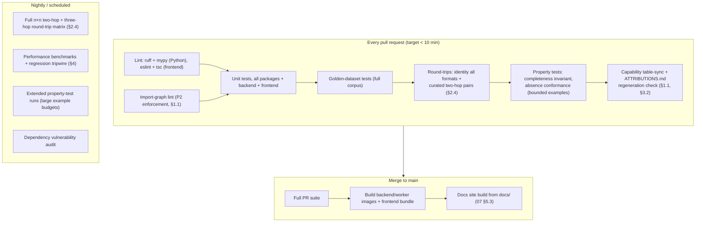

The PR suite is deliberately capped near ten minutes: the golden corpus and identity round-trips are the non-negotiable core; anything super-linear in formats or frames moves to nightly. A nightly failure opens an issue automatically rather than blocking anyone's PR — visible, tracked, but not a surprise tax on unrelated work.


---


## Part 9: Deployment and Operations

*Source: `docs/09_Deployment.md`*

> **Document status:** Binding. This document specifies how ChemBridge is developed locally, built and released through GitHub Actions, deployed to production, and operated at scale: the docker-compose development environment, CI/CD workflows, the production architecture (with rationale), the hosted-instance vs self-hosting strategy, and the scaling and file-lifecycle policies that address the project's large-file and uploaded-file-security risks.
>
> Prerequisites: the monorepo layout and tech-stack rationale in `01_Architecture.md` (§4, §5); the async job model, limits, and retention semantics in `06_API.md` (§3, §5); the CI stage definitions in `08_Testing.md §5`. Design principles **P1–P6** are defined in `00_Project_Overview.md §2`.
>
> **Binding vs. design intent (Revision 1.2).** This Part is binding for the two-tier local-dev split (§1), the deployment-shape decisions with stated rejected alternatives (§4.2, self-hosting-first in §5.4), and the reports-outlive-bytes/lifecycle policy (§5.2, §6.2). Specific implementation choices dated to roadmap v0.5+ — exact CSRF/auth mechanics, named metrics, Alembic/RQ operational detail — are **design intent**, re-validated when that version's work begins rather than treated as frozen 12+ months ahead of it (`10 §6` item 7).

---

### 1. Local Development

Two tiers, because the two personas of local work need different weights:

#### 1.1 Tier 0 — library-only loop (no services)

For work inside `packages/*` (the majority of scientific development), nothing but Python is required: `pip install -e ".[dev]"`, then run package unit tests and golden/round-trip suites directly. The storage and database adapters (`backend/app/storage/`, `01 §5`) each have a zero-infrastructure backend for this tier — **SQLite** behind the same interface as PostgreSQL, and a **local-filesystem** backend behind the same interface as object storage — fulfilling the local-development role assigned to SQLite in `01 §4.2`. Tier 0 exists so that a parser bug fix never requires Docker; friction in the core loop is friction in the project's most important contributions.

#### 1.2 Tier 1 — full stack via docker-compose

The repo-root `docker-compose.yml` (`01 §5`) brings up production-shaped services for API/UI/job work and for parity testing before release:

| Service | Image / source | Purpose | Notes |
|---|---|---|---|
| `backend` | built from `backend/` | FastAPI app (uvicorn), hot-reload mount | Serves `/v1/*` |
| `worker` | same image, worker entrypoint | Async job execution (`06 §3`) | Same code, different process — parity with production topology |
| `frontend` | built from `frontend/` | Next.js dev server, hot reload | Proxies API to `backend` |
| `postgres` | `postgres:16` | Reports, jobs, history (`01 §4.2`) | Volume-persisted |
| `minio` | `minio/minio` | S3-compatible object storage emulation | Bucket + lifecycle rules created by an init job so expiry behavior (§5.2) is testable locally |
| `queue` | `redis:7` | Job queue broker | The broker behind the worker (`01 §4.1`) |

One command (`docker compose up`) yields the full upload → inspect → convert → validate → download loop, including `awaiting_recovery` pauses and object-storage expiry — nothing about the trust pipeline is "production-only." Parity is the point: **alternative rejected — a mock-heavy dev mode** (in-memory queue, stubbed storage) boots faster but lets lifecycle, streaming, and job-state bugs hide until deployment; the two-tier split already provides the fast loop where it belongs (Tier 0), so Tier 1 can afford to be honest.

---

### 2. Container and Configuration Shape

- **One backend image, two entrypoints** (API server / worker): a single build artifact eliminates API-vs-worker version skew — a worker running yesterday's schema against today's API is a report-corruption hazard, not a mere inconvenience.
- **Configuration via environment variables only** (12-factor): database URL, object-storage endpoint/credentials, queue URL, every `06 §5` limit (upload size, frame cap, rate limits, retention days), auth mode (`06 §4`), and CORS origins. A committed `.env.example` documents every variable; the same image runs in compose, self-hosting, and the hosted instance with no rebuild.
- **Frontend build** consumes only the API origin URL at build time; everything else it learns from `GET /v1/limits` and `GET /v1/capabilities` at runtime (`07 §2.2`), so a rebuilt backend never requires a rebuilt frontend to stay truthful.

---

### 3. GitHub Actions Workflows

Stage content is defined in `08_Testing.md §5`; this section binds stages to workflows and artifacts (`.github/workflows/`, `01 §5`):

| Workflow | Trigger | Does |
|---|---|---|
| `ci.yml` | every PR | The full PR suite (`08 §5`): lint, import-graph lint, unit, golden, PR round-trips, property tests, table-sync/attribution checks. Required for merge. |
| `main.yml` | push to `main` | Full PR suite; build backend/worker image (pushed to GHCR tagged `main-<sha>`); build frontend bundle; build and publish the docs site from `docs/` (`07 §5.3`). |
| `nightly.yml` | schedule | Full n×n round-trip matrix, performance benchmarks + regression tripwire, extended property runs, dependency audit (`08 §5`). Failures auto-open issues. |
| `release.yml` | tag `v*` | Re-run full suite at the tag; publish versioned container images (`vX.Y.Z` + `latest`); publish the Python packages under `packages/` to PyPI as the `chembridge` distribution (Persona 2's `pip install chembridge`, `01 §5.1`); attach a generated changelog to the GitHub Release. |

**Release tagging.** Git tags `vX.Y.Z` follow semantic versioning of the *product* (semver policy details in `10_Roadmap.md`). The canonical **schema** version is deliberately independent (`02 §5`): a product release may or may not bump the schema, and the release notes must state the shipped `schema_version` explicitly so pipeline operators (Persona 2) can see schema changes without reading diffs.

---

### 4. Production Architecture

#### 4.1 Recommended shape

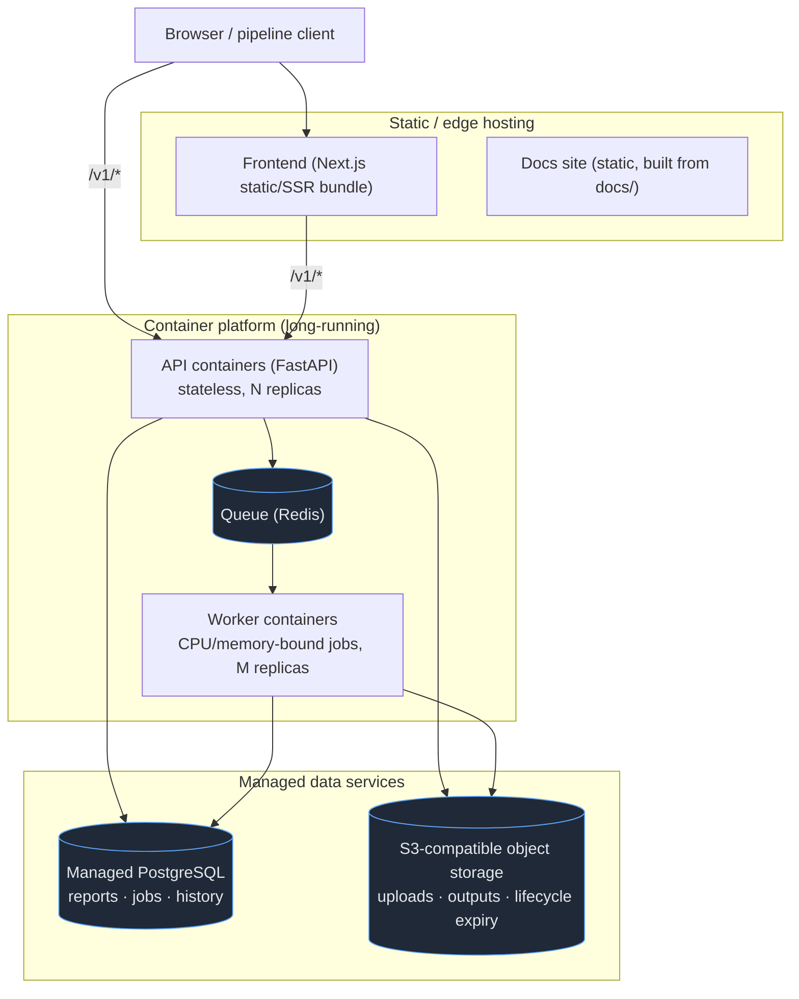

- **API containers are stateless** — all state lives in PostgreSQL, the queue, and object storage — so replicas scale horizontally behind a load balancer with no session pinning (bearer-key and cookie auth per `06 §4` require none).
- **Workers are the scaling unit that matters:** conversion jobs are CPU/memory-bound (`06 §3.1`); worker replica count, per-worker concurrency (low — jobs are heavy), and per-job resource limits (§5.1) are the operative knobs.
- **Frontend and docs are static/edge-hosted** (any static host or CDN — the bundle is host-agnostic by design; the hosted instance may use a managed platform, but nothing in the build assumes one).
- **Managed PostgreSQL and S3-compatible storage** in production; the interfaces are the same adapters as Tier 0/Tier 1, so "managed vs self-run vs emulated" is a configuration difference, not a code path (`01 §4.2`).

#### 4.2 The central tradeoff: long-running containers vs serverless

**Decision: long-running containers for API and workers. Serverless functions rejected for the conversion engine.**

Serverless (FaaS) is the reasonable alternative for a bursty, low-baseline workload like a young open-source service — pay-per-use, zero idle cost, no orchestration. It is rejected here because the workload shape is exactly FaaS-hostile:

1. **Jobs exceed FaaS envelopes.** A 10,000-frame conversion targets ≤ 90 s and up to ~2 GB peak RSS (`08 §4`), and the frame ceiling admits jobs several times larger; platform time/memory caps turn the project's *designed-for* workloads into platform errors, and working around caps by sharding jobs would push pipeline orchestration complexity into the scientific core.
2. **Large-payload movement.** 500 MB uploads (`06 §5`) streaming through short-lived function instances multiplies data transfer and cold-start cost precisely on the heaviest requests.
3. **Self-hostability is a first-class requirement** (§5.3, `06 §4`): a docker-compose/K8s deployment is portable to a lab server; a FaaS-shaped backend is not, and maintaining two execution shapes is two codebases' worth of operational truth.
4. **The queue already provides elasticity.** Scale-to-few (not zero) worker replicas on queue depth captures most of the cost benefit that motivates serverless, inside one deployment shape.

**Sub-alternative rejected: Kubernetes as the baseline recommendation.** The architecture is K8s-*compatible* (stateless API, queue-driven workers), but the baseline recommendation is a simpler container platform or a single VM running the production compose file — a solo maintainer's project (`10_Roadmap.md`) should not carry a cluster's operational load before traffic justifies it. K8s is the growth path, not the entry point.

---

### 5. Scaling, File Lifecycle, and Uploaded-File Security

#### 5.1 Scaling the real bottleneck: conversion jobs

- **Horizontal worker scaling on queue depth**, with per-worker job concurrency kept low (1–2) — heavy jobs contend on memory, not on I/O wait.
- **Per-job resource limits** (container CPU/memory caps + wall-clock timeout slightly above the `08 §4` hard bounds): a pathological file exhausts *its own* job's budget and fails with a structured error, never a worker host. Combined with the frame cap and upload cap (`06 §5`), worst-case per-job memory is bounded by design, making worker capacity planning arithmetic rather than hope.
- **Fair scheduling** is delegated to the existing per-caller concurrent-job limit (`06 §5`) rather than a priority system — queue priorities are speculative complexity until a real starvation problem exists (**P6**: seams, not prebuilt features).

#### 5.2 Object storage lifecycle and cost

Uploads and conversion outputs carry `expires_at` (default 7 days, instance-configurable; `06 §5`) enforced by **bucket lifecycle rules** — deletion is the storage platform's guarantee, not an application cron job that can silently stop running (a failure that would turn a privacy promise into a lie; the distinction matters under **P1**'s standard of honesty). `DELETE /v1/files/{file_id}` performs immediate deletion for users who won't wait. **Reports outlive bytes deliberately:** Conversion and Validation Reports persist in PostgreSQL after file expiry (`07 §2.6` renders this as the "expired" state) — the audit trail is small, the payload is large, and the trust claim lives in the trail. Storage cost therefore scales with *recent* usage, not lifetime usage.

#### 5.3 Uploaded-file security

The master risk "security of uploaded files" decomposes into three distinct threats, each with its own control:

1. **Confidentiality** (files are unpublished research data): private buckets only — no public object URLs ever; downloads stream through the authenticated API (or short-lived pre-signed URLs minted per request, an equivalent control); encryption at rest via the storage platform; ownership scoping per `06 §4`; the short default retention (§5.2) is itself the largest confidentiality control — data that no longer exists cannot leak.
2. **Hostile input** (parsers consume untrusted bytes): uploaded files are **data, never code** — parsers must not shell out to external interpreters or evaluate file content; they run inside workers under the §5.1 resource caps, so decompression-bomb-style and pathological-input attacks (e.g. a file declaring 10¹² atoms) are converted into that job's structured failure (`03 §5` error contract) rather than host exhaustion. Parser fuzzing against malformed inputs is part of the extended nightly property runs (`08 §5`).
3. **Abuse of the hosted instance** (storage/CPU as a free resource): the rate, size, and concurrency limits of `06 §5` plus lifecycle expiry bound the blast radius per key/session.

#### 5.4 Domain and hosting strategy

- **Self-hosting is the primary supported deployment.** A production compose file (`docker-compose.prod.yml`: hardened settings, no dev mounts, external Postgres/storage endpoints) plus the `.env.example` reference constitutes the complete self-hosting story; the docs site carries a dedicated self-hosting guide. Every feature must work self-hosted with zero external SaaS dependencies — this is a hard review criterion, because a "transparent" scientific tool that only runs on someone else's infrastructure has an asterisk on the word.
- **The hosted public instance is optional and secondary** — a convenience and demonstration deployment under the project domain (app at the apex or `app.`, `api.` for the API origin, `docs.` or `/docs` for documentation), operated with the §5.2/§5.3 policies and the `06 §5` public limits. Its existence is a maintainer-capacity decision deferred to `10_Roadmap.md`; nothing in the architecture assumes it exists.
- **Domain strategy.** Recommendation: register a single project domain — `chembridge.org` preferred (`.org` signals a non-commercial open-source project to the academic audience; `.dev` is an acceptable fallback and brings HSTS-preload-enforced HTTPS) — laid out as: **apex** = landing page + web app (`frontend/`), **`api.`** = the API origin, **`docs.`** = the static docs site (or `/docs` on the apex, since the docs build is static either way, `07 §5.3`). A separate `api.` origin is recommended over a path-mounted `/api` on the apex because it decouples frontend and API deployments (independent scaling, CDN, and TLS configuration; CORS declared explicitly rather than implied by co-origin) at the one-time cost of a CORS allowlist entry — a cost the config shape already pays (`§2`). **Alternative rejected: serving the API under the apex at `/api/v1/…`.** It couples the two deployment lifecycles and makes the static-frontend hosting choice dictate API routing; the split-origin layout keeps each surface on its natural platform. Whatever the domain, the API's versioned path prefix (`06 §7`) plus permanent redirects keep clients insulated if the origin ever moves — the domain is replaceable; the `/v1` contract is not.

---

### 6. Observability, Backups, and Disaster Recovery

A project whose product is *trust in a record* has an unusual ops inversion: the uploaded bytes are deliberately ephemeral, but the reports and provenance rows are the artifact — "reports outlive bytes" (§5.2) is only true if the database those reports live in is itself durable and observable. This section makes that promise operational rather than aspirational.

#### 6.1 Health and monitoring

- **`GET /v1/health`** (`06 §2`): liveness (process answers) and, with `?ready=true`, readiness — a real ping of Postgres, Redis, and object storage, each reported as an independent `checks` entry so an operator sees *which* dependency is down, not just "503". Unauthenticated and rate-limit-exempt; exposes component states only, never user data.
- **Structured logging.** JSON lines to stdout (the container-native sink, §2), every line carrying `request_id`, and `job_id`/`conversion_id` where applicable — the same IDs the API returns to users, so a bug report containing a `conversion_id` is directly greppable. Scientific content is **never logged** (no positions, no file contents): logs are operational metadata, and uploaded science is private by policy (§5.3). Log level per environment via config (§2).
- **Metrics.** A Prometheus-format `/metrics` endpoint on the internal network (not the public API — it leaks operational shape): job counts by `kind`×`terminal state` (the `refused` and `failed` rates are the scientific-health signals), `PARSE_ERROR` counts by `format_id` (a spike after a release is a parser regression in the wild), validation `failed`/`passed_with_warnings` rates (drift here means an exporter/parser asymmetry escaped the golden corpus), queue depth and job latency histograms (worker-pool sizing input, §5.1), and storage bytes by class (cost tripwire, §5.2). **Alternative rejected: a bundled Grafana/alerting stack in the compose file.** Every self-hoster has their own monitoring; shipping opinionated dashboards is maintenance surface. The project ships the `/metrics` contract and documents the four alerts worth having (readiness failing, failed-job rate > 5% over 15 min, queue depth growing monotonically for 30 min, storage > 80% of budget); wiring them is the operator's platform choice.

#### 6.2 Backups and restore

- **PostgreSQL is the only stateful component that must never lose data** — it holds the conversion/validation reports, provenance rows, and (hosted mode) accounts. Policy: nightly logical dumps (`pg_dump`) retained 30 days, plus WAL archiving where the hosting platform offers it (managed Postgres does; a lab-server self-host may accept the nightly-only posture). Default RPO is therefore ≤ 24 h self-hosted and near-zero on managed WAL platforms; the self-hosting guide states this tradeoff plainly instead of implying durability the setup does not have.
- **Object storage is deliberately not backed up.** Uploads and outputs expire in days by design (§5.2) and are reproducible from their sources by their owners; backing up ephemeral private science would *increase* privacy exposure for zero recovery value. The one nuance: persisted Canonical Objects (`01 §4.3`) share the input lifecycle and are likewise excluded — nothing in the recovery path depends on them (re-thresholding needs only reports, `05 §4.5`).
- **Restore is drilled, not assumed.** Each release checklist (`10 §6`) includes restoring the latest dump into a scratch database and running the migration-chain test against it (`01 §4.4`) — an untested backup is a hope, not a backup.
- **Disaster recovery posture: single-region, documented, honest.** MVP-through-v1.0 runs in one region/provider; the DR plan is "restore the dump to a new environment from the runbook," with expected recovery measured in hours. **Alternative rejected: multi-region replication.** It multiplies operational complexity and cost for a free scientific tool whose worst-case outage loses no user science (their files are their own; the reports restore from backup) — the honest hours-scale RTO, written down, serves users better than an unmaintained HA architecture.

---

### 7. Consequences for Downstream Documents

- **`10_Roadmap.md`** sequences the deployment milestones (Tier 0 → compose → hosted instance), decides whether the hosted instance is in scope for v1.0, owns the semver policy referenced in §3, and carries the open-source mechanics (license, contribution guide, templates) that govern the release workflow's publishing steps.


---


## Part 10: Roadmap, Risks, and Open-Source Mechanics

*Source: `docs/10_Roadmap.md`*

> **Document status:** Binding for sequencing and scope. This is the final planning document of the specification set: it fixes what ships in each milestone (with realistic effort estimates for a solo, experienced developer working part-time), states the explicit MVP scope, maps every named project risk to its architectural mitigation (or flags it as open), defines the open-source mechanics (license, contribution guide, versioning, templates), and gives v1.0 a concrete definition of done.
>
> Prerequisites: all prior documents. Component names, schema fields, report schemas, endpoint paths, and test suites referenced below are defined in `00`–`09` and used verbatim. Design principles **P1–P6** are defined in `00_Project_Overview.md §2`.
>
> Planning assumption throughout: **one experienced developer, part-time (~10–15 h/week)**. "Dev-weeks" below are part-time weeks under that assumption; estimates are deliberately conservative because scientific-format edge cases, not framework code, dominate this project's schedule risk.

---

### 1. Milestones at a Glance

| Milestone | Theme | Ships | Key components (by doc) | Effort (part-time dev-weeks) | Estimate rationale (one line) |
|---|---|---|---|---|---|
| **MVP (v0.1)** | The trustworthy core, as a library + CLI | `pip install chembridge` + `chembridge` CLI | Canonical schema, full 8 categories (`02`); plugin SDK interfaces + Capability Matrix (`03 §2, §4`); parsers/exporters for **XYZ, extXYZ, POSCAR, CONTCAR**; Conversion Engine + **preset-only** Recovery (`04`); Validation Engine (`05`); Tier 0 dev loop, golden corpus seed, PR CI suite (`08`, `09 §1.1`) | **18–22** | Four format pairs with laundering + golden tests dominate (~6 wk); schema/SDK/matrix (~4), conversion+recovery (~4), validation (~3), CLI+CI (~3) — each engine is small once the schema is right. |
| **v0.2** | Complete Phase 1 + programmatic service | REST API + all 7 Phase 1 formats | **CIF, XDATCAR, ASE trajectory** parsers/exporters (`03 §3`); FastAPI backend, async job model incl. `awaiting_recovery`, error envelope, limits (`06`); PostgreSQL/object-storage adapters, Tier 1 compose (`09 §1.2`); performance benchmark suite + nightly matrix (`08 §4, §5`); feedback-loop *logging* (`05 §7`) | **13–16** | CIF is the costliest single parser (occupancy, symmetry, multi-block ≈ 3 wk alone); XDATCAR forces the frame-chunked implementation (§4 risk R8); the API is thin by design (`01 §2`) but the job lifecycle needs careful tests. |
| **v0.5** | Humans | Web UI, end to end | All pages and the Recovery Workflow UI (`07`); loss-communication design language (`07 §4`); format explorer; frontend test suites (`08 §1.1`); production deployment shape + self-hosting compose (`09 §4, §5.4`); feedback-loop advisory *surfacing* (`05 §7`) | **12–15** | Eight routes with fixture-driven report rendering is steady, parallelizable-with-nothing UI work; the recovery cards and report panels are the design-critical 40%. |
| **v1.0** | Stability promises | Frozen contracts, public release | Plugin SDK declared stable + published reference plugin (`03 §7`, `plugins/example-format`); schema `1.0.0` frozen with migration machinery proven (`02 §5`); docs site + self-hosting guide (`09 §3, §5.4`); security hardening pass (`09 §5.3`); optional hosted instance decision; §6 definition of done | **7–10** | Mostly verification, documentation, and API-surface review — the discipline milestone, not the feature milestone. |
| **Future (post-1.0)** | Secondary goals, on the seams | Incremental releases | New formats (LAMMPS, Quantum ESPRESSO, CP2K, Gaussian, ORCA, GROMACS, Open Babel, pymatgen objects) as plugins; visualization (Mol\*), File Repair, Analysis plugins, AI assistant — each at its named seam (`01 §6`, `07 §6`) | 2–4 per format; 6–12 per secondary feature | Each attaches at an existing seam by design; per-format cost is bounded by the O(1) architecture (`03 §4.3` alternative-rejected rationale). |

Cumulative to v1.0: **≈ 50–63 part-time dev-weeks** (roughly 12–15 calendar months at the stated pace). Sequencing is strict: each milestone's components depend only on prior milestones, so no milestone begins on speculation about a later one.

**Note on version-ladder terminology (Revision 1.2).** `docs/Incremental_Roadmap_v1.0.md` re-slices this milestone table for a solo student developer's availability, subdividing it into v0.1–v0.7 (its v0.2 = this table's "MVP (v0.1)"; its v0.5 = this table's "v0.2"; and so on) while preserving every component, schema, and dependency listed above unchanged — only the version *labels* and *weekly packaging* differ. Consequently **"MVP" in this document and "v0.1" in the roadmap are different scopes**: this document's MVP is the roadmap's v0.2 (full seven-format Phase 1, service layer excluded); the roadmap's v0.1 is a first, smaller public release covering four formats and two recovery scenarios. Readers combining both documents should use the roadmap's labels when discussing schedule and this table's "MVP" only to mean "everything the seven-format, library-plus-CLI core promises," never a specific weekend count. `docs/IMPLEMENTATION_PLAN_v0.1.md` sequences the roadmap's v0.1 into milestones and is the execution-level document for that scope.

---

### 2. Explicit MVP Scope (and the Reasoning)

The MVP question the master brief poses — avoid overengineering, but never foreclose the future — resolves into four explicit decisions:

**1. Library + CLI first; API in v0.2; web UI in v0.5.**
The scientific core (`packages/*`) is deliberately importable without FastAPI (`01 §5.1`), and Persona 2 — the pipeline engineer — consumes structured reports programmatically and needs no UI at all (`00 §5`). Shipping the library first puts the *entire* trust pipeline (parse → capability diff → recovery → export → report → validate) in users' hands at minimum cost, and every later layer (API, UI) is a thin presenter over objects that already exist. **Alternative rejected: shipping the web UI in the MVP.** The UI is the most visible artifact but the least load-bearing one: it contains no scientific logic by rule (`01 §2`), so building it first would mean months of work presenting engines that don't exist yet — the definition of overengineering the master brief warns against. **Alternative rejected: API-first without a CLI.** A CLI costs ~1 week on top of the library and gives Persona 1 a usable tool a full milestone earlier; an API without either audience's entry point serves neither.

**2. Four of seven Phase 1 formats in MVP: XYZ, extXYZ, POSCAR, CONTCAR.**
These four are chosen because together they exercise **every engine code path**: no-cell vs full-cell (`cell = None` vs `Cell`, `02 §3.4`), Cartesian vs fractional internals (`02 §4`), single- vs multi-frame (`max_frames`, `04 §3.3` `frame_selection`), velocities and constraints (POSCAR selective dynamics → `Constraint`, `03 §3` n.7), rich per-atom custom arrays (extXYZ), format-defined PBC facts, and a fabricative recovery (`missing_lattice` for any XYZ→POSCAR conversion). CIF, XDATCAR, and ASE trajectory defer to v0.2 not because they are unimportant but because each is a *format-complexity* cost (CIF occupancy/symmetry/multi-block; XDATCAR's per-frame cells at scale; `.traj` binary richness) that adds no *new engine path* — deferring them is the cheapest possible proof that adding a format later really is O(1) (`03 §4.3`). **Alternative rejected: all seven in MVP.** It adds ~8 dev-weeks before anyone can use anything, for coverage the engine design doesn't need to be validated.

**3. All eight canonical schema categories in MVP — the schema does not get trimmed.**
Geometry, Cell, Trajectory, Dynamics, Electronic, Simulation Metadata, Provenance, User Metadata (`02 §3`) all ship in `1.0.0-draft` form from day one, even though MVP formats leave many fields `None`. Rationale: schema fields are cheap to define and ruinous to retrofit (`02 §5` — additive evolution is easy precisely because the structure exists), and the absence convention (`02 §2`) makes unpopulated categories free. Trimming the schema to "what MVP formats use" would be optimizing the one artifact the whole architecture treats as its constitution.

**4. Recovery is preset-only in MVP; interactive `awaiting_recovery` arrives with the API in v0.2.**
The Recovery Engine, scenario catalog, and Assumption recording (`04 §3`) ship fully in MVP — but the *pause-and-ask* interaction model is job-lifecycle machinery (`06 §3.2`) that has no natural home in a synchronous CLI. The CLI therefore takes `recovery_choices` presets (flags/config, `origin: "preset"`) and otherwise refuses with the structured report (`04 §4`) — which is exactly correct behavior under the fabricative bright line, not a degraded mode.

---

### 3. Risks & Pitfalls Register

Every risk named in the master brief, with its mitigation as designed in docs `00`–`09`, and an honest **residual** where the architecture does not fully retire it. Items marked ⚠ are the register's genuinely open risks.

| # | Risk | Architectural mitigation | Residual / open |
|---|---|---|---|
| R1 | **Silent data loss** | The entire design: absence convention (`02 §2`), pre-flight prediction from the Capability Matrix (`03 §4.3`), Conversion Report completeness invariant (`04 §2`) enforced as the project's most important property test (`08 §1.2`), post-hoc Validation (`05`), UI rules that structurally prevent burying loss (`07 §2.5, §4`). | ⚠ Symmetric parser/exporter bugs pass their own round-trips (`05 §5`); mitigated — not eliminated — by golden anchoring to external truth (`08 §2.3, §3`). Grows the golden corpus forever. |
| R2 | **Floating-point precision** | Canonical float64; per-quantity tolerances with declared representational bounds so precision differences are *explained*, not merely tolerated (`05 §4.2–4.3`); `PRECISION_LIMIT` warnings (`04 §1`). | Cross-platform float variance in nightly benchmarks (pinned runners, `08 §4`); negligible for correctness, relevant only to perf comparability. |
| R3 | **Unit mismatches** | One canonical unit system, conversion only at parse/export boundaries, original units recorded in `provenance.source_units` (`02 §3.1, §3.9`). | ⚠ Formats with *ambiguous* unit declarations (e.g. LAMMPS unit styles, post-1.0) will need a `recovery_hint`-style explicit resolution rather than a guessed default — pattern exists (`03 §5`), per-format work remains. |
| R4 | **Cartesian vs fractional** | Single internal representation (Cartesian), one conversion point at each pipeline end, `original_coordinate_system` recorded (`02 §4`); round-trip error absorbed by the tolerance model (`05 §4.1`). | Retired by construction. |
| R5 | **Periodic boundary issues** | `cell = None` vs `pbc=(F,F,F)` distinguished as different physical statements (`02 §3.4`); wrapping forbidden at parse/export (`02 §4`); minimum-image invariant tests (`08 §1.3`). | Out-of-cell coordinates may surprise downstream consumers of converted files; honest answer is a report warning today and the File Repair feature (explicit, Assumption-recorded wrapping) post-1.0. |
| R6 | **Malformed input files** | Error contract: warnings-with-success or error-without-object, never a half-parsed structure (`03 §5`); corrupt-tail recovery is a recorded choice (`04 §3.3`); parser fuzzing nightly (`09 §5.3`, `08 §5`). | Mitigated; fuzz corpus quality is a permanent maintenance duty. |
| R7 | **Unsupported metadata** | Verbatim carry-through surfaces (`simulation.extra`, `user_metadata`, `02 §3.8, §3.10`); drops are capability-visible and named per key in `removed` (`02 §6` r.3). | ⚠ Carry-through preserves *bytes*, not *meaning*: semantics-free extras cannot be translated into another format's native metadata fields. Promotion path (`02 §6` r.4) converts recurring cases to first-class fields over time. |
| R8 | **Large trajectory performance** | Frame-chunked processing behind stable interfaces (`04 §6`), async jobs (`06 §3`), frame/size caps (`06 §5`), enforced memory bounds via `frame_limit_ceiling` (`08 §4`), per-job resource caps (`09 §5.1`). | ⚠ **Top schedule risk of v0.2**: frame-chunking is committed but unimplemented until XDATCAR lands; if it slips, the mitigations degrade to "caps and patience". Tracked by the benchmark tripwire from the first nightly. |
| R9 | **Browser memory limitations** | Strict thin client: browser transfers and renders, never parses or holds scientific data; reports are per-field, bounded by schema width not system size (`07 §5.2`). | Retired by construction (and by the `01 §2` prohibition on client-side science). |
| R10 | **Security of uploaded files** | Threat-decomposed controls: private buckets + authenticated streaming + encryption + short retention (confidentiality); files-as-data-never-code + per-job resource caps + fuzzing (hostile input); rate/size/concurrency limits (abuse) (`09 §5.3`, `06 §5`). | ⚠ Dependency-inherited parser vulnerabilities (ASE/pymatgen CVEs) — mitigated by nightly dependency audit (`08 §5`) and the worker sandbox, never eliminable. |
| R11 | **Scientific reproducibility** | Provenance with append-only history and mirrored Assumptions (`02 §3.9`, `04 §2`); seeds as recorded parameters (e.g. `maxwell_boltzmann`, `04 §3.3`); reports self-contained incl. tolerance profile (`05 §3`); reports outlive file bytes (`09 §5.2`). | Full re-execution reproducibility additionally requires the ChemBridge version — carried as `tool_version`/`parser_version` in every `ConversionRecord`, so the requirement is at least always *stated*. |
| R12 | **Extensibility challenges** | Plugin SDK with identical interfaces for first- and third-party formats (`03 §2, §7`); O(1)-per-format matrix-driven conversion (`03 §4.3`); named seams for every secondary goal (`01 §6`, `07 §6`); additive schema/API evolution policies (`02 §5`, `06 §7`). | ⚠ Pre-1.0 SDK instability: third-party plugins written against v0.x interfaces **will** break. Mitigation is honesty — the SDK is documented as unstable until v1.0 freezes it (§6), and the reference plugin is the compatibility canary in CI. |

---

### 4. Open-Source Mechanics

#### 4.1 License: Apache-2.0

**Decision: Apache License 2.0**, applied to the whole monorepo (golden-data files retain their per-manifest licenses and aggregated attribution, `08 §3.2`).

**Rationale vs MIT (the closest alternative):** both are permissive and academia-friendly, but Apache-2.0 adds two things this project specifically wants: an **explicit patent grant** from contributors (relevant for a tool likely to sit inside industrial materials/chemistry pipelines where patent posture is scrutinized before adoption) and the **NOTICE-file mechanism**, which gives the golden-corpus attribution obligations (`08 §3.2`) a standard, tooling-recognized home. MIT's brevity is its only advantage here, and it buys silence exactly where this project prefers explicitness. **Rationale vs GPL/LGPL (rejected):** copyleft on a *library* whose primary persona embeds it in private pipelines (`00 §5`, Persona 2) would suppress precisely the adoption that matters; note that depending on LGPL ASE at runtime is compatible with an Apache-2.0 codebase (normal dynamic use, never vendored — a constraint recorded here deliberately).

#### 4.2 Semantic versioning policy

Product releases follow SemVer (`vX.Y.Z` tags, `09 §3`). The **public surface** whose compatibility the version number promises is, exhaustively: the canonical schema models, the report schemas (`DiscoveryReport`, `ConversionReport`, `ValidationReport`), the plugin SDK ABCs, the REST `/v1` contract, and documented CLI flags. Coupling to the schema's own version (`02 §5`): a schema **major** bump *requires* a product major bump; schema **minor** (additive) rides a product minor; the product may bump major for non-schema reasons without touching the schema. Release notes always state the shipped `schema_version` (`09 §3`). Pre-1.0, minor versions may break — stated loudly in the README until v1.0 (§3, R12).

#### 4.3 Contribution guide (`CONTRIBUTING.md` outline)

1. **Start here:** read `docs/00` and the doc covering your area; the docs are the constitution — code that contradicts them needs a docs PR first.
2. **Ground rules (the non-negotiables):** the absence convention (`02 §2`) — no defaulting, ever; every conversion behavior change must keep the completeness invariant green; new names must reuse the binding glossary (`00 §6`).
3. **Adding a format:** the checklist — implement `ParserPlugin`/`ExporterPlugin`, declare `capabilities()` honestly (PARTIAL with notes beats optimistic FULL), add golden cases with licensed manifests, pass identity round-trips, add the format's rows to the `03 §3` table (the sync test will hold you to it).
4. **Dev environment:** Tier 0 vs Tier 1 (`09 §1`), how to run each test layer locally (`08 §1`).
5. **PR expectations:** small, single-purpose; every nontrivial decision names a rejected alternative (this document set's own standard); CI green including golden and property suites.
6. **Conduct & licensing:** contributions are Apache-2.0; contributed test files require the manifest license grant (`08 §3.2`).

#### 4.4 Issue templates

| Template | Key fields |
|---|---|
| **Bug: incorrect conversion** | Source file (or minimal reproducer), target format, the **Conversion Report and Validation Report JSON** (the reports are designed to be the bug report, `04 §2`, `05 §3`), expected vs observed, ChemBridge + schema versions. |
| **Bug: parse failure** | File + full error envelope / `ParseIssue` list (`03 §5`, `06 §6`), what produced the file, license status if the file can be donated to the golden corpus. |
| **Format request** | Format name/spec link, which canonical fields it can express (a draft capability row!), example files with license status, willingness to contribute a plugin. |
| **General bug / docs issue** | Freeform with version fields. |

#### 4.5 Pull-request template (outline)

Checkboxes: docs updated or confirmed unaffected; golden cases added for new behavior (with licensed manifests); no parser defaulting introduced (laundering suite passes); capability declarations updated and `03 §3` table sync green; rejected alternative named in the description for design changes; attribution file regenerates cleanly; contributed files carry license grants.

#### 4.6 Documentation policy

The brief's open-source list names documentation as a first-class mechanic alongside license and versioning; the policy is stated here so it is a governed artifact, not an assumption:

1. **The `docs/` set is the constitution.** Code that contradicts it needs a docs PR first (§4.3 rule 1); docs-vs-code drift found at a release review is a release blocker (§6 item 7). The docs are versioned with the code in the monorepo precisely so that a behavior change and its documentation change are one atomic PR (`01 §5.2`).
2. **One source, two renderings.** The same Markdown files are the in-repo spec and the statically built docs site (`09 §3`, `07 §5.3`). There is no wiki and no second corpus — a separately editable wiki was considered and rejected because its convenience is purchased with divergence from the reviewed constitution.
3. **User-facing guides are additive, never substitutive:** quickstart, self-hosting guide (`09 §5.4`), CLI reference (Appendix A), and an error-code reference page per code — every `documentation_url` the error envelope emits (`06 §6`) must resolve, and a CI link-check enforces it. Format documentation is *generated* from live `capabilities()` declarations (the `07 §2.7` pattern) so it cannot drift from the registry.
4. **The central examples are executable.** The worked examples of `02 §8`, `04 §5`, and `05 §6` are committed verbatim as golden fixtures (`08 §3.2`) and rendering fixtures (`08 §1.1`), so the documentation's load-bearing examples are continuously tested rather than merely proofread.

---

### 5. Post-1.0 Direction (Non-Binding Sketch)

Priority among secondary goals, justified by dependency and demand rather than glamour: **new formats first** (each is direct user value and a live test of the SDK), then **visualization** (highest-requested UI feature; pure consumer of existing objects, `07 §6`), then **File Repair** (reuses the Recovery decision-card pattern and Assumption machinery wholesale), then **Analysis plugins** (needs a stable SDK plus real plugin authors), with the **AI assistant** last — it explains reports, so it improves in proportion to everything shipped before it (`01 §6`). This ordering is a default, not a commitment; post-1.0 planning belongs to the project's issue tracker, not this document.

---

### 6. Definition of Done — v1.0

v1.0 ships when every line below is true. This list is the finish line; nothing else is.

1. **Formats:** all seven Phase 1 formats parse and export with golden coverage; the full nightly n×n round-trip matrix is green for 30 consecutive days.
2. **Invariant:** the report completeness property test (`08 §1.2`) runs against every golden case and generated corpus with zero waivers.
3. **Contracts frozen:** canonical schema tagged `1.0.0` with the migration registry exercised by at least one real (not synthetic) migration; plugin SDK declared stable; `/v1` API published with the OpenAPI schema as an artifact; the reference plugin builds and passes CI against the frozen SDK.
4. **Product surface:** library, CLI, REST API, and web UI all expose the full pipeline including interactive recovery; the worked examples of `02 §8`, `04 §5`, and `05 §6` are reproducible end-to-end by a user following only the public docs.
5. **Operations:** self-hosting via `docker-compose.prod.yml` documented and tested from a clean machine; lifecycle expiry verified against a real S3-compatible store; performance targets of `08 §4` met on the pinned runner; a backup **restore drill** performed per `09 §6.2` — the latest `pg_dump` restored to a scratch database with the migration chain green against it (this item recurs on every release checklist, not just v1.0).
6. **Honesty checks:** every risk in §3 marked ⚠ has a tracking issue with current status; `README` states the SemVer promises of §4.2; `ATTRIBUTIONS.md` is complete and CI-enforced.
7. **Docs:** this specification set updated to match shipped reality — any drift between docs and code found during the v1.0 review is itself a release blocker, because the docs are the product's warranty card.


---


## Appendix A: Command-Line Interface Surface (Supplement)

> **Status:** Binding supplement. Part 10 §2 ships a CLI in the MVP; this appendix specifies its surface so that MVP implementation needs no further design. The CLI is a thin presenter over `packages/*` — the same rule that governs the API layer (Part 1 §2). It contains no scientific logic, emits the report schemas of Parts 3–5 **verbatim** as JSON, and honors the preset-only recovery model of Part 10 §2 (interactive `awaiting_recovery` is API/UI machinery, Part 6 §3.2; the CLI refuses instead, which is correct behavior under the fabricative bright line of Part 4 §3.1).

### A.1 Commands

| Command | Purpose | Key options |
|---|---|---|
| `chembridge inspect FILE` | Run the Information Discovery Engine; print a human-readable ✓/✗ inventory (the rendering rules of Part 7 §4 in terminal form) | `--format FORMAT_ID` (sniff override, Part 3 §6.1); `--report PATH` (write the `DiscoveryReport` JSON to a file); `--json` (print the `DiscoveryReport` JSON to stdout instead of the inventory) |
| `chembridge convert FILE --to FORMAT_ID` | Full pipeline: parse → pre-flight → (preset recovery) → export → validate | `-o PATH`; `--mode strict\|permissive` (default `permissive`); `--recover SCENARIO=CHOICE[,param=value…]` (repeatable — the CLI form of `recovery_choices`, Part 6 §2.1; recorded as `origin: "preset"`); `--acknowledge-loss`; `--acknowledge-parse-warnings`; `--tolerance-profile NAME\|FILE`; `--report PATH` (write ConversionReport JSON); `--validation-report PATH` (write ValidationReport JSON); `--json` (print both reports as one JSON object to stdout) |
| `chembridge validate --output FILE --source FILE --conversion-report REPORT.json` | Offline **full re-parse re-validation**: reconstruct the expected object from the source file and the report's `preserved`/`supplied` path lists (the write plan, Part 4 §2), re-parse the output, and diff — possible offline precisely because the report is self-contained (Part 5 §4.5). Omit `--source` to instead **re-threshold** a supplied `--validation-report` under a new profile (no re-parse; Part 5 §4.5) | `--tolerance-profile NAME\|FILE`; `--validation-report PATH` (write, or — with no `--source`/`--output` — read for re-thresholding); `--json` (print the ValidationReport JSON to stdout) |
| `chembridge capabilities [FORMAT_ID]` | Print the Capability Matrix (all formats, or one format's read/write declarations) | `--json` (print the matrix JSON to stdout) |

**Report-output flag convention (uniform across all commands).** `--json` is always a **bare flag** meaning "emit this command's primary structured output to **stdout** as JSON instead of the human-readable rendering" — pipeable, no argument. Writing a named report to a **file** always uses a `*PATH`-valued flag: `--report PATH` for a Conversion or Discovery report, `--validation-report PATH` for a Validation report. `convert` — the only command that produces two reports plus an output file — therefore takes both file flags and, with bare `--json`, prints `{ "conversion_report": …, "validation_report": … }` as a single object. This removes the earlier `--json PATH`/`--json`-flag inconsistency: `--json` never takes a path, and file destinations are never overloaded onto `--json`.

Example, mirroring the worked conversion of Part 4 §5:

```text
chembridge convert relax.traj --to poscar -o POSCAR \
  --recover frame_selection=last \
  --recover missing_lattice=bounding_box,padding_ang=5.0 \
  --report conversion.json --validation-report validation.json
```

### A.2 Exit codes

Exit codes make the CLI CI-native for Persona 2 (Part 0 §5) without parsing stdout:

| Code | Meaning |
|---|---|
| `0` | Conversion `completed`; validation `passed` (or `passed_with_warnings` in permissive mode) |
| `2` | Conversion `refused` — the refused `ConversionReport` (with `refusal.unresolved_scenarios` and offered choices) is still written/printed, per Part 4 §4 ("refusal is a first-class outcome") |
| `3` | Validation `failed` — output file is written (Part 5 §2's access rule), exit code carries the posture |
| `4` | `ParseError` — the `ParseIssue` list of Part 3 §5 printed as the error payload |
| `5` | Validation `passed_with_warnings` under `--mode strict` (strict pipelines must be able to halt on warnings) |
| `1` | Usage or internal error |

**Alternative rejected: interactive terminal prompts for recovery.** A TTY prompt is technically feasible, but it would create a second interactive-recovery implementation alongside the job-envelope-driven UI (Part 7 §3) — two consent flows to keep honest instead of one — and it breaks the CLI's primary use in non-interactive pipelines. Presets plus structured refusal cover both personas; interactive recovery belongs to the surfaces built on the job model.

---

## Appendix B: Requirements Traceability Matrix (Supplement)

Every requirement area of the original project brief, mapped to the Part(s) that satisfy it — for reviewers verifying coverage and for planning agents locating the normative text for a work item.

| Brief requirement | Where specified |
|---|---|
| Universal file parsing; Phase 1 formats; future formats | Part 3 §§2–3, §7; Part 10 §2 (MVP subset), §1 (future formats) |
| Canonical internal representation (all eight categories) | Part 2 (entire); Part 0 §6 (binding vocabulary) |
| Information extraction / discovery engine | Part 3 §6 (`DiscoveryReport`, algorithm, worked example) |
| Capability matrix driving conversion logic | Part 3 §4; consumed in Part 4 §1, Part 5 §5 |
| Intelligent conversion engine + conversion reports | Part 4 §§1–2, §5 (worked example), §6 (canonical-routing tradeoff) |
| Recovery engine (missing lattice, velocities, …) | Part 4 §3 (hazard classes, scenario catalog, decision flow) |
| Automatic validation + validation reports | Part 5 (entire) |
| Website (landing → upload → convert → report → download → history → docs) | Part 7 (entire) |
| Backend technology recommendations with rationale | Part 1 §4; Part 6 (API shape); Part 9 §4 |
| Repository structure (monorepo, every directory explained) | Part 1 §5 |
| REST API (upload/inspect/convert/validate/download/history/capabilities) | Part 6 §2 (plus jobs incl. cancel, limits, files, health, and hosted-mode auth/key endpoints the design required) |
| Plugin system / SDK for new formats without core changes | Part 3 §§2, 7; Part 6 §7 (formats-as-data); Part 10 §4.3 (contributor checklist) |
| Testing strategy (unit, parser, round-trip, golden, scientific, performance, CI/CD) | Part 8 (entire) |
| Deployment (local, Docker, GitHub Actions, hosting, domain, scaling) | Part 9 (entire) |
| Open source (license, contribution guide, versioning, templates) | Part 10 §4 |
| Product roadmap with difficulty estimates | Part 10 §§1–2, §5, §6 (definition of done) |
| Risks & pitfalls (all twelve named risks) | Part 10 §3 (register with mitigations and open-risk flags) |
| Non-goals and how ChemBridge complements ASE/pymatgen | Part 0 §4; Part 1 §4.2 (wrapping boundary); Part 3 §2 (default laundering) |
| Guiding philosophy: never silently lose scientific information | Part 0 §2 (P1–P6); enforced mechanically via Part 4 §2 (completeness invariant) and Part 8 §1.2 |
